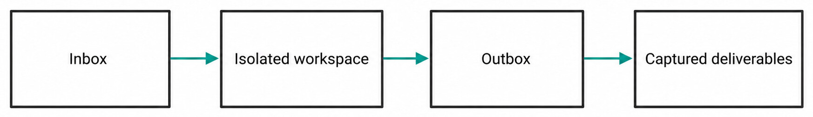
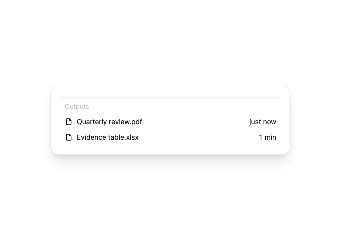
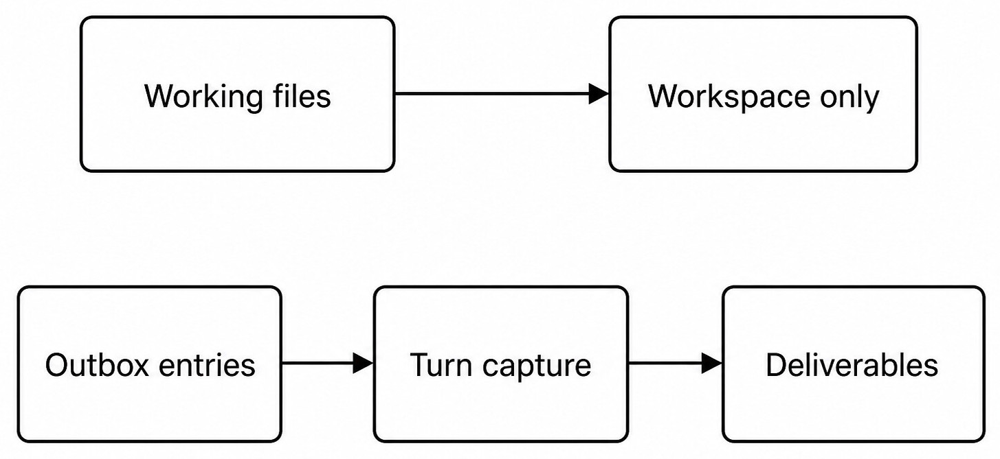

# Chapter 33 — Studio Outputs {#chapter-33}

## The question

Studio is artifact-oriented. It receives inputs, works inside a Haros-managed isolated workspace,
and captures intended deliverables from the Outbox. Not every intermediate file is an output. The
Outbox rule makes delivery explicit and prevents caches, scratch files, or private inputs from being
presented as finished artifacts.

_Figure 33.1 — Studio delivery is a directional path through an explicit Outbox boundary._

**Accessible equivalent.** Studio intake enters an isolated workspace; only Outbox entries become captured deliverables.

_Product capture — The production output-row components present attributed deliverables as a bounded list; workspace files do not become outputs merely because they exist._

| Area             | Purpose                         | Owner                                        | Published automatically?          |
| ---------------- | ------------------------------- | -------------------------------------------- | --------------------------------- |
| Inbox            | Admitted source material        | Studio scaffold/intake                       | No                                |
| Workspace        | Intermediate creation and tools | Studio Project workspace                     | No                                |
| Outbox           | Explicit candidate deliverables | Studio output convention/service             | Eligible for capture              |
| Captured outputs | Per-Turn product projection     | Studio output service/orchestration activity | Visible, not externally published |

The workspace lifecycle differs from Agent's user-chosen folder. It is managed and isolated for the
Studio Project. The Product Thread remains durable product state, while files follow the Studio
workspace lifecycle. An Engine may help create artifacts, but it does not decide which arbitrary
files become product outputs.

## The scaffold establishes the contract

The Studio workspace scaffold creates the expected structure and instructions for inputs,
workspace, and outputs. Reconciliation can restore missing managed structure without importing an
unrelated user directory. The scaffold is Haros-owned, not a private Engine namespace.

Inputs should be treated as source material. Editing an Inbox copy does not mutate the original
external file unless a separate capability performs that action. Intermediate assets can remain in
the workspace. Final deliverables are placed in Outbox with stable, descriptive names and the
formats the user requested.

## Capture is per Turn

The Studio contract exposes output entries with path, name, media/type information, size, and Turn
association. When a Turn completes relevant work, the server scans or resolves eligible Outbox
entries, records a `studio.outputs.captured` activity, and projects outputs for the Thread. Capture
does not mean upload, publication, or legal approval.

_Figure 33.2 — Only the Outbox lane reaches the Turn output projection._

**Accessible equivalent.** Ordinary working files remain workspace-only, while Outbox entries are captured per Turn as deliverables.

| File situation                            | Capture result        | Reason                                   |
| ----------------------------------------- | --------------------- | ---------------------------------------- |
| File only in workspace                    | Not captured          | Intermediate by default                  |
| File placed in Outbox before Turn capture | Captured if valid     | Explicit delivery boundary               |
| Outbox file changes later                 | New evidence required | Old output entry describes prior capture |
| Symlink/path escapes workspace            | Refuse                | Isolation boundary                       |
| Missing file at capture                   | Failure/no output     | Do not invent deliverable                |

## Generated images and relocations

Image generation may produce a file in a tool-owned default directory. A Studio result intended for
delivery must be copied into the managed workspace and then Outbox. The server's generated-image
and output logic validates paths and metadata. Leaving the only copy in a tool cache produces no
durable Studio deliverable.

If an output is relocated, the product resolves the new path rather than trusting stale client
URLs. Preview grants can display local files, but preview is not capture. The output service owns
the durable entry and the file service owns the bytes.

## Naming, formats, and variants

Choose names that identify the artifact rather than the implementation step: `quarterly-report.pdf`
is better than `final-v7-really-final.pdf`. When several requested formats are real deliverables,
place each in Outbox. A thumbnail, source file, and print derivative should be identified distinctly.
Do not capture hidden caches or temporary render frames merely to increase output count.

| Deliverable choice | Good practice                        | Boundary                           |
| ------------------ | ------------------------------------ | ---------------------------------- |
| Filename           | Stable, descriptive, safe characters | Not a guarantee of contents        |
| Format             | Match requested use and validate     | Extension alone is not proof       |
| Variant            | State purpose/size clearly           | Do not invent unrequested variants |
| Preview            | Inspect full artifact                | Preview grant is not publication   |
| Provenance         | Associate with producing Turn        | Engine claim alone is insufficient |

### Worked example: report plus chart source

Mei asks Studio for a PDF report and the editable chart data. The Turn reads admitted Inbox data,
builds intermediate notebooks and images in the isolated workspace, validates the PDF, and places
`report.pdf` and `chart-data.csv` in Outbox. Capture records two entries associated with the Turn.
Scratch plots and package caches remain workspace-only.

If PDF validation fails, Mei can still receive the CSV only if it is independently valid and in
Outbox. The activity should not claim the PDF was captured. A later repair Turn may replace or add a
PDF, creating new output evidence while preserving the earlier Turn's history.

## Failure and recovery

An absent Outbox yields no deliverables, not a scan of the entire workspace. An invalid path or
symlink escape is refused. A file disappearing between discovery and metadata read creates a
capture failure. Oversized or unsupported preview may still remain a file, but presentation must
state the limitation.

Recovery starts by listing the intended Outbox entries and validating each. Recreate only missing
deliverables. Preserve successful independent outputs. Never move private Inbox material into
Outbox as a convenience. If workspace recovery recreates structure, it must not overwrite user
artifact bytes.

## Check your model

1. Is every Studio file an output? No.
2. Does capture publish externally? No.
3. Who decides output eligibility? The Outbox contract and output service, not arbitrary Engine prose.
4. Can a preview grant substitute for capture? No.
5. What survives a partial capture failure? Valid independent outputs and explicit failure evidence.

## Output capture is a snapshot, not a live alias

A captured output entry describes a file at a particular Turn boundary. If the workspace file later
changes, the historical entry must not silently change meaning. The implementation can retain path,
metadata, hash, or copied material according to its contract, but the presentation must distinguish
current file preview from historical capture evidence.

This distinction matters during iterative work. Turn 1 produces `poster.png`; Turn 2 replaces it
with a corrected version at the same Outbox path. Both Turns should retain truthful history. The
latest output may be the recommended deliverable, while the earlier activity still describes what
Turn 1 captured.

| Change after capture | Historical entry            | Current Outbox | Safe presentation                             |
| -------------------- | --------------------------- | -------------- | --------------------------------------------- |
| File unchanged       | Same evidence               | Same bytes     | One current output with provenance            |
| File overwritten     | Prior evidence retained     | New bytes      | New capture/version distinction               |
| File deleted         | Prior activity remains      | Missing        | Historical output unavailable/current missing |
| File renamed         | Prior path remains evidence | New path       | Capture new entry if intended                 |

Do not turn a path into a permanent pointer that rewrites history. Conversely, do not claim the
product archives every byte forever unless the storage contract proves it.

## Validate each deliverable at its real layer

File existence and extension are only the first checks. A PDF should parse and render; an image
should decode and have expected dimensions; a spreadsheet should open with valid sheets; an HTML
bundle should resolve required assets; a ZIP should contain intended entries without unsafe paths.
Use the narrowest validator appropriate to the requested artifact.

Visual deliverables need full-resolution review. Documents may require pagination and font checks.
Data files need schema and content checks. A Studio Turn can create several formats from one source,
but each derivative needs validation. A good Markdown source does not prove the PDF renderer
preserved tables.

If one derivative fails, keep independently valid outputs and mark the failed one. Avoid replacing
a requested format with a screenshot without telling the user. The Outbox is a delivery boundary,
not a quality oracle.

## Inbox provenance and safe reuse

Inputs can arrive as attachments, copied files, or connected-service downloads. Record enough
provenance to explain the source without exposing credentials or private endpoints. A copied Inbox
file is a workspace input; it does not remain a live connection to the original service.

When reusing an input in a later Turn, confirm it still belongs to the same Studio Project and has
not been deleted or replaced. Do not read arbitrary files from another Studio workspace. Cross-task
copying is a new file action and should preserve source boundaries.

If an input has legal or license constraints, capture the necessary notice/source information in
the project workflow. The output service does not automatically confer redistribution rights.

## Path safety and collisions

Outbox traversal must reject entries that escape through `..`, absolute paths, or unsafe symlinks.
Filename normalization must not merge two distinct files silently. Case-sensitive and
case-insensitive platforms can differ, so collision handling belongs to the server owner.

When a new Turn writes an existing filename, choose overwrite/version behavior explicitly. A
partial write must not be captured as complete. Use atomic file-writing patterns where appropriate,
then validate and expose the final name.

Generated tools may return path text that is not trustworthy. Resolve it before copying. Never
interpret Markdown links, shell snippets, or assistant prose as automatic output registration.

## Output size and performance

Large artifacts can make listing, preview, hashing, and publication expensive. The output entry can
carry size/type so the client chooses an appropriate preview. A large video may be downloadable but
not rendered inline. A huge directory should not become one output merely because it sits under
Outbox unless the contract supports directory packaging.

Bound scans and avoid following uncontrolled symlinks. For many files, package or index them only
when the user requested that delivery form. Do not create hundreds of redundant variants to satisfy
a visual quota.

## Recover the Studio workspace without rewriting outputs

On restart, Haros reconstructs Product Thread and Studio Project state from its owners. The managed
scaffold can be repaired when structural directories are missing, but existing files must be
preserved. Output capture can be retried for an exact Turn only with idempotent identity or current
state checks.

If an activity says capture started but no terminal output event exists, inspect the Outbox and run
record before retry. If entries already exist, reconcile them rather than duplicating. If the
workspace is unavailable, retain Product history and report that file artifacts cannot currently
be read.

### Multi-format worked example

Lena requests a slide deck, PDF handout, and source Markdown. The Turn creates intermediate images
and a rendered review in the workspace. It places the three requested files in Outbox, validates
the PPTX structure, renders representative slides, checks PDF pages, and confirms the Markdown
links. Capture records three deliverables.

The PDF has a clipped table. Lena asks for repair. Turn 2 updates source and regenerates the PDF and
deck, but the Markdown source is unchanged. The Outbox receives validated replacements. Capture
associates the new deck/PDF with Turn 2 while the source retains prior provenance. No cache or
thumbnail is promoted.

If render validation cannot run, Haros may deliver the editable source with that limitation, but it
must not claim visual QA passed. “Captured” and “validated” remain separate predicates.

## Studio delivery checklist

Before capture: verify requested deliverables, exact Outbox paths, safe containment, stable writes,
format validity, accessibility or visual review where relevant, and absence of private scratch
material. After capture: compare entry metadata with files, associate the producing Turn, preview
what the user will receive, and state any failed derivative.

Before external publication or sending, stop. Studio capture is local product state. Publishing,
uploading, emailing, or sharing requires a connected capability and explicit authority.

## Output ordering and presentation

When several outputs are captured, ordering should follow a stable product rule such as capture
sequence or explicit metadata. Filesystem enumeration order is not a reliable editorial order. The
client can group by Turn and type, but it must retain exact entries and failure state.

A primary deliverable can be identified by task intent, not by filename guess. If the user asked
for a PDF and source, present both without making the source appear like a failed derivative. When
there are many assets, an index or manifest can help, but it becomes another deliverable that needs
validation.

## Partial success and retries

Capture should settle each intended entry or record a bounded failure. If metadata collection fails
for one file, do not discard other valid files unless atomic all-or-nothing delivery was explicitly
required. A retry should use Turn/output identity to avoid duplicate visible entries.

If a file was partially written, validate before retrying capture. If the producer Turn failed after
writing a complete file, the output may still exist, but product policy decides whether it is an
eligible deliverable. Never infer eligibility solely from presence in Outbox when the capture event
did not settle.

## Exercise: workspace file versus deliverable

In a synthetic Studio Project, create `notes.txt` in the workspace and `report.txt` in Outbox during
one Turn. Capture outputs and verify only `report.txt` appears. Move or copy the notes into Outbox in
a later Turn and capture again. Verify the new entry is associated with the later Turn.

Then modify `report.txt` without a new capture and inspect historical presentation. It should not
rewrite Turn 1's meaning. The exact storage behavior may retain metadata or bytes differently, but
the product must distinguish prior capture from current workspace state.

Use harmless text and task-specific directories. The expected result is not merely two files; it
is a visible provenance difference between workspace-only material and two Turn-linked captures.

## Accessibility and alternative formats

Artifact accessibility belongs to the deliverable, not only the output list. Images need useful alt
text when embedded in documents. Reports need heading structure and readable tables. Videos may
need captions or transcripts. A captured file can still fail these quality requirements.

When offering alternative formats, derive them from the same content source where practical and
verify meaning remains consistent. Do not add an HTML or PDF version with independent prose that can
drift. Record which source produced each derivative.

For dense technical diagrams, provide an extended description of essential relationships. The
image file and sidecar/Markdown association should agree. Cropping must preserve labels and arrows.

## Studio privacy and cleanup

The managed workspace can contain private inputs, intermediate extracts, and generated artifacts.
Only intended outputs should be surfaced. Cleanup and retention follow Studio Project policy; do
not recursively delete a workspace merely because one Turn completed. Product Thread recovery may
still need it.

When a task is deleted or archived, distinguish product history from workspace retention. Do not
claim secure deletion unless implemented and verified. Connected-service uploads are outside local
cleanup and require their own retention actions.

Temporary tool directories used during production should be cleaned when safely owned, while final
workspace/Outbox assets remain. Exact ownership prevents deleting a user's source file that was only
referenced as input.

## Studio output handoff

Report the producing Turn, requested artifacts, final Outbox paths, formats, sizes/hashes where
useful, validation performed, preview limitations, failed variants, and whether any external
publication occurred. A clickable local file link helps the user inspect the result.

Avoid “all files delivered” when only the workspace contains them. Avoid “published” for local
capture. Avoid “source preserved” if the editable source was not placed in Outbox. These distinctions
let the user decide whether to continue in Studio, copy to an Agent Project, or use a connected
service.

## Completion criteria for Studio delivery

A Studio task completes when every requested deliverable is either captured with exact Turn/path
provenance and format-specific validation, or reported as a bounded failure. Workspace-only files
do not count. Preview success does not replace capture, and capture does not replace publication.

For a partially successful task, enumerate outputs rather than give one status. “PDF captured and
render-checked; CSV captured and schema-checked; editable deck failed validation and was not
captured” gives the user safe next choices. A later repair Turn can address only the deck without
regenerating independently accepted artifacts.

## Source trail

- `apps/server/src/studioWorkspaceScaffold.ts` owns managed Studio workspace structure.
- `apps/server/src/studioOutputs.ts` discovers, validates, and projects output entries.
- `packages/contracts/src/studio.ts` defines output list inputs, entries, results, and activity kind.
- `apps/server/src/studioOutputs.integration.test.ts` proves Outbox, Turn capture, and boundary cases.

<!-- guide-navigation:start -->

[Guidebook contents](../README.md) · [Previous: Project Actions and Dev Servers](32-project-actions-dev-servers.md) · [Next: Automations](34-automations.md)

<!-- guide-navigation:end -->
