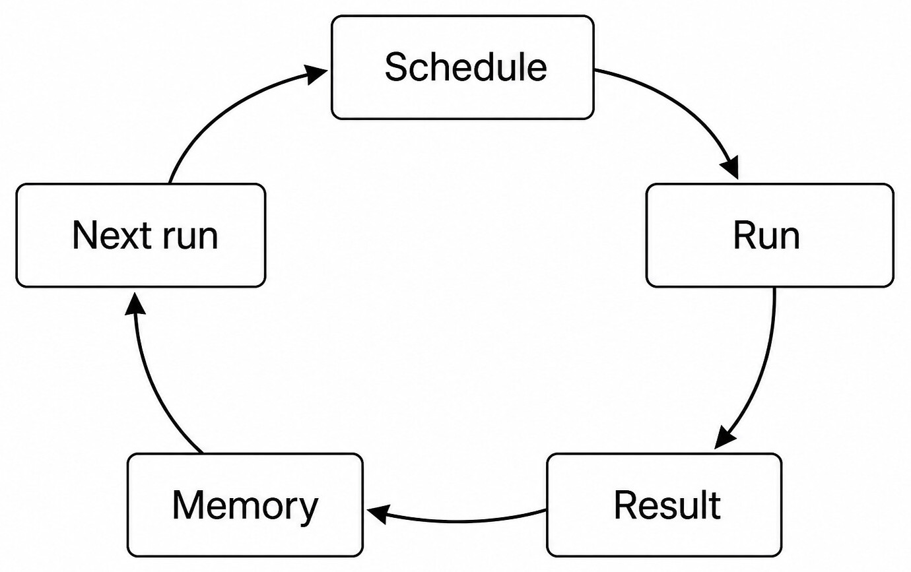
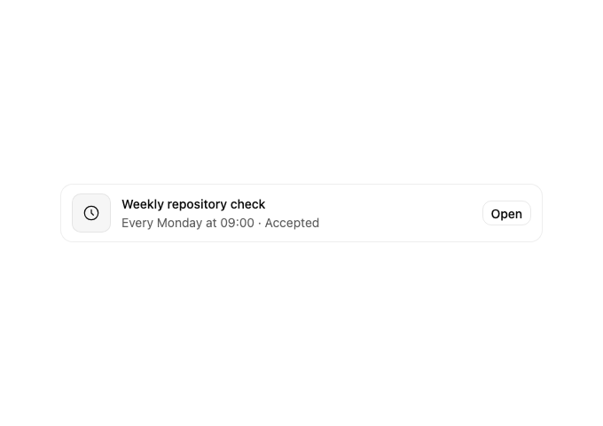
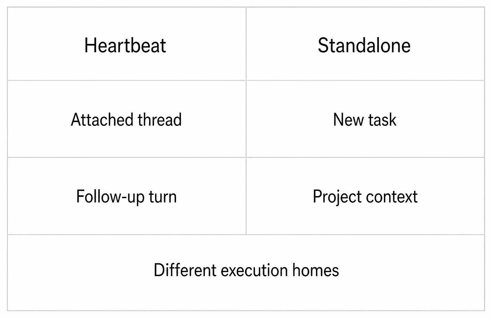
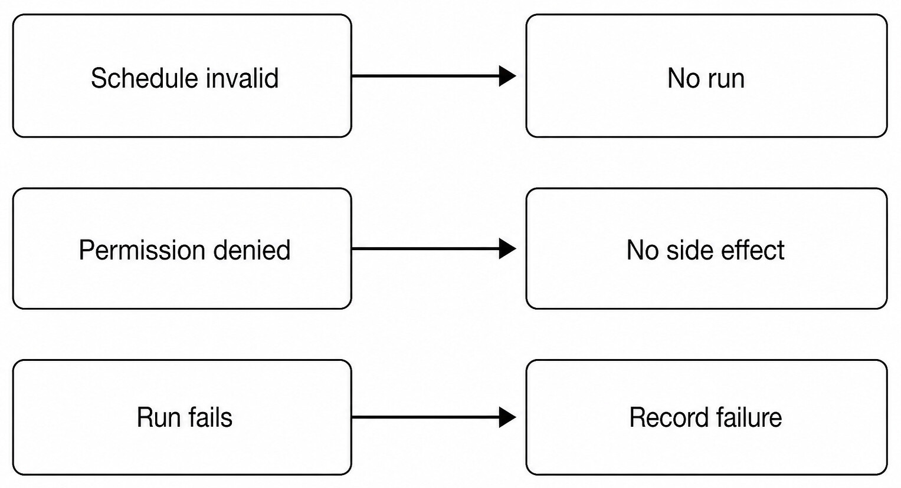

# Chapter 34 — Automations {#chapter-34}

## The question

An automation combines a schedule, execution home, prompt, permissions, failure policy, run
history, and bounded memory. Creating it does not run it immediately unless the contract says so.
Each occurrence still needs admission and a real result. The scheduler owns due time; the
automation service owns lifecycle; orchestration owns the resulting task or follow-up Turn.

_Figure 34.1 — Each run produces evidence and bounded memory before another occurrence is due._

**Accessible equivalent.** An automation schedule admits a run, records its result and bounded memory, then determines the next run.

_Product capture — The real automation card presents an accepted definition and cadence as product state; the card alone says nothing about a run result or the next run's permissions._

| Fact                      | Owner                              | Reader question                           |
| ------------------------- | ---------------------------------- | ----------------------------------------- |
| Recurrence rule/time zone | Automation configuration/scheduler | When is it due?                           |
| Mode                      | Automation mode contract           | Where does it execute?                    |
| Prompt                    | Automation record                  | What intent is replayed?                  |
| Run envelope              | Automation service                 | Which permissions/context enter this run? |
| Result/history            | Run repository/projection          | What actually happened?                   |
| Memory                    | Bounded automation state           | What may inform the next run?             |

Time zones and daylight-saving changes matter. A human phrase such as “every morning” must become
an explicit supported schedule. Preview the next occurrence. Invalid or ambiguous schedules should
be refused rather than guessed.

## Heartbeat versus standalone

A heartbeat is attached to an existing Thread and normally creates a follow-up Turn there. It is
suited to monitoring or checking back while preserving the conversation's product context. A
standalone automation creates a new task/run with explicit Project context. It is suited to work
that should not append indefinitely to one Thread.

_Figure 34.2 — The two modes have different execution homes even when their schedules look alike._

**Accessible equivalent.** Heartbeat automation follows up in an attached Thread; standalone automation creates a new task with explicit Project context.

| Dimension | Heartbeat                                | Standalone                                  |
| --------- | ---------------------------------------- | ------------------------------------------- |
| Home      | Attached Product Thread                  | New task/run                                |
| Context   | Thread history plus bounded envelope     | Explicit Project and prompt envelope        |
| Best use  | Monitor, follow up, check changing state | Independent recurring production work       |
| Risk      | Thread noise/context growth              | Fragmented tasks or missing Project context |
| Result    | Follow-up Turn/activity                  | New task and run history                    |

Do not use standalone merely to work around heartbeat limits, or heartbeat to smuggle a new
unrelated job into an old conversation. Choose the home that matches how the user will review and
continue the work.

## Permissions are evaluated per run

An automation is future authority, so permissions must remain explicit. A record may store an
approved runtime mode or bounded policy, but a due schedule does not grant new external powers.
Exact-turn HostGateway checks still apply to local capabilities. Connected-service credentials stay
with their owners. High-impact actions may require approval or may be unsuitable for unattended
execution.

Changing a prompt, Project, permission policy, or destination should update the automation record
deliberately. Do not keep a hidden second schedule with old authority. Pausing prevents new runs;
it does not cancel an already admitted Turn unless a separate stop action is issued.

## Results, memory, and next run

Run history distinguishes scheduled, admitted, completed, failed, skipped, or cancelled outcomes
according to the implemented contract. The next run is computed from schedule state, not from an
assistant promise. Memory can carry bounded facts needed for comparison, such as the last observed
version or cursor. It must not become an unbounded transcript or a credential store.

Good bounded memory includes the last observed release tag for change detection and the last
successful artifact hash for idempotency. Poor memory includes an entire raw webpage on every run,
because it grows and becomes stale. An access token never belongs in memory; its credential owner
must retain it. An unsupported assistant forecast is also not memory-worthy execution evidence.

Idempotency matters. A retry after uncertain failure must use a stable run identity or check the
external state before repeating side effects. A monitor can safely report the same unchanged state;
an automation that sends or publishes needs stronger duplicate prevention.

## Failure is part of the schedule

_Figure 34.3 — Invalid configuration or denied authority produces no side effect; execution failure
is retained as history._

**Accessible equivalent.** Invalid schedule prevents a run, denied permission prevents side effects, and execution failure is recorded.

| Failure              | Run outcome              | Next occurrence            | Required evidence     |
| -------------------- | ------------------------ | -------------------------- | --------------------- |
| Invalid schedule     | No run                   | None until corrected       | Validation error      |
| Project missing      | Refused/failed           | Policy-dependent           | Exact missing context |
| Permission denied    | No protected side effect | Future run still explicit  | Denial receipt        |
| Engine unavailable   | Launch failure           | Do not silently substitute | Exact binding/error   |
| Task execution fails | Failed run recorded      | Continue/pause per policy  | Terminal Turn/result  |

### Worked example: watch a dependency release

Jules wants a weekly check for a dependency release. A heartbeat suits an existing maintenance
Thread: every week it searches the official source, compares the observed stable tag with bounded
memory, and posts a follow-up only with cited evidence. It does not update the dependency
automatically because Jules requested monitoring, not mutation.

For a nightly report generated in a specific Project, standalone mode may be better. Each run starts
with explicit Project context, reads current data, writes into an isolated or Project output path,
and records a result. Publishing or emailing the report would require separately authorized
connected-service actions and duplicate prevention.

## Operating and recovering

Before enabling, inspect name, prompt, mode, Project/Thread home, schedule, time zone, next run,
permissions, and notification/failure policy. After a run, inspect the resulting task or Turn and
receipts, not only the “last run” timestamp. Pause while changing risky inputs. Delete only when the
user intends to remove future execution and history retention behavior is understood.

If a run is missed while the app is offline, the scheduler's implemented catch-up policy decides
whether to skip or admit; do not invent a backlog. If two scheduler ticks race, stable run identity
must prevent duplicate admission. If execution starts and the app restarts, orchestration recovery
settles the Turn while automation history reconciles the run.

## Check your model

1. Does due mean completed? No.
2. Is heartbeat a standalone task? No; it is attached to a Thread.
3. Does schedule grant capability permission? No.
4. Should memory contain credentials? No.
5. What prevents duplicate side effects? Stable run identity, idempotency, and external-state checks.

## Schedule evaluation and catch-up

A scheduler compares current time with each active automation's recurrence and last admitted run.
Time zone is part of interpretation. Daylight-saving transitions can skip or repeat local clock
times. The service must use one documented recurrence policy rather than recompute from prose on
every tick.

When Haros was offline at the due time, catch-up behavior must follow the implementation. Possible
policies include skip, admit one catch-up run, or process bounded missed occurrences. The Guidebook
must not promise a backlog if tests do not. The next-run projection should explain the result.

When a clock moves forward, apply the documented missing-local-time policy rather than choosing an
arbitrary time. When a clock repeats, stable occurrence identity prevents a duplicate. After an
offline interval, apply bounded catch-up rather than replaying an unbounded backlog. Editing a
schedule recomputes from the new record/version; it does not leave a hidden old timer. Pausing stops
new admission without deleting history.

Scheduler ticks can race across processes or restart. Stable occurrence/run identity and repository
claims prevent double admission. The UI's countdown is not the lock.

## Run envelopes freeze context

Each run needs a bounded envelope: automation identity/version, occurrence, prompt, mode, target
Thread or Project, Engine/model selection where applicable, runtime/interaction mode, permission
policy, and memory input. Freezing this data makes a run explainable even if the automation is
edited while it executes.

An edit affects future occurrences, not the already admitted Turn. Deleting or pausing can prevent
future runs but must not rewrite historical provenance. Stopping the current run is a separate
command against its task/Turn.

If the configured Project moved or Thread was archived, the service follows explicit admission
rules. It must not select a similarly named Project. A heartbeat tied to a deleted Thread cannot
become standalone automatically.

## Monitoring without noisy false positives

A monitor should define the source, comparison, notification condition, unchanged outcome, and
failure outcome. Store only the last fact required for comparison. For a release monitor, that may
be the last stable version and source URL. A failure to fetch is not “no change.”

Heartbeat is often ideal because unchanged results can remain compact in one Thread, while changed
state creates a useful follow-up. Still control frequency and context growth. A monitor that posts
every minute can bury actionable history.

Notification policy is separate from execution. Muting routine success does not erase run history
or disable failure records. Conversely, a notification does not prove the monitored action
completed; link it to the run evidence.

## Side effects and idempotency

Read-only recurring analysis can often retry safely. Creation, sending, payment, publication, or
repository mutation cannot. Give each occurrence a stable idempotency key where the external
service supports one, and query external state after uncertain transport failure.

Suppose a nightly automation creates an issue when a threshold is crossed. It times out after the
request. Retrying immediately might create a duplicate. Query for the occurrence marker or use the
same idempotency identity. Record whether the issue existed before claiming success.

If the external service has no idempotency support, design a bounded deduplication rule and make the
residual risk visible. Do not store credentials or whole remote responses in automation memory.

## Engine availability and exact binding

An automation may be configured with an Engine/model selection. At run admission, that exact
binding is frozen. If the Engine is unavailable, preserve the occurrence and failure. Silent
fallback would change execution semantics and make history misleading.

The Product Thread and automation history remain Haros facts. Native Engine Session continuity is
not promised across runs. A heartbeat can supply Product Thread context without fabricating the
same native Session. Standalone runs have explicit project/task context.

If the user wants a different Engine for future runs, update the automation record. Do not mutate
the provenance of prior runs or a currently admitted occurrence.

## Concurrency and overlap

A new occurrence can become due while the previous run is still active. The service needs an
explicit overlap policy: skip, queue, or allow bounded concurrency if implemented. Never assume
parallelism from the recurrence interval. Overlap can duplicate side effects and race memory.

For monitoring, queueing one later check may be enough; processing every missed minute is rarely
useful. For report production, overlapping writes to the same Outbox path can corrupt artifacts.
Use run-specific workspaces or serialize according to the owner contract.

Memory updates should commit from a terminal run under version/occurrence rules. A failed or older
run must not overwrite newer successful memory. Result projection and next-run computation need the
same ordering discipline.

## Automation incident playbook

When a run is missing, inspect automation status, schedule/time zone, next-run calculation, pause
state, and scheduler claim history. When duplicated, compare occurrence and run identities. When a
run exists but no task appears, inspect admission receipt. When a task ran but no external effect
exists, inspect capability/service receipt.

Keep layers distinct:

| Symptom                 | Owner to inspect        | Evidence                            |
| ----------------------- | ----------------------- | ----------------------------------- |
| Never became due        | Scheduler/configuration | Recurrence and next run             |
| Due but no run          | Claim/admission         | Occurrence claim and refusal        |
| Run launched then stuck | Orchestration/Engine    | Turn lifecycle and reconciliation   |
| Tool denied             | HostGateway/service     | Approval and operation receipt      |
| Notification absent     | Notification policy     | Delivery outcome, separate from run |

Do not repair scheduler failure by manually creating an untracked task and pretending it was the
occurrence. A manual recovery can be useful, but record it as manual and reconcile automation state.

## Change and retirement workflow

Before editing, view the existing automation rather than creating a duplicate. Preserve fields the
user did not ask to change. Update name, prompt, recurrence, mode, destination, or permission policy
as one coherent record. Verify the next occurrence after update.

Pause when temporarily unwanted. Delete when future scheduling and the record should be removed
according to retention rules. Neither action authorizes cancelling a live run automatically. If the
Thread should archive after a one-shot terminal outcome, that is a product action outside raw prompt
text.

After retirement, ensure no active scheduler claim can resurrect it. Historical tasks remain real
product state according to retention; deletion of the automation is not conversation rollback.

## Exercise: unchanged, changed, failed

Create a synthetic heartbeat monitor against a local fixture with a single version field. On run 1,
store the observed version as bounded memory. On run 2, leave the fixture unchanged and record an
unchanged result without inventing an update. On run 3, change the version and verify the follow-up
identifies the exact difference. On run 4, make the source unavailable and verify failure is not
reported as unchanged.

This four-run sequence exercises result classification and memory ordering without external cost.
The attached Thread should show distinct Turns and authoritative outcomes. The memory should contain
only the last verified value, not the whole transcript.

Repeat conceptually with standalone mode only if a new task per run is genuinely desired. The task
list should then show separate run homes rather than one Thread history.

## Cost, rate, and retention boundaries

Recurring work can consume model, network, storage, and connected-service quotas. Choose the lowest
frequency that meets the decision need and bound each run. A user's authorization for one focused
probe is not permission for an unbounded automation. High-cost actions need explicit limits.

Run history and artifacts also accumulate. Apply documented retention and summarize bounded memory.
Do not delete historical evidence silently merely to keep the automation green. If storage limits
prevent new artifacts, record the failure and let the user change retention or destination.

External rate limits are not “no change.” Back off according to service policy and record the run as
failed or deferred. Do not increase concurrency to compensate.

## Automation handoff

Report automation identity, active/paused state, mode and execution home, recurrence/time zone,
next occurrence, prompt version, Project/Thread target, Engine/model binding if applicable,
permission and failure policy, last terminal run, bounded memory, and unresolved uncertain effects.

Avoid saying “will run” when only configuration validation passed; say it is scheduled with the
next projected time. Avoid saying “runs successfully” based on creation. Cite an actual terminal
run. Avoid saying “continues the same Session” for heartbeat; Product Thread context does not create
native Engine continuity.

## Completion criteria for automation operations

Creation or update completes when one canonical record reflects the requested configuration and the
next occurrence validates. A run completes only with a terminal run/task outcome. A side-effecting
run completes when its capability receipt and external state agree. Pause completes when no new
occurrence can be admitted; it does not settle a live Turn.

Use separate language for each: configured, scheduled, due, admitted, running, completed, failed,
or paused. “Active” alone is ambiguous. A useful summary says: “Heartbeat active; next occurrence
09:00 Asia/Shanghai; last run failed before Web access; no external effect; next run remains
scheduled.”

## Reviewing automation quality

Before leaving an automation active, ask whether its frequency matches the decision, unchanged
outcomes are quiet enough, failures are visible, memory is minimal, cost is bounded, target context
is exact, and side effects are idempotent. Test with synthetic state where possible.

An automation that technically runs but floods a Thread, retries destructive work, or reports fetch
failure as no change is not operationally correct. Quality includes the long-lived behavior around
the run, not only the scheduler tick.

## Source trail

- `packages/shared/src/automationMode.ts` defines heartbeat and standalone mode semantics.
- `apps/server/src/automation/Layers/AutomationService.ts` owns automation lifecycle and run handling.
- `apps/server/src/automation/Layers/AutomationScheduler.test.ts` proves due-time and scheduling behavior.
- `apps/server/src/automation/runEnvelope.test.ts` covers bounded per-run context and permissions.

<!-- guide-navigation:start -->

[Guidebook contents](../README.md) · [Previous: Studio Outputs](33-studio-outputs.md) · [Next: Desktop, Web, and Server](../part-05-architecture/35-desktop-web-server.md)

<!-- guide-navigation:end -->
