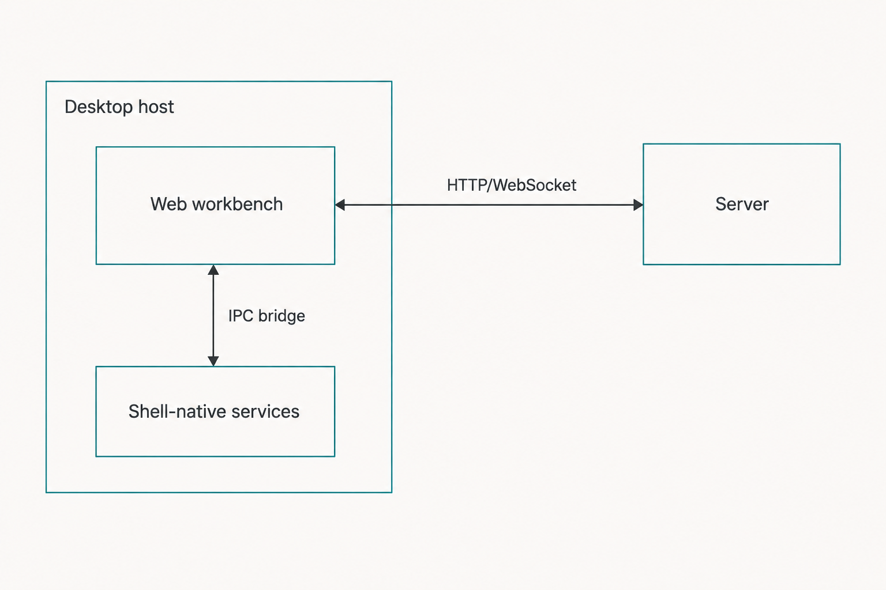
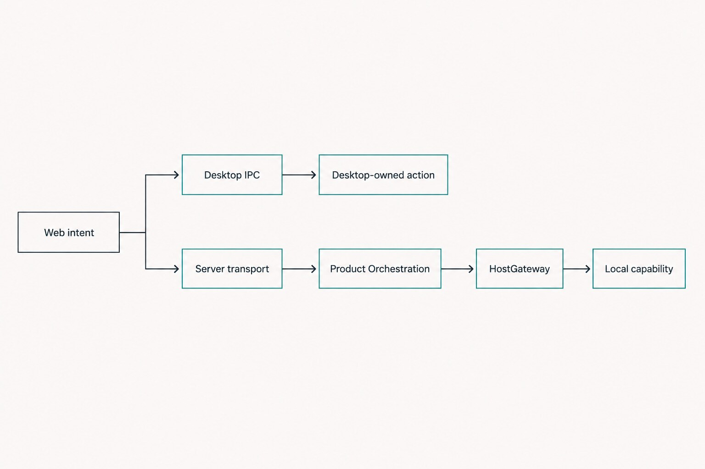

# Chapter 35 — Desktop, Web, and Server {#chapter-35}

## The question

Haros looks like one desktop application. Why does its architecture name three different pieces—
Desktop, Web, and Server—and which piece is allowed to do what?

The short answer is that one product does not require one process. Haros separates presentation,
native application lifecycle, and authoritative work so that each has a clear owner:

- **Desktop** is the Electron shell. It owns windows, native menus and dialogs, application
  lifecycle, tightly scoped desktop IPC, and supervision of the local Server process.
- **Web workbench** is the React user interface. It renders Agent, Chat, and Studio, gathers user
  intent, and consumes typed snapshots and streams.
- **Server** owns Product Orchestration, persistence, Engine adapters, HostGateway composition, and
  the services that actually touch repositories, terminals, browsers, and devices.

The Web workbench does **not** own native execution. A button may begin a request, and the UI may
show immediate pending feedback, but a React component is not the authority that starts an Engine,
writes a file, or declares a Product Turn complete. Those facts cross a typed boundary to the Server.

_Figure 35.1 — Three cooperating process roles form one Haros product without sharing ownership._

**Accessible equivalent.** Desktop surrounds and supervises the application. It hosts the Web
workbench and launches or connects to the Server. The Web workbench sends typed intent and reads
typed state. The Server owns Product Orchestration, persistence, Engine adapters, HostGateway, and
native capability services. No arrow runs directly from Web components to an Engine process or a
local capability implementation.

## One product, three responsibilities

Process boundaries answer “where does this code run?” Ownership boundaries answer “who is allowed
to decide this fact?” The two often align, but they are not synonyms. For example, Desktop owns the
window and may broker a native folder picker, while the Server remains the owner of workspace
admission and file operations used by an Engine. Similarly, the Server can serve static Web assets,
but it does not become the owner of button layout or focus behavior.

| Process role                 | Owns                                                                                                | Receives                                                           | Must not become                                                           |
| ---------------------------- | --------------------------------------------------------------------------------------------------- | ------------------------------------------------------------------ | ------------------------------------------------------------------------- |
| Desktop shell                | Window lifecycle, native menus/dialogs, desktop protocol, backend supervision, bounded IPC          | Native user actions and Server readiness/failure                   | A second Product Orchestration store or an Engine adapter                 |
| Web workbench                | Rendering, routes, accessible interaction, local draft/presentation state                           | Typed snapshots, stream items, RPC results, desktop bridge results | Native process owner, secret reader, or durable product-state authority   |
| Server                       | Product Orchestration, persistence, Engine runtime composition, HostGateway and capability services | Typed commands, authenticated requests, Engine runtime events      | A second UI state tree or an excuse to bypass contracts                   |
| Engine adapter inside Server | Translation to one Engine's native protocol and lifecycle                                           | Admitted, exact Engine/Turn inputs                                 | Owner of Product Threads, local permissions, or cross-Engine continuation |

This separation is visible in source composition. The Desktop entrypoint starts Electron concerns
and supervises a backend child in desktop mode. The Server entrypoint resolves configuration and
constructs Effect layers for orchestration, Engine services, persistence, HostGateway, Git,
terminal, browser, devices, automation, and related owners. The Web entrypoint mounts the router
and shared store into the renderer. The repository uses stable machine identifiers in some package
names and environment variables; those implementation contracts do not create a second product
identity. The product is Haros.

## Startup is a negotiated sequence

A desktop window cannot safely assume that a local Server is ready merely because a child process
was spawned. Current source-alpha startup coordinates several distinct facts:

1. Desktop resolves a private application data location and a local backend configuration.
2. It starts the Server process with a loopback HTTP address, WebSocket address, and a scoped
   authentication value supplied through controlled process configuration.
3. The Server secures its paths, opens and migrates persistence, composes runtime services, performs
   startup reconciliation, and begins listening.
4. Desktop waits for an explicit readiness outcome rather than treating process creation as ready.
5. The renderer receives the connection information through the desktop bridge and establishes its
   typed transport.
6. The Web workbench obtains snapshots and subscriptions before it can claim authoritative product
   state.

In development, the renderer may be loaded from a development URL. In a built desktop application,
Desktop loads the product entry URL through the configured static path/protocol. That difference is
packaging mechanics, not a different architecture: Web still consumes Server projections, and
Desktop still owns the native shell.

Haros can also run its Server in a web-oriented mode. That does not move native authority into the
browser. It changes hosting and access configuration while leaving server-side owners intact.
Remote access, authentication, trusted origins, and platform availability add more gates; a URL
alone is not authorization to execute local work.

## The edges are intentionally narrow

There are several kinds of edges, and confusing them produces bad designs. Desktop IPC is suitable
for native shell actions such as choosing a folder, controlling a window, showing a confirmation,
or asking the operating system to reveal a file. Typed WebSocket RPC carries requests to Server
services. Snapshot and subscription contracts carry product state back. HTTP routes serve bounded
resources such as application assets or specifically admitted local previews.

_Figure 35.2 — An action uses the edge owned by its responsibility instead of a generic bridge._

**Accessible equivalent.** A native-window action travels from Web to a narrow Desktop IPC handler.
A product command or capability request travels from Web through typed authenticated RPC to Server.
Server dispatches product intent to Product Orchestration and admitted local work through
HostGateway or the real capability service. Snapshots and subscribed events return to Web. Engine
native protocols and credentials remain behind Server-side adapters and are never projected into
the renderer.

| Edge                                | Appropriate payload                                                       | Validation/authority                                               | Unsafe shortcut                                                 |
| ----------------------------------- | ------------------------------------------------------------------------- | ------------------------------------------------------------------ | --------------------------------------------------------------- |
| Web ↔ Desktop IPC                   | Folder/file picker request, window action, theme or desktop update action | Desktop handler decodes the request and applies OS-specific policy | Exposing arbitrary shell execution to the renderer              |
| Web ↔ Server typed RPC              | Commands, queries, subscriptions, capability inputs                       | Shared schemas plus Server authentication and domain admission     | Letting components call an Engine binary directly               |
| Server → Web stream                 | Projection updates, runtime activity, bounded live state                  | Server sequence/lifecycle owners; client synchronization logic     | Treating an optimistic UI flag as durable truth                 |
| Server ↔ Engine adapter             | Exact session/turn input and canonical runtime events                     | Engine service, adapter contract, lifecycle generation             | Passing raw Engine protocol objects through to UI               |
| Engine operation → local capability | Typed HostGateway request bound to an admitted Turn                       | HostGateway authorization, cancellation, timeout, receipt          | Adapter-owned file, Git, terminal, browser, or device authority |

The edge chosen should match the fact being changed. “Open a native folder dialog” is a Desktop
operation. “Create a Project from the selected folder” is a product command. “Read a file for the
active Turn” is a Server capability operation. One visible workflow may use all three, but merging
them into one unrestricted renderer bridge would erase the security and lifecycle boundaries.

## Worked example: send a diagnostic request

Suppose Jules opens an Agent Project and sends: “Find why the parser test fails, but do not edit
files.” The Web workbench controls the visible Composer. It validates presentation-level input,
builds the typed command, and can immediately show that the message is being submitted with the
selected Engine and model. That immediate feedback is useful, but it is provisional.

The request crosses the WebSocket RPC contract. Server transport decoding rejects malformed input
before it becomes product history. Product Orchestration decides whether the Thread exists, whether
the exact Engine/model/runtime binding is admissible, and whether the Turn should start or queue.
Accepted events and projections make the message and lifecycle durable. Only after that boundary
does an Engine reactor ask the selected adapter to start or resume execution.

If the Engine needs to search the repository, the adapter does not open the filesystem on its own.
The request goes through the Server-side HostGateway projection to the actual file/search service,
with exact-Turn authority. Results and receipts return through bounded contracts. Engine output is
normalized into runtime events, ingested into Product Orchestration, projected, and streamed back
to Web. The renderer displays activities and text; it does not decide that the run succeeded.

This worked example also explains what each process can recover. If the renderer reloads after the
command commits, it asks the Server for a fresh snapshot and resumes subscriptions. If the Server
never accepted the command, the UI must show a recoverable submission failure rather than invent a
Turn. If the Engine launch fails after acceptance, Product Thread history and Queue facts survive,
and the runtime path settles the Turn honestly. Desktop supervises process failure and restart, but
it does not rewrite the outcome itself.

## Why Web cannot own native execution

A browser-style renderer is optimized for interaction and presentation. Its lifecycle is also less
stable than the work it displays: routes change, components unmount, a renderer can reload, a tab
can be hidden, and a window can crash. If a component owned an Engine child process, then closing a
panel might accidentally terminate work; two mounted views might start duplicate processes; and a
renderer refresh could lose cancellation state.

The renderer is also the wrong trust zone for credentials and unrestricted host access. Haros sends
credential-blind status and capability projections to Web. “Authenticated,” “unavailable,” or
“supports runtime model discovery” is enough to render a control. The secret or private Engine
configuration used to establish that fact remains with its Server-side owner.

Finally, the Web workbench is shared by Agent, Chat, and Studio. If each route or screen owned
execution, the three surfaces would acquire separate lifecycle implementations. Server-side Product
Orchestration keeps Queue, Timeline, recovery, and settlement shared while each surface presents an
appropriate workspace experience.

## Failure and recovery by boundary

The safest recovery starts by naming the boundary that failed. A blank renderer, an unavailable
Server, a rejected command, and an Engine launch error can look similar to a user but have different
durable consequences.

| Failure                              | What may already be durable                                  | Visible recovery                                                                         | Wrong conclusion                                      |
| ------------------------------------ | ------------------------------------------------------------ | ---------------------------------------------------------------------------------------- | ----------------------------------------------------- |
| Renderer load/crash                  | Server product state and running work may survive            | Reload Web, negotiate transport, fetch snapshot, resume subscriptions                    | “The task stopped because the view disappeared”       |
| Desktop cannot start Server          | No new command can be admitted; prior database remains local | Show startup evidence, retry bounded supervision, keep the window in a recoverable state | “A spawned PID means Haros is ready”                  |
| WebSocket disconnect after commit    | Events, projections, and receipt may already exist           | Reconnect and reconcile from snapshot/sequence before retrying                           | “No response means the command was not accepted”      |
| Typed command rejected               | No accepted event for that command                           | Correct input or product state and submit a new valid request                            | “Write the desired row directly”                      |
| Engine launch fails after acceptance | Prompt, binding, and start intent remain product facts       | Settle failure visibly; preserve Queue/Thread; let the user retry deliberately           | “Silently choose another Engine”                      |
| Desktop quits during active work     | Product facts remain; native runtime may not                 | Use shutdown coordination and next-start reconciliation                                  | “A native Session must continue across process death” |

Desktop shutdown deserves special care. Current code coordinates running-task prompts, backend stop,
timeouts, and failure policies. The Server owns settlement and durable shutdown behavior; Desktop
owns the application-level decision to close and supervision of the child. A normal quit is not the
same as a release update, a renderer close, or an operating-system kill. This edition describes the
checked-in alpha behavior, not a promise that every platform or future package uses identical
timings.

## Reading the code without getting lost

Start from composition, not from every feature. `apps/desktop/src/main.ts` shows the native shell
and backend supervision boundary. `apps/server/src/main.ts` resolves startup configuration;
`apps/server/src/serverLayers.ts` shows which services are composed into the Server. The
`packages/contracts/src/rpc.ts` surface shows typed calls across the main Web/Server edge.
`apps/web/src/main.tsx` and the Web store show the renderer bootstrap and consumer side.

Then follow one small request. A folder picker will teach Desktop IPC, but not Product
Orchestration. An orchestration snapshot RPC will teach Web/Server contracts and projection reads,
but not Engine execution. A turn-start command will cross the whole system. State clearly which
journey you are tracing so that adjacent services do not become accidental owners in your mental
model.

| Change request             | First owner to inspect                                 | Supporting boundary                  | Change-radius warning                                |
| -------------------------- | ------------------------------------------------------ | ------------------------------------ | ---------------------------------------------------- |
| Add a native window action | Desktop shell and IPC contract                         | Preload/renderer call site           | Do not add a generic command bridge                  |
| Change visible Thread data | Product Orchestration/projection contract              | RPC and Web consumer                 | Do not derive authority independently in Web         |
| Add an Engine              | `ENGINE_DESCRIPTORS`, adapter seam, focused tests      | Engine registry/discovery projection | Do not add lists in routes, Settings, or persistence |
| Add a local tool           | Real capability service and HostGateway catalog/policy | Adapter's typed projection           | Do not give the adapter ambient host authority       |
| Change startup readiness   | Server readiness owner and Desktop supervisor          | Renderer startup presentation        | Do not equate socket existence with full readiness   |

## Try it safely

Perform a read-only process trace in source. Choose the orchestration snapshot request in
`packages/contracts/src/rpc.ts`. Locate its Server handler and the projection query it calls. Then
locate the Web client or store action that consumes the result. Write three columns on paper:
“request,” “authoritative work,” and “presentation.”

Next, inspect one Desktop IPC handler such as the folder picker. Confirm that it ends in a native
Desktop action and does not silently create Product state. The observable result is two distinct
paths: native shell work through IPC, and product-state work through typed Server RPC. Do not run an
Engine, mutate a database, or use a real user home for this exercise.

## Recap

1. Desktop, Web, and Server are process roles inside one Haros product.
2. Web renders intent and projections; it does not own native execution or durable product truth.
3. Server owns Product Orchestration, persistence, Engine composition, HostGateway, and capability
   services.
4. Desktop owns native application lifecycle and bounded OS bridges, including Server supervision.
5. Recovery begins by identifying which edge failed and what had already crossed the durable
   boundary.

## Check your model

1. **If a React component shows “running,” has it made the Turn authoritative?**  
   No. The component renders projected state. Product Orchestration and admitted runtime facts own
   the lifecycle.

2. **Should an Engine adapter open arbitrary files because it runs inside the Server process?**  
   No. Process location does not grant authority. Local capabilities remain behind HostGateway and
   their real service owners.

3. **What should happen after a WebSocket disconnect when command acceptance is uncertain?**  
   Reconnect and reconcile from durable snapshots/receipts before deciding whether a retry is safe.

## Source trail

- `docs/architecture.md`, “Processes,” defines the top-level Desktop, Web, and Server map and the
  rule that Web consumes typed projections rather than native state.
- `apps/desktop/src/main.ts` owns Electron bootstrap, native bridges, renderer hosting, and backend
  process supervision; its focused startup and shutdown helpers make those stages explicit.
- `apps/server/src/main.ts` resolves Server runtime configuration, while
  `apps/server/src/serverLayers.ts` composes Product Orchestration, Engine, HostGateway, persistence,
  and capability services.
- `apps/server/src/effectServer.ts` and the WebSocket connection tests prove the HTTP/WebSocket
  transport boundary and connection lifecycle.
- `packages/contracts/src/rpc.ts` is the typed cross-process RPC surface rather than a bag of raw
  renderer messages.
- `apps/web/src/main.tsx`, `apps/web/src/store.ts`, and focused projection tests show Web as a typed
  consumer and presentation owner.
- `apps/server/src/main.integration.test.ts` and Desktop readiness/shutdown tests provide executable
  evidence for startup and failure claims in this source-alpha edition.

<!-- guide-navigation:start -->

[Guidebook contents](../README.md) · [Previous: Automations](../part-04-capabilities/34-automations.md) · [Next: Typed Contracts and Narrow Projections](36-typed-contracts-narrow-projections.md)

<!-- guide-navigation:end -->
