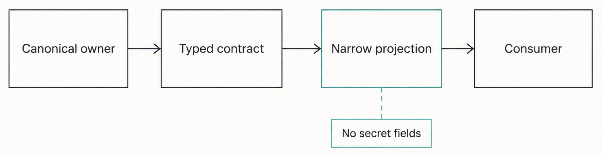
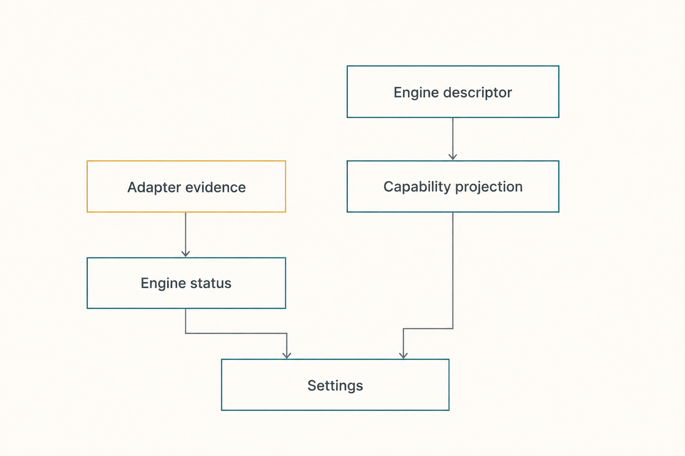

# Chapter 36 — Typed Contracts and Narrow Projections {#chapter-36}

## The question

How can the Web workbench, an Engine adapter, or a background service learn enough to do its job
without becoming a second owner of the underlying fact?

Haros answers with two related tools:

- A **typed contract** describes the allowed shape and meaning of information crossing a boundary.
- A **narrow projection** presents only the facts a consumer needs, in a form owned by the source
  side of that boundary.

A TypeScript interface alone is not the whole answer. Network, database, plugin, and Engine data
arrive at runtime, where compile-time types no longer protect anything. The shared contracts use
runtime schemas for important boundaries, RPC declarations bind payloads to results and typed
errors, and Server owners produce query shapes rather than exposing private storage or protocol
objects.

The result is **knowledge without ownership transfer**. Web can render that an Engine is ready
without reading credentials. An adapter can receive a typed HostGateway tool projection without
owning permissions. A sidebar can read Thread shell summaries without loading every message and
activity or reconstructing Product Orchestration itself.

_Figure 36.1 — The consumer sees a deliberate window onto owner-controlled truth, not the owner's
entire private state._

**Accessible equivalent.** An authoritative owner contains durable state, secrets, and internal
implementation details. A schema-controlled projection selects named, validated, consumer-safe
fields. The consumer receives that projection and may render or act within its contract, but it
cannot reach backward to mutate the owner's private store or infer omitted secrets.

## Contract, projection, and owner are different things

A contract does not own the value it describes. `EngineKind` constrains an Engine identity at a
boundary, but `ENGINE_DESCRIPTORS` remains the sole owner of Engine identity, registration,
display name, capability projection, and Settings discovery. `OrchestrationThread` describes a
readable Product Thread shape, but Product Orchestration and persistence own the facts that fill it.
An RPC declaration defines how a request crosses transport; it does not become the domain decider.

A projection is also not “a copy that may evolve independently.” It is a derived view with a named
source. It may deliberately omit data, aggregate it, or reshape it for efficient reading. The
consumer can cache the result for rendering, but the projection's owner remains responsible for
how the view is built and repaired.

| Layer            | Purpose                                              | Example                                        | Does not own                                             |
| ---------------- | ---------------------------------------------------- | ---------------------------------------------- | -------------------------------------------------------- |
| Domain owner     | Decides and persists authoritative facts             | Product Orchestration accepts a Thread command | Consumer layout or transport encoding                    |
| Shared contract  | Defines valid cross-boundary shape and meaning       | Command, event, Engine status, RPC payload     | The live instance or its lifecycle                       |
| Projection owner | Derives a query shape from authoritative state       | Shell snapshot or Thread detail snapshot       | A second event history                                   |
| Transport        | Encodes, authenticates, routes, and decodes messages | Typed WebSocket RPC                            | Domain admission or final truth                          |
| Consumer         | Presents or uses the allowed view                    | Web store and React components                 | Secrets, private Engine state, or product-state mutation |

This distinction prevents a common error: moving business decisions into schema defaults or UI
normalizers. A decoding default may keep an older stored row readable, but it should not silently
authorize a new lifecycle transition. A Web selector may organize rows for fast rendering, but it
should not decide that a missing Session means a completed Turn. Policy belongs to the owner whose
invariants it changes.

## Runtime schemas make the boundary real

TypeScript catches many mistakes while building Haros. It cannot prove that a WebSocket peer sent a
valid Project ID, that JSON from SQLite matches today's event schema, or that an Engine returned a
well-formed model descriptor. Shared runtime schemas perform those checks where untrusted or older
data enters.

The contract package gathers schema definitions for orchestration, Server configuration, Engine
execution and discovery, HostGateway, files, Git, terminals, browser, devices, automation, and
other cross-boundary subjects. `packages/contracts/src/rpc.ts` attaches schemas to RPC payloads,
success values, and typed errors. Server handlers still perform authorization and domain checks
after decoding. “Structurally valid” is not the same as “allowed now.”

For example, a turn-start command can contain a correctly shaped Engine selection and still be
rejected because the Thread does not exist, the selection conflicts with an active exact binding,
or the lifecycle is not ready. Schema validation protects representation. Product Orchestration
protects meaning and timing.

Contracts should also keep failures useful without leaking private details. A typed discovery error
can say “authentication required,” “configuration problem,” “starting,” or “unavailable.” It need
not include a credential, an entire environment, an upstream response, or the contents of an Engine
private configuration file.

## Narrow means designed for the reader

The same authoritative state can support several projections. A navigation sidebar needs Project,
Space, and Thread shell fields: identity, title, pin/archive state, latest lifecycle summary, and
enough workspace metadata to route correctly. It does not need two thousand activities from every
Thread. An opened Thread needs messages, activities, pending interactions, plans, checkpoints, and
provenance. A retention job may need only worktree paths and deletion state. A diff query needs a
checkpoint context, not the complete Thread transcript.

The Server's `ProjectionSnapshotQuery` names these shapes explicitly. The current alpha
implementation includes full, shell, Thread-detail, single-row, count, sequence, diff-context,
generated-image-record, stale-flight, and retention-oriented queries. Those are implementation
choices at the pinned edition, not a guarantee that the exact set or row limits will never change.
The durable principle is that consumers ask an owner for the narrowest meaningful view.

_Figure 36.2 — Useful status crosses the boundary; credentials and private configuration do not._

**Accessible equivalent.** The Server-side Engine owners read private configuration and, when
needed, credentials. They derive a safe Engine status containing identity, availability,
authentication state, health, capability flags, checked path identity, and sanitized guidance. Web
receives only that typed status. It can render setup and readiness without receiving a token,
password, raw configuration, or complete upstream diagnostic.

| Consumer need              | Narrow shape                                                       | Intentionally omitted                            | Why omission matters                                    |
| -------------------------- | ------------------------------------------------------------------ | ------------------------------------------------ | ------------------------------------------------------- |
| Sidebar/navigation         | Shell snapshot of Spaces, Projects, and Thread summaries           | Message/activity bodies and Engine-private state | Fast startup and no parallel transcript hydration       |
| Open Thread                | Thread detail snapshot and bounded activity/message windows        | Other Threads' bodies and raw event rows         | One task can render without exposing the whole store    |
| Engine picker              | Descriptor-derived identity plus safe health/discovery projections | Credentials and raw private configuration        | UI can decide presentation, not authenticate on its own |
| Managed-worktree retention | Thread ID, archival/deletion state, relevant paths                 | Messages, goals, model data                      | Background cleanup sees only its ownership inputs       |
| Full-thread diff           | Workspace/checkpoint context                                       | Arbitrary file contents and unrelated activities | Diff service resolves evidence through its real owners  |

Narrow does not always mean tiny. A Thread detail may be substantial because the user needs a deep
work log. The key is that every field has a consumer job and an owner. A giant “everything” payload
is suspicious because it makes accidental coupling easy; an artificially fragmented API is also
bad if consumers must join private facts and recreate policy. The useful width is the smallest
coherent shape that preserves meaning.

## Worked example: show Engine readiness without a secret

Suppose Jules opens Settings after selecting an Engine. The Web workbench needs to answer several
questions: Is the Engine registered? Is it enabled? Is its executable available? Does it appear
authenticated? Which supported composer features should be shown? Can models be discovered now?

The incorrect implementation would have the renderer inspect environment variables, read the
Engine's private configuration directory, run its CLI, and parse diagnostic strings. That would
duplicate Engine discovery, expose secrets to a broader trust zone, and produce different answers
from the runtime that will actually execute the Turn.

The correct path derives identity and presentation from `ENGINE_DESCRIPTORS`, then asks Server-side
health and discovery owners for typed, sanitized projections. `ServerEngineStatus` includes fields
such as Engine kind, status, availability, authentication status, checked executable identity,
version evidence, and bounded guidance. `EngineComposerCapabilities` projects structural feature
support from the registered adapter and Haros-owned capability composition. Web maps these known
fields into controls. It does not parse a message to infer `not_installed`, and it does not assume
that a structurally supported feature is healthy at this instant.

If model discovery fails, the error projection identifies an allowed category. The UI can keep the
chosen Engine visible, explain that discovery is unavailable, and offer an exact retry or setup
route. It must not display the token that failed or silently choose a model from another Engine.
When the health owner recovers, a new projection updates presentation through the same contract.

This example contains three truths that should remain separate:

1. The descriptor says which Engine identity exists in Haros.
2. The adapter says which operations it structurally supports.
3. Health/discovery says what is currently usable and observed.

Combining those truths into a single freehand Settings list would make the UI a second owner.

## From projection to Web store

The Web store normalizes projection arrays into keyed maps and ordered identity lists for efficient
rendering. That is a presentation optimization. The store may preserve object identity for
unchanged rows, merge an ordered stream after a snapshot, and expose selectors to components. It
does not gain permission to alter the accepted sequence or fill unknown domain facts from guesses.

Sequence fields matter because snapshot plus stream is a synchronization protocol. A snapshot says
“this view includes authoritative projection work through sequence N.” Subsequent items can be
applied in order. If a gap, reset, or incompatible state appears, the client must resynchronize.
It should not increment its own number and declare parity.

Similarly, an optional field must retain its contract meaning. Sometimes absence means an older
Server did not provide the field; sometimes it means “unknown”; sometimes a decoding default is
safe. The contract's comment, schema, and focused compatibility test—not UI convenience—decide the
interpretation.

## Evolution without split truth

Contract changes are architecture changes when they alter meaning across processes. A safe change
starts with the owner and the consumer question. Add only the smallest field or variant needed,
give absence or failure an explicit meaning, update runtime decoding, and test both producer and
consumer. If the value is volatile, derive it from its canonical owner rather than copying a list.

Adding a new projection solely to save one query can be reasonable. Adding one that re-decides
Thread lifecycle is not. Moving a credential into a shared result because “Settings needs it” is
never a presentation optimization. Widening a schema to `unknown` may hide compile errors while
destroying the safety the boundary exists to provide.

| Contract failure                 | Safe behavior                                                    | Recovery owner                                      | Forbidden patch                                 |
| -------------------------------- | ---------------------------------------------------------------- | --------------------------------------------------- | ----------------------------------------------- |
| Incoming payload fails schema    | Reject before domain dispatch with bounded typed error           | Caller fixes input or negotiates compatible version | Coerce arbitrary fields in a component          |
| Stored row/event fails decode    | Fail with exact persistence operation/sequence evidence          | Persistence/migration/repair owner                  | Drop the row silently and continue history      |
| Projection is behind             | Report degraded/catching-up state and replay from durable events | Projection pipeline                                 | Resend accepted commands to “refresh” it        |
| Client misses stream sequence    | Fetch an authoritative snapshot and resume                       | Transport synchronization                           | Invent missing state locally                    |
| Optional field is absent         | Apply the contract's documented compatibility meaning            | Producer/consumer contract owners                   | Infer from diagnostic prose or unrelated fields |
| Discovery returns malformed item | Isolate or reject it with sanitized evidence                     | Server-side discovery owner                         | Pass raw upstream object into Web               |

## Failure and recovery: the projection is not the history

A malformed request should fail before it reaches a decider. A command that passes its schema may
still fail admission. A command that commits may be temporarily absent from a lagging deferred
projection. A Web connection may miss the reply even though the receipt exists. These are different
boundaries, and one generic “retry” button cannot safely repair all of them.

Projection repair replays accepted events into derived tables. It does not edit the event history
to match whatever the UI last saw. Client repair fetches a snapshot and reconciles sequences. It
does not write Web cache contents into SQLite. Contract incompatibility should fail closed with
bounded evidence rather than letting one side guess the other's fields.

Credential-blind projections also shape incident handling. If Settings reports a sanitized
authentication problem, developers should inspect the Server-side health owner and focused logs in
a safe environment. Adding raw credential output to the RPC result would broaden the incident into
a security failure.

## Ownership checks for contributors

Before adding a field, ask four questions: Who decides it? Where is it persisted, if anywhere? Who
projects it? Who consumes it? A convincing answer names one owner at each responsibility and no
parallel truth.

| Proposed change              | Canonical starting point                              | Required proof                                    | Stop signal                                                 |
| ---------------------------- | ----------------------------------------------------- | ------------------------------------------------- | ----------------------------------------------------------- |
| New Thread summary flag      | Orchestration event/projection owner                  | Decider/projector/query plus Web consumer test    | UI would infer it from messages independently               |
| New Engine presentation fact | `ENGINE_DESCRIPTORS` or descriptor-derived projection | Exhaustiveness and Settings/discovery test        | A second Engine registry appears                            |
| New RPC operation            | Real service owner plus contract schema               | Decode, auth/admission, result/error, client test | RPC handler becomes the domain owner                        |
| New health detail            | Server-side health owner and credential-blind schema  | Sanitization and degraded-state tests             | Secret or raw upstream response crosses boundary            |
| Narrower background query    | Projection query service                              | Correct inclusion of tombstones/lifecycle rows    | Job hydrates the full product store and reinterprets policy |

## Try it safely

Choose `OrchestrationShellSnapshot` and `OrchestrationThreadDetailSnapshot` in the contracts. List
the fields present in both and the detail-only fields. Then inspect the corresponding methods in
`ProjectionSnapshotQuery`. Explain, in one sentence each, why navigation needs the shell shape and
why an opened Thread needs the detail shape.

As a second read-only check, inspect `ServerEngineStatus`. Mark every field that is safe for Web and
write down three things intentionally absent: a credential, raw private configuration, and an
unbounded upstream response. The observable result is a consumer-purpose map. Do not add logging,
read real Engine private state, or modify a database.

## Recap

1. Contracts validate information crossing boundaries; they do not own the underlying facts.
2. Narrow projections give consumers coherent, purpose-built views without transferring authority.
3. Runtime schemas protect network, storage, and Engine edges that TypeScript alone cannot prove.
4. Credential-blind status is useful enough for Web and safer than private configuration access.
5. Projection or client repair rebuilds derived views from owners; it never rewrites history from a
   consumer cache.

## Check your model

1. **Does adding `EngineKind` to a schema make that schema the Engine registry?**  
   No. `ENGINE_DESCRIPTORS` remains the sole Engine identity and discovery-presentation owner.

2. **Why can a structurally valid command still be rejected?**  
   Schemas validate representation. Domain owners still enforce lifecycle, identity, workspace,
   permission, and admission invariants.

3. **What should Web do after detecting a sequence gap?**  
   Resynchronize from an authoritative Server snapshot rather than inventing or replaying local
   state as truth.

## Source trail

- `packages/contracts/src/index.ts` exposes the shared contract modules; individual modules remain
  organized by their real domain rather than one universal payload.
- `packages/contracts/src/rpc.ts` binds typed payload, success, and error schemas to WebSocket RPC
  operations.
- `packages/contracts/src/orchestration.ts` defines full, shell, and Thread-detail projection shapes
  and their sequence fields.
- `packages/contracts/src/server.ts` and `packages/contracts/src/engineDiscovery.ts` define
  credential-blind Engine health and capability projections.
- `apps/server/src/orchestration/Services/ProjectionSnapshotQuery.ts` names purpose-specific read
  methods; its layer builds them from projection repositories.
- `apps/web/src/storeProjection.ts` shows normalization as consumer-side rendering work rather than
  product-state ownership.
- Contract unit tests and `ProjectionSnapshotQuery.integration.test.ts` prove runtime decoding,
  compatibility, and narrow read behavior for this pinned alpha edition.

<!-- guide-navigation:start -->

[Guidebook contents](../README.md) · [Previous: Desktop, Web, and Server](35-desktop-web-server.md) · [Next: Product Orchestration](37-product-orchestration.md)

<!-- guide-navigation:end -->
