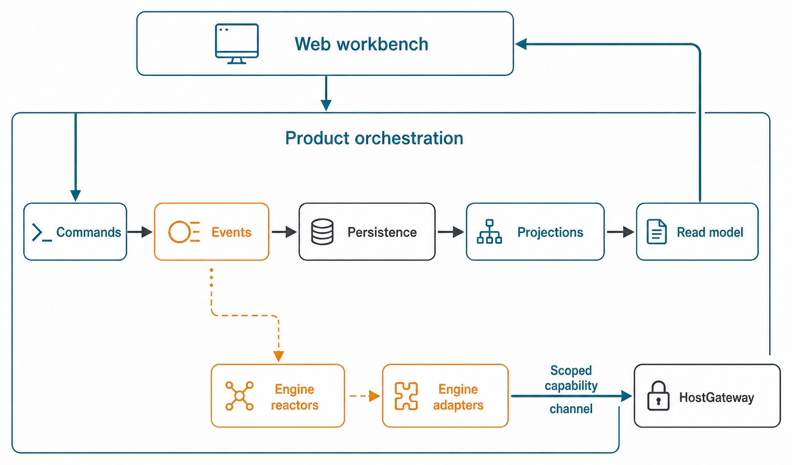
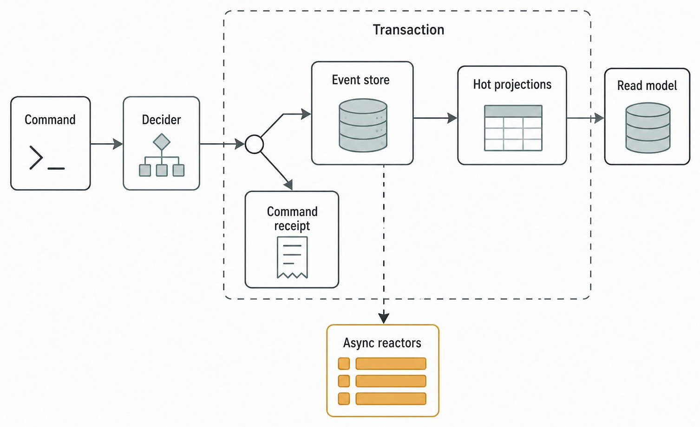
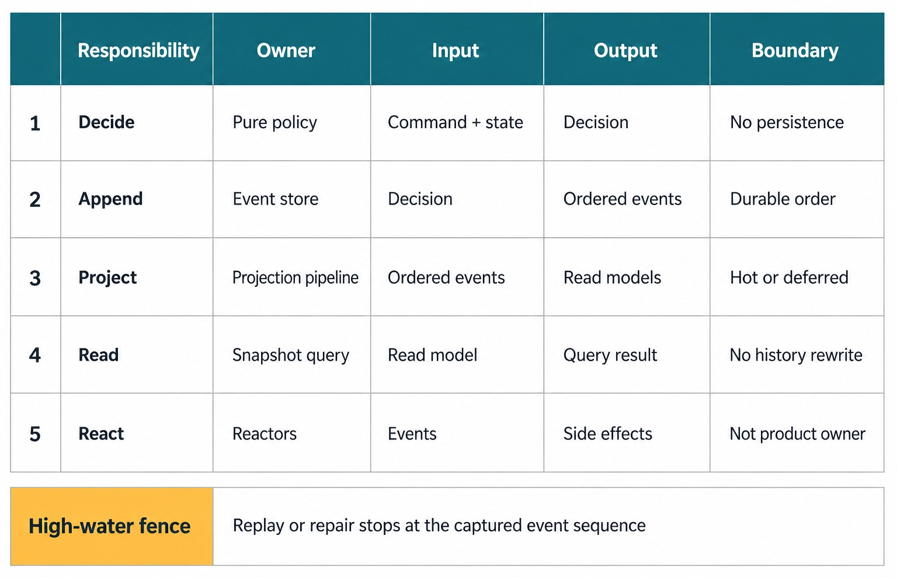

# Chapter 37 — Product Orchestration {#chapter-37}

## The question

When a person presses Send, what turns that intention into durable, visible Haros state? The answer
is not “the selected Engine updates the chat.” An Engine executes work, but it does not own Product
Threads, Queue, Timeline, recovery, or the shared state used by Agent, Chat, and Studio.

**Product Orchestration** is the Haros owner that accepts typed commands, decides which domain facts
follow, appends those facts durably, projects them into useful read models, and lets reactors perform
authorized execution around that durable core. A **reactor** is an asynchronous worker that observes
committed facts and coordinates a bounded side effect without becoming the owner of product state.

The compact flow is:

> **Command → decision → event → projection → visible state**

That arrow is not a claim that everything is synchronous or infallible. Some projections are hot,
some are deferred, and runtime work happens outside the event-store transaction. The value of the
model is that each stage has a precise responsibility and failure boundary.

_Part V opener — Product Orchestration connects Web intent to persisted facts and a read model while
keeping asynchronous Engine reaction and HostGateway authority bounded._

**Accessible equivalent.** The Web workbench submits commands to Product Orchestration. Accepted events are persisted, projected into a read model, and read back by the Web workbench. Committed events also reach Engine Reactors and adapters; scoped local capability calls pass through HostGateway.

## Why a product owner is necessary

Haros supports multiple complete Agent Engines. Each Engine can have its own protocol, process,
model catalog, authentication method, and private native Session state. If each adapter also owned
Threads, queued work, message history, and recovery, switching Engines would split the product into
incompatible islands.

Product Orchestration prevents that split. It gives Agent, Chat, and Studio a shared vocabulary and
durable lifecycle independent of replaceable execution. A Product Thread can record that a turn was
submitted, interrupted, recovered, or handed off without claiming that two Engines share one native
Session. This is the architectural form of the Guidebook's central thesis: durable work remains a
Haros fact; execution can vary.

| Fact                                       | Sole owner                                      | Typical consumer                                   | Forbidden duplicate                                             |
| ------------------------------------------ | ----------------------------------------------- | -------------------------------------------------- | --------------------------------------------------------------- |
| Project, Thread, Turn, Queue, Timeline     | Product Orchestration contracts and persistence | Web workbench, Desktop shell, Engine reactors      | Engine-private product store                                    |
| Native Session/process                     | The selected Engine adapter/runtime             | Orchestration reactors through typed runtime facts | Product code fabricating cross-Engine continuation              |
| Local capability authorization             | HostGateway and capability services             | Admitted Engine operation                          | Adapter-owned permission system                                 |
| Engine identity and discovery presentation | `ENGINE_DESCRIPTORS` and discovery owners       | Settings and selectors                             | Orchestration-specific Engine list                              |
| Visible Thread/read state                  | Projection owners                               | Web transport and UI                               | UI reconstructing authority from private config or raw protocol |

The separation is not bureaucracy. It is what lets a launch failure retain accepted Product Thread
facts, lets a server restart settle an orphaned turn, and lets a queued follow-up keep its admitted
binding. Those are product behaviors that no single Engine can own for all other Engines.

## Step 1: a typed command expresses intent

A command asks for a state transition. Examples include creating a Thread, starting a turn,
interrupting a turn, updating Thread metadata, or recording runtime activity. A command has a type,
a command identity, the target aggregate, and the data needed for validation. Here an **aggregate**
is the product entity and lifecycle boundary whose invariants are decided together, such as a
Project, Thread, or Space.

Commands are not yet facts. A client can request an impossible transition: start work on a missing
Thread, reuse a command ID for different content, select a structurally invalid runtime mode, or
attach a file owned by another principal. Orchestration must reject such requests before presenting
them as accepted history.

The public service serializes dispatch through an internal queue. Serialization gives the decider a
coherent view of preceding accepted commands. Command receipts and fingerprints make retries
idempotent: a repeated command identity can return its original result, while the same identity with
different content is a collision rather than permission to overwrite history.

| Input property     | Why it matters                                        | Example failure if absent                                |
| ------------------ | ----------------------------------------------------- | -------------------------------------------------------- |
| Command ID         | Connects retries to one logical request               | Network retry creates duplicate messages or turns        |
| Fingerprint        | Proves a repeated ID still names the same content     | Caller reuses an ID and silently changes intent          |
| Aggregate identity | Names the Project, Thread, or Space whose rules apply | Validation reads or writes the wrong lifecycle           |
| Typed payload      | Constrains fields and values before decision          | UI strings become an accidental protocol                 |
| Admission context  | Binds sensitive resources and reserved runtime facts  | Attachment or shutdown fact crosses authority boundaries |

The Web workbench should therefore send a command through the typed transport, not directly mutate
a database row and then imitate an event. The Desktop shell should not become another decider. An
Engine adapter should report runtime facts through admitted seams rather than editing product
projections.

## Step 2: the decider protects invariants

The decider is a side-effect-free domain decision boundary: given a command, the relevant read
model, workspace facts, and limited capability facts, it either returns one or more candidate events
or a typed invariant error.

Consider a turn start. The decider verifies that the Thread exists, that no checkpoint revert makes
starting unsafe, that the requested runtime mode and Engine selection are structurally valid, and
that any referenced proposed plan belongs to the correct Project. It then decides whether the user
message leads to an immediate start request, an ordinary queued event, or a steering disposition.

The decider does not launch the Engine. That restraint keeps domain admission deterministic and
testable. Launching a process before the command is durably accepted would create a dangerous gap:
work could begin with no accepted product fact describing why it began.

Some commands need carefully bounded preparation. A Chat-to-Agent fork, for example, may require
copying accepted attachment blobs. Even there, source/target/scope admission is run before spending
the copy budget, and prepared attachment work is cleaned up if the durable commit fails. The
decider remains the sole fork-admission owner rather than letting storage side effects decide policy.

## Step 3: accepted events become durable facts

An event states what happened: `thread.message-sent`, `thread.turn-queued`,
`thread.turn-start-requested`, or another domain fact. The event store assigns an ordered sequence
and owns append and replay access. It does not decide commands or reduce events into UI shapes.

For one accepted command, Orchestration may produce several events. A steered turn on an Engine
without native steering can produce a user-message event, a queued-turn event, and an interrupt-
requested event. The transaction appends them in order, updates the command-oriented model, applies
the hot projections, and inserts the command receipt. If the transaction fails, the command cannot
be reported as durably accepted with only half of those facts.

_Figure 37.1 — Accepted facts, hot projections, and command receipt share a transaction; asynchronous
reaction begins after that durable boundary._

**Accessible equivalent.** A command enters a side-effect-free decider. The transaction stores events, updates hot projections, and produces a parallel command receipt; the read model derives from hot projections, while asynchronous reactors begin only after commit.

Events are immutable history, but “immutable” does not mean “never correct a mistake.” A later
command can append a correcting or settling event. Restart reconciliation, for example, does not
edit the old running event; it records new failure activity and an interrupted Session state because
the former runtime no longer exists.

## Step 4: projections make facts useful

An ordered event stream is good evidence but a poor UI query. A Thread screen needs messages,
activities, turns, pending interactions, and summary data arranged for current reading. Projection
owners reduce accepted events into those queryable views.

The pinned implementation has focused projectors for Projects, Thread messages, proposed plans,
activities, Threads, Sessions, Turns, pending interactions, and shell summaries. Each projector
declares which event types it accepts and maintains a cursor. Hot projectors update the state needed
for immediate transcript and lifecycle correctness inside the command transaction. Deferred
projectors handle work that can catch up without invalidating the accepted command.

This hot/deferred split is a performance boundary, not a split in truth. Deferred projection health
is observable; failures schedule catch-up, and projector cursors tell the system what remains behind.
The underlying accepted events remain the source from which projections can be rebuilt. A
**high-water fence** is the captured event sequence that replay or repair is allowed to reach; it
prevents a moving event tail from turning a bounded repair into an unbounded race.

| Layer                   | Owns                                                 | Does not own                   | Recovery mechanism                                 |
| ----------------------- | ---------------------------------------------------- | ------------------------------ | -------------------------------------------------- |
| Event store             | Ordered append and replay                            | Command policy or UI reduction | Replay through a captured high-water fence         |
| Hot projections         | Immediate lifecycle/read rows needed with acceptance | Engine execution               | Transactional event application and cursor updates |
| Deferred projections    | Derived summaries that may catch up                  | A second accepted history      | Retry/catch-up from durable events                 |
| In-memory command model | Coherent decider input for serialized dispatch       | Durable authority by itself    | Refresh from projection state                      |
| Web store/UI            | Rendering and local interaction state                | Product lifecycle authority    | Snapshot plus event synchronization                |

A cursor advances even when a projector intentionally ignores an event. Otherwise the minimum
snapshot sequence could lag and clients would replay push events they had already seen. This is a
good example of an implementation detail that supports a user-visible guarantee—consistent
synchronization—without becoming the product concept a junior must memorize.

## Step 5: reactors connect durable intent to execution

An event such as `thread.turn-start-requested` says Haros accepted the request to start. It does not
say the Engine successfully launched or completed. Reactors observe accepted events and coordinate
the appropriate runtime, checkpoint, Studio-output, attachment, or metadata owner.

Runtime facts then return through trusted ingestion seams as new commands/events: Session state,
assistant text deltas, tool activities, completion, interruption, or error. Product projections make
those facts visible. This feedback loop is why the architecture is a cycle rather than a one-way
database write.

Reactors must remain bounded. An Engine command reactor starts execution; it does not become the
owner of Product Threads. A checkpoint reactor coordinates Git/checkpoint facts; it does not make
the event store a Git implementation. A Studio output reactor captures designated outputs; it does
not redefine all workspace files as deliverables.

_Figure 37.2 — Five responsibilities cooperate without becoming interchangeable, and replay is
bounded by a captured event sequence._

**Accessible equivalent.** Pure policy decides from command plus state without persisting. The event store appends decisions as events in durable order. The projection pipeline applies ordered events to hot or deferred read models. Snapshot queries read the model without rewriting history. Reactors consume events for side effects but are not the product owner. Replay or repair stops at the captured event sequence high-water fence.

## Following one prompt end to end

Take the harmless request “Inspect the failing test and explain the likely owner.” The visible path
can be narrated without reading every source file:

1. The Composer builds a typed `thread.turn.start` command with a unique command ID, message ID,
   admitted Engine/model selection, modes, and attachments.
2. Transport decodes the command and dispatches it to `OrchestrationEngine`.
3. Serialized processing checks any existing command receipt and compares its fingerprint.
4. The decider validates Thread, binding, workspace, attachment, and lifecycle invariants.
5. Inside one persistence transaction, the event store appends the user message and either a start
   request or queued request; hot projections update; the receipt records the accepted sequence.
6. Subscribers and reactors observe the accepted start request. The selected Engine runtime is
   launched or resumed through its adapter; local tools remain behind HostGateway.
7. Runtime activities and assistant output return as admitted facts. Projectors update the Thread
   read model and the Web workbench receives synchronized state.
8. A terminal runtime fact settles the Session and latest Turn. If execution dies across a server
   restart, reconciliation records an honest interrupted outcome instead of fabricating completion.

At no point should the UI write “running” merely because the send button was pressed. At no point
should an adapter decide that a Product Thread equals its native Session. The visible status is a
projection of accepted and runtime-reported facts.

## What can go wrong

### The command is invalid

The decider returns a typed invariant error. No accepted event should be appended. Prepared resources
must be cleaned up. The client can show a recoverable failure without pretending the request entered
the Queue.

### The persistence transaction fails

The command is not accepted. Because event append, hot projection, and command receipt share the
transactional boundary, the system avoids reporting a receipt for events that did not commit or a
visible hot state that has no durable event.

### A deferred projector fails

The durable event remains accepted. Projection health becomes degraded and catch-up is scheduled.
Consumers must distinguish “summary is catching up” from “the command never happened.” Repeating the
command is not the generic repair for a lagging projection.

### Runtime startup fails after acceptance

The accepted start request remains history. The runtime path reports failure facts, preserving the
prompt and product state. Haros must not silently switch Engines or erase the accepted intent.

### The same command is retried

If identity and fingerprint match, the existing receipt makes retry idempotent. If content differs,
the collision is an error. Overwriting the old receipt would let one command ID mean two histories.

| Failure boundary               | Durable truth                        | User-visible consequence                               | Correct repair owner                             |
| ------------------------------ | ------------------------------------ | ------------------------------------------------------ | ------------------------------------------------ |
| Decode/admission failure       | No accepted event                    | Request rejected with reason                           | Caller or command input                          |
| Transaction failure            | No partial accepted command          | Recoverable internal failure                           | Persistence/Orchestration transaction            |
| Deferred projection lag        | Events accepted, derived view behind | Degraded/catching-up state                             | Projection catch-up                              |
| Engine launch/runtime failure  | Start intent plus failure facts      | Turn errors or interrupts; Product Thread facts remain | Engine adapter/reactor plus product settlement   |
| Client disconnect after commit | Receipt and events survive           | Client resynchronizes                                  | Snapshot/replay transport, not duplicate command |

## Try it safely

Read one focused orchestration integration test rather than starting with the entire server. Locate a
test that dispatches a command and asserts emitted events plus the resulting projection. Write down
four answers:

1. What command expresses the intent?
2. Which invariant could reject it?
3. Which event makes acceptance durable?
4. Which projection makes the result easy to read?

Then imagine the client retries the same command after losing its response. Identify the receipt or
fingerprint assertion that prevents duplication. The observable result is a complete ownership
trace, not a modification to production data.

## Recap

1. Product Orchestration owns shared product facts; Engines own replaceable execution and private
   native Sessions.
2. Commands request change, deciders enforce invariants, events record accepted facts, and
   projections create readable state.
3. Event append, hot projections, and command receipts share the accepted-command transaction.
4. Deferred projections may catch up, but they do not create a second history.
5. Reactors connect durable intent to runtime work without taking over the owners they coordinate.

## Check your model

1. **Why not let an Engine adapter update the Thread directly?**  
   Because it would make replaceable execution a second owner of shared product history and break
   continuity across Engines.

2. **What is the difference between an event and a projection?**  
   An event is an accepted ordered fact; a projection is a derived query shape that can be rebuilt
   from relevant events.

3. **If a deferred projection fails, should the client resend the command?**  
   Not by default. The event may already be accepted. Projection catch-up should repair the derived
   view, while command receipts protect against accidental duplication.

## Source trail

- `docs/architecture.md`, “Product orchestration,” defines the product/Engine ownership boundary.
- `packages/contracts/src/orchestration.ts` defines typed commands, events, read models, dispatch
  modes, and lifecycle schemas.
- `apps/server/src/orchestration/Services/OrchestrationEngine.ts` defines the public orchestration
  service boundary and explicitly excludes Engine process and transport ownership.
- `apps/server/src/orchestration/Layers/OrchestrationEngine.ts` owns serialized dispatch,
  fingerprint/receipt handling, transactional append, and projection coordination.
- `apps/server/src/orchestration/decider.ts` owns domain admission and event decisions.
- `apps/server/src/persistence/Services/OrchestrationEventStore.ts` owns append and replay.
- `apps/server/src/orchestration/Layers/ProjectionPipeline.ts` owns named hot/deferred projectors and
  cursor/catch-up behavior.
- `apps/server/src/orchestration/Layers/OrchestrationEngine.integration.test.ts` and focused
  projection/persistence tests provide executable evidence for the path.

[Return to the Guidebook reading order](../README.md)

<!-- guide-navigation:start -->

[Guidebook contents](../README.md) · [Previous: Typed Contracts and Narrow Projections](36-typed-contracts-narrow-projections.md) · [Next: Persistence and Read Models](38-persistence-read-models.md)

<!-- guide-navigation:end -->
