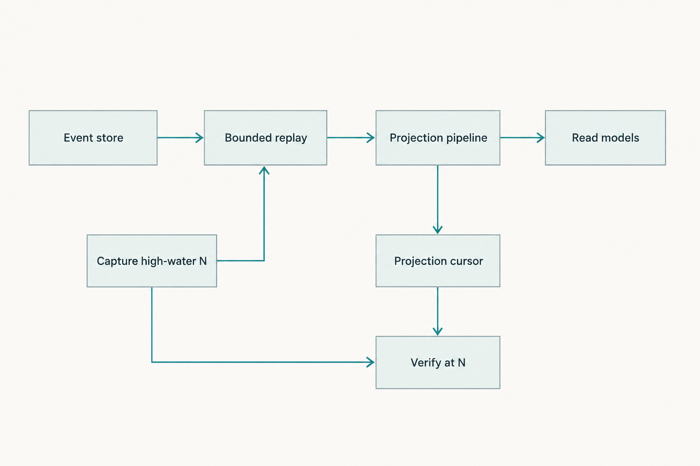
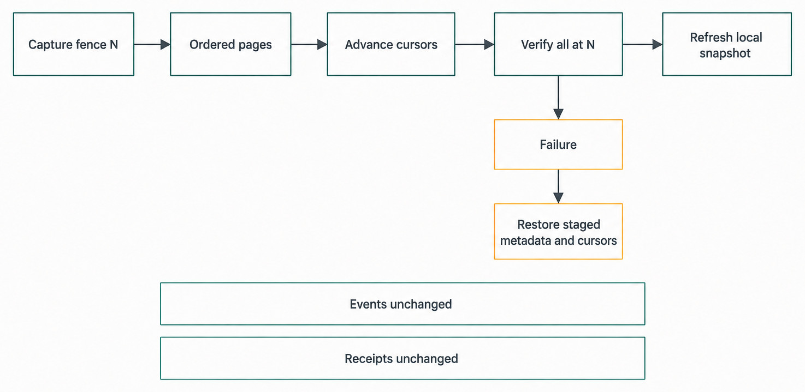
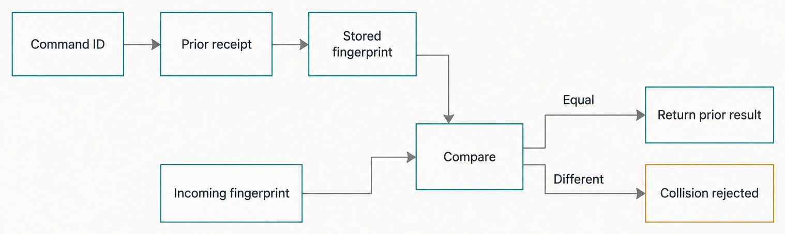

# Chapter 38 — Persistence and Read Models {#chapter-38}

## The question

When Haros restarts, which facts survive, how are they made readable again, and why does replaying
events not mean rewriting history?

Haros persists different kinds of data for different jobs. The durable orchestration event stream
records accepted product facts in order. Projection tables hold derived, query-friendly state.
Command receipts make retries explainable and idempotent. Projector cursors record how far each
derived view has advanced. Separate repositories hold bounded runtime, automation, attachment, and
other service state under their own contracts.

These records currently live in a private SQLite database in the Server's local state boundary.
SQLite is the storage mechanism in this source-alpha edition; it is not the product concept. The
durable concept is stronger and simpler:

> Accepted facts are not reconstructed from the UI or an Engine's private Session. Read models are
> derived from Haros-owned persistence and can be repaired without pretending the past changed.

_Figure 38.1 — A finite replay and its cursor are checked against one captured event fence._

**Accessible equivalent.** `Event store` flows to `Bounded replay`, then to `Projection pipeline`
and `Read models`. `Capture high-water N` points both to `Bounded replay` and to `Verify at N`.
`Projection pipeline` also advances `Projection cursor`, which points to the same `Verify at N`
check. The shared N makes the replay finite and verifies progress against durable order.

## Four persistence jobs, not one generic database

It is tempting to call every SQLite table “state” and stop there. That loses the distinctions needed
for safe recovery. An event answers “what accepted fact occurred at sequence N?” A projection row
answers “what does the current Thread look like for this query?” A receipt answers “what result did
this command identity already receive?” A cursor answers “through which sequence has this projector
applied its work?”

| Persistent record       | Question it answers                                                                | Writer/owner                                         | Recovery use                                                              |
| ----------------------- | ---------------------------------------------------------------------------------- | ---------------------------------------------------- | ------------------------------------------------------------------------- |
| Orchestration event     | What accepted fact happened, in what order, and for which aggregate?               | Event store inside Product Orchestration transaction | Replay and audit ordered product history                                  |
| Projection row          | What is the current query-friendly view?                                           | Named projector/repository                           | Serve shell, Thread detail, counts, diffs, and focused background queries |
| Command receipt         | Was this command ID already accepted, with which fingerprint and sequence?         | Orchestration command transaction                    | Return the prior result or reject an ID/content collision                 |
| Projector cursor        | How far did this named projection advance?                                         | Projection pipeline                                  | Resume incremental catch-up and detect lag                                |
| Service-specific record | What durable fact belongs to another owner, such as runtime binding or automation? | That service repository                              | Recover only that service's lifecycle without annexing product history    |

The table also explains why direct SQL updates are dangerous. Editing a Thread projection row may
make one screen look right while leaving the event stream, receipt, other projections, and runtime
reaction inconsistent. Appending a made-up event outside the decider can bypass lifecycle
invariants. Replacing a receipt can make one command identity name two outcomes. Correct writes go
through the owner that can preserve all affected records together.

## SQLite is a protected local mechanism

At the pinned edition, the Server opens a file-backed SQLite database under a Haros-owned private
path. A lifecycle lock prevents another Haros Server from sharing the same database unsafely.
Startup configures foreign keys, a busy timeout, write-ahead logging, and exclusive locking for the
owned file. Private permissions cover the database and its WAL/SHM sidecars.

The current implementation uses WAL mode with `synchronous = NORMAL`. The source documents the
tradeoff precisely: SQLite consistency survives application crashes, while a hard operating-system
crash or power loss may lose the most recent committed transactions that were not checkpointed.
That is an edition-specific implementation decision, not a promise of zero data loss under every
hardware failure.

Schema migration also fails conservatively. Haros accepts its canonical migration lineage and
rejects an untracked non-empty database or a schema newer than the current source understands. A
pre-migration snapshot is taken when an upgrade is required, with private storage, disk-space
checks, recovery markers, bounded resume attempts, and retained recovery artifacts. Haros does not
open and “adopt” predecessor-product databases merely because their tables resemble the current
schema.

That migration machinery protects the physical database. It is separate from projection repair,
which rebuilds derived rows from already accepted events. A migration backup is not a Product Thread
checkpoint, and a projector cursor is not a Git checkpoint. The word “checkpoint” is overloaded in
software; always name which boundary you mean.

## Event append and ordered replay

The event store appends an event without its sequence; storage assigns the durable sequence. Each
row includes event identity, aggregate kind and stream, stream version, event type, occurrence time,
command/correlation information, actor kind, payload, and metadata. Runtime decoding validates the
stored envelope and the domain event. Corrupt JSON or an unsupported persisted event schema reports
the exact sequence and type rather than quietly skipping it.

Replay reads events in ascending sequence pages. A caller can capture the latest durable sequence
first and use it as a **high-water fence**. The fence converts a moving event stream into a finite
repair job: apply events after the cursor through sequence N, while newer accepted events remain
outside that bounded pass. Thread-scoped replay uses the same principle for a single stream.

Filtering a projector replay does not create a different history. It lets a projector read only the
event types it understands, plus any required boundary event. The global sequence remains the order
reference. Even an intentionally ignored event advances the relevant cursor when the projection
contract requires the consumer to know that the sequence has been observed.

## Projections are disposable in one direction

“Disposable” does not mean unimportant. Projection tables are the normal, efficient way to read
Haros state. Shell and Thread-detail queries depend on them; losing or lagging projections affects
the product. The word means their authority is one-way: accepted events can rebuild projections,
but projections cannot rewrite the event stream.

The current pipeline names projectors for Spaces, Projects, Thread messages, proposed plans,
activities, Threads, Sessions, Turns, checkpoints, pending interactions, and Thread shell summaries.
Some are **hot** because a command's visible lifecycle must update atomically with acceptance. Some
are deferred because their work may catch up without invalidating the command.

Projector cursors are monotonic. A cursor update cannot move backward. Bootstrap captures a durable
high-water sequence, replays bounded pages, and updates projected rows plus the page-tail cursor in
a transaction. A crash may cause a page to replay, so projector operations must tolerate re-entry
according to their repository contracts.

_Figure 38.2 — Current repair is a bounded Project/Space metadata and cursor operation, not a
wholesale replacement of every projection row._

**Accessible equivalent.** `Capture fence N` flows through `Ordered pages`, `Advance cursors`, and
`Verify all at N`. Success reaches `Refresh local snapshot`. The failure branch reaches `Failure`
and then `Restore staged metadata and cursors`. Two invariant bars read `Events unchanged` and
`Receipts unchanged`. In the pinned source alpha, the staged metadata is the Project/Space repair
surface plus designated projector cursor state; existing Thread and Chat rows remain in place.

| Operation             | Reads                                                  | Writes                                                  | Historical effect                                                |
| --------------------- | ------------------------------------------------------ | ------------------------------------------------------- | ---------------------------------------------------------------- |
| Normal command commit | Current command model, existing receipt, domain inputs | New events, hot projections, receipt                    | Adds accepted facts; never edits earlier event meaning           |
| Deferred catch-up     | Events after projector cursor through a fence          | Derived rows and cursor                                 | No new product fact; view catches up                             |
| Snapshot query        | Projection tables and cursor state                     | Nothing                                                 | Reads a coherent derived view                                    |
| Projection repair     | Durable events through captured high-water fence       | Project/Space metadata and designated projector cursors | Preserves events, receipts, and existing Thread/Chat rows        |
| Migration recovery    | Physical database snapshot and migration marker        | Restored/upgraded database files                        | Restores a known physical version; does not invent domain events |

## Worked example: a duplicate submission after a lost reply

Jules sends “Explain the failing parser test.” The Server accepts the command and commits a user
message event, a turn-start request, the required hot projections, and a command receipt. Before the
response reaches Web, the connection drops. Jules sees uncertainty: did the Send succeed?

If the client blindly generates another command identity and sends the same text, Haros may rightly
treat it as a second user request. The safe retry uses the original command ID and identical
content. Orchestration finds the receipt, recomputes the versioned fingerprint, and compares them.
When they match, it returns the recorded result sequence rather than appending another message. If
the same command ID carries different content, the collision is rejected. The original receipt is
not overwritten.

_Figure 38.3 — Retry identity depends on both the command ID and its versioned content fingerprint._

**Accessible equivalent.** `Command ID` points to `Prior receipt`, which exposes `Stored
fingerprint`. `Stored fingerprint` and `Incoming fingerprint` both enter `Compare`. The `Equal`
branch returns `Return prior result`; the `Different` branch reaches `Collision rejected`. No path
creates or overwrites a receipt during retry.

Now imagine that the message projection was deferred and temporarily lagged. The event and receipt
would still prove acceptance. Resending the command is not the repair for a lagging read model; the
projection pipeline catches up from its cursor. Web resynchronizes from the Server snapshot and
sequence. These mechanisms solve different uncertainty:

- Receipt and fingerprint resolve **command retry identity**.
- Event sequence resolves **durable accepted order**.
- Projector cursor resolves **derived-view progress**.
- Client snapshot sequence resolves **consumer synchronization**.

Keeping these identities separate is why Haros can recover without guessing.

There is also a useful ordering rule for incident evidence. Start with the command ID and receipt,
then locate its result sequence in the event stream, compare every relevant projector cursor with
that sequence, and only then inspect the client snapshot sequence. This order moves from durable
acceptance toward increasingly derived views. Starting from a screenshot reverses that logic: the
screenshot proves what Web rendered, but not whether the missing fact was rejected, committed but
unprojected, projected but unsynchronized, or later settled.

The same rule prevents unsafe “repair by copy.” A healthy Thread detail from one running Server is
not a backup format that may be inserted into another database. It is a bounded read model that can
omit tombstones, older activities, private bindings, and unrelated aggregates. Recovery inputs must
come from persistence owners and their exact edition-aware schemas, never from a convenient
consumer payload.

## Checkpoints: three meanings to keep apart

Haros architecture contains several checkpoint-like ideas. A Git or Turn checkpoint records a
reversible workspace reference associated with completed work. Projection checkpoint rows make
those product facts queryable. A SQLite WAL checkpoint moves committed pages from the WAL toward the
main database file. A projector cursor records replay progress.

Only the first is a user-visible work checkpoint. The second is its read-model representation. The
third is a storage-engine operation. The fourth is pipeline bookkeeping. None is interchangeable
with a migration backup. Documentation and code reviews should use qualified names so a request to
“restore the checkpoint” does not turn into an unsafe database operation.

## Failure and recovery matrix

Persistence failures require conservative language. “The database exists” does not prove the last
command committed. “The UI looks empty” does not prove events were lost. Evidence should move from
physical startup to event/receipt truth, projection health, and finally consumer synchronization.

| Failure boundary                       | Preserved evidence                                               | Recovery                                                             | Must not happen                                                    |
| -------------------------------------- | ---------------------------------------------------------------- | -------------------------------------------------------------------- | ------------------------------------------------------------------ |
| Command transaction rolls back         | Earlier database state                                           | Report command unaccepted; caller may retry with same identity       | Partial events, hot rows, or receipt reported as accepted          |
| Stored event cannot decode             | Exact sequence/type plus prior readable history                  | Fail closed; repair source/schema issue under persistence owner      | Skip the event and advance cursors                                 |
| Deferred projector stops               | Durable events and its last cursor                               | Report degradation; resume bounded catch-up                          | Rewrite events to match stale projection                           |
| Full projection repair fails           | Event stream plus staged derived-state backup                    | Restore derived backup; restart before unsafe retry if restore fails | Leave half-rebuilt projections as healthy                          |
| Interrupted schema migration           | Pre-migration snapshot and recovery marker                       | Stop normal startup; resume/restore through migration recovery owner | Continue on a partly upgraded database                             |
| Hard OS crash under current WAL policy | Database consistency; possibly not newest uncheckpointed commits | Reopen, migrate/reconcile, report actual retained state              | Promise that every last acknowledged hardware-level write survives |

Repair itself is serialized and coalesced in the current implementation because a full rebuild can
be expensive on a large state database. Concurrent callers join one in-flight repair, and a recent
successful repair can suppress thrashing. This is an alpha implementation detail, but the broader
rule is durable: recovery work must be bounded and must not race another writer over the same
derived state.

## What belongs outside this database story

Engine-private configuration and native Session state remain owned by each Engine. Haros may store
a typed runtime binding or opaque resume cursor needed by its Engine service, but that does not make
the orchestration event store the owner of the Engine's private conversation. Workspace files and
Git repositories remain with their filesystem/Git owners. HostGateway operation authority remains
with HostGateway repositories and services. Web caches remain presentation state.

Local-first therefore does not mean “everything is one SQLite file.” It means Haros product state
uses local Haros-owned persistence by default, with explicit boundaries for native workspaces,
Engine-private state, and connected services. Recovery must respect each owner instead of copying
all bytes into a universal store.

## Try it safely

Use an isolated test path, never a real Haros home. Read
`OrchestrationEventStore.integration.test.ts` and identify one test that appends events and replays
them through a high-water sequence. Then read the command-receipt integration test and explain why
the second insert does not replace the first identity.

For a deeper exercise, run only the existing in-memory or temporary-database projection pipeline
integration test selected by the repository's test command. Record the event count, final projector
cursor, and one snapshot field asserted by the test. The observable result is a proof that replay
builds derived state from durable inputs. Do not open, copy, migrate, repair, or delete the database
from a real user profile.

## Recap

1. Events, projections, receipts, and projector cursors answer different persistence questions.
2. Accepted-command transactions keep event append, required hot projections, and receipts aligned.
3. Projection replay and repair flow from immutable accepted history toward derived views.
4. A captured high-water fence makes replay finite and verifiable while new work may continue.
5. SQLite, WAL, migrations, and backups are current local mechanisms with explicit alpha limits,
   not excuses to merge Engine-private or workspace state into one owner.

## Check your model

1. **If a projection row is wrong, should repair edit the corresponding old event?**  
   No. Repair rebuilds the derived row from accepted events and preserves history.

2. **What prevents one retry from creating a duplicate accepted command?**  
   Stable command identity, a versioned fingerprint, and an immutable command receipt.

3. **Why capture a high-water sequence before replay?**  
   It gives repair a finite target that can be verified even while newer events exist.

## Source trail

- `apps/server/src/persistence/Services/OrchestrationEventStore.ts` defines append, ordered replay,
  thread replay, and high-water-fence responsibilities.
- `apps/server/src/persistence/Layers/OrchestrationEventStore.ts` owns SQLite encoding, actor
  attribution, schema-version validation, paging, and exact decode evidence.
- `apps/server/src/persistence/Services/OrchestrationCommandReceipts.ts` makes command identities
  immutable and verifiable rather than overwriteable deduplication hints.
- `apps/server/src/persistence/Services/ProjectionState.ts` owns monotonic named projector cursors.
- `apps/server/src/orchestration/Layers/ProjectionPipeline.ts` defines the hot/deferred projectors,
  atomic page replay, cursor behavior, and bootstrap fence.
- `apps/server/src/orchestration/Layers/OrchestrationEngine.ts` owns the accepted-command transaction
  and bounded projection repair/restore sequence.
- `apps/server/src/persistence/Layers/Sqlite.ts`, `Migrations.ts`, and `MigrationBackup.ts` define the
  current private SQLite, lineage, backup, and physical recovery behavior.
- Focused event-store, receipt, migration, projection-pipeline, and repair tests are executable
  evidence for this pinned source-alpha edition.

<!-- guide-navigation:start -->

[Guidebook contents](../README.md) · [Previous: Product Orchestration](37-product-orchestration.md) · [Next: Engine Identity, Discovery, and Adapters](39-engine-identity-discovery-adapters.md)

<!-- guide-navigation:end -->
