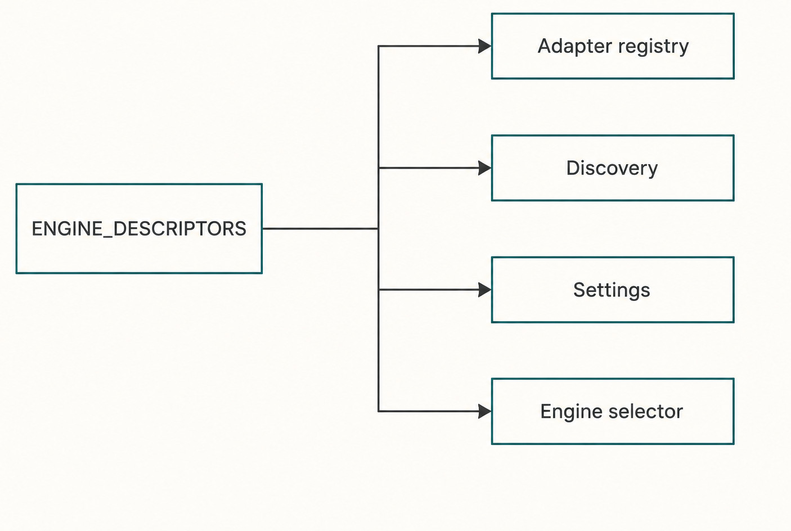
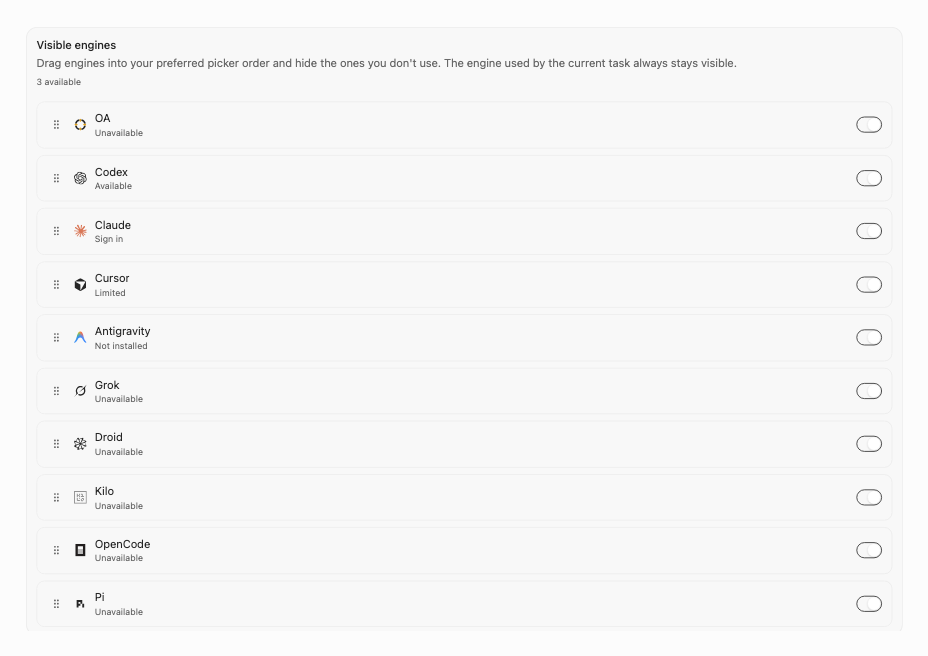
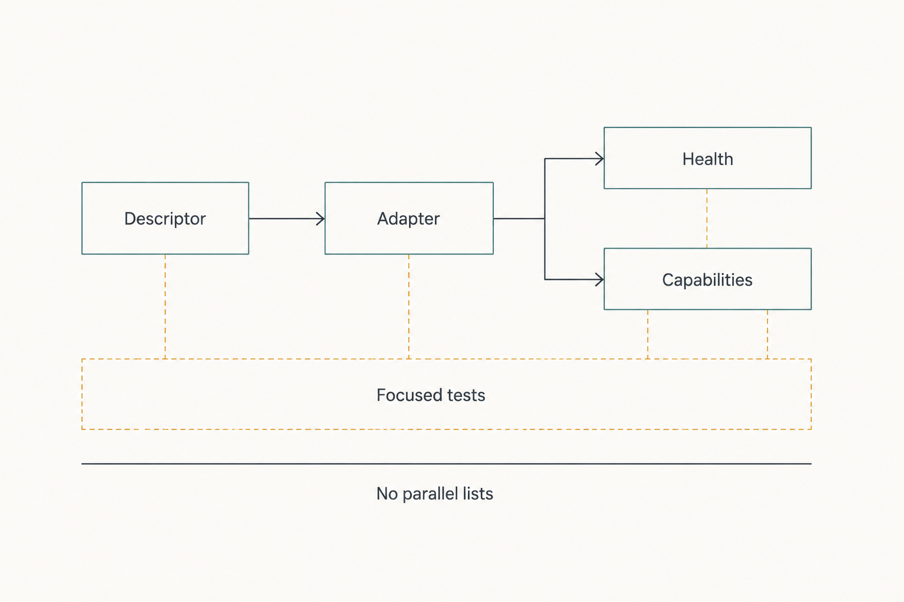

# Chapter 39 — Engine Identity, Discovery, and Adapters {#chapter-39}

## The question

What makes an Engine exist in Haros, how does Haros learn what it can currently do, and where does
Engine-specific code stop?

An **Engine** is a complete agent runtime, not a model and not a model-service Provider. It may own
its native protocol, process, authentication, model discovery, and private Session state. Haros
integrates that runtime through a descriptor-derived identity and a bounded adapter. Shared product
work—Projects, Product Threads, Queue, Timeline, recovery, and local capability authority—remains
outside the Engine.

The central ownership rule is strict:

> `ENGINE_DESCRIPTORS` is the sole owner of Engine identity, registration, display name, capability
> projection, and Settings discovery.

The current source-alpha edition derives ten Engine identities from that owner. The number and
individual entries are edition facts, not a list this chapter should duplicate. Contributors read
the descriptor source or a generated projection when an exact matrix is needed.

_Figure 39.1 — One canonical Engine owner feeds every identity consumer._

**Accessible equivalent.** A single `ENGINE_DESCRIPTORS` box branches directly to `Adapter
registry`, `Discovery`, `Settings`, and `Engine selector`. No peer source box exists, so all four
consumers derive Engine identity from the same exhaustive owner rather than maintaining parallel
lists.

_Real product capture — The production Engine Settings panel projects descriptor-owned identity,
ordering, and bounded availability status without becoming another Engine registry._

## Identity, capability, health, and selection

Four facts are often collapsed into “Engine support,” but each answers a different question.

| Fact                     | Question                                                               | Owner                                               | Example outcome                                           |
| ------------------------ | ---------------------------------------------------------------------- | --------------------------------------------------- | --------------------------------------------------------- |
| Identity/registration    | Which complete Agent Engines does Haros recognize and present?         | `ENGINE_DESCRIPTORS`                                | An Engine appears consistently in selection and Settings  |
| Structural capability    | Which operations can this adapter implement in principle?              | Adapter contract plus descriptor-derived projection | Turn steering supported; model switch requires restart    |
| Current health/discovery | Is the configured runtime available now, and what did it report?       | Server health/discovery owner using the adapter     | Ready, auth required, configuration error, or unavailable |
| Exact selection          | Which Engine, model, and options were admitted for this Turn?          | Product Orchestration binding/provenance            | Queued Turn remains bound to the chosen combination       |
| Provider/model service   | Which upstream model service supplies a model inside an Engine domain? | That Engine's model-service owner                   | Internal service catalog without becoming an Engine list  |

An Engine can be registered but temporarily unavailable. An adapter can structurally support model
discovery while the runtime is unhealthy. A model may exist in an Engine catalog without being the
admitted model for this Turn. A Provider can supply models inside an Engine without becoming a
complete agent runtime. Clear wording matters because fallback or UI behavior based on the wrong
fact can silently change execution.

Haros's built-in default Engine is selected for a fresh setup through the canonical Engine identity
contract. Its internal model-service configuration remains inside that Engine domain. The Web
workbench sees a typed, credential-blind projection; it does not become a second model package,
credential, or catalog owner.

## What a descriptor owns

The descriptor collection is exhaustive against the `EngineKind` contract. This gives the compiler
and focused tests a way to expose missing identities. Derived maps provide display names and other
presentation facts without inviting screens to restate them.

Descriptor ownership is broader than a convenient label array. Registration order, identity,
display presentation, capability projection, and Settings discovery must originate there. The
runtime adapter registry therefore orders and checks registered adapters against
`ENGINE_DESCRIPTORS`. Settings tests assert descriptor-derived coverage rather than blessing a
second list.

This has an important maintenance consequence. Adding an Engine may require one descriptor entry,
its adapter implementation and composition, exact assets or bilingual product copy where relevant,
and focused tests. It must not require adding the same identity to Chat, the sidebar, Settings,
persistence, and several switch statements. If those consumers need edits just to recognize the
new identity, the canonical projection is incomplete.

The stable machine `EngineKind` literals and package names are implementation contracts. They may
appear in source, persistence, or diagnostics where exactness requires them. They are not a reason
to advertise another product identity in the Guidebook.

## What an adapter owns

An Engine adapter translates between Haros's canonical Engine service and one native runtime. Its
required methods cover starting a Session, sending and interrupting Turns, responding to approval
or user-input requests, stopping Sessions, listing active Sessions, reading or rolling back native
threads where supported, and emitting canonical runtime events. Optional methods cover features
such as steering, skills, commands, plugins, model listing, compaction, forking, account limits, or
voice operations.

Capabilities and methods must agree. If an adapter advertises turn steering, it must provide the
steering method. If it advertises plugin discovery, it must implement both listing and detail reads.
The conformance checker rejects inconsistent adapters before they enter normal composition. The
adapter registry rejects duplicate Engine registrations and, in the full production composition,
missing descriptor-backed adapters.

_Figure 39.2 — Runtime evidence branches from the adapter, while tests verify the whole descriptor-to-adapter contract._

**Accessible equivalent.** `Descriptor` points to `Adapter`. The adapter branches independently to
`Health` and `Capabilities`; neither is shown as the cause of the other. An amber `Focused tests`
verification band covers Descriptor, Adapter, Health, and Capabilities. A separate constraint under
the diagram reads `No parallel lists`.

This separation keeps runtime observations useful without turning health, capability, discovery,
Settings, selector, or test code into a second authority for Engine identity, registration order,
display names, supported-adapter coverage, or product presentation.

| Adapter responsibility | Allowed                                                                        | Required boundary                                   | Not allowed                                                               |
| ---------------------- | ------------------------------------------------------------------------------ | --------------------------------------------------- | ------------------------------------------------------------------------- |
| Native lifecycle       | Start, resume, interrupt, stop, and inspect the Engine runtime                 | EngineService and lifecycle generation              | Decide Product Thread or Queue lifecycle                                  |
| Protocol translation   | Map native requests/events to canonical Engine contracts                       | Runtime schemas and event ingestion                 | Send raw native objects directly to Web                                   |
| Native discovery       | Ask the Engine for models, skills, commands, plugins, or account facts it owns | Discovery service sanitization and capability flags | Become a second Engine identity registry                                  |
| Native Session state   | Retain opaque cursor/session information needed by that Engine                 | Engine-private and typed runtime binding boundaries | Claim cross-Engine Session continuity                                     |
| Local capabilities     | Receive only the authorized typed tool projection                              | HostGateway exact-Turn authority and receipts       | Reimplement permission, timeout, idempotency, or filesystem/Git authority |
| Product history        | Report canonical runtime facts                                                 | Orchestration ingestion                             | Write messages, projections, or receipts directly                         |

The buffer between adapter events and durable ingestion is bounded. A slow persistence consumer
must apply backpressure rather than letting an Engine fill process memory without limit. That detail
foreshadows Chapter 42, but it belongs in the adapter contract because unbounded native output is an
integration failure, not a UI problem.

## Discovery is observation, not identity creation

Discovery asks the selected adapter about runtime-dependent information. It may list models, skills,
native slash commands, plugins, agents, or other supported resources. Server-side discovery first
decodes input, resolves the adapter from the canonical registry, establishes an authoritative
resource scope, and returns a typed result.

Scope is important. Passive discovery should not execute untrusted Project extensions merely
because a settings page opened. When no valid Product Thread and folder-backed Project establish an
authoritative root, discovery falls back to a global-only scope. When a Project scope is admitted,
the Server derives the root from Product Orchestration rather than trusting an arbitrary renderer
path.

Haros can combine an Engine-native discovery source with a Haros-owned portable catalog where the
contract calls for it. A failure in one source is represented as a sanitized warning while useful
results from the other may survive. “Unsupported native discovery” is different from “discovery
failed.” Neither creates or removes the Engine identity.

Malformed model descriptors can be isolated before reaching Web. Raw endpoints, credentials, and
private diagnostics stay behind the Server boundary. A discovery response may indicate its source
and whether it was cached, which lets the UI be honest about freshness without parsing arbitrary
strings.

## Health is current evidence, not structural truth

Health checks observe executable availability, authentication state, compatible version evidence,
and other runtime-specific readiness. They may be slow, cached, rate-limited, or temporarily
degraded. A health error does not erase the descriptor. Conversely, a descriptor does not prove the
CLI exists or the account is authenticated.

Structural execution capability is projected separately from current health so Haros can explain
“this Engine supports the mode, but the configured runtime is not ready” instead of hiding the
control or claiming it will work. Exact configured binary identity matters: status learned from one
path should not be reused for a different override.

The UI consumes bounded states such as ready, warning, error, authenticated, unauthenticated,
unknown, and explicit unavailable reasons. These values are edition-pinned contracts. Future alpha
changes may refine them; contributors must update producer, contract, and consumer together rather
than infer new states from message prose.

## Worked example: a model picker opens

Jules opens the Composer's model picker for an Engine. The picker first knows the Engine identity
and display presentation from descriptor-derived data. It requests composer capabilities and the
model catalog through typed Server RPC. The discovery service decodes the Engine kind, checks that
the Engine is enabled, resolves its adapter, and invokes model discovery only if the adapter
supports it.

Suppose the Engine executable is installed but its account needs authentication. Health returns a
credential-blind status. Model discovery returns a typed auth-required error. The picker keeps the
chosen Engine visible, shows a setup action derived from safe presentation metadata, and does not
invent a model list. It does not switch to the built-in Engine, read credential files, or reuse a
catalog from another Engine.

After Jules authenticates through the Engine's real mechanism, Server health is refreshed and
discovery returns runtime model descriptors. The UI renders the new projection. Selecting one does
not immediately mutate an active native Session or queued Turn. Product Orchestration admits the
exact Engine/model/options at the appropriate lifecycle boundary. If changing Engine requires a
stop, the replacement must succeed before the established binding is projected as changed.

This sequence keeps identity, observation, and admission separate. It also makes failure recovery
truthful: a discovery retry cannot accidentally become a Turn retry, and a healthy model catalog
cannot overwrite Product Thread provenance.

Catalog freshness needs the same care. A cached model list can remain useful for presentation while
a refresh is rate-limited, but only when the result retains its source and freshness semantics. It
does not prove that the model is still executable or authorized for a new Turn. Admission still
uses current Engine and product rules. Conversely, one failed refresh must not erase the safe
presentation identity already frozen into historical Turn provenance.

Historical presentation and live discovery therefore move on different clocks. Old Timeline
entries should remain intelligible if an Engine later renames a model or becomes unavailable.
Historical identity is evidence about what Haros admitted then; discovery is an observation about
what the Engine reports now. Neither authorizes rewriting the other.

## Failure and recovery

| Failure                                               | Preserved fact                                                        | Correct response                                                | Forbidden fallback                                       |
| ----------------------------------------------------- | --------------------------------------------------------------------- | --------------------------------------------------------------- | -------------------------------------------------------- |
| Descriptor has no default adapter in full composition | Canonical identity list exposes the gap                               | Fail composition and add/fix the bounded adapter                | Hide the Engine in one screen only                       |
| Adapter capability lacks required method              | Descriptor identity remains; adapter is invalid                       | Reject via conformance and focused test                         | Advertise a control that fails at runtime                |
| Duplicate adapter registration                        | No unambiguous adapter lookup                                         | Fail fast during registry construction                          | Choose whichever registered last                         |
| Health probe fails                                    | Registration and structural capability remain                         | Return sanitized degraded evidence; allow deliberate retry      | Mark Engine permanently unsupported                      |
| Discovery source fails                                | Engine identity and any independent useful source remain              | Typed error/warning, cached evidence only when contract permits | Leak raw config or silently use another Engine           |
| Native Session launch fails                           | Product prompt, Queue, and exact binding remain Haros facts           | Settle failure through EngineService/Orchestration              | Change Engine/model without user-visible admission       |
| Local tool call fails                                 | Engine Session may remain; HostGateway receipt owns operation outcome | Report/cancel through the capability boundary                   | Add adapter-specific direct filesystem or terminal logic |

Recovery respects the failing layer. A missing method is a development-time adapter defect. A
missing executable is a health/setup problem. A rejected Engine change is a lifecycle/admission
problem. A tool denial is HostGateway authority. Treating them all as “Engine unavailable” loses
the evidence needed to restore control safely.

## Adding an Engine as a thought exercise

Imagine integrating an Engine named only `example` for a local experiment. Do not implement it.
Trace the required ownership cut:

1. The canonical Engine identity contract and `ENGINE_DESCRIPTORS` receive the identity and Haros-
   owned presentation facts.
2. One adapter implements the required Engine operations and declares exact capabilities.
3. Server runtime composition supplies the adapter to the registry.
4. Registry and conformance tests prove completeness, uniqueness, and capability/method agreement.
5. Discovery and health tests prove bounded runtime observations and sanitized failure.
6. Settings and Composer consume descriptor-derived projections without adding `example` to their
   own arrays.
7. HostGateway continues to own local capability policy; Product Orchestration continues to own
   Product Threads, Queue, Timeline, and recovery.

If the exercise requires a new `switch` in every screen or another persistence list, stop. That is
evidence that an existing projection is incomplete, not permission to create parallel truth.

## Try it safely

Read `packages/shared/src/engineMetadata.ts` and
`apps/server/src/engine/Layers/EngineAdapterRegistry.ts` without editing them. Verify that registry
ordering derives from descriptors and that normal composition checks for missing adapters. Then
open `engineAdapterConformance.test.ts`; choose one advertised capability and identify the method it
requires.

Finally, trace `getComposerCapabilities` in the discovery service. Note which values come from the
adapter and which Haros-owned portable capability is projected across Engines. Your observable
result is a three-column map: descriptor fact, adapter fact, discovery projection. Do not run any
Engine binary or read real credentials.

## Recap

1. `ENGINE_DESCRIPTORS` is the sole Engine identity, registration, presentation, capability-
   projection, and Settings-discovery owner.
2. An adapter translates one Engine's native lifecycle and protocol; it does not own product state.
3. Discovery and health report current typed evidence without creating or removing Engine identity.
4. Engine, Provider, and model describe different layers and must not be used interchangeably.
5. Local capabilities remain behind HostGateway, and cross-Engine native continuation is never
   fabricated.

## Check your model

1. **If model discovery fails, has the Engine ceased to be registered?**  
   No. Identity remains descriptor-owned; discovery is current runtime evidence.

2. **Can an adapter advertise plugin discovery while omitting plugin detail reads?**  
   No. Conformance requires the methods promised by its capability flags.

3. **Why not add an Engine array directly to Settings?**  
   It would create a second registration and presentation truth that can drift from
   `ENGINE_DESCRIPTORS`.

## Source trail

- `packages/contracts/src/engineIdentity.ts` defines stable Engine-kind machine contracts and the
  fresh-setup default.
- `packages/shared/src/engineMetadata.ts` defines `ENGINE_DESCRIPTORS`, the exhaustive canonical
  identity/presentation owner and its derived maps.
- `apps/server/src/engine/Services/EngineAdapter.ts` defines the required and optional native
  translation seam plus bounded event ingress.
- `apps/server/src/engine/Layers/EngineAdapterRegistry.ts` derives registration order from
  descriptors and rejects missing or duplicate adapters in normal composition.
- `apps/server/src/engine/engineAdapterConformance.ts` ties advertised capabilities to required
  adapter methods.
- `apps/server/src/engine/Layers/EngineDiscoveryService.ts` owns typed, scoped discovery and safe
  combination of native and Haros-owned resources.
- `apps/server/src/engine/Layers/EngineHealth.ts` owns current executable/auth/version evidence;
  `apps/server/src/engine/runtimeLayer.ts` composes the bounded Engine subsystem.
- Registry, conformance, discovery, health, execution-capability, and Settings tests provide focused
  evidence for this pinned source-alpha behavior.

<!-- guide-navigation:start -->

[Guidebook contents](../README.md) · [Previous: Persistence and Read Models](38-persistence-read-models.md) · [Next: Product Threads vs Native Engine Sessions](40-product-threads-native-engine-sessions.md)

<!-- guide-navigation:end -->
