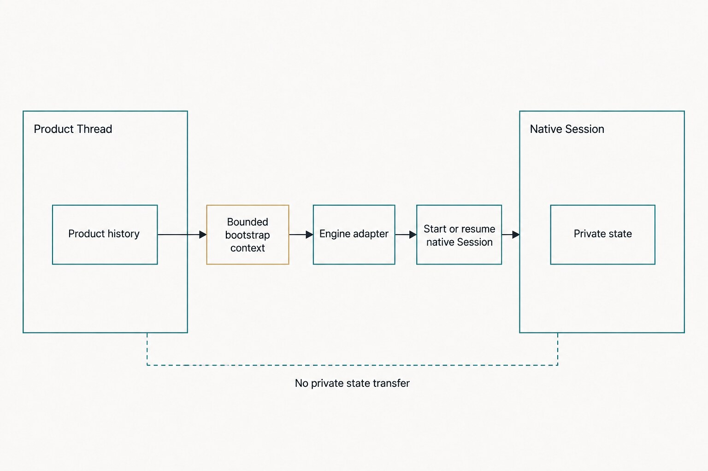
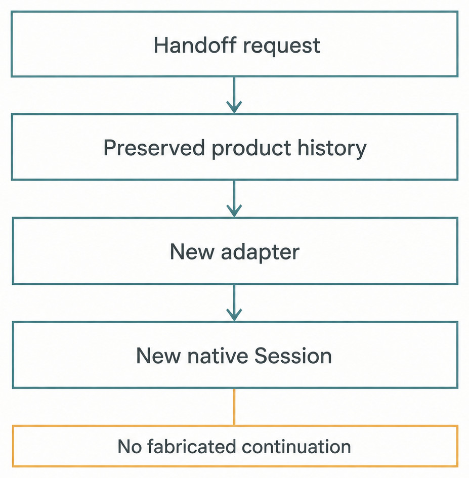

# Chapter 40 — Product Threads vs Native Engine Sessions {#chapter-40}

## The question

If a Haros Thread can keep its history when execution changes, why can't Haros simply continue the
same Session in another Engine?

Because **Product Thread** and **native Engine Session** are different facts with different owners.
A Product Thread is durable Haros work: its Project relationship, visible messages, Queue and Turn
history, Timeline activities, plans, lineage, checkpoints, goal state, and recovery records. A
native Engine Session is execution-private state inside one complete agent runtime: native
conversation identity, process state, opaque resume data, and protocol-specific context.

Haros can preserve and explicitly import product-visible history. It cannot truthfully claim that a
different Engine understands or continues another Engine's private Session. A handoff therefore
creates a new execution boundary. The destination may receive a bounded transcript and workspace
context, but its native Session is new unless that same Engine's own supported resume mechanism
proves otherwise.

_Figure 40.1 — Durable product work and replaceable native execution meet through an adapter without
becoming the same object._

**Accessible equivalent.** The Product Thread contains Haros-owned messages, Turns, Queue,
Timeline, lineage, workspace metadata, and recovery. An exact Engine/model binding selects one
adapter. The adapter starts or resumes a native Session owned by that Engine and returns canonical
runtime events. When the Engine changes, the Product Thread remains, but the previous native
Session does not cross the adapter boundary; the destination starts a new native Session with only
explicitly admitted product context.

## Three similar words, three lifecycles

Haros also has a product **Session projection**, which summarizes runtime status for a Thread:
starting, running, ready, interrupted, stopped, or error. It is not the native Session itself. It is
a Haros read-model fact used to explain whether the Product Thread currently has active execution.

| Concept                    | Owner                                       | Typical contents                                                                                                | Lifetime                                                                                |
| -------------------------- | ------------------------------------------- | --------------------------------------------------------------------------------------------------------------- | --------------------------------------------------------------------------------------- |
| Product Thread             | Product Orchestration and Haros persistence | Messages, Turns, activities, plans, lineage, Queue, checkpoints, goals, workspace and admitted Engine selection | Durable across views, renderer reloads, and recoverable runtime failures                |
| Product Session projection | Product Orchestration projection            | Thread ID, status, Engine label, runtime mode, active Turn, last error, update time                             | Changes with admitted runtime lifecycle; rebuilt from events                            |
| Engine runtime binding     | EngineService repository                    | Engine kind, status, lifecycle generation, active Turn, opaque resume cursor                                    | Survives enough to reconcile/recover one Engine relationship; not product history       |
| Native Engine Session      | Selected Engine adapter/runtime             | Native conversation ID, process/protocol state, Engine-private context                                          | Exists according to that Engine; may die with process or require its own resume support |
| Product Turn               | Product Orchestration                       | One admitted unit of user/goal work and terminal outcome                                                        | Durable history inside the Product Thread                                               |

The Product Session projection may say `running` while a native process exists, then become
`interrupted` after restart reconciliation proves the old in-process runtime is gone. Setting that
projection does not create, resume, or clone a native Session. Conversely, a native Session may
have an opaque resume cursor, but that cursor alone does not create a Product Thread or its visible
history.

The distinction is easiest to remember by asking who can interpret the bytes. Product
Orchestration understands Thread, Turn, and projected Session schemas. EngineService stores and
routes an opaque resume cursor. Only the matching adapter/runtime understands its internal native
meaning.

## Exact binding prevents accidental identity drift

A Product Thread records an Engine selection containing the Engine, model, and Engine-specific
options admitted for work. A queued Turn freezes the exact selection and provenance needed to
explain later execution. Changing Engine is stop-first: Haros does not let two Engines act as one
Session or project the replacement as established before startup succeeds.

The current turn-start logic distinguishes an empty Thread that may adopt its first requested
Engine from an established Thread/session binding. When established execution exists, a requested
Engine, model, runtime-mode, or interaction-mode change can be deferred until the replacement
boundary succeeds. A failed replacement therefore does not make the Thread pretend it already
belongs to the new runtime.

This does not mean a Product Thread is permanently locked to its first Engine. It means transitions
must be explicit. A new Turn can use a new admitted binding according to the lifecycle contract, and
a handoff can create a destination Thread or execution path with recorded lineage. What Haros will
not do is reinterpret earlier native references as if the new Engine had produced them.

## Native references stay opaque and scoped

Adapters report canonical runtime events with optional native references. Those references may
identify a native thread, item, task, or child agent. They are useful for targeted interrupt,
steering, diagnostics, and reconciliation within the same Engine boundary. They are not global
Haros IDs and must not be used to infer product ownership.

Lifecycle generation adds another scope. When a native Session is replaced or an interrupt rotates
the active lifecycle, late events from an older generation must not settle the new Turn. Engine
service and ingestion compare generations and exact bindings so stale native output cannot cross
into current product state merely because the Product Thread ID is unchanged.

An Engine runtime binding can persist an opaque resume cursor. On recovery, the same adapter may use
it if its contract supports resumption and the lifecycle evidence remains valid. Haros treats the
cursor as opaque; product code must not parse one Engine's cursor to fabricate another's Session.

## Handoff transfers history, not private cognition

Cross-Engine handoff makes the distinction visible. Haros creates or updates product facts that
record the source Thread, destination binding, workspace relationship, and imported messages.
Imported messages are labeled as handoff history rather than native destination output. A bounded
bootstrap transcript can introduce that history to the destination Engine.

_Figure 40.2 — Handoff preserves traceable product context but starts a truthful destination
execution boundary._

**Accessible equivalent.** `Handoff request` flows to `Preserved product history`, then `New
adapter`, then `New native Session`. An amber constraint beneath the last step reads `No fabricated
continuation`. The diagram does not claim that a native identifier, hidden context, tool cache,
process state, or opaque cursor crosses from the source Engine.

The bootstrap builder keeps recent messages more fully and summarizes or omits older material to
fit a hard context budget for ordinary handoff/restart paths. History-only forks have a stricter
rule: the exact accepted prefix must fit, or bootstrap fails closed rather than silently
truncating. A Chat-to-Agent fork labels the history as product-visible Chat context and warns the
destination not to assume that earlier operations ran in the new Project.

| Context item                              | May cross a handoff?                   | Representation                                  | Non-guarantee                                           |
| ----------------------------------------- | -------------------------------------- | ----------------------------------------------- | ------------------------------------------------------- |
| Product-visible user/assistant history    | Yes, when explicitly selected/admitted | Imported messages plus bounded bootstrap text   | Not native destination history                          |
| Source/destination lineage                | Yes                                    | Product Thread handoff/fork fields              | Does not merge Thread identities                        |
| Workspace/branch/worktree metadata        | Yes, under exact handoff scope         | Product-owned metadata and target environment   | Does not copy arbitrary private files                   |
| Exact destination Engine/model/options    | Yes                                    | New admitted binding/provenance                 | Does not rewrite prior Turn provenance                  |
| Source native Session ID/cursor           | No across Engines                      | Remains with source Engine owner                | Cannot be interpreted as destination continuation       |
| Hidden native context, caches, tool state | No                                     | Engine-private                                  | Completeness cannot be promised from visible transcript |
| Local capability authority                | No ambient transfer                    | Re-evaluated through HostGateway per exact Turn | Prior tool permission is not a destination grant        |

This is why a destination Engine may answer differently even with the same visible transcript. It
can have a different model, tool semantics, context window, skill support, or native system prompt.
The handoff promises traceable context, not identical hidden state or output.

## Worked example: hand a parser investigation to another Engine

Jules has a Product Thread in Engine A containing the original bug report, a test failure, a short
analysis, and a proposed fix. No file changes have been made. Jules chooses a handoff to Engine B
because its review capability better matches the next step.

First, Haros stops active Engine A work. Product Orchestration retains every accepted message,
activity, Turn outcome, and the exact provenance of Engine A. It creates the destination product
relationship with an Engine B selection. User and assistant messages eligible for handoff are
copied as imported product messages with source identities and timestamps. Streaming fragments and
private Engine data are not treated as stable transcript history.

Engine B's adapter starts a new native Session. Its bootstrap text says that the conversation was
handed off, includes the original title and relevant workspace metadata, and provides bounded
history. Engine B can now inspect the repository through newly authorized HostGateway operations.
If it runs the test, that action receives a new exact-Turn receipt; Engine A's earlier permissions
or tool results do not grant it authority.

The Timeline can truthfully show both phases: earlier Turns executed under Engine A and the new
Turn under Engine B. If Engine B startup fails, the imported Product Thread context and failed
destination intent remain recoverable. Haros does not reopen Engine A silently and call that the
same continuation. Jules can deliberately retry Engine B, choose another action, or return to the
source Thread with visible lineage intact.

## Same-Engine resume is still conditional

Even within one Engine, “resume” is not automatic. Some adapters can persist a native resume cursor;
some rebuild context from product-visible history; some support native forks; others provide only
history-based fallback. The adapter capability and current runtime evidence decide which path is
real.

A persisted binding can outlive the in-memory process. On Server restart, EngineService may inspect
the binding and try a supported recovery path. Yet an in-flight Turn whose process died cannot be
allowed to remain `running` forever. Product startup reconciliation marks orphaned execution
interrupted and resolves stale pending approval or user-input requests. This settlement is honest
even if a future Turn can start a new native Session from a saved cursor.

Thus these statements can both be true:

- The Product Thread and its history survive a Server restart.
- The previous in-flight native Session or Turn did not survive and must be settled.

Continuity belongs to product work; native continuation requires separate Engine-specific proof.

## Parent Threads and native child tasks

Subagents introduce another identity layer. A visible child Product Thread may have a parent Thread,
while the Engine also reports native child task or thread IDs. Haros resolves which Product Thread
owns Engine-session side effects and uses the parent lease when required. A transient projection
lookup must fail rather than let two reactors choose different lease keys.

Targeted native child operations can carry a native thread ID for steering or interrupt within the
current Engine generation. That native ID does not replace `parentThreadId`, `sourceThreadId`, or
other Product Thread lineage. Product hierarchy remains visible and durable; native hierarchy is
scoped execution evidence.

## Failure and recovery matrix

| Failure                                       | Product Thread outcome                                                | Native Session outcome                                    | Recovery                                                                           |
| --------------------------------------------- | --------------------------------------------------------------------- | --------------------------------------------------------- | ---------------------------------------------------------------------------------- |
| Destination Engine launch fails               | Imported history, lineage, and exact attempted binding remain visible | No successful destination Session                         | Settle failure; retry deliberately without silent fallback                         |
| Server restarts during a Turn                 | Messages, events, Queue, and projected history persist                | In-process runtime is gone; old Turn cannot finish itself | Reconcile orphaned Turn to interrupted and resolve stale interactions              |
| Resume cursor is missing/invalid              | Product history remains                                               | Native resume unavailable                                 | Start a new Session with explicitly bounded prior transcript when supported        |
| Late event arrives from old generation        | Current Product Turn must remain unchanged                            | Event belongs to obsolete native lifecycle                | Reject/quarantine through generation checks                                        |
| Cross-Engine handoff context exceeds budget   | Source history remains unchanged                                      | Destination bootstrap cannot safely include everything    | Bound/summarize according to handoff scope, or fail closed for exact-history scope |
| HostGateway operation is denied after handoff | Product Turn records denial/failure evidence                          | Destination Session may continue or settle                | Ask/adjust authority explicitly; never reuse source permission                     |
| Parent/child Thread lookup fails              | Existing lineage remains                                              | Session-side operation must not guess lease owner         | Retry after projection recovery rather than falling back to child identity         |

The preservation rule is consistent: do not destroy accepted product facts to make runtime recovery
look smooth. The settlement rule is equally important: do not keep a dead Session `running` because
the product history survived. Recovery restores user control through new facts.

## Why copying everything would still be wrong

Even if Haros could serialize every visible message, that would not capture an Engine's hidden
system instructions, tokenized context, internal summaries, tool caches, background task handles,
or service-side conversation state. Copying private configuration would violate ownership and may
expose secrets. Translating native tool calls from one protocol to another could also claim that
effects happened when only descriptions were copied.

The correct transferable unit is therefore an explicit product context package, not “the Session.”
It has a source, scope, size budget, and visible limitations. This design is more honest and more
recoverable: a contributor can inspect which messages crossed, which Engine was admitted, which
workspace is active, and which new operations received receipts.

## Try it safely

Perform a read-only comparison. Open the `OrchestrationThread`, `OrchestrationSession`,
`EngineSession`, and `EngineSessionRuntime` schemas. Make four lists of fields and circle only the
identifiers shared across boundaries. Explain why `threadId` can correlate records without making
their lifecycles identical.

Then inspect `handoff.test.ts` and `startupTurnReconciliation.test.ts`. Find one assertion that keeps
the newest imported history within a budget and one that turns a restart-orphaned running Session
into `interrupted`. The observable result is a truthful two-part recovery story: context may be
carried forward, while dead execution is settled. Do not start an Engine or inspect real native
Session files.

## Recap

1. A Product Thread is durable Haros work; a native Engine Session is private execution state.
2. The Product Session projection summarizes runtime lifecycle but is not the native Session.
3. Handoff transfers explicit, bounded product context and starts a new native boundary.
4. Same-Engine resume is adapter-specific and never excuses leaving orphaned Turns running.
5. HostGateway authority, native references, lifecycle generations, and Turn provenance remain
   exact across every transition.

## Check your model

1. **If two Engines receive the same visible transcript, are they continuing one native Session?**  
   No. They have separate private runtime state; the destination receives explicit product context.

2. **Why can the Product Thread survive while a running Turn becomes interrupted?**  
   Product history is durable, but the in-process native runtime that could finish that Turn died.

3. **Can a source Engine's tool approval authorize the destination Engine after handoff?**  
   No. HostGateway evaluates authority for the destination's exact admitted Turn.

## Source trail

- `docs/architecture.md` establishes Product Thread ≠ native Engine Session as a product invariant.
- `packages/contracts/src/orchestration.ts` defines durable Product Thread fields, Turn provenance,
  handoff/import commands, and the Product Session projection.
- `packages/contracts/src/engine.ts` defines the canonical Engine Session boundary exposed to
  EngineService and adapters.
- `apps/server/src/persistence/Services/EngineSessionRuntime.ts` owns the typed runtime binding and
  opaque resume cursor without claiming product history.
- `apps/server/src/engine/Layers/EngineService.ts` routes exact bindings, lifecycle generations,
  resume/fork paths, native events, and stop-first replacement.
- `apps/server/src/orchestration/handoff.ts` constructs bounded, explicitly labeled product-history
  bootstrap context.
- `apps/server/src/orchestration/turnStartSession.ts` keeps established binding changes pending until
  replacement succeeds.
- `apps/server/src/orchestration/startupTurnReconciliation.ts` settles runtime work that cannot
  survive a Server process boundary; focused tests prove handoff budgets, binding preservation, and
  restart interruption for this edition.

<!-- guide-navigation:start -->

[Guidebook contents](../README.md) · [Previous: Engine Identity, Discovery, and Adapters](39-engine-identity-discovery-adapters.md) · [Next: HostGateway and Exact-Turn Authority](41-hostgateway-exact-turn-authority.md)

<!-- guide-navigation:end -->
