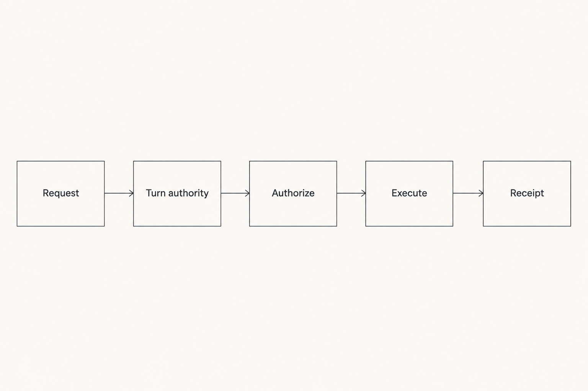
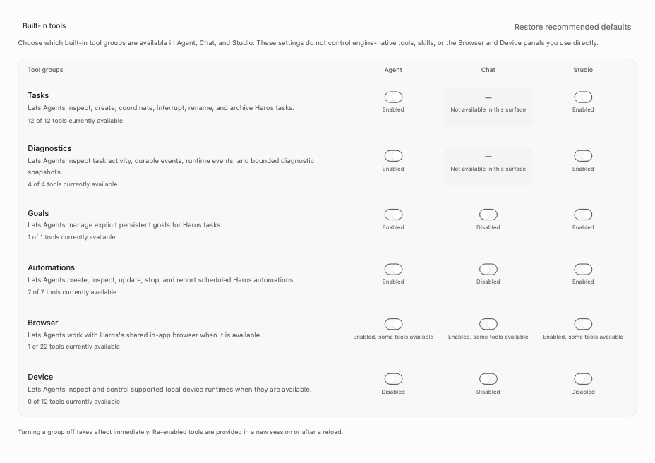
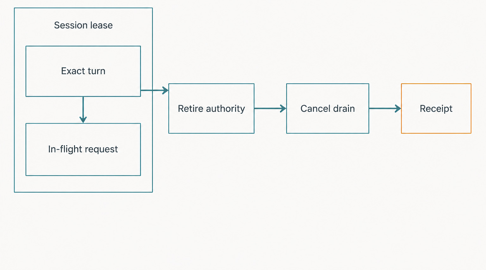

# Chapter 41 — HostGateway and Exact-Turn Authority {#chapter-41}

## The question

An Engine can ask to read a Thread, control a browser, create another task, or operate a device. Why
does Haros put those requests through HostGateway instead of letting every Engine adapter call local
services directly?

Because “the runtime asked for a tool” is not enough authority. Haros must know which Engine Session
made the request, which Product Thread it belongs to, which exact Turn is still running, whether the
tool is exposed on that product surface, whether the Session has the required capability, whether
the target is allowed, and how cancellation or a retry should settle. HostGateway is the boundary
that answers those questions consistently.

The plain-English model is:

> **Request → authenticate the Session → bind the exact Turn → authorize the tool and target →
> execute through the real capability owner → return a result or durable operation receipt.**

_Figure 41.1 — Authority is checked before execution, and the result returns through the same bounded path._

**Accessible equivalent.** `Request` points to `Turn authority`, then `Authorize`, `Execute`, and
`Receipt`. The diagram is deliberately linear: no execution edge bypasses exact-Turn authority or
authorization.

_Real product capture — The production capability matrix renders a server-owned projection by
product surface; a switch does not itself grant exact-Turn authority or prove a native
implementation exists._

HostGateway does not replace file, Git, terminal, browser, device, automation, or Product
Orchestration owners. It catalogs and projects their admitted tools, authenticates Engine callers,
and enforces the cross-cutting authority rules. The underlying service still owns what the action
means. An Engine adapter is a consumer of that boundary, not a second permission system.

## Authority is narrower than identity

Three identities are easy to collapse. A Product Thread is durable Haros work. A native Engine
Session is the runtime's private execution context. A Turn is one admitted unit of work inside the
Product Thread. HostGateway credentials are issued to one Engine Session and bound to a Thread, but
a tool call receives authority only from the exact running Turn observed when its MCP request
arrives.

That final restriction closes a dangerous race. Imagine Turn A starts a slow browser operation,
then A finishes and Turn B begins on the same long-lived native Session. If the gateway merely
re-read “latest running turn” halfway through the request, A's late call could inherit B's authority.
The pinned implementation captures a non-secret `HostGatewayTurnAuthority` at ingress and later
checks that the same Turn is still running. A terminal Turn credential can also be retired so it can
never bind to a later Turn, even if Turn A never used a tool before it finished.

| Fact                              | Canonical owner                                             | What a consumer receives                          | Forbidden shortcut                               |
| --------------------------------- | ----------------------------------------------------------- | ------------------------------------------------- | ------------------------------------------------ |
| Product Thread and Turn lifecycle | Product Orchestration                                       | Thread ID, exact running Turn ID, projected state | Treating a native Session ID as a Product Thread |
| Engine Session identity           | Engine adapter plus HostGateway Session registry            | Opaque Session credential and non-secret identity | Reusing one credential for replacement runtimes  |
| Tool-call authority               | HostGateway ingress and exact-Turn checks                   | A request-scoped authority object                 | Rebinding a late request to the newest Turn      |
| Local action semantics            | File, Git, terminal, browser, device, or automation service | A typed tool handler result                       | Reimplementing the service inside an adapter     |
| Engine identity and discovery     | `ENGINE_DESCRIPTORS` and discovery owners                   | Typed Engine projection                           | Adding a HostGateway-owned Engine registry       |

The Session registry deliberately gives replacement runtimes independent credentials. Startup and
teardown can overlap; if a replacement reused the outgoing runtime's bearer, old cleanup could
revoke the new runtime. Session-lease release is idempotent because finalizers, process exit,
explicit Stop, and replacement can all race to clean up the same runtime.

## Catalog, exposure, and authorization are separate gates

The catalog is assembled once from tool groups tagged with canonical owner metadata. In this
edition the built-in groups are tasks, diagnostics, goals, automations, browser, and device. The
exact group-to-surface policy lives in shared policy, not in this chapter or a UI switch. The
gateway projects availability, support, defaults, configured overrides, and effective exposure.
These are different facts.

A device group may be supported on a surface but unavailable on the current platform. A browser
group may be available yet disabled by a current setting. A tool may be listed in the internal
catalog but absent from `tools/list` for a Chat workspace. Even after exposure, the Session must
hold the tool's required capability. Finally, the handler may enforce target-specific rules such as
preventing a lower-privilege worktree caller from driving a higher-privilege local-checkout Thread.

The gateway checks current exposure at call time. Changing a setting does not retroactively kill a
call that already passed admission, but a new call from an existing Session is evaluated against the
new projection. This prevents an initialized MCP client from treating its old `tools/list` response
as permanent authorization.

| Gate                   | Question                                                                           | Example refusal                       | Surviving fact                                  |
| ---------------------- | ---------------------------------------------------------------------------------- | ------------------------------------- | ----------------------------------------------- |
| Session authentication | Is this opaque bearer live and still attached to the correct Engine and Thread?    | `caller_session_inactive` or HTTP 401 | Product Thread remains unchanged                |
| Exact-Turn authority   | Was this request admitted during the same Turn that is still running?              | `caller_turn_inactive`                | Later Turns do not inherit the request          |
| Surface exposure       | Is the group supported, configured, available, and effective here?                 | `tool_unavailable`                    | Catalog owner and settings remain authoritative |
| Session capability     | Does the principal hold the required read/control/write capability?                | `capability_denied`                   | No handler side effect begins                   |
| Target policy          | May this caller drive this target without crossing workspace or runtime privilege? | Typed tool-input error                | Target Thread and binding remain unchanged      |
| Domain admission       | Does the real capability owner accept this exact operation?                        | Service-specific typed failure        | Gateway does not fabricate success              |

Tool annotations help an Engine reason about risk—read-only, destructive, idempotent, or open-world
behavior—but annotations are guidance, not a grant. “Full access” is a runtime mode, not proof that
every device or browser action is available. A reference passed in a prompt is context, not
authority. These distinctions are why one gateway policy is more reliable than similar-looking
checks scattered through adapters.

## Following one tool call

Consider a running Turn that asks HostGateway to send a follow-up message to another Thread.

1. The Engine Session connects to the streamable-HTTP MCP endpoint with an opaque bearer. A
   stdio-only Engine can receive a short-lived, one-shot bootstrap credential that is exchanged by
   the proxy; the long-lived bearer need not be exposed as ordinary process configuration.
2. The transport verifies the bearer, loads the caller's projected Thread, and checks that the live
   Engine still matches the Session identity.
3. Because the latest Turn is running, the registry binds the request batch to that exact Turn. The
   transport creates `assertCallerTurnActive`, which rechecks Session validity and the Turn ID
   before admitted tool work.
4. `tools/call` resolves the named catalog entry, reloads current exposure, and verifies its
   required capability.
5. The handler loads caller and target Thread shells. It applies the drive/privilege boundary and
   confirms that the target's current Engine/runtime mode is executable.
6. The handler dispatches a typed Product Orchestration command. Product Orchestration—not the
   gateway—owns message acceptance, Queue behavior, events, projections, and command receipts.
7. The gateway returns a bounded result describing the dispatch. It does not report that the target
   Engine completed the follow-up.

This example contains two receipts with different jobs. The immediate MCP response proves what the
tool call returned. Product Orchestration's command receipt makes command retry behavior
idempotent. Some multi-resource HostGateway operations, particularly child-Thread creation, also
have a durable gateway operation record because their filesystem and Product Orchestration steps
may cross a process boundary.

Notice what the Web workbench does not do in this path. It does not receive the bearer, approve the
tool by rendering it, or translate an MCP payload into a direct browser or filesystem call. The Web
may show the resulting Timeline facts and expose user controls whose intents travel through typed
server contracts. Native execution and local system authority remain behind the server boundary.
That separation protects headless Engine execution too: authorization does not depend on one
particular component remaining mounted.

The response also must not be inflated into a larger claim. “Follow-up accepted” means the target
Product command was admitted; it does not mean the target's native Engine Session exists forever,
that its next Turn completed, or that the target read every preceding message. A caller that needs
completion evidence must observe the target Thread's later lifecycle through the Product owner.
This makes chained automation debuggable: admission, launch, runtime output, and settlement remain
distinct facts rather than one optimistic success flag.

Finally, the exact-Turn recheck belongs close to the capability action, not only at the initial
HTTP boundary. Authentication can be valid at ingress and stale milliseconds later because Stop,
Session replacement, or policy change races the request. Rechecking before admitted work reduces
that time-of-check/time-of-use window. The domain service may then perform its own transaction or
target validation, because HostGateway authority is necessary but not sufficient for domain
success.

## Durable operations and idempotent creation

Creating several child Threads is more complicated than reading state. It may resolve exact Engine
targets, prepare worktrees, dispatch initial turns, and then return a combined result. Retrying an
interrupted request must not create an unbounded family of replacements.

The public input therefore includes a request ID and a bounded creation plan. The pinned operation
repository scopes one `create_threads` plan to caller Thread plus caller Turn. It stores a
fingerprint, requested count, plan, state, result, and sanitized error. An identical request ID and
fingerprint replays the same operation. Reusing the ID with different content is an idempotency
conflict. A distinct second plan in the same active Turn is locked rather than interpreted as
permission to double the work.

Worktree ownership is recorded only after creation and only while the operation is dispatching.
That evidence lets startup recovery compensate resources belonging to the interrupted operation.
Recovery must verify ownership before deletion; it refuses to remove a reused path or branch based
only on a planned name. If cleanup cannot finish, the operation remains in a compensating state so
the unresolved fact stays visible and retryable. It does not create replacements as a recovery
shortcut.

| Operation state | Meaning                                                               | Valid next step                           | Recovery rule                                              |
| --------------- | --------------------------------------------------------------------- | ----------------------------------------- | ---------------------------------------------------------- |
| `reserved`      | Exact plan accepted; no dispatching side effect should yet be assumed | Begin dispatch or fail                    | Restart can fail it without inventing cleanup              |
| `dispatching`   | Bounded resources or child commands may be in progress                | Complete, compensate, or fail             | Verify operation ownership before cleanup                  |
| `compensating`  | Recovery is reversing confirmed operation-owned resources             | Retry cleanup or fail terminally          | Preserve sanitized failure evidence; create no replacement |
| `completed`     | Replayable result committed                                           | Return the same result for an equal retry | Request interruption after commit does not undo it         |
| `failed`        | Operation cannot produce the requested result                         | Report the stored failure                 | Product and external side effects are not guessed away     |

This is an implementation detail of the current source alpha, not a promise that all future tools
will use the same table. The durable principle is narrower: a retryable multi-resource operation
needs a single owner, an exact idempotency scope, and recovery evidence strong enough to avoid
deleting unrelated state.

## Cancellation is a barrier, not a story about rollback

MCP clients may send `notifications/cancelled`, but an Engine can be interrupted without sending
one. HostGateway therefore keeps a process-local in-flight request registry keyed by Session,
Turn, and JSON-RPC request ID. The adapter can cancel every request for the exact Turn directly.

When a Turn stops, the gateway tombstones that Turn before draining matching requests. A request
racing with Stop is cancelled during registration, before its handler starts. Engine-native
interruption and gateway cancellation run concurrently, but the caller receives the native result
only after the gateway drainage barrier settles. A short bounded wait prevents broken tool cleanup
from indefinitely blocking Engine interruption; cleanup failures are logged rather than replacing
the Engine's real interrupt outcome.

_Figure 41.2 — Cancellation closes future authority before draining work already associated with the exact Turn._

**Accessible equivalent.** `Session lease` contains `Exact turn` and `In-flight request`. `Exact
turn` points down to the in-flight request and right to `Retire authority`. The safety sequence then
continues through `Cancel drain` to `Receipt`. Authority retirement therefore precedes the drain.

Cancellation still does not mean rollback. A browser click, filesystem write, or child Thread
dispatch that committed before the abort may remain. The correct evidence is the capability
service's result, Product Timeline, and durable operation record where one exists. HostGateway can
stop authority from flowing forward; it cannot truthfully erase an already completed action.

## What can go wrong—and how control returns

An invalid or revoked bearer fails before tool discovery or execution. A request arriving while no
Turn is running may still initialize or list exposed tools, but `tools/call` is rejected because it
lacks exact-Turn authority. A stale batch whose Turn settles midway is rechecked and refused rather
than borrowing authority from a new Turn.

A disabled or unavailable group produces an explicit unavailable result. A capability mismatch
fails before the handler. A target privilege violation fails inside the bounded handler before it
dispatches domain work. A duplicate JSON-RPC request ID in one batch is invalid input; requests in a
valid batch start without head-of-line serialization so a cancellation notification can see its
target.

| Failure                                     | What is preserved                                        | Recovery or next action                                          | Not promised                |
| ------------------------------------------- | -------------------------------------------------------- | ---------------------------------------------------------------- | --------------------------- |
| Session revoked or Engine ownership changed | Product Thread and accepted history                      | Start or resume through a fresh adapter-owned Session lease      | Reusing the old bearer      |
| Caller Turn already terminal                | Later Turn authority remains isolated                    | Issue the request from an actually running Turn                  | Late request inheritance    |
| Tool group disabled/unavailable             | Current settings and canonical catalog projection        | Enable a supported group or satisfy platform availability        | Adapter bypass              |
| In-flight request cancelled                 | Durable actions already committed; cancellation evidence | Inspect result, Timeline, and operation status before retrying   | Automatic rollback          |
| Creation request replayed                   | Original plan, fingerprint, and terminal result/status   | Equal retry replays; changed intent needs a new Turn/plan        | Duplicate child creation    |
| Startup compensation incomplete             | Sanitized compensating operation record                  | Retry or perform bounded manual cleanup using ownership evidence | Deleting an unverified path |

The unifying recovery rule is to return control without broadening authority. A failed device action
does not grant a browser fallback. An unavailable Engine does not justify silently selecting
another Engine. A timed-out operation does not justify guessing whether it committed. Haros keeps
the refusal or uncertain boundary explicit so a person or later Turn can make a new, informed
decision.

## Try it safely

Use source and focused tests; do not point a tool at real private data.

1. Read `toolCatalog.test.ts` and write down the difference between supported, configured,
   available, and effective for one group.
2. Read the exact-Turn tests in `HostGatewaySessionRegistry.test.ts`. Trace Turn A through bind,
   retire, and a hypothetical Turn B.
3. Read one integration test that replays an identical child-creation request and one that changes
   the fingerprint. Record whether a new Thread is created.
4. Finally, inspect one cancellation test in `sessionLease.test.ts` and state which happens first:
   the authority tombstone or Engine-native interruption.

The observable result is a written authority trace with no running Engine, filesystem mutation, or
real credential. You should be able to identify the first gate that rejects each invented request.

## Recap

1. HostGateway owns cross-cutting local-capability admission; domain services still own actions.
2. A live Engine Session authenticates a caller, but one exact running Turn authorizes a tool call.
3. Catalog, surface exposure, Session capability, target policy, and domain admission are distinct.
4. Durable multi-resource operations need exact idempotency and ownership-aware compensation.
5. Cancellation retires authority and drains work; it does not claim completed side effects rolled
   back.

## Check your model

1. **Why can a Session bearer not simply authorize every future Turn in that Session?**  
   Because a late request from Turn A could otherwise acquire Turn B's authority. Ingress binds the
   request to the exact Turn, and terminal authority is retired.

2. **If a browser tool is advertised, is its call automatically permitted?**  
   No. Advertisement reflects current exposure. Exact-Turn authority, Session capability, target
   rules, and the browser service's own admission still apply.

3. **What should happen after an uncertain child-creation interruption?**  
   Inspect or replay the same durable operation. Do not mint a new plan or delete resources without
   operation-ownership proof.

## Source trail

- `packages/shared/src/hostToolSurfacePolicy.ts` is the canonical group/surface policy; the table in
  this chapter explains its dimensions without becoming another registry.
- `apps/server/src/hostGateway/toolCatalog.ts` tags one catalog, rejects duplicate tool names, and
  derives revisioned group projections.
- `apps/server/src/hostGateway/mcpTransport.ts` authenticates the Session, binds ingress to an exact
  Turn, reloads exposure, checks capabilities, and registers cancellable requests.
- `apps/server/src/hostGateway/Layers/HostGatewaySessionRegistry.ts` owns independent Session
  credentials, exact-Turn binding, retirement, and revocation.
- `apps/server/src/hostGateway/sessionLease.ts` coordinates Turn cancellation with Engine-native
  interruption and idempotent Session cleanup.
- `apps/server/src/hostGateway/Layers/HostGatewayOperationRepository.ts` and
  `apps/server/src/hostGateway/startupRecovery.ts` own replayable creation operations and verified
  compensation.
- Focused evidence includes `toolCatalog.test.ts`, `HostGatewaySessionRegistry.test.ts`,
  `sessionLease.test.ts`, `mcpTransport.test.ts`, `HostGatewayOperationRepository.integration.test.ts`,
  and `HostGateway.integration.test.ts`.

<!-- guide-navigation:start -->

[Guidebook contents](../README.md) · [Previous: Product Threads vs Native Engine Sessions](40-product-threads-native-engine-sessions.md) · [Next: Streaming, Synchronization, and Backpressure](42-streaming-synchronization-backpressure.md)

<!-- guide-navigation:end -->
