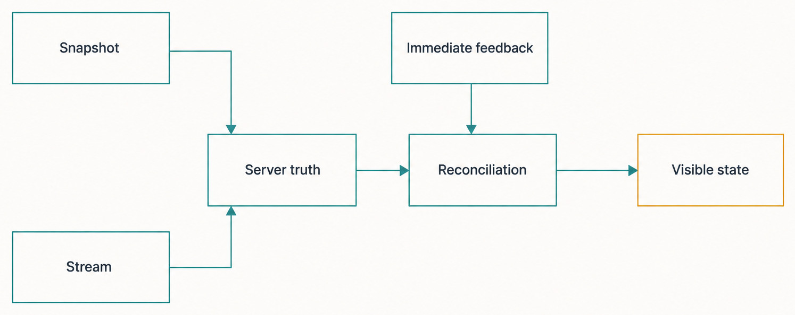
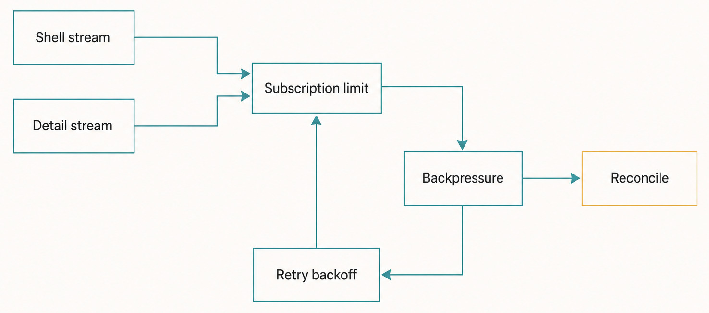
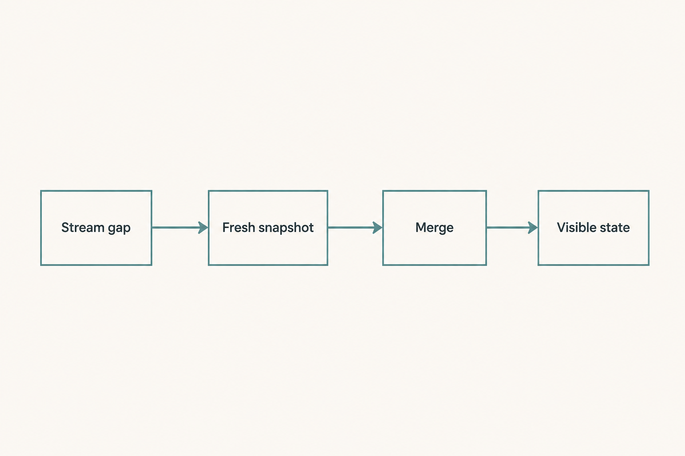

# Chapter 42 — Streaming, Synchronization, and Backpressure {#chapter-42}

## The question

Haros can show a submitted message, changing activity, and streamed assistant text quickly. How can
the interface feel immediate without making the Web workbench the owner of Product Thread truth?

The answer is not “trust every WebSocket message.” A live stream can disconnect, duplicate work
during resubscription, fall behind, or arrive while a snapshot is being loaded. Haros combines
local interaction state with server snapshots, ordered durable events, exact sequence fences, and
bounded live delivery. When a gap cannot be proven safe, the client resynchronizes instead of
inventing continuity.

The plain-English model is:

> **Immediate feedback is presentation. Server acceptance and persisted events are truth.
> Synchronization joins a snapshot to ordered events; reconciliation repairs uncertainty.**

_Figure 42.1 — Presentation can be immediate while reconciliation remains anchored in server evidence._

**Accessible equivalent.** `Snapshot` and `Stream` both point to `Server truth`. `Server truth` and
`Immediate feedback` then point to `Reconciliation`, which produces `Visible state`. No arrow makes
reconciliation the producer of snapshot or stream evidence.

This chapter focuses on Product Orchestration shell and Thread-detail streams. Terminal output and
device video have different semantics and must not be forced into the same recovery rule. In the
pinned source alpha, terminal output is treated as an ordered byte stream with explicit renderer
acknowledgement; dropping a chunk would create a hole. Product state, by contrast, can recover from
durable events and snapshots.

## Three layers of “now”

When a user presses Send, several observations can be true at different moments. The Composer can
clear or retain a draft immediately. A command response can prove server admission. A shell stream
can update the sidebar. A Thread-detail stream can deliver messages and activities. An Engine can
later report output and terminal settlement.

The Web workbench coordinates these views, but it does not get to declare a Turn accepted merely
because a click occurred. It consumes typed projections and stream items. Product Orchestration
owns commands, events, receipts, and read models. Engine adapters report runtime facts through
trusted server seams. The Web store renders and temporarily buffers; it is not a parallel event
store.

| Layer                   | What it may know quickly                                          | Authority                                                                 | Repair path                                                     |
| ----------------------- | ----------------------------------------------------------------- | ------------------------------------------------------------------------- | --------------------------------------------------------------- |
| Local interaction state | Draft text, pressed control, focused route, pending request       | Presentation only                                                         | Restore the draft or show a request error                       |
| Command response        | Accepted sequence or typed rejection                              | Product Orchestration receipt/dispatch result                             | Equal retry by command identity when appropriate                |
| Shell stream            | Projects, Spaces, Thread summaries, latest visible lifecycle      | Shell projection                                                          | Fresh shell snapshot plus relevant events                       |
| Thread-detail stream    | Transcript, activities, pending interactions, detailed Turn state | Thread-detail projection                                                  | Cursor resume or fresh detail snapshot plus events              |
| Engine runtime stream   | Assistant deltas and runtime activities entering the server       | Engine runtime for execution facts; Product Orchestration after ingestion | Runtime settlement, restart reconciliation, or explicit failure |

A junior-friendly rule is: fast does not mean authoritative, and authoritative does not mean the
UI must wait for every later detail. Haros can display known local intent while preserving a clear
failure route if the server rejects it.

## Why a snapshot alone is not enough

Suppose a Thread snapshot is read at event sequence 100. While that database read is running, event
101 commits. If the server starts the live subscription after reading the snapshot, event 101 can
fall into the gap: it is too new for the snapshot and too old for the live tap.

Haros closes that gap in the opposite order:

1. Attach the scoped live subscription synchronously.
2. Read the snapshot and its `snapshotSequence`.
3. Capture the durable event-log high-water sequence after the live tap exists.
4. Replay events newer than the snapshot through that fixed high-water fence.
5. Continue with live events strictly newer than the fence.

The small handoff queue between the live tap and the join is bounded. The upstream UI-facing live
stream owns slow-consumer handling. Filtering by sequence removes live events already covered by
the replay. The result is snapshot first, fenced replay second, and newer live events last.

This is a protocol pattern, not a claim that event delivery over a network is magically exactly
once. It makes the server's join deterministic for one subscription. The client still applies
sequence guards, ignores stale snapshots, and must tolerate a restarted stream.

Subscription lifetime is therefore part of correctness. A reconnect or same-key takeover creates
a new lease with its own bootstrap. Results from an older lease can arrive late, so the client must
associate snapshots and events with the active subscription path and compare durable sequences
before reducing them. Unmounting a component is not, by itself, evidence that every queued callback
from the old lease vanished.

Sequences describe accepted Product history, not wall-clock time and not reusable object versions.
Several projection changes may derive from one event, and a snapshot may summarize many earlier
events. The client should ask whether a fact is covered by its current snapshot fence, not whether
one network packet “looks newer.” This is especially important after restore: a cursor from the old
database can be numerically ahead of the restored head while referring to a history that no longer
exists in this environment.

The join also avoids making the Web replay arbitrary domain history. The server chooses the scoped
events and projection shape appropriate to shell or one Thread. The Web reducer stays a bounded
consumer of typed facts rather than learning persistence schemas, scanning the database, or
reconstructing Engine-native state. That keeps synchronization behavior consistent across Agent,
Chat, and Studio while their visible layouts remain different.

| Phase             | Fence or input                              | Emits                            | Excludes                                      |
| ----------------- | ------------------------------------------- | -------------------------------- | --------------------------------------------- |
| Live attach       | Subscription registered before snapshot I/O | Nothing yet; buffers live events | The attach/snapshot race                      |
| Snapshot          | Projection at `snapshotSequence = S`        | Current shell or Thread detail   | Events already represented by the snapshot    |
| Durable replay    | `(S, H]`, where `H` is captured high water  | Ordered accepted gap events      | Events at or below `S`; moving tail above `H` |
| Live continuation | Sequence `> H`                              | New relevant events              | Replay duplicates at or below `H`             |
| Client reduction  | Current local sequence and deletion fences  | Visible normalized state         | Stale snapshots and already-applied events    |

The shell stream filters events into compact upsert/remove shapes because sidebars do not need full
transcripts. A Thread-detail stream filters the durable log to one Thread and returns raw typed
Orchestration events after its initial detail snapshot. These are narrow projections over the same
accepted history, not independent product stores.

## Cursor resume: useful only when the gap is provable

Opening a recently viewed Thread does not always require resending its full transcript. The client
keeps a bounded resume cursor for retained Thread detail. It can subscribe with `afterSequence`.
The server then captures the current durable high water and calculates the gap.

Resume is accepted only if the subject still exists, the cursor is not ahead of the durable head,
and the gap is within the fixed replay limit. The current limit is 4,096 events. That number is an
edition-pinned transport budget, not a product promise or a recommendation to build UI logic around
it.

A cursor ahead of the head can occur after restoring a backup or resetting a database. A hard purge
can remove one Thread while unrelated events keep the journal head high. For those cases the server
falls back to the snapshot path instead of streaming an empty replay forever. If the Thread detail
does not exist after the bounded bootstrap wait, the stream fails with an identifiable
`THREAD_SNAPSHOT_NOT_FOUND` error.

If the snapshot-to-head gap itself exceeds the replay limit, the server asks for a fresh
resubscription with `ORCHESTRATION_RESNAPSHOT_REQUIRED`. A repeated request with a non-advancing
snapshot fence escalates to a non-retryable stalled error. Repeating the identical restart forever
would only spend resources while proving no progress.

## Backpressure: bound memory, then make loss visible

A server can produce events faster than a slow browser can consume them. An unbounded queue turns
that mismatch into growing memory. A bounded queue needs an explicit loss and recovery policy.

For general UI-facing streams, the current transport uses a sliding buffer whose default capacity
is 1,024 items. Sliding keeps the newest items and may drop the oldest lagging ones. The lag tracker
reports a lower bound on drops rather than pretending to know a perfect count from asynchronous
buffer internals. Reports are rate-limited as loss grows.

For snapshot-backed Product Orchestration streams, a detected drop invokes a recovery hook that
fails the stream so the client resubscribes and rebuilds from durable truth. Thread-detail drops
also create a sanitized operational diagnostic. That is better than continuing with a plausible
but incomplete transcript.

Not every stream can recover by resnapshot. Terminal bytes remain lossless at this layer because a
dropped byte range cannot be reconstructed from Product Orchestration. Device frames can normally
prefer freshness over every intermediate image. The owner of a stream's meaning chooses the
policy.

| Pressure boundary                |           Current bound | When exceeded                                                            | Why this is truthful                                            |
| -------------------------------- | ----------------------: | ------------------------------------------------------------------------ | --------------------------------------------------------------- |
| UI live-item buffer              |  1,024 items by default | Oldest live items may slide out; snapshot-backed streams fail for resync | Durable snapshot/events repair product state                    |
| Snapshot replay gap              |            4,096 events | Request a fresh snapshot; escalate a repeated non-advancing fence        | Avoid unbounded catch-up and retry loops                        |
| Streams per RPC client           |                20 total | Retryable capacity error                                                 | One client cannot own unlimited live taps                       |
| Unique Thread streams per client |                       8 | Retryable Thread-capacity error                                          | Visible and retained detail must fit a shared connection budget |
| Same-key subscription            |       One current lease | New lease evicts and gracefully ends the old one                         | Fast resubscribe does not double live taps                      |
| Terminal event subscription      | Lossless ordered stream | Backpressure rather than sliding loss                                    | Missing bytes cannot be repaired from a snapshot                |

The transport records admission rejections without waiting for diagnostic persistence. Diagnostics
must not become a second gate that delays the refusal. Client budgets are isolated, and releasing a
failed or interrupted lease is idempotent.

_Figure 42.2 — Bounded stream delivery turns pressure into a visible retry-and-reconcile path._

**Accessible equivalent.** `Shell stream` and `Detail stream` enter `Subscription limit`, which
points to `Backpressure`. Backpressure points both to `Retry backoff` and to `Reconcile`; retry
backoff loops to subscription admission. The loop is bounded recovery, not silent continuation
after dropped product events.

## Worked example: an answer arrives during navigation

Imagine the Engine is explaining a failing test in Thread T. The user switches to another route and
then returns while assistant output and a terminal Session event are being committed.

1. Before navigation, the client retains T's normalized detail and advances its resume cursor to
   the latest integrated sequence.
2. The visible route releases one subscription handle. Retention policy may keep a non-idle Thread
   subscribed; it must not evict running work merely because the pane is hidden.
3. On return, the client asks for T with its `afterSequence` cursor. A same-key takeover replaces an
   older overlapping lease instead of counting both.
4. The server attaches live delivery, captures high water, and verifies that T still exists. A
   valid gap of at most 4,096 events replays only the missing events. An invalid cursor or subject
   takes the fresh-snapshot path. If the new snapshot-to-head gap still exceeds 4,096, admission
   returns `ORCHESTRATION_RESNAPSHOT_REQUIRED` instead of promising immediate recovery; a repeated
   non-advancing fence becomes `ORCHESTRATION_SNAPSHOT_STALLED`.
5. The Web root buffers Thread events until the snapshot has established a sequence. It then drops
   events already covered by that snapshot and applies only newer ones.
6. The store reducer normalizes the transcript and terminal lifecycle. A stale snapshot from an
   earlier subscription cannot overwrite a newer one.
7. If the client was too slow and the live buffer dropped events, the stream fails deliberately.
   The transport retries through the resnapshot path. The visible Thread is repaired from server
   truth rather than kept half-current.

_Figure 42.3 — Resynchronization replaces an unprovable gap with fresh bounded server evidence._

**Accessible equivalent.** `Stream gap` points to `Fresh snapshot`, then `Merge`, then `Visible
state`. The simple chain describes the client recovery intent; server admission may still return a
resnapshot-required or stalled error when the newly captured gap remains outside its fixed bound.

The immediate feel comes from retaining and rendering known state while bounded synchronization
runs. The truth comes from sequence-aware server projections and accepted events. These are
complementary, not competing, responsibilities.

## Shell and detail have different jobs

The shell snapshot answers broad navigation questions: which Projects and Threads exist, where they
appear, and their compact status. Thread detail answers focused reading questions: what messages,
activities, pending interactions, and Turn facts belong to one Thread.

Keeping them separate reduces the cost of restoring the whole workbench. It also creates an
important deletion rule. A shell `thread-removed` event can tell the client to stop treating a
Thread as present. A retained detail cache must not resurrect it just because an older snapshot
arrives. The Web store tracks sequence-aware deletion evidence and prunes released terminal detail
that no visible or retained owner needs.

Thread-detail retention is bounded and shared with connection admission. Visible Threads win over
idle cache entries. Non-idle hidden subagents may remain retained until they settle, because dropping
their only live detail can hide progress. This is current Web implementation policy; the durable
architecture statement is simply that caches are consumer-owned and bounded, while Product Thread
truth remains server-owned.

## What can go wrong—and how it recovers

| Failure                            | What remains trustworthy                    | Recovery                                             | What not to do                                   |
| ---------------------------------- | ------------------------------------------- | ---------------------------------------------------- | ------------------------------------------------ |
| Disconnect after command commit    | Command receipt, events, projections        | Reconnect; snapshot or cursor replay                 | Resend with a new command ID immediately         |
| Event commits during snapshot I/O  | Durable event and attached live tap         | Fenced replay plus live-after-fence                  | Assume snapshot time equals subscription time    |
| Client cursor ahead of server head | Server snapshot and current durable head    | Fall back to a fresh snapshot                        | Treat sequence numbers as reusable identities    |
| Replay gap too large               | Durable history and current projection      | Resnapshot; slow retry if the fence advances         | Unbounded replay on the UI connection            |
| Live buffer drops events           | Durable Product Orchestration state         | Fail stream, record diagnostic, resubscribe          | Continue showing an incomplete detail as current |
| Repeated non-advancing snapshot    | Evidence that ordinary retry is not healing | Surface stalled state; restart or repair local state | Infinite fast retry                              |
| Thread was hard-purged             | Shell absence and failed detail lookup      | Remove local detail and route safely                 | Stream an empty “success” forever                |

Backoff belongs at the transport layer. Domain reducers should not sleep and retry. Similarly, a
projection repair belongs to the server's projection owner, not to a component that notices an odd
message count.

The source alpha also distinguishes stream admission from request admission. Long snapshot/diff
reads have bounded request lanes, while control and Engine discovery have separate capacity. A
heavy read should not strand the Composer's model truth or a Stop command behind unrelated work.
Those lane sizes may evolve; the principle is that overload must fail explicitly without starving
the path needed to regain control.

## Try it safely

Use the focused tests with in-memory streams; do not generate real workloads.

1. In `wsSnapshotLiveStream.test.ts`, trace the case where an event is published during snapshot
   I/O. Write the emitted order and explain why nothing is lost.
2. Trace the tests for a cursor ahead of high water and a gap above the replay limit. State why both
   choose a snapshot rather than cursor replay.
3. In `wsStreamBackpressure.test.ts`, use the small test capacity and identify which items survive a
   sliding overflow and how the recovery hook is invoked.
4. In `wsStreamAdmission.test.ts`, compare a same-key takeover with a unique ninth Thread stream.

The observable result is a four-case synchronization worksheet. No server database, network
connection, or private Thread is required.

## Recap

1. The Web workbench may render immediate intent, but accepted Product state remains server-owned.
2. Live delivery attaches before snapshot I/O; a fixed high-water fence closes the gap.
3. Cursor resume is allowed only when subject existence and a bounded non-negative gap are proven.
4. Backpressure is bounded, and snapshot-backed loss triggers resynchronization rather than silent
   incompleteness.
5. Shell, Thread detail, terminal bytes, and device frames use policies matched to their meaning.

## Check your model

1. **Why does Haros subscribe live before loading a snapshot?**  
   So an event committed during snapshot I/O is either replayed through the captured fence or held
   in live delivery; it cannot fall between the two.

2. **Does a cursor mean the client owns an authoritative event log?**  
   No. It is a bounded resume hint. The server verifies the subject and gap, then may require a fresh
   snapshot.

3. **Why not use the sliding UI buffer for terminal bytes?**  
   Product state can be rebuilt from durable snapshots/events. Missing terminal bytes create an
   unrecoverable hole, so that stream stays lossless at this boundary.

## Source trail

- `apps/server/src/wsSnapshotLiveStream.ts` owns live-first attachment, snapshot/high-water fences,
  bounded cursor resume, and resnapshot escalation.
- `apps/server/src/wsRpc.ts` composes shell and Thread-detail filters, snapshots, durable replay,
  diagnostics, and identifiable missing-subject failures.
- `apps/server/src/wsStreamBackpressure.ts` owns the bounded sliding UI stream and drop reporting;
  `apps/server/src/wsStreamAdmission.ts` owns per-client stream leases and capacity.
- `packages/contracts/src/wsCompatibility.ts` owns the current shared stream budgets and required
  cursor-safe capability declaration.
- `apps/web/src/routes/__root.tsx`, `storeProjection.ts`, `threadDetailResumeCursors.ts`, and
  `threadDetailSubscriptionRetention.ts` own client buffering, sequence reduction, resume hints,
  and bounded detail retention.
- Focused evidence includes `wsSnapshotLiveStream.test.ts`, `wsStreamBackpressure.test.ts`,
  `wsStreamAdmission.test.ts`, Web `wsTransport.test.ts`, `storeProjection.test.ts`, and
  `threadDetailSubscriptionRetention.test.ts`.

<!-- guide-navigation:start -->

[Guidebook contents](../README.md) · [Previous: HostGateway and Exact-Turn Authority](41-hostgateway-exact-turn-authority.md) · [Next: Startup and Admission](../part-06-reliability/43-startup-admission.md)

<!-- guide-navigation:end -->
