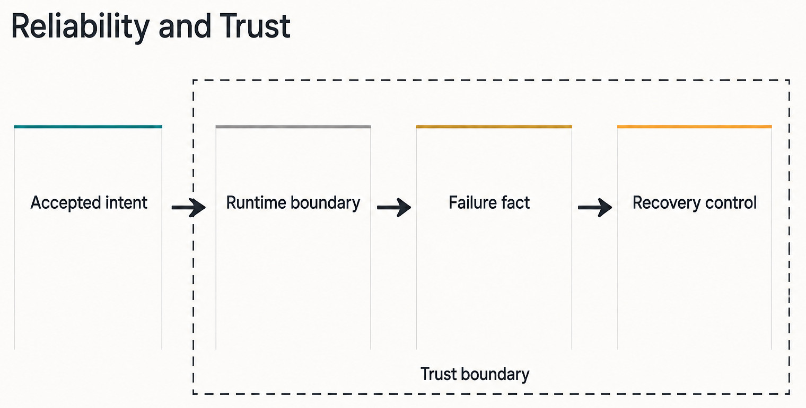
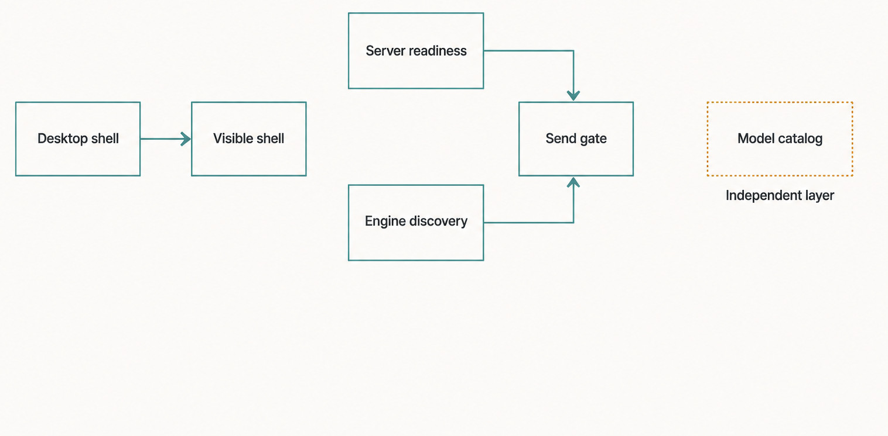
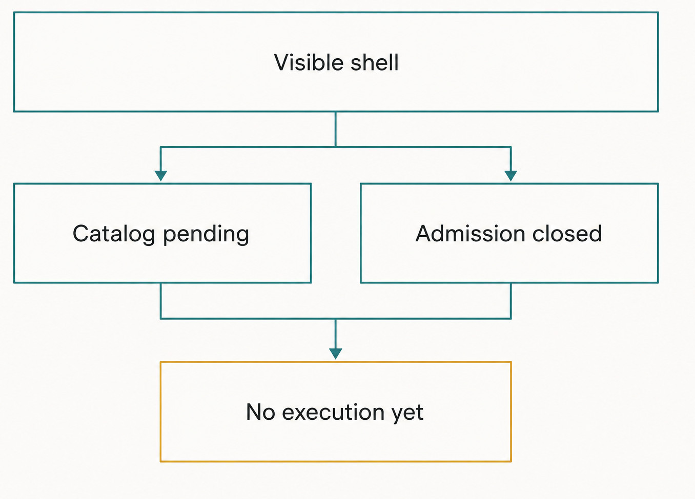
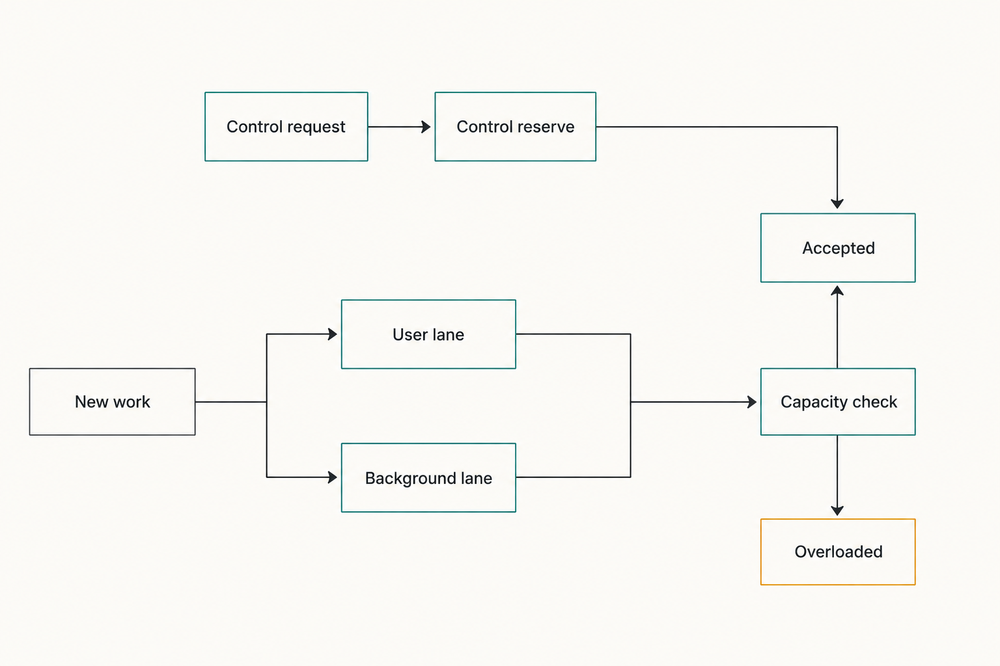

# Chapter 43 — Startup and Admission {#chapter-43}

## The question

The Haros window can appear before every model catalog has finished loading. The server can listen
before it accepts Product Orchestration commands. A selected Engine can be visible before it is
usable. So what does “ready” actually mean?

There is no single honest readiness bit. Haros uses layered readiness because each layer protects a
different promise:

> **The shell may be paintable before work is admissible; work may be admissible before every
> optional catalog is warm; a specific Turn may start only when its exact Engine, model, modes, and
> resources pass admission.**

This chapter separates presentation readiness, transport readiness, command readiness, Engine
discovery, send admission, and domain admission. Those layers should converge quickly in a healthy
startup, but treating them as identical would either block the entire product on optional work or
let commands race recovery.

Haros is a source alpha at the pinned edition. The exact ordering and time budgets described here
are implementation facts verified at commit `29b2b39…`, not an installer or availability promise.

_Part VI opener — Reliability starts by separating accepted intent from runtime evidence and recovery control._

**Accessible equivalent.** `Accepted intent` enters a labeled `Trust boundary`. Inside that boundary,
`Runtime boundary` points to `Failure fact`, then `Recovery control`. The sequence explains the
Part's subject without claiming that acceptance guarantees execution.

## A ladder, not a light switch

The Desktop shell owns the first native window and backend process. The server owns local state,
recovery, transports, and execution services. The Web workbench owns browser presentation and
Composer interaction. Engine discovery owners inspect runtime/model availability. Product
Orchestration owns command acceptance.

Each owner can declare only its own layer ready.

| Readiness layer         | Owner                                                   | What “ready” means                                                                         | What it does not prove                          |
| ----------------------- | ------------------------------------------------------- | ------------------------------------------------------------------------------------------ | ----------------------------------------------- |
| Desktop presentation    | Desktop process                                         | A window may show the bounded startup surface                                              | Server command admission or Engine availability |
| HTTP/transport          | Server listener and Web transport                       | Routes/socket can carry typed requests                                                     | Startup recovery has completed                  |
| Projection/subscription | Server composition                                      | Orchestration reactors and required subscriptions are attached                             | A particular Engine is installed/authenticated  |
| Command readiness       | `ServerRuntimeStartup`                                  | Startup reconciliation gates are complete; queued commands may run                         | Every command will satisfy domain invariants    |
| Catalog readiness       | Engine discovery and Web catalog query                  | Selected Engine catalog is ready, empty, stale, or failed rather than indefinitely unknown | Engine health allows Send                       |
| Send admission          | Shared Engine availability gate plus Composer preflight | Current Engine is available and authenticated; exact content/binding is sendable           | Engine launch or Turn completion                |
| Domain admission        | Product Orchestration and capability owners             | The exact typed transition is accepted and persisted                                       | Successful downstream execution                 |

The full startup presentation is claimed once per Desktop process. Later windows skip the long
presentation rather than each pretending the whole application is cold. Pre-React startup pages use
a deliberately bounded system light/dark palette and locale choice; they do not own the eventual
theme or product state.

The Web startup bridge waits for an open transport and settled server configuration/settings
queries. It does not hold the entire Desktop workbench behind model discovery. On a fresh install,
an Engine catalog may legitimately remain empty or require sign-in. That should affect the
Composer and setup guidance, not prevent access to Settings or existing local history.

_Figure 43.1 — A visible shell and an exact Send gate depend on different evidence._

**Accessible equivalent.** `Desktop shell` points to `Visible shell`. Separately, `Server readiness`
and `Engine discovery` converge on `Send gate`. `Model catalog` is shown as an `Independent layer`;
it neither blocks the visible shell nor substitutes for the Send gate.

## Server startup: listen early, admit mutations late

The server first validates remote-access policy, prepares settings and readiness services, starts
the bounded HTTP server, resolves its actual port, persists runtime connection state, and marks the
listener ready. The listener must exist so Desktop and Web can observe progress, but the presence of
a socket is not permission to mutate Product state.

After listening, the server creates a scope for long-lived subscribers and starts Product
Orchestration, automation, deletion, Engine reaping, and runtime reconciliation workers. It then
heals restart-orphaned Turns, reconciles reactor delivery ledgers, promotes eligible older queued
work, and recovers interrupted Git handoff operations. Only after those blocking startup steps does
it claim any private quit-resume record and mark command readiness.

The ordering is load-bearing. If commands were accepted before orphaned “running” Turns were
settled, a new user request could be judged against a Session that died with the previous process.
If queued work were promoted before stale Turns settled, promotion might see a false active owner.

`ServerRuntimeStartup` is a small explicit gate. While pending, `enqueueCommand` waits. When marked
ready, queued effects proceed. If startup fails, queued commands receive the startup error instead
of waiting forever. The state transition is one-way and idempotent: repeated ready or failure calls
do not rewrite the first terminal decision.

Waiting is different from accepting. A request parked behind the startup gate has not yet earned a
Product receipt merely because its transport connection is open. The client must keep the original
command identity and avoid sending replacement requests while startup converges. Once released,
the command still passes ordinary queue capacity, fingerprint, lifecycle, and domain invariants.
Readiness removes one reason to wait; it does not preapprove the transition.

Early listening is useful only because observation remains narrower than mutation. Desktop can
learn the chosen port, Web can establish transport state, and diagnostics can describe a startup
block without allowing an un-reconciled Turn to change. Any route available during this interval
must respect that distinction. Adding a convenience mutation that bypasses `enqueueCommand` would
turn the listener into a second command gate and reintroduce the race the startup owner prevents.

This structure also gives failure a bounded destination. If required composition fails after the
socket opens, the gate resolves with the startup error and waiters stop waiting. The listener's
brief existence does not convert partial initialization into readiness. Desktop presentation can
then classify a known database or migration block, while unknown failures remain unknown rather
than being rewritten into a reassuring but false setup state.

| Server phase                        | Work performed                                                 | Commands                                                    | Failure treatment                                                              |
| ----------------------------------- | -------------------------------------------------------------- | ----------------------------------------------------------- | ------------------------------------------------------------------------------ |
| Configuration and access validation | Private paths, settings, remote-bind rules                     | Not admitted                                                | Fail startup; do not open unsafe exposure                                      |
| HTTP listen                         | Bind server, resolve dynamic port, publish runtime state       | Transport reachable; mutations still gated                  | Desktop sees a startup failure/block                                           |
| Subscriber attach                   | Start Orchestration and lifecycle reactors                     | Still gated                                                 | Do not expose stale projections as command-ready                               |
| Reconciliation                      | Settle dead Turns, pending interactions, queued work, handoffs | Still gated                                                 | Contain per-item cleanup where designed; fatal composition errors fail startup |
| Command-ready                       | Resolve startup gate                                           | New and waiting commands execute through ordinary admission | Typed rejection remains possible                                               |
| Welcome/ready publication           | Notify connected surfaces                                      | No new authority is created                                 | Presentation can recover through transport state                               |

Some recovery is intentionally best-effort and logged—for example, one Thread's stale-detail
hydration failure should not necessarily prevent every other Thread from returning. That does not
mean the server calls all failures success. Database lifecycle locks, exhausted migration recovery,
unsafe remote policy, or inability to establish required composition are startup blocks.

## Desktop readiness and startup blocks

The Desktop process may receive an explicit “listening” promise from the child backend. It also has
an HTTP readiness probe for configurations where that signal is absent. `waitForBackendStartupReady`
races them and cancels the losing HTTP wait when the listening signal wins. A failed listening
promise rejects startup rather than being masked by a later poll.

Backend output is inspected only for known, user-actionable startup blocks. A live database owner
produces a database-lock classification. An exhausted or unreadable migration recovery marker
produces a migration-recovery-required classification. Unrelated crashes remain failures, not
misleading recovery dialogs.

The detector retains a bounded tail of output and recognizes markers split across chunks. This is a
presentation classifier; the server's database lifecycle and migration owners remain authoritative.
Desktop does not parse arbitrary error text into a new storage protocol.

## Engine discovery is not Send admission

Engine, model, and option selection are related but different. `ENGINE_DESCRIPTORS` is the only
owner of Engine identity and Settings discovery. A catalog query answers which model descriptors
and options the selected Engine currently exposes. Its Web state distinguishes checking, ready,
empty, stale, and error.

A catalog can contain last-good data while refresh fails; that is `stale`, not proof that a Send
will work. Conversely, a missing health result is not treated as usable merely because a static
model label exists. Engine health separately owns whether the selected Engine is available and not
unauthenticated.

Before blocking Send on a missing, unavailable, or unauthenticated status, the shared availability
helper performs one silent refresh. This reduces false refusal from a stale health snapshot without
turning Send into an unbounded retry loop. If the refreshed status is still unusable, the Composer
retains the request and surfaces an explicit reason. It does not silently choose another Engine.

Discovery itself is demand-aware. The selected Engine stays authoritative. Other catalogs may
prefetch when the picker is open. Stock Pi native discovery requires explicit browsing or selection
rather than treating the whole picker as consent to inspect its private state. Agent/mode discovery
is secondary to model discovery so it does not occupy both expensive-read lanes and delay the
send-critical catalog.

| Condition at Send                    | Admission decision                                              | Preserved user fact                   | Recovery                                                    |
| ------------------------------------ | --------------------------------------------------------------- | ------------------------------------- | ----------------------------------------------------------- |
| Exact Engine/model selection missing | Refuse before dispatch                                          | Composer content and references       | Choose an exact selection                                   |
| Engine health still loading          | One bounded refresh, then refuse if still unknown               | Draft and selected intent             | Wait, inspect setup, or retry after health settles          |
| Engine unauthenticated/unavailable   | Refuse with explicit reason                                     | No Engine substitution; draft remains | Authenticate, install, or repair the selected Engine        |
| Catalog stale but health usable      | Allow only if exact selected binding remains structurally valid | Exact admitted selection              | Refresh catalog for later choices; do not rewrite this Send |
| Unsupported runtime/interaction mode | Refuse in preflight or server admission                         | Prompt and chosen intent              | Select a supported mode explicitly                          |
| Domain invariant fails               | Typed command rejection; no accepted event                      | Existing Product Thread state         | Correct the conflicting state/input                         |
| Engine launch fails after acceptance | Accepted prompt, Queue, binding, and failure facts              | Product state survives                | Explicit retry/recovery; never silent Engine fallback       |

Catalog state should therefore guide choice; health gates execution; Product Orchestration admits the
exact command. No one layer should impersonate the others.

## Worked example: first Send after a restart

Suppose Haros restarts while Thread T previously showed a running Turn. The user sees the window and
immediately tries to send “Continue by running the focused test.”

1. Desktop can paint the startup surface while the backend binds. That paint does not yet enable
   Product mutation.
2. The HTTP server listens, and the Web transport may connect. An incoming dispatch passes through
   `runtimeStartup.enqueueCommand`; if command readiness is pending, it waits.
3. Orchestration subscribers are already attached. Startup reconciliation finds T's old in-flight
   projection, settles stale pending approvals/user questions, and appends an interrupted Session
   fact with no active Turn.
4. Reactor ledgers and older queued work are reconciled. Only then does the server mark command
   readiness.
5. The waiting Send continues. The Composer has captured the selected Engine/model and structured
   context. The shared availability check refreshes health once if needed.
6. Product Orchestration now judges the command against the reconciled Thread. If accepted, it
   appends a start or Queue event and returns an accepted sequence. If rejected, the Web workbench
   restores or retains the draft rather than pretending the Turn started.
7. The selected adapter attempts launch. A launch failure becomes explicit runtime/product failure
   facts; it does not select a different Engine or reinterpret the old native Session as resumable.

The user experiences a single Send, but the system crosses several readiness layers. Waiting at the
command gate prevents a race without forcing the entire window to stay blank.

_Figure 43.2 — Presentation readiness can honestly expose pending execution prerequisites._

**Accessible equivalent.** `Visible shell` branches to `Catalog pending` and `Admission closed`.
Those two conditions converge on the amber statement `No execution yet`. The diagram distinguishes
what can be rendered from what may be executed.

## Admission also protects overload

Readiness says whether a service can work; admission also says whether it should accept more work
right now. The WebSocket server classifies unary requests into control, standard, Engine discovery,
and expensive-read lanes. Each client receives bounded independent capacity.

Product Orchestration has a second, separate admission owner for accepted commands. Its queues are
`control`, `user`, and `normal`; the last carries retention, projection, and other background work.
Only control commands may consume the reserved tail of total capacity. User and normal/background
work pass the ordinary capacity check and may be refused as overloaded. This is not the WebSocket
four-class budget described above: one bounds Product commands, while the other bounds per-client
transport requests.

_Figure 43.3 — Product Orchestration preserves a control path when ordinary command capacity is full._

**Accessible equivalent.** `Control request` points to `Control reserve` and then directly to
`Accepted`, bypassing the ordinary check. `New work` branches to `User lane` and `Background lane`;
both enter `Capacity check`, which branches to `Accepted` or `Overloaded`. Here Background lane is
the source's `normal` queue, described by its background-work responsibility.

Control requests have their own lane so Stop, terminal acknowledgement, or a reconciliation command
does not wait behind expensive diff and snapshot reads. Engine discovery has a separate small lane
so cold shell restoration cannot strand model truth. Capacity refusal is typed and retryable, with a
short retry hint. The lease releases on success, failure, or interruption.

Streaming requests have their own per-client total and Thread limits, discussed in Chapter 42.
These budgets are current implementation details. The durable design rule is that overload must be
bounded, visible, and must preserve a path to regain control.

## What can go wrong—and what the user should infer

| Symptom                                  | Likely boundary                                           | What remains safe                           | Correct next evidence or action                                            |
| ---------------------------------------- | --------------------------------------------------------- | ------------------------------------------- | -------------------------------------------------------------------------- |
| Window appears but Composer is not ready | Presentation ahead of transport/settings                  | Local state and startup surface             | Wait for transport/config settlement; inspect startup error if it persists |
| Server reachable but Send waits          | Command gate still reconciling                            | Prompt is not yet claimed as accepted       | Let startup complete; do not duplicate the request                         |
| Model picker says checking/empty/error   | Catalog discovery                                         | Product Thread and other surfaces           | Inspect the selected Engine setup or choose an explicit available model    |
| Send says Engine unavailable             | Health/auth gate after bounded refresh                    | Draft and exact selection                   | Repair that Engine; do not expect fallback                                 |
| Capacity error during heavy reads        | Request/stream admission                                  | Existing durable state                      | Retry after the hint; reduce simultaneous views                            |
| Database locked                          | Database lifecycle startup block                          | Existing database untouched by this process | Close the verified owner process, then restart                             |
| Migration recovery required              | Bounded automatic resume is exhausted or marker untrusted | Pre-migration backup/marker                 | Use the explicit Desktop recovery flow; do not keep relaunching blindly    |
| Accepted request later errors            | Runtime launch/execution boundary                         | Accepted Product facts and binding          | Read Timeline/failure details; make an explicit retry decision             |

“Ready enough to render” is not “ready to execute.” “Admitted” is not “completed.” Keeping those
sentences distinct turns vague startup complaints into actionable boundary reports.

## Try it safely

Use the focused unit tests; do not stop a real server or touch a real database.

1. In `serverRuntimeStartup.test.ts`, follow a command queued before `markCommandReady`. Confirm its
   effect does not run early, then inspect the failure-gate case.
2. In `backendStartupReadiness.test.ts`, compare readiness from an explicit listening signal with
   readiness from HTTP polling.
3. In `startupReadiness.test.ts`, classify `ready`, `empty`, `stale`, and `error` as terminal catalog
   states and explain why `checking` is different.
4. In `engineAvailability.test.ts`, trace a missing health status through the one bounded refresh
   before refusal.

The observable result is a readiness ladder annotated with the first safe point for rendering,
transport, commands, model choice, and one exact Send. No external Engine or private state is used.

## Recap

1. Haros has layered readiness; one global boolean would either block too much or admit too early.
2. The server can listen before command readiness so progress is observable while recovery remains
   protected.
3. Engine catalog truth guides selection, Engine health gates Send, and Product Orchestration admits
   the exact command.
4. Bounded request lanes keep expensive reads from starving control and discovery.
5. Admission preserves the prompt and exact Engine choice on failure; it never silently substitutes
   execution.

## Check your model

1. **Why can the Web window appear before model discovery finishes?**  
   Model discovery is optional, Engine-specific work. Blocking all local history and Settings on it
   would confuse presentation readiness with execution readiness.

2. **What is the key difference between command-ready and Engine-ready?**  
   Command-ready means startup recovery no longer makes Product mutation unsafe. Engine-ready means
   one selected runtime is available/authenticated; domain admission must still accept the command.

3. **If Send is accepted and Engine launch fails, may Haros choose another Engine?**  
   No. The admitted binding is preserved and failure is explicit. A different Engine requires a new
   user decision.

## Source trail

- `apps/server/src/effectServer.ts` owns the startup order from policy validation and listen through
  subscriptions, reconciliation, command readiness, and lifecycle publication.
- `apps/server/src/serverRuntimeStartup.ts` owns the one-way command gate; its focused tests prove
  waiting and terminal failure.
- `apps/server/src/orchestration/startupTurnReconciliation.ts` supplies the restart cleanup that
  must precede ordinary commands.
- `packages/shared/src/engineMetadata.ts` owns `ENGINE_DESCRIPTORS`; this chapter consumes that
  identity projection but does not create another Engine list.
- `apps/desktop/src/backendStartupReadiness.ts` and `backendStartupBlock.ts` own Desktop observation
  and classification, not server recovery semantics.
- `apps/web/src/startup/startupReadiness.ts`, `useEngineModelCatalog.ts`, and
  `lib/engineAvailability.ts` distinguish shell presentation, catalog terminality, and Send health.
- `apps/server/src/wsRequestAdmission.ts` owns per-client request-class capacity; focused tests prove
  control and Engine-discovery isolation.
- `apps/server/src/orchestration/orchestrationAdmission.ts` separately owns control, user, and normal
  Product command lanes plus the control reserve.

<!-- guide-navigation:start -->

[Guidebook contents](../README.md) · [Previous: Streaming, Synchronization, and Backpressure](../part-05-architecture/42-streaming-synchronization-backpressure.md) · [Next: Failure, Cancellation, Timeout, and Idempotency](44-failure-cancellation-timeout-idempotency.md)

<!-- guide-navigation:end -->
