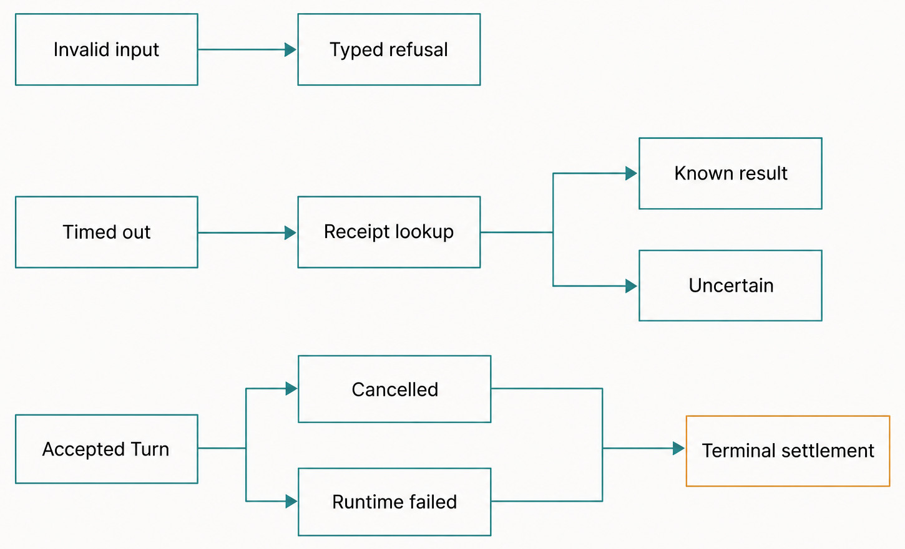
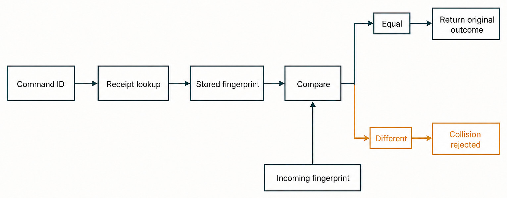
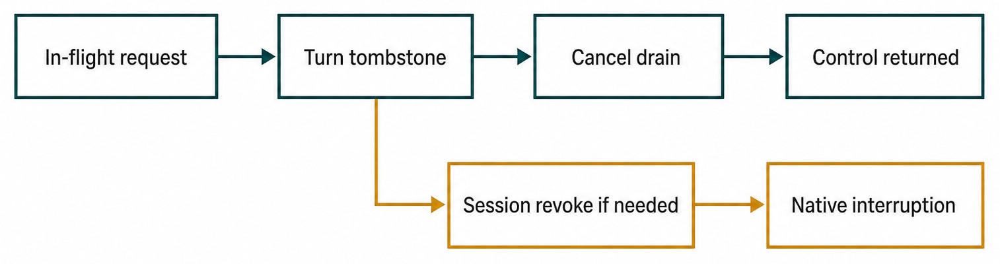

# Chapter 44 — Failure, Cancellation, Timeout, and Idempotency {#chapter-44}

## The question

When a Haros operation fails or times out, how can you tell whether nothing happened, something
committed, execution is still draining, or a retry would duplicate work?

Those outcomes are not interchangeable. A timeout describes what one caller stopped waiting for;
it does not prove the operation stopped. Cancellation requests work to stop; it does not undo prior
side effects. A failure can occur before admission, during a transaction, after durable commit, or
inside replaceable Engine execution. Idempotency connects a retry to one logical intent, but only
when identity and content match.

The reliable mental model is:

> **Locate the failure boundary, inspect the durable receipt or lifecycle state, settle authority,
> and retry only with the original identity when the original intent is unchanged.**

This chapter uses Product Orchestration and HostGateway examples because they expose the full
pattern. Individual file, Git, terminal, browser, device, and external-service operations retain
their own side-effect and rollback semantics.

## First classify the boundary

“The request failed” says too little. Before admission, no Product event exists. During a durable
transaction, the command must not report partial acceptance. After commit but before a response,
the correct repair is receipt lookup or synchronization—not a new command. During Engine execution,
the prompt and Product facts can survive even though the native operation errors.

| Boundary              | Evidence of success                                    | If it fails                                 | Safe retry question                                             |
| --------------------- | ------------------------------------------------------ | ------------------------------------------- | --------------------------------------------------------------- |
| Decode/preflight      | Valid typed input and exact selection                  | No command admitted                         | Can the input be corrected without claiming earlier acceptance? |
| Queue admission       | Command envelope accepted within capacity              | Typed overload/stopped refusal              | Has any receipt been created? Usually no                        |
| Decision/transaction  | Events, hot projections, and command receipt commit    | Transaction rolls back or reconciles        | Does the original command ID have a stored outcome?             |
| Durable publication   | Committed events reach subscribers                     | Client may disconnect or lag                | Can the client resnapshot instead of redispatch?                |
| Engine launch/runtime | Runtime facts and terminal Session/Turn state          | Error or interruption after accepted intent | Are side effects and native Session state known?                |
| Local/external tool   | Capability-specific result or durable operation record | May be partial or uncertain                 | Is the tool declared and actually implemented as idempotent?    |

Failure recovery begins with evidence, not optimism. If the command receipt says accepted, a new
command ID asks for new work. If no receipt exists because the command timed out before the worker
started, the original identity can be retried. If a browser click returned after the Turn was
cancelled, inspect its result and visible page state; Product Orchestration cannot reverse it.

_Figure 44.1 — The boundary determines whether refusal, uncertainty resolution, or terminal settlement is appropriate._

**Accessible equivalent.** `Invalid input` points to `Typed refusal`. `Timed out` points to
`Receipt lookup`, which branches to `Known result` and `Uncertain`. Separately, `Accepted Turn`
branches to `Cancelled` and `Runtime failed`; both outcomes then point to `Terminal settlement`.
Invalid input and timeout therefore do not bypass their own evidence paths.

## Idempotency means same identity and same intent

Product Orchestration serializes commands and persists receipts. A command ID is an idempotency
identity, not a mutable slot. The server fingerprints authoritative command content while excluding
the command ID itself. When an equal retry arrives, the existing accepted sequence or rejection is
returned. When the same ID carries different authoritative content, Haros reports an identity
collision.

That content check matters. Without it, a caller could retry `cmd-7` with a different prompt and
silently attach two meanings to one receipt. Attachments receive an extra ownership check on an
accepted Turn retry: the same IDs must still be claimed by the same principal, Thread, and message.
Changing the bytes or their owner is not an equal retry merely because the JSON looks similar.

An invariant rejection can also receive a rejected receipt. Repeating the same impossible command
does not re-run it against a later state and unexpectedly succeed. A caller that intends a new
decision after state changes should issue a new command ID.

This yields a practical retry test with three questions. First, is the logical intent unchanged?
Second, can the caller reproduce the same authoritative content and attachment ownership? Third,
is the original command identity still available? Only three “yes” answers describe an equal
retry. If the user edited the prompt, selected a different Engine, changed a target, or deliberately
responded to new state, the operation is new intent and needs a new identity.

Idempotency also has a boundary. A Product command receipt deduplicates the Product transition it
owns. It cannot automatically deduplicate an arbitrary external service call performed later by an
Engine. That later capability needs its own idempotency key, durable operation owner, or explicit
uncertainty treatment. Reusing the Product command ID everywhere without a defined contract merely
makes unrelated namespaces look coordinated.

HostGateway child-creation operations add a narrower rule: one exact creation plan per active caller
Turn. Equal request and fingerprint replay the operation; a different request ID in the same Turn
locks; a reused ID with changed content conflicts. That prevents a timeout-retry loop from spawning
replacement tasks.

_Figure 44.2 — An idempotent retry reuses the first durable outcome; it does not create a replacement receipt._

**Accessible equivalent.** `Command ID` points to `Receipt lookup`, then `Stored fingerprint`, then
`Compare`. `Incoming fingerprint` enters the same comparison. The `Equal` branch reaches `Return
original outcome`; the `Different` branch reaches `Collision rejected`. Original outcome means the
accepted sequence or typed rejection represented by the stored receipt, not the receipt row itself.

## Timeouts do not all mean the same thing

The pinned Orchestration dispatch budget is 45 seconds. This is an alpha implementation detail.
What matters is how the worker distinguishes queued from in-flight work when the deadline expires.

If the envelope is still queued, the caller marks it abandoned and receives a timeout. The worker
will skip abandoned work instead of starting it later. If processing already began, the caller does
not interrupt the critical section merely because the wall-clock budget elapsed. It waits for the
result while the worker completes or resolves the durable outcome.

Inside processing, a timeout triggers receipt lookup. If an accepted receipt exists, Haros returns
the accepted result. If a rejected receipt exists, it returns the stored rejection. If no outcome
exists, the timeout remains uncertain from the caller's perspective. Once committed publication
begins, publication is uninterruptible: letting a deadline cut the event bus halfway would leave
live consumers behind durable history.

| Timeout location                          | Current behavior                        | Durable interpretation                     | Caller response                                      |
| ----------------------------------------- | --------------------------------------- | ------------------------------------------ | ---------------------------------------------------- |
| Before worker starts                      | Mark queued envelope abandoned          | No command processing should begin later   | Timeout; equal intent may retry with evidence check  |
| During in-flight command                  | Wait beyond nominal queue budget        | Critical processing may commit             | Await result; do not launch a duplicate              |
| Processing deadline with accepted receipt | Resolve stored accepted sequence        | Command committed                          | Return original result                               |
| Processing deadline with rejected receipt | Resolve stored rejection                | Command was durably rejected               | Return original rejection                            |
| No receipt after bounded resolution       | Report timeout                          | Outcome not proven                         | Inspect state/receipt before choosing a new identity |
| Tool or network deadline                  | Owner-specific cancellation/uncertainty | Product command may or may not be involved | Follow the tool's receipt and side-effect semantics  |

This approach is more conservative than “timeout means cancel everything.” It protects atomicity
and makes late success observable. It also places a responsibility on clients: they must preserve
command identity through an equal retry.

It also keeps diagnosis honest. Queue telemetry can explain an abandoned command without implying
an Engine failure, while an in-flight command must resolve through its receipt and terminal
lifecycle facts. A UI may stop showing a spinner at its own deadline, but it still needs a
synchronization path that can discover the eventual accepted or rejected outcome.

## Cancellation retires future authority

An Interrupt is a Product command that records stop intent. The Engine adapter maps it to native
cancellation. HostGateway separately cancels local tool calls belonging to the exact Turn, because
an MCP client may omit its own cancellation notification.

The gateway keeps in-flight requests keyed by Session, Turn, and JSON-RPC request ID. Cancelling a
Turn first records a tombstone. Any matching request already registered is interrupted; a racing
request is cancelled as it registers and its handler stays behind a start barrier. The Session
bearer is revoked before native interruption when needed, so late calls cannot escape into another
Turn.

Engine-native interruption and gateway drainage proceed concurrently. The adapter preserves the
Engine's actual interrupt result, but waits on a short gateway barrier so tool abort signals and
finalizers can run. The current drainage wait is bounded at two seconds; a cleanup failure is logged
rather than suppressing the Engine stop. A background child without an exact parent Turn requires
Session revocation, because narrower authority cannot be proven.

This is cancellation, not rollback. A file already written remains written. A Git commit remains a
commit. A task whose creation operation reached `completed` stays committed even if the MCP request
fiber is interrupted immediately afterward. Recovery must distinguish “request stopped” from
“effect did not occur.”

_Figure 44.3 — The mandatory drain path and the conditional Session-revocation path remain distinct._

**Accessible equivalent.** The main path is `In-flight request` to `Turn tombstone`, `Cancel drain`,
and `Control returned`. A separate branch leaves `Turn tombstone` for `Session revoke if needed`
and then `Native interruption`. Revocation is not drawn as a mandatory step after every drain;
native interruption and gateway drainage may proceed concurrently under the shared tombstone.

## Lifecycle generations reject stale answers

Approvals and structured user questions add another race. The UI can display request R from one
native Engine lifecycle. The Engine may restart and produce a new R-like request before an old
response arrives. Matching only by Thread or request label could send the answer into the wrong
runtime.

The durable pending-interaction row carries interaction kind, request ID, Turn, lifecycle
generation, status, response command identity, and settlement. Claiming a response is atomic. The
reactor compares the generation supplied by the response path with the current durable row and
Engine lifecycle. A stale mismatch is rejected rather than delivered to the current Engine.

Not every delivery failure is terminal. A retryable settlement lets a later attempt reclaim the
interaction. An uncertain settlement records that the response may have crossed a boundary and
prevents the UI from claiming clean success. Orphaned `responding` claims can be reclaimed after
their bounded age so one crashed presenter cannot strand the prompt forever. Restart reconciliation
settles non-confirmed leftovers as stale.

Lifecycle generation is an implementation mechanism. The durable promise is that a human answer is
not silently applied to a different Engine request simply because identifiers look similar.

The response command has two observable stages: claiming the pending interaction and delivering the
answer through the current Engine lifecycle. Atomic claim prevents two presenters from both
believing they won. Settlement records whether delivery was confirmed, safely retryable, uncertain,
or stale. That vocabulary matters after a crash. A retryable claim can be reacquired under its
rules; an uncertain claim must not be advertised as cleanly undelivered; a stale claim belongs to a
generation that can no longer consume it.

The Web should render those owned states rather than maintain an independent “answered” boolean.
Otherwise a local click could hide the prompt even when the server rejected a stale generation, or
show it again after confirmed delivery. Optimistic feedback may acknowledge the click, but durable
pending-interaction projection decides whether authority remains available.

## Overload must preserve the Stop path

The Orchestration command owner uses three priority lanes: control, direct user work, and normal
background commands. The current overall queue capacity is 256 with 32 slots reserved from
non-control admission. Those values are edition-pinned budgets.

Interrupt, task stop/background, approval and user-input responses, Session stop/set, completion,
and other settlement commands may use reserved admission. They also remain admissible while the
engine is quiescing because they can only bring existing work closer to idle. A command that starts
new work must not enter that set.

The worker drains control before user, and user before normal work. One poisoned command is caught
per envelope, its outstanding count is released in a finalizer, and the worker continues. Otherwise
a synchronous defect could leak the idle counter, make shutdown drain hang, and wedge every later
command.

## Worked incident: lost response after Send

Assume a client dispatches `cmd-A` to start a Turn. The transaction commits the user message,
start-request event, hot projection, and accepted receipt at sequence 500. Before the WebSocket
response reaches the client, the connection drops.

1. The client still has local intent but no response. It reconnects and synchronizes the Thread.
2. The snapshot or replay shows the accepted message/Turn at or after sequence 500. That is enough
   to avoid redispatch.
3. If synchronization is temporarily unavailable, the client may retry `cmd-A` with identical
   content. The fingerprint matches, so the server returns the original accepted result.
4. Retrying `cmd-A` with edited text is rejected as an identity collision. The edit is new intent
   and needs a new command.
5. If the user Interrupts while the Engine is running a browser tool, Product Orchestration records
   the interrupt request, the adapter cancels native execution, and HostGateway tombstones the exact
   Turn and drains the tool request.
6. If the browser navigation already completed, it remains. Terminal settlement says the Turn was
   interrupted, not that every external effect was reversed.
7. A late approval response bearing an old lifecycle generation is rejected. The current prompt is
   not answered by accident.

This incident has one accepted Product command, one eventual terminal Turn, and possibly one
completed browser side effect. “The connection failed” does not merge those facts.

## Failure and recovery matrix

| Failure                            | Preserved fact                                             | Settlement/recovery                                        | Non-guarantee                                  |
| ---------------------------------- | ---------------------------------------------------------- | ---------------------------------------------------------- | ---------------------------------------------- |
| Preflight or invariant rejection   | Draft/input; rejected receipt when applicable              | Correct input; new ID for genuinely new intent             | No accepted Product event                      |
| Queue overload                     | Existing commands and reserved control capacity            | Retry after capacity returns                               | Background work cannot starve Stop forever     |
| Client loses accepted response     | Receipt, events, projections                               | Resync or equal retry with same ID/content                 | New ID is not deduplication                    |
| Engine launch/runtime error        | Prompt, admitted binding, Product Thread history           | Append explicit error/interrupted facts                    | Native Session continuation or Engine fallback |
| Interrupt races a HostGateway call | Turn tombstone, in-flight registry, completed side effects | Drain/cancel, then inspect receipts/state                  | Rollback of prior effects                      |
| Stale approval/user-input response | Current generation and durable pending row                 | Reject stale response; answer current request explicitly   | Applying answer to replacement lifecycle       |
| Worker defect                      | Other queued envelopes and reconciled read model           | Fail affected command, release outstanding count, continue | Pretending the poisoned command succeeded      |
| Shutdown quiesce                   | Reserved settlement commands                               | Drain admitted work through ordered shutdown               | Starting new work during teardown              |

The matrix is deliberately evidence-oriented. “Try again” is appropriate only after the row tells
you what identity and state survived.

## Try it safely

Use focused tests and no real side effects.

1. Read the equal-retry and command-ID collision cases in
   `OrchestrationEngine.integration.test.ts`. List which fields change the fingerprint.
2. In `orchestrationAdmission.test.ts`, fill the non-control budget and confirm a control command
   can still enter while a new Turn start is refused.
3. In `sessionLease.test.ts`, trace the order of Turn tombstone, bearer release, native interrupt,
   and gateway drainage.
4. Find a pending-interaction test with `generation-current` and `generation-stale`. Explain why the
   stale response cannot settle the durable row.

The observable result is a retry decision sheet: same ID, new ID, resnapshot, or do not retry. No
Engine process, live browser, or user credential is required.

## Recap

1. Failure location determines whether no work, committed work, or uncertain side effects survive.
2. Idempotency requires one identity and the same authoritative content; an ID is not mutable.
3. A timeout ends waiting at a boundary; it does not automatically cancel or roll back execution.
4. Cancellation retires exact-Turn authority and drains requests while preserving honest native
   settlement.
5. Reserved control admission and lifecycle generations keep recovery possible under overload and
   races.

## Check your model

1. **A command times out after processing began. Should the caller send a new command ID?**  
   Not immediately. In-flight work may commit. Resolve the original receipt or synchronized state;
   use the same ID only for an equal retry.

2. **Does an interrupted Turn prove its browser and file actions were reversed?**  
   No. Interruption settles execution authority. Already completed side effects require their own
   evidence and explicit reversal if supported.

3. **Why carry a lifecycle generation on an approval response?**  
   To prove the answer belongs to the exact Engine request lifecycle, not a replacement request that
   happens to look similar.

## Source trail

- `apps/server/src/orchestration/orchestrationAdmission.ts` owns lane priority, bounded admission,
  and the reserved settlement set.
- `commandFingerprint.ts`, `OrchestrationCommandReceipts.ts`, and
  `Layers/OrchestrationEngine.ts` own equal retry, identity collision, timeout resolution, worker
  containment, and durable publication.
- `ProjectionPendingInteractions.ts` and `Layers/EngineCommandReactor.ts` own atomic human-response
  claims, lifecycle-generation checks, and retryable/uncertain settlement.
- `apps/server/src/hostGateway/inFlightRequestRegistry.ts` and `sessionLease.ts` own exact-Turn tool
  cancellation and the Engine/gateway drainage barrier.
- `apps/server/src/hostGateway/creationCoordinator.ts` owns the per-caller-Turn creation-plan lock,
  request/fingerprint replay, conflict detection, and compensating durable operation.
- `apps/server/src/effectServer.ts#closeServerRuntimePipeline` shows why quiesce, drain, runtime
  close, subscription close, and stop remain ordered during shutdown.
- Focused evidence includes `OrchestrationEngine.integration.test.ts`,
  `orchestrationAdmission.test.ts`, `commandFingerprint.test.ts`, `sessionLease.test.ts`, and the
  interaction/interrupt cases in `EngineCommandReactor.integration.test.ts`.

<!-- guide-navigation:start -->

[Guidebook contents](../README.md) · [Previous: Startup and Admission](43-startup-admission.md) · [Next: Restart, Quit, and Recovery](45-restart-quit-recovery.md)

<!-- guide-navigation:end -->
