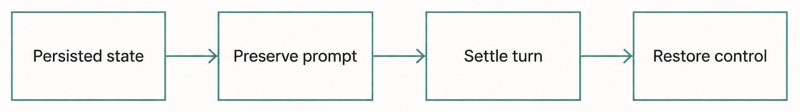
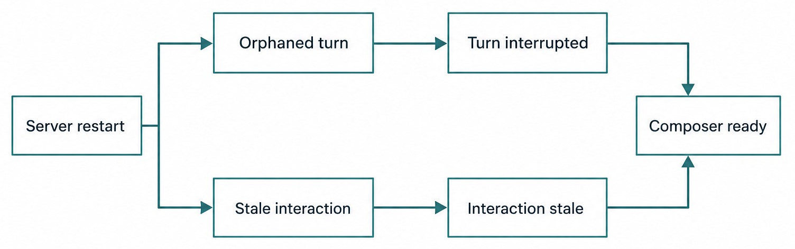
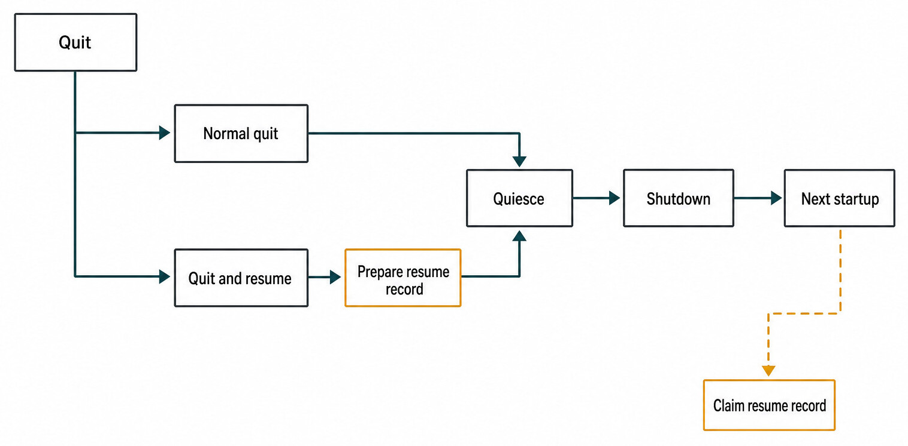
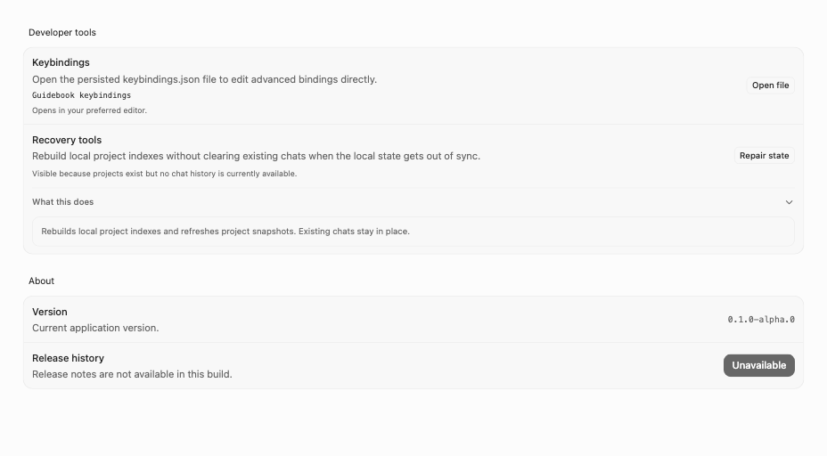

# Chapter 45 — Restart, Quit, and Recovery {#chapter-45}

## The question

A process disappears while a Turn is running. On the next launch, should Haros continue the native
Engine Session, start new work, mark the old Turn interrupted, restore a database backup, or wait
for the operator?

There is no universal “resume.” Each durable fact has an owner and each volatile resource has a
lifetime. Product Threads survive a process restart because they live in Product State. Native
Engine processes, in-memory HostGateway credentials, open sockets, and process-local cancellation
registries do not. A database migration has yet another recovery protocol because an interrupted
schema change can prevent Product State from opening at all.

The governing rule is:

> **Recover durable truth first, close facts that cannot still be true, and create fresh work only
> through an explicit, one-shot recovery intent. Never manufacture native Session continuity.**

This chapter separates ordinary startup reconciliation, user-approved quit-and-resume, orderly
shutdown, and migration recovery. They may occur near the same launch, but combining them into one
generic retry loop would erase important safety boundaries.

Haros is a source alpha at this edition. The file formats, limits, and sequencing below describe the
pinned implementation, not a compatibility promise for future releases.

## Four different recovery problems

“The app restarted” can hide several different histories. The correct action depends on what was
durable before the process ended and whether a human explicitly asked for replacement work.

| Situation                            | Durable evidence                                          | Lost process-local fact                                      | Correct recovery                                                             | Forbidden shortcut                                                |
| ------------------------------------ | --------------------------------------------------------- | ------------------------------------------------------------ | ---------------------------------------------------------------------------- | ----------------------------------------------------------------- |
| Unexpected server loss during a Turn | Product Thread, Turn, pending interactions, event history | Native process, active runtime, exact-Turn gateway authority | Settle stale requests and mark the Turn/Session interrupted                  | Pretend the old native Session is still executing                 |
| User chooses quit and resume         | The above plus a private one-shot quit record             | Old runtime and credentials                                  | Reconcile old work, claim record once, then dispatch fresh replacement Turns | Copy a native Session ID into a new Engine or replay indefinitely |
| Orderly quit without resume          | Product facts plus completed shutdown writes              | All live execution resources                                 | Drain bounded pipelines and start later from reconciled Product State        | Exit immediately after closing the window                         |
| Interrupted database migration       | Private backup and recovery marker                        | Partially completed migration attempt                        | Resume within a bounded budget or require explicit restore                   | Start normal services against uncertain schema state              |

_Figure 45.1 — Restart preserves durable Product truth while closing execution facts that cannot survive the process._

**Accessible equivalent.** `Persisted state` points to `Preserve prompt`, then `Settle turn`, then
`Restore control`. The path does not contain a native Engine Session continuation.

The first distinction is Product Thread versus native Engine Session. A Thread is Haros-owned
history. A Session is Engine-owned continuity. Event replay can reconstruct the Product projection;
it cannot resurrect a dead child process or prove that a remote Engine kept a compatible Session.
This is why restart reconciliation records interruption instead of inventing continuation.

The second distinction is automatic repair versus new user work. Closing stale state is automatic
because it makes the projection truthful. Starting a fresh Turn after quit is authorized only by a
bounded record produced during the protected quit path. The record does not convert new work into
continuation; it remembers that the user requested a replacement.

## Startup reconciliation makes stale truth honest

At startup, persisted events rebuild projections exactly as written. That fidelity creates a
necessary problem: a Turn recorded as running before a crash will still project as running, even
though its in-memory runtime died with the old server. Event replay must not silently reinterpret
history. Instead, a reconciliation command appends new facts that explain the discontinuity.

`reconcileRestartStuckTurns` runs before normal command readiness. For each affected Thread, it plans
commands that settle stale approval, user-input, or checkpoint-revert requests, set the native
Session state to interrupted, and clear the active Turn. Within one startup plan, the injected
timestamp makes repair identities deterministic and receipt-safe. Across a later process launch,
replayed terminal facts prevent completed repairs from being planned again; any state still stale
receives a new bounded repair command.

A dangling active-Turn pointer is not permission to rewrite every status. If the terminal state
already reports an error and only the active pointer is stale, reconciliation preserves that error
while clearing the impossible active relationship. Recovery should add the minimum facts required
for consistency, not erase the most informative terminal outcome.

Pending interactions need explicit settlement because their UI and command authority otherwise
remain live. A restarted process cannot deliver the user's later approval to the old native
operation. Marking the request stale tells every projection and client the same thing: this request
belongs to an execution generation that no longer exists.

_Figure 45.2 — A restart closes each stale fact through its own truthful terminal classification._

**Accessible equivalent.** `Server restart` branches to `Orphaned turn` and `Stale interaction`.
The Turn branch continues to `Turn interrupted`; the interaction branch continues to
`Interaction stale`. Both paths then point to `Composer ready`. A stale interaction does not flow
through `Turn interrupted`.

Startup ordering matters. If ordinary commands became ready first, a new Turn could race a stale
active Turn, or a user could answer an approval whose executor is gone. Haros therefore reconstructs
state, attaches required services, performs reconciliation, and only then opens the command gate.
Chapter 43 describes that admission ladder in detail.

## Quit-and-resume is replacement, not resurrection

Desktop users sometimes want to quit while work is active and have Haros pick it up next time. The
safe implementation is deliberately narrow. The renderer reports eligible running work to the
Desktop quit guard. The user may cancel quitting, quit without resuming, or request quit and resume.
Only the last choice authorizes a one-shot recovery record.

The record is private local recovery state, not Product State and not a second source of truth. It
contains enough information to construct fresh Product commands after startup: exact Product
bindings, a bounded prompt, and sanitized Engine options. It does not store arbitrary paths,
endpoints, private directories, bearer credentials, or a promise that a native Session can be
continued.

Eligibility is intentionally conservative. At the pinned edition, a candidate must be a top-level
running Thread, not a subagent or HostGateway-only execution, and it must not be waiting on approval
or user input. Those excluded cases require human context or authority that a blind restart cannot
recreate. The exact binding is derived from durable Turn-start evidence instead of trusting a stale
renderer summary.

| Quit-resume property | Current bound or rule                               | Why it exists                                                | What exceeding it means                                          |
| -------------------- | --------------------------------------------------- | ------------------------------------------------------------ | ---------------------------------------------------------------- |
| Record ownership     | Protected shutdown writes; startup claims           | Prevents ordinary UI code from becoming a second owner       | Refuse ad hoc writers                                            |
| Consumption          | One claim, then no recreation of the claimed record | Prevents repeated launches from duplicating replacement work | A failed replacement remains visible as a normal Product failure |
| Thread count         | At most 256                                         | Bounds startup fan-out and private-file size                 | Additional candidates are not silently promised                  |
| Prompt length        | At most 2,000 characters                            | Prevents an unbounded recovery payload                       | Candidate must be rejected or represented safely before quit     |
| File permissions     | Private file mode `0600`                            | Limits local disclosure                                      | Treat a broader mode as a security defect                        |
| Engine data          | Sanitized safe options only                         | Avoids copying secrets and machine-specific authority        | Rediscover availability through normal owners                    |

At the next launch, startup first performs ordinary stale-Turn reconciliation. It then claims the
record and removes its ability to be claimed again. Replacement work is submitted asynchronously
after command readiness. Each replacement receives normal Product admission, current
`ENGINE_DESCRIPTORS` identity, current availability checks, and a new native execution lifetime.

If an Engine is missing, a workspace is unavailable, or a command is rejected, recovery records a
normal visible failure rather than recreating the private record. This is an important stop-loss.
One-shot means one attempt to translate the user's quit intent into fresh work, not an infinite
background promise.

## Worked example: quit during two running Threads

Suppose Mina has two Product Threads running. Thread A uses the Codex Engine and is producing code.
Thread B is paused at a user-input request asking which database to target. She chooses “Quit and
resume tasks.”

1. The Desktop quit guard obtains the renderer's current candidates. Thread A is eligible. Thread B
   is excluded because a pending user-input decision cannot be guessed after restart.
2. Protected shutdown asks the server to prepare the quit record. The server verifies Thread A
   against durable state and reads its exact Turn-start binding. It stores the bounded prompt and
   sanitized Engine options in a private file.
3. Shutdown seals new presenters and command paths, quiesces orchestration, drains accepted work,
   closes event delivery and related subscribers in order, and then permits process exit.
4. On the next launch, event replay reconstructs both Threads. Their old runtimes do not exist.
   Startup reconciliation marks stale active execution interrupted and settles Thread B's stale
   input request rather than leaving an actionable control on screen.
5. Startup claims the quit record once. After normal command readiness, it builds a fresh Turn
   command for Thread A. The current Engine descriptor and current workspace conditions apply.
6. If that command is accepted, Thread A shows a new Turn after the interrupted one. This visible
   break is truthful. If it fails because the Engine is unavailable, the failure is shown; relaunching
   does not secretly submit it again.

Nothing in this flow says that the old native Engine Session continued. The Product Thread retains
its history and can host the new Turn, but Engine-owned continuity is not fabricated. Switching the
replacement to another Engine would be an explicit new selection with different native semantics,
not a transparent recovery trick.

## Orderly shutdown is an admission protocol

Shutdown is not merely a final cleanup callback. It changes what the process may accept. Once
closing begins, new user work must not enter behind the drain boundary, while control operations
needed to settle already accepted work may still proceed.

The server pipeline seals presentation and incoming work, places Product Orchestration into
quiescing mode, drains work already accepted, closes runtime-event ingress, drains Git handoffs,
closes subscribers, drains again, cleans up, and stops. The exact implementation may evolve, but
the invariant is stable: owners stop accepting before their dependencies disappear, and accepted
facts receive a bounded opportunity to settle.

_Figure 45.3 — Shutdown closes admission in both cases; a resume record exists only after the explicit resume choice._

**Accessible equivalent.** `Quit` branches to `Normal quit` and `Quit and resume`. `Normal quit`
points to `Quiesce`; `Quit and resume` points to `Prepare resume record`, then `Quiesce`. The shared
path continues from `Quiesce` to `Shutdown` to `Next startup`. Only the resume branch conditionally
continues from `Next startup` to `Claim resume record`.

The Desktop guard covers window close and application quit. When a renderer is responsive, it can
present the active-work choice. If the renderer cannot answer, the pinned implementation fails open
after three seconds rather than trapping the operating-system quit forever. “Fail open” here does
not mean “pretend work resumed”; it means allow quitting without a renderer-confirmed resume
record. Startup reconciliation will still make surviving Product facts truthful.

An abrupt kill, power loss, or crash bypasses orderly shutdown entirely. Reliability therefore
cannot rely on cleanup having run. Durable receipts, event history, migration markers, and startup
reconciliation are the recovery foundation; shutdown reduces ambiguity but is not the only line of
defense.

## Migration recovery protects the database boundary

Schema migration occurs before ordinary Product services can safely use the database. Haros creates
a pre-migration backup and a private recovery marker around migration. If migration completes, the
marker is cleared. If the process dies, the next launch detects the marked attempt instead of taking
another backup from potentially partial state.

Resume attempts are bounded and charged before the retry begins. Charging first matters: a crash
during the retry still consumes an attempt. Otherwise every crash would reset the apparent budget
and create an infinite loop. A resumed migration reuses the existing backup relationship; it does
not bless current partial state by replacing the known-good backup.

| Recovery state                        | Automatic action                                             | User-visible consequence                                    | Required next evidence                                 |
| ------------------------------------- | ------------------------------------------------------------ | ----------------------------------------------------------- | ------------------------------------------------------ |
| No marker; migration required         | Validate space, create private backup/marker, run migration  | Normal bounded startup work                                 | Successful schema validation and marker removal        |
| Marker with retry budget              | Resume the marked migration; charge attempt before execution | Startup continues only if it succeeds                       | Marker cleared and database opens at expected schema   |
| Budget exhausted or marker unreadable | Enter recovery-required state                                | Desktop blocks normal startup with recovery guidance        | Explicit operator decision and valid artifact identity |
| Explicit restore selected             | Server-owned restore CLI runs under database lifecycle lock  | All Haros processes must be stopped; clean restart required | Backup validation, restored database, marker cleared   |
| Restore cannot be verified            | Keep normal startup blocked                                  | No speculative use of the database                          | Diagnose artifact/permissions; do not delete evidence  |

The Desktop recovery surface does not perform file surgery itself. It invokes the server-owned
restore command, which requires an absolute database path, validates the marked backup, acquires the
database lifecycle boundary, restores, verifies that the marker is cleared, and requests a clean
restart. Operators must stop all Haros processes because a second process holding the database can
invalidate the recovery assumption.

Do not “fix” a recovery-required state by deleting the marker. The marker is evidence that the
database and backup have a specific relationship. Removing it would allow ordinary startup to treat
uncertain state as clean. Preserve artifacts until the owned resume or restore path reports success.

_Real product capture — The production Recovery tools surface explains a bounded index repair and
keeps the action separate from destructive chat clearing or private Engine-state manipulation._

## Failure and recovery map

Recovery is easiest to reason about when each failure has an explicit terminal owner.

| Failure                             | What remains trustworthy                              | Recovery action                                        | What not to infer                                     |
| ----------------------------------- | ----------------------------------------------------- | ------------------------------------------------------ | ----------------------------------------------------- |
| Crash while native Turn runs        | Persisted Product events through last commit          | Reconcile stale Turn and interactions                  | Native process or HostGateway token survived          |
| Crash during startup reconciliation | Earlier receipts plus deterministic repair identities | Run reconciliation again                               | Every planned repair was absent                       |
| Crash after quit record claim       | Product history and any accepted replacement receipt  | Inspect normal Product outcome; do not recreate record | Relaunch should retry automatically                   |
| Renderer does not answer quit guard | Durable Product facts only                            | Allow bounded quit; reconcile next start               | User approved resume                                  |
| Engine missing on replacement       | Interrupted old Turn and visible replacement failure  | Let user repair availability and submit explicitly     | Product Thread can substitute another Engine silently |
| Migration retries exhausted         | Backup, marker, diagnostics                           | Block and require explicit restore/repair              | Database is safe because it opens as a file           |

HostGateway and Git handoff also have operation-specific recovery. Their durable operation owners
may compensate reserved resources or resume a known handoff. Those mechanisms do not authorize a
generic scan that retries every incomplete side effect. Each durable operation defines its own
state machine and compensation boundary.

## Try it safely

Use only the repository tests and a temporary data directory. Do not kill a real Haros process that
owns personal Engine state, and do not point migration tools at your normal database.

1. Read `startupTurnReconciliation.test.ts`. List which stale pending-request types receive a
   settlement and which existing terminal status is preserved.
2. Run the focused startup reconciliation and quit-resume suites. Observe that claiming a record is
   one-shot and that replacement commands are new work.
3. Read `MigrationBackup.integration.test.ts` and `restoreMigrationBackup.integration.test.ts`.
   Identify the temporary database path in each fixture before running them.
4. In a fresh temporary fixture, interrupt the test migration at its supported failure seam. Confirm
   that the marker survives, the attempt budget advances before retry, and a new backup is not taken
   during resume.
5. Run the Desktop quit-guard and migration-recovery tests. Confirm the three-second fail-open rule
   is a UI/process-exit policy, not authorization to create a resume record.

Expected result: every recovered state has durable evidence, every replacement Turn is visibly new,
and no test reads or mutates real private Engine state.

## Recap

Restart recovery restores truth, not processes. Event replay reconstructs Product Threads, then
startup reconciliation appends facts that close impossible active Turns and stale interactions.
Native Engine Sessions and exact-Turn HostGateway credentials are not invented after process loss.

Quit-and-resume is a private, bounded, one-shot instruction to create fresh work after reconciliation.
Orderly shutdown first closes admission and then drains owners in dependency order. Migration
recovery uses a pre-migration backup, a durable marker, a bounded retry budget, and an explicit
restore path when automatic repair can no longer establish safety.

## Check your model

1. Why does faithful event replay require an additional startup reconciliation command?
2. Why is a Product Thread able to survive restart while a native Engine Session may not?
3. What makes quit-and-resume authorized replacement work rather than automatic continuation?
4. Why is the migration retry attempt charged before the retry runs?
5. What evidence would you require before deleting a migration recovery marker?

## Source trail

- `apps/server/src/orchestration/startupTurnReconciliation.ts` plans deterministic repairs for
  stale Turns, pending requests, native Session state, and active-Turn pointers.
- `packages/shared/src/engineMetadata.ts` owns `ENGINE_DESCRIPTORS`, the sole Engine identity and
  discovery registry consulted again for replacement work.
- `apps/server/src/orchestration/quitResume.ts` owns eligibility, exact binding, private record
  bounds, one-shot claim, and fresh replacement commands.
- `apps/server/src/effectServer.ts` composes startup ordering and the bounded server shutdown
  pipeline.
- `apps/desktop/src/runningTasksQuitGuard.ts` owns the Desktop close/quit decision and bounded
  renderer wait.
- `apps/server/src/persistence/MigrationBackup.ts` owns backup creation, marker lifecycle, bounded
  resume, and restore semantics.
- `apps/desktop/src/desktopMigrationRecovery.ts` and
  `apps/server/src/restoreMigrationBackup.ts` connect the recovery-required UI to the server-owned
  restore boundary.
- Focused evidence lives in `startupTurnReconciliation.test.ts`, `quitResume.integration.test.ts`,
  `MigrationBackup.integration.test.ts`, `restoreMigrationBackup.integration.test.ts`,
  `desktopMigrationRecovery.test.ts`, and `runningTasksQuitGuard.test.ts`.

<!-- guide-navigation:start -->

[Guidebook contents](../README.md) · [Previous: Failure, Cancellation, Timeout, and Idempotency](44-failure-cancellation-timeout-idempotency.md) · [Next: Secrets, Trust, and Local Boundaries](46-secrets-trust-local-boundaries.md)

<!-- guide-navigation:end -->
