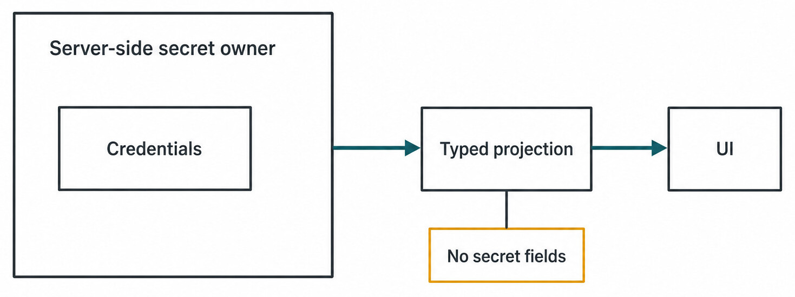
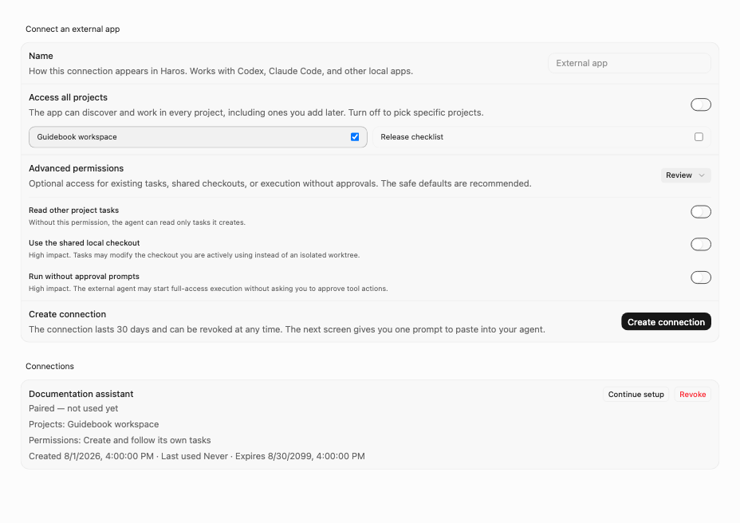
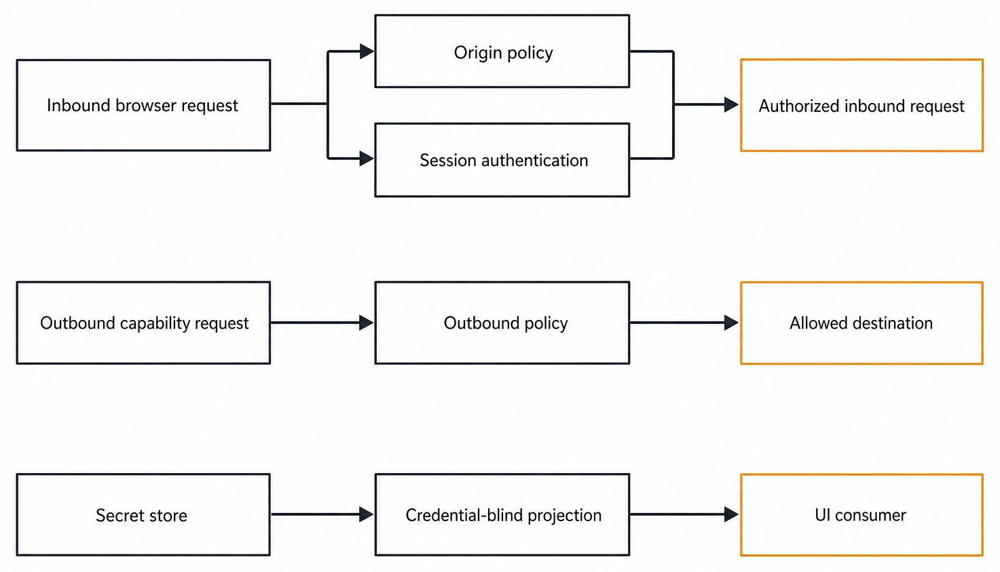
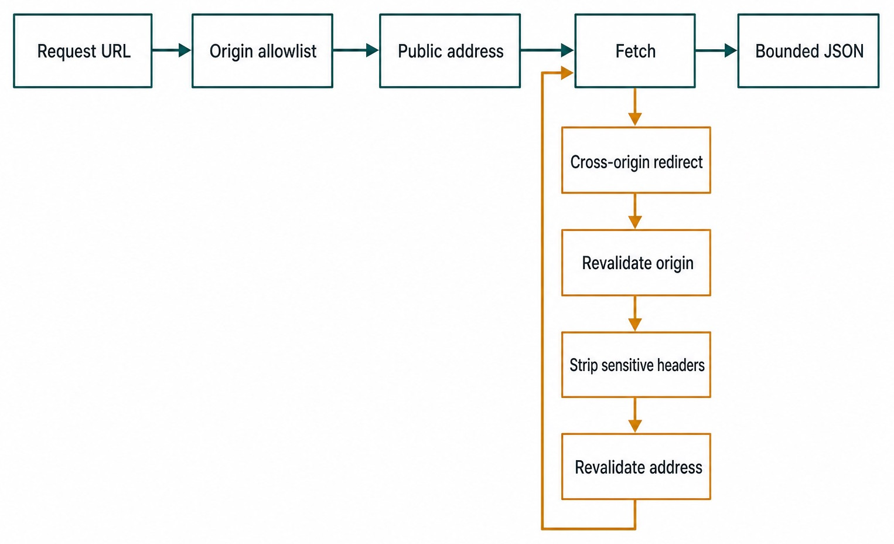

# Chapter 46 — Secrets, Trust, and Local Boundaries {#chapter-46}

## The question

Haros is local-first. Does that mean every local process, browser tab, URL, Engine, and outbound
request can be trusted?

No. “Local-first” describes where the product normally runs and where its state is owned. It is not
a security perimeter. A malicious web page can target localhost. Another account or process can
read overly broad files. A redirect can carry an authorization header to a different origin. An
Engine credential can leak if a Web projection serializes it. Remote access can expose assumptions
that were safe only on loopback.

Haros therefore uses several small, explicit boundaries:

> **Secrets stay with server-side owners; clients receive capability-shaped projections; each
> session or exact Turn receives narrow credentials; origins and network destinations are checked
> independently; local placement never substitutes for authentication.**

These boundaries overlap on purpose. File permissions do not replace request authentication.
Authentication does not make a hostile Origin safe for cookie mutation. A trusted Origin does not
make an arbitrary outbound URL safe. HostGateway authorization does not grant general server
authority.

The details in this chapter are verified against the pinned source-alpha edition. Exact time limits
and capacities are implementation facts, not public compatibility commitments.

## Begin with ownership, not concealment

A secret is safe only when its lifecycle has an owner: creation, storage, use, rotation or
replacement, and deletion. Merely omitting a password from one screen is not enough if a generic
settings endpoint, log, event, or error can serialize it elsewhere.

The server-side secret store maintains a private directory and named binary secret files. The
directory is constrained to mode `0700`; secret files are constrained to `0600`. Writes use an
atomic path so readers do not observe a half-written credential. These filesystem controls narrow
local disclosure, but the more important architecture rule is that server services consume the
secret directly. The Web workbench does not receive the value.

Engine server passwords illustrate this pattern. `engineCredentials.ts` owns secret access. The
settings projection exposes only whether a credential is configured. Updates may accept a new
secret, but the returned settings view remains credential-blind. Legacy passwords encountered in
older settings are migrated into the secret store; that compatibility seam does not authorize new
plaintext copies or dual owners.

`ENGINE_DESCRIPTORS` remains the sole owner of Engine identity, registration, display name,
capability projection, and Settings discovery. A credential belongs to the selected Engine's
server-side connection policy. It does not turn the Engine into a generic Provider, nor may a model
Provider surface become a second Engine registry.

| Sensitive fact                 | Authoritative owner                                     | Client-visible representation                       | Must never cross the boundary                                 |
| ------------------------------ | ------------------------------------------------------- | --------------------------------------------------- | ------------------------------------------------------------- |
| Engine server password         | Server secret store and Engine credential service       | `configured: true/false` or equivalent typed status | Password bytes in settings snapshots, logs, or Product events |
| Session signing key            | Server secret store and session credential service      | Signed/validated session behavior                   | Signing key or reusable derivation material                   |
| Bootstrap pairing token        | Bootstrap credential service                            | Short-lived one-time input/status                   | Token in durable Product State or repeatable UI history       |
| HostGateway bearer             | In-memory exact-Session registry and one-shot bootstrap | Narrow tool availability for the active Turn        | Verified snapshots, repository config, or later Turns         |
| Product Thread history         | Product Orchestration persistence                       | Typed Thread/Turn projections                       | Native Engine private config or credential files              |
| Outbound service authorization | Calling server-side capability owner                    | Bounded result or typed error                       | Header propagation to an unapproved redirect origin           |

_Figure 46.1 — Secret values remain inside the server owner boundary; the UI receives only a credential-blind projection._

**Accessible equivalent.** `Server-side secret owner` is a labeled boundary containing
`Credentials`. Its only outward path goes to `Typed projection`, then `UI`. `No secret fields`
constrains `Typed projection`.

_Real product capture — The production connection review exposes explicit project scope and typed
permissions while keeping credentials and private endpoints outside the UI projection._

This also explains the Web-native execution boundary. The Web app renders typed projections and
submits typed intents. It does not parse private Engine configuration, launch native processes,
mint gateway bearers, or decide which local file contains a credential. Moving those duties into
browser code would create multiple owners and make browser compromise equivalent to server
compromise.

## Session credentials have different lifetimes

Haros uses distinct credentials because “authenticated once” is too coarse. A long-lived browser
session, a WebSocket connection, first-run pairing, and an Engine's exact Turn need different
revocation and replay properties.

The session credential service signs session material and records active sessions durably. A
WebSocket does not simply reuse an ambient secret forever. The server issues a short-lived ticket;
at the pinned edition its default lifetime is five minutes. The ticket must also be present in a
process-local allowlist and is consumed once. A durable signature alone cannot replay a ticket that
the current process never minted or has already consumed.

Capacity limits make credential abuse and resource capture bounded. The current implementation
allows up to 16 outstanding WebSocket tickets per session and 8 concurrent WebSocket connections
per session. Revoking the session interrupts associated live connections instead of waiting for
them to notice at an arbitrary future request.

First-run bootstrap has a separate service. Its pairing token also defaults to five minutes and is
consumed atomically. A bootstrap token is not a normal session, and successful pairing must not
leave a reusable master token behind.

HostGateway credentials are narrower still. The server creates an independent gateway Session for
the exact Engine execution and binds authority to the current Turn. The bearer registry is
in-memory; restart destroys it. A one-shot standard-input bootstrap record currently expires after
30 seconds. Transport validation rechecks that the Session is live, the Engine matches, the exact
Turn remains active, the tool is exposed, and the required capability is still effective. Chapter
41 follows that path end to end.

| Credential              | Lifetime and replay rule                                             | Scope                                                      | Revocation/failure meaning                                                  |
| ----------------------- | -------------------------------------------------------------------- | ---------------------------------------------------------- | --------------------------------------------------------------------------- |
| Authenticated session   | Durable active row plus valid signed material                        | User/session request authority                             | Revocation invalidates the session and interrupts its live sockets          |
| WebSocket ticket        | Five-minute default; one use; process-local allowlist                | Establish one authenticated socket                         | Expired, unknown, or consumed ticket must reconnect through normal issuance |
| Bootstrap pairing token | Five-minute default; atomically consumed                             | Initial pairing only                                       | Failure does not grant a partial normal session                             |
| HostGateway bearer      | In-memory Session; exact active Turn; bootstrap currently 30 seconds | Exposed tools and effective capabilities for one execution | Restart, retire, cancel, or Turn change removes authority                   |

Do not collapse these into one token table and one validator. Their semantics differ: a WebSocket
ticket proves a session authorized a connection attempt; a HostGateway bearer proves an exact live
Engine Turn may invoke a current tool. Sharing validation merely because both values are strings
would blur revocation, audit, and failure behavior.

## Local HTTP still needs an Origin policy

A browser can send requests to loopback even when the page itself came from elsewhere. Cookies may
be attached according to browser rules. That makes cross-site request attacks against a “local”
server entirely plausible.

Haros evaluates request Origin separately from authentication. Canonical Desktop origins and an
explicit configured development origin can be trusted. Same-origin host comparison is normalized
by the server's policy. When a browser supplies an invalid or untrusted Origin, the request is
rejected. Missing Origin can be valid for command-line clients, but it is not a blanket bypass for
browser mutations.

Cookie-authenticated mutations require a trusted Origin because ambient cookies can be sent without
the user's current page intentionally possessing the credential. A bearer-authenticated client can
omit Origin, reflecting non-browser callers, but an explicitly hostile Origin is still not evidence
to ignore. Remote WebSocket connections always require authentication.

The policy distinguishes CORS presentation from server authorization. Returning an
`Access-Control-Allow-Origin` header does not itself prove the caller may mutate state. Conversely,
a command-line request without Origin can be legitimate when it supplies the exact required bearer.
These decisions should stay visible in tests rather than being delegated to vague framework
defaults.

_Figure 46.2 — The diagram groups three independent boundaries; it does not prescribe one global execution order._

**Accessible equivalent.** In the inbound group, `Inbound browser request` branches independently
to `Origin policy` and `Session authentication`; both are required before `Authorized inbound
request`. In the outbound group, `Outbound capability request` points to `Outbound policy` and then
`Allowed destination`. In the projection group, `Secret store` points to `Credential-blind
projection` and then `UI consumer`. The three groups are separate, not a single sequence.

## Remote access is an explicit mode

`config.ts` treats loopback, private-LAN, and public exposure differently. Non-loopback or public
access fails closed without an authentication token. A public URL must be an exact HTTPS root
origin. Remote development URLs are not accepted as a convenient substitute. Insecure LAN access
requires an explicit opt-in rather than being inferred from a bind address.

| Deployment shape         | Required checks                                                                        | Why                                                           | Invalid assumption                                   |
| ------------------------ | -------------------------------------------------------------------------------------- | ------------------------------------------------------------- | ---------------------------------------------------- |
| Desktop/loopback default | Trusted Desktop/browser origin rules, session boundaries, private state paths          | Hostile pages and local processes still exist                 | “127.0.0.1 means no auth or CSRF concerns”           |
| Explicit private LAN     | Authentication token plus explicit insecure-LAN allowance when transport is not secure | Network peers are outside the local process boundary          | “Private IP means trusted household or office”       |
| Public URL               | Exact HTTPS root origin and authentication                                             | Prevents ambiguous path/origin routing and plaintext exposure | “A reverse proxy will probably fix it”               |
| Development Web origin   | Exact configured development origin; no remote dev URL shortcut                        | Keeps development privilege narrow and auditable              | “Any localhost-like or preview domain is equivalent” |

The exact root-origin requirement avoids configuration whose apparent public base includes a path
that the server or proxy interprets differently. HTTPS is necessary for public transport, but it is
not sufficient: sessions, trusted origins, and request admission still apply.

Local state paths are private implementation locations, not APIs. A Web client must not discover a
private directory and read Engine configuration directly. A native Engine adapter also does not
gain permission to duplicate file, terminal, browser, or device authority; those system
capabilities go through HostGateway with current policy.

## Outbound HTTP is a second network boundary

Inbound authentication answers who may ask Haros to act. Outbound policy answers where Haros may
send a request and how much network work it may consume. An authenticated caller can still supply a
dangerous URL, follow a redirect to a private service, or cause an unbounded response.

The shared outbound HTTP owner requires exact allowlisted origins and enforces public address
resolution. DNS and IP checks defend against SSRF, including names that resolve toward local,
private, link-local, or otherwise disallowed addresses. The connection is pinned to the validated
resolution so a later DNS change cannot silently redirect the request after policy approval.

Requests are bounded by concurrency, queue, request bytes, response bytes, redirect count, and
timeouts. Response compression is rejected where exact byte accounting would otherwise become
ambiguous. A compressed payload that looks small on the wire can expand enormously; refusing it
makes the response limit an honest memory bound.

Cross-origin redirects require particular care. Sensitive headers are stripped before following a
redirect to a different origin. The new origin must independently satisfy policy. Authentication
for `api.example.test` must never ride a `302` to `collector.example.test` merely because the first
host was allowlisted.

_Figure 46.3 — Every redirect begins a fresh bounded policy pass before another network fetch._

**Accessible equivalent.** The initial path is `Request URL` to `Origin allowlist`, `Public
address`, `Fetch`, and `Bounded JSON`. A `Cross-origin redirect` from `Fetch` starts a loop through
`Revalidate origin`, `Strip sensitive headers`, and `Revalidate address` before returning to
`Fetch`.

| Outbound control                                    | Threat contained                                  | Evidence required before proceeding                                          | Safe failure                                     |
| --------------------------------------------------- | ------------------------------------------------- | ---------------------------------------------------------------------------- | ------------------------------------------------ |
| Exact origin allowlist                              | User-controlled or confused-deputy destinations   | Scheme, host, and port match approved origin                                 | Reject before sending bytes                      |
| Public DNS/IP validation and pinning                | SSRF and DNS rebinding                            | Validated public resolution remains the connection target                    | Reject private/changed resolution                |
| Redirect revalidation and header stripping          | Credential exfiltration across origins            | Every destination is allowed; sensitive headers remain only where authorized | Stop redirect or continue without secret headers |
| Byte, redirect, concurrency, queue, and time bounds | Memory, socket, and availability exhaustion       | Operation remains inside all budgets                                         | Typed bounded failure and resource release       |
| Compressed-response rejection                       | Decompression bombs and dishonest byte accounting | Response size is measurable against exact limit                              | Reject unsupported encoding                      |

An Engine or search service may accurately call an upstream a Provider within that domain. That
does not move outbound policy into a generic Provider registry. The capability owner supplies the
approved destination and credentials; the shared HTTP layer enforces network invariants. Identity,
business policy, and transport safety remain separate responsibilities.

## Worked example: remote browser plus redirected model request

Consider a team enabling Haros on a private LAN. They configure a non-loopback address, explicitly
allow insecure LAN transport for a temporary isolated network, and provide the required auth token.
Alex pairs from a browser and opens a WebSocket.

1. The browser's HTTP Origin must match the configured trusted application origin. Being on the
   same subnet is not enough.
2. The authenticated session requests a WebSocket ticket. The server records a short-lived,
   one-use ticket in the current process and enforces the per-session outstanding-ticket limit.
3. The WebSocket handshake consumes that ticket. A copied second use fails. If the session is
   revoked, the live connection is interrupted.
4. Alex starts a Turn. The selected Engine comes from `ENGINE_DESCRIPTORS`; its configured status is
   visible, but its password remains server-side. Product Thread history and native Engine Session
   identity remain distinct.
5. The Engine needs an allowed model-service request. The capability owner passes the exact approved
   origin to the outbound HTTP layer. DNS resolves to a public address and the connection is pinned.
6. The service returns a redirect to another origin. Haros revalidates that origin and strips the
   authorization header. If the second origin is not approved, the request stops with a bounded
   error rather than following it.
7. If the Turn invokes a local browser tool, it uses an exact-Turn HostGateway bearer. That bearer
   cannot be reused after cancellation or for another Turn, even though the Web session remains
   valid.

Notice how many independent statements are involved: Alex may use Haros; this socket belongs to
Alex's active session; this Engine credential is configured; this outbound origin is permitted;
this exact Turn may invoke this local tool. No single “trusted” flag can safely replace them.

## Failure and recovery

Credential failures should close authority, not trigger broad compatibility fallbacks.

If a secret file has broader permissions, repair or refuse it through the owning secret service;
do not copy its contents into ordinary settings to keep startup moving. If legacy settings contain
a password, migrate it once to the secret owner and expose only configured status afterward.

If a WebSocket ticket expires or the server restarts, request a new ticket from an authenticated
session. The process-local allowlist intentionally does not survive. If a session is revoked, the
client must authenticate again; reconnect loops must not manufacture authority.

If a HostGateway bearer disappears on restart, the old Turn is reconciled as interrupted. A fresh
Turn gets a fresh Session and bearer after normal admission. Persisting the bearer to “improve
resume” would defeat exact-Turn authority.

If remote configuration is incomplete, fail closed before exposing the listener. If an outbound
destination fails allowlist, DNS, redirect, or budget checks, return a typed failure to the owning
operation. Do not add a direct-fetch fallback that bypasses shared policy.

Logs and diagnostics must report category and outcome without printing tokens, passwords, complete
authorization headers, private paths, or raw upstream responses. A useful message says that a
WebSocket ticket was expired or an origin was rejected; it does not repeat the rejected credential.

## Try it safely

Use focused repository tests and temporary directories. Never print fixture secrets, point tests at
your real Haros state directory, or expose a development server to another network.

1. Run `ServerSecretStore.test.ts`. Confirm the temporary directory and file modes, atomic
   replacement, and named-secret behavior.
2. Read `engineCredentials.test.ts` and `serverSettings.integration.test.ts`. Verify that a password
   can be accepted or migrated while every returned settings view remains credential-blind.
3. Run the session and bootstrap credential integration tests. Check one-use consumption,
   expiration, capacity, connection revocation, and atomic pairing behavior.
4. Run `trustedOrigins.test.ts` and its duplicate-Origin coverage. Build a small matrix of trusted,
   hostile, invalid, and missing Origin values for cookie and bearer authentication.
5. Run `packages/shared/src/outboundHttp.test.ts` and the server outbound HTTP suite. Use their local
   fixtures only. Confirm that private-address resolution, disallowed redirects, compressed
   responses, and oversize bodies fail without leaking authorization headers.
6. Read the HostGateway registry and transport tests. Confirm that verified snapshots contain
   capability status but never the bearer itself.

Expected result: each test proves one narrow boundary, all secrets remain fixture-local, and no
exercise depends on a real Engine account or external network.

## Recap

Local-first is a placement and ownership model, not permission. Server-side secret owners keep
credential values out of Web projections and Product history. Authenticated sessions, one-use
WebSocket tickets, bootstrap tokens, and exact-Turn HostGateway bearers have deliberately different
lifetimes and revocation rules.

Trusted-Origin checks defend browser request boundaries. Explicit configuration and authentication
protect LAN and public modes. Shared outbound HTTP policy protects destination, DNS, redirects,
credentials, and resource budgets. The Web remains a typed, credential-blind workbench; native
Engine execution and local capabilities remain behind server and HostGateway owners.

## Check your model

1. Why is `configured: true` safer and more useful to the Web than returning an Engine password?
2. What does a one-use WebSocket ticket prove that a HostGateway bearer does not, and vice versa?
3. Why can a cookie-authenticated mutation require a trusted Origin even on loopback?
4. Why must a redirected outbound request be authorized again and lose sensitive headers across
   origins?
5. Which parts of a Product Thread survive restart, and which security authorities must be minted
   again?

## Source trail

- `apps/server/src/auth/Layers/ServerSecretStore.ts`, `engineCredentials.ts`, and
  `serverSettings.ts` own private storage, Engine credential access, migration, and
  credential-blind projections.
- `SessionCredentialService.ts` and `BootstrapCredentialService.ts` own signed sessions, one-use
  WebSocket tickets, pairing, capacity, and revocation.
- `apps/server/src/hostGateway/Services/HostGatewaySessionRegistry.ts` owns in-memory gateway
  Sessions and exact-Turn bearer authority.
- `apps/server/src/config.ts` and `trustedOrigins.ts` own remote-access prerequisites, exact public
  origins, browser Origin policy, and WebSocket authentication requirements.
- `packages/shared/src/outboundHttp.ts` and `outboundHttpPolicy.ts` own exact-origin, DNS/IP,
  redirect, header, and resource-budget enforcement.
- `packages/shared/src/engineMetadata.ts` owns `ENGINE_DESCRIPTORS`; security projections consult
  that registry without creating another Engine identity owner.
- Focused evidence lives in the matching secret-store, credential, trusted-origin, outbound-HTTP,
  Engine-credential, server-settings, and HostGateway test suites.

<!-- guide-navigation:start -->

[Guidebook contents](../README.md) · [Previous: Restart, Quit, and Recovery](45-restart-quit-recovery.md) · [Next: Diagnostics, Usage, Retention, and Maintenance](../part-07-contributing/47-diagnostics-usage-retention-maintenance.md)

<!-- guide-navigation:end -->
