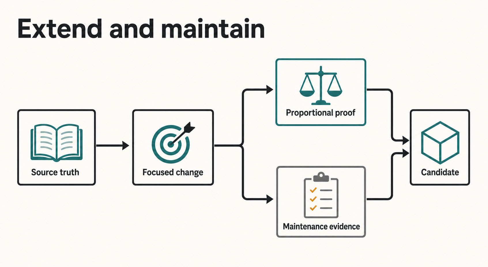
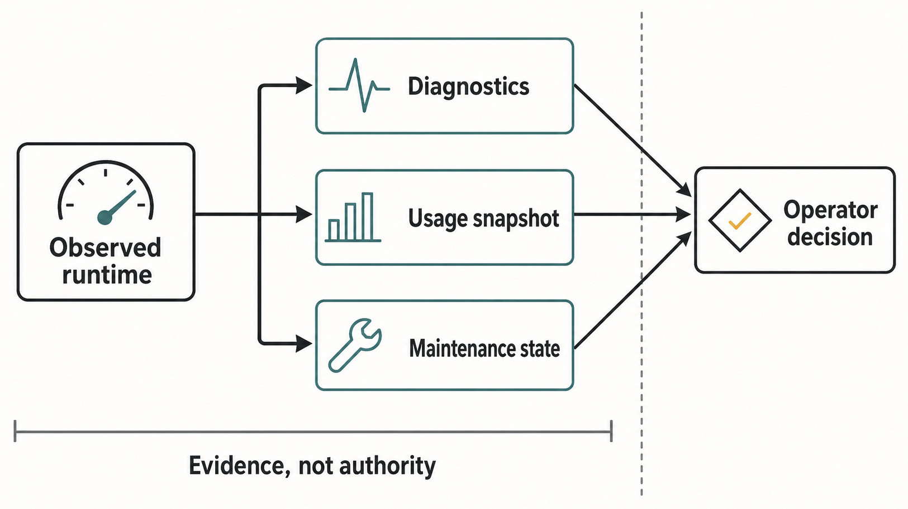
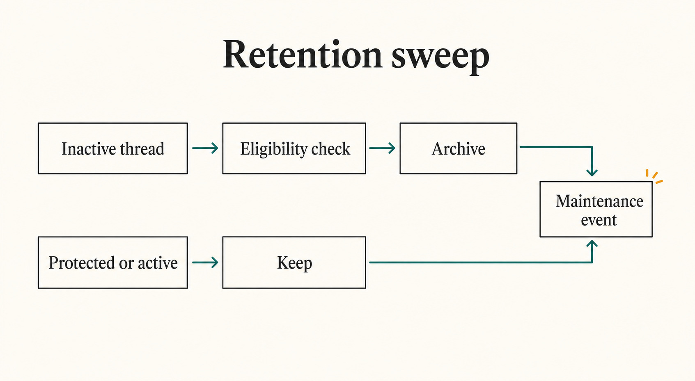

# Chapter 47 — Diagnostics, Usage, Retention, and Maintenance {#chapter-47}

_Part VII opener — Extending and maintaining Haros begins with source truth and ends at an identified candidate, not an implied release._

**Accessible equivalent.** Source truth leads to Focused change. Focused change branches to
Proportional proof and Maintenance evidence; both feed Candidate. Candidate is not connected to a
release claim.

## The question

Haros can show health, usage, history, diagnostics, and maintenance progress. Which of those records
is allowed to decide what happens to a task?

None of them by itself. They are evidence about product or Engine behavior, not substitute owners
for Product Threads, admitted Turns, permissions, or native Engine Sessions. A usage card can say
that an Engine account is near a limit, but it cannot silently move a queued Turn to another
Engine. A diagnostic can explain that a launch failed, but it cannot rewrite the Timeline. A
maintenance event can report that inactive Threads were archived, but it does not become the
archive command or the Thread store.

This distinction matters because operational data often looks authoritative. It has timestamps,
status words, totals, and warnings. Those fields are useful only when the reader knows which owner
produced them, how fresh they are, and what recovery path remains.

## The plain-English model

Think of these systems as instruments around a machine:

- **Diagnostics** explain observed activity and operational failures.
- **Live Engine usage** asks an Engine-owned account source for a bounded current snapshot.
- **Usage history and profile statistics** build read models for human review; they do not schedule
  or admit work.
- **Retention** sends ordinary Product Orchestration commands to archive eligible inactive Threads.
- **Engine maintenance** observes versions and, after an explicit command, runs a bounded update
  action.

The instrument panel may be stale or temporarily unavailable while the underlying Product Thread
remains valid. Conversely, a green panel does not prove that a future Turn is admitted, that a
credential is authorized, or that a package is safe to release.

> **Telemetry describes. Product and lifecycle owners decide.**

_Figure 47.1 — Health, usage, diagnostics, and maintenance are separate evidence streams; none is a replacement Product State owner._

**Accessible equivalent.** Observed runtime fans out to Diagnostics, Usage snapshot, and Maintenance state. Those evidence streams converge on Operator decision under the constraint Evidence, not authority.

## Four evidence families, four different clocks

The first maintenance skill is not memorizing every status. It is asking what clock the status
uses. A live usage fetch may be cached for minutes. An operational diagnostic is a bounded durable
row. Profile history is a lifetime aggregate derived from Haros product activity. Usage history is
an explicitly authorized projection over supported Engine archives. Retention runs on a scheduled
server loop. Engine maintenance compares an installed version with a bounded latest-version
source, then may execute a user-requested update.

| Evidence family       | Primary question                                                                     | Source owner                                                          | What it must not decide                                                 |
| --------------------- | ------------------------------------------------------------------------------------ | --------------------------------------------------------------------- | ----------------------------------------------------------------------- |
| Thread diagnostics    | What activity or operational failure was observed for this Product Thread?           | Thread activity projections and `ThreadDiagnosticsQuery`              | Thread history, Turn settlement, or permission authority                |
| Live Engine usage     | What does this Engine account report now, or what last-good snapshot remains useful? | Descriptor-selected usage metadata plus Engine-specific fetcher       | Engine selection, model admission, or automatic fallback                |
| Usage/profile history | What work and token evidence can be summarized over time?                            | Consent-gated usage-history projection and Haros profile-stat queries | Native Session continuation, billing truth, or product scheduling       |
| Retention/maintenance | What housekeeping or explicit Engine update is in progress?                          | Server maintenance jobs and Engine maintenance owner                  | Silent deletion, release publication, or adapter-owned system authority |

These clocks explain why apparently conflicting values can both be honest. A Toolbar usage popover
may show a cached last-good account limit while a fresh fetch is rate-limited. The Timeline can
show a settled Turn even while an external archive index is only partially complete. An archived
Thread can still contribute to profile history. The correct response is to preserve source and
freshness, not to force every display into one universal “current” flag.

## Diagnostics are bounded explanations

Thread diagnostics combine two kinds of evidence. Sequenced Thread activities come from the
Product projection and can be paged through an exact high-water boundary. Operational diagnostics
record a source, kind, severity, optional code, structured detail, and occurrence time. The pinned
implementation keeps operational diagnostics bounded by age and count: insertion also removes
rows older than 30 days and caps the table at 10,000 newest rows.

Those bounds are maintenance facts, not a promise that every historic incident will remain
available. A contributor debugging an old failure should first use durable Product history and
receipts, then use diagnostics as supporting evidence. Missing diagnostic rows must not be
interpreted as proof that no failure occurred.

Stored diagnostic JSON is decoded defensively. If a row cannot be decoded, the query returns an
explicit unavailable marker instead of crashing or inventing detail. This is an important pattern:
degraded evidence stays visibly degraded.

Diagnostics also cross a privacy boundary. A useful record may name the failing subsystem, a safe
error category, and a bounded status. It should not contain credentials, authorization headers,
raw upstream responses, or unnecessary private paths. Sanitization belongs at the producer and
projection boundaries; the UI is not a reliable final redaction service.

## Live usage is not Product usage

The live Engine usage path is a defensive batch of Engine-specific fetchers. The set of
usage-capable Engines and their human presentation comes from the `usage` field in
`ENGINE_DESCRIPTORS`, through `packages/shared/src/engineUsage.ts`. The fetcher registry supplies
protocol-specific readers for those entries. A focused registry test checks that every
descriptor-declared usage capability has a fetcher.

That registry is not a second Engine identity owner. It is a capability implementation map. It may
be partial for Engines that do not expose live account usage, and its display order derives from
the descriptors.

One failing fetcher does not fail the whole batch. Unexpected failures become sanitized error
snapshots. Requests for the same Engine coalesce, healthy results have a longer cache lifetime than
degraded results, and an explicit refresh bypasses the ordinary freshness check while still joining
an in-flight request. If a refresh fails while a fresh healthy snapshot exists for the same
credential identity, the healthy snapshot can remain visible.

The UI must preserve the meaning of that fallback. A cached value is useful evidence, not a new
authorization decision. It does not say that a future request will succeed, nor does it override an
Engine health or Product admission result.

## Usage history and profile history answer different questions

The usage-history service is consent-gated. In the pinned edition it indexes supported Codex and
Claude archive sources through a killable child process. Opening the dedicated history surface can
resume an interrupted authorized index; ordinary startup, a Header, or a conversation does not
implicitly authorize it. A user can authorize, pause, clear the derived projection, resume, or
reindex. Clear removes Haros's derived usage-history rows; it does not claim to delete an Engine's
private archive.

The indexer is bounded by file, byte, event, output, timeout, and restart controls. It can report
partial, paused, unsupported, stale, indexing, or ready states. Cost values are estimates tied to a
pricing version and are explicitly uncertain. They are not invoices and should not be presented as
Provider billing authority.

Profile statistics are different. They derive lifetime activity from Haros's own Product database,
including prompt activity and token deltas attributed to the Engine/model selection of the relevant
Turn. They do not read native Engine archives or cloud services for those metrics. When an
explicitly deleted Thread is eligible for purge, the archive service snapshots the aggregates that
must continue contributing to lifetime statistics before removing the bulky Thread-owned rows.

| Read model         | Input boundary                                                      | User control                                              | Honest interpretation                                             |
| ------------------ | ------------------------------------------------------------------- | --------------------------------------------------------- | ----------------------------------------------------------------- |
| Live Engine usage  | Current Engine-specific account source, with bounded caching        | Refresh the current snapshot                              | Operational account evidence that may be stale or unavailable     |
| Usage history      | Supported native Engine archives, only after explicit authorization | Authorize, pause, resume, clear projection, or reindex    | Partial or complete local index with uncertain cost estimates     |
| Profile statistics | Haros Product projections plus delete-time aggregate snapshots      | Ordinary Product activity and explicit deletion lifecycle | Lifetime Haros activity, not a native archive or Provider invoice |
| Thread diagnostics | Sequenced Product activity and bounded operational rows             | Inspect through the diagnostic surface                    | Troubleshooting evidence, not a replacement Timeline              |

This creates a deliberate distinction: deleted content can be gone while non-content aggregate
history remains. A contribution that changes deletion behavior must state which fact is being
removed and which aggregate is intentionally preserved.

## Retention archives; manual deletion can purge

The periodic retention job archives inactive Product Threads through ordinary
`thread.archive` commands. It does not hard-delete them. The current source-alpha policy waits seven
days of inactivity, runs a first sweep after a startup settling period, then repeats daily. These
durations are implementation facts and may change.

Eligibility is conservative. Pinned Threads, already archived or deleted Threads, active or
starting Sessions, active Turns, pending approvals, pending user input, recent Threads, and Threads
protected by enabled automation continuation are not selected. For a Thread hierarchy, retention
archives only a root whose entire active subagent subtree is eligible. A protected child prevents
the parent cascade.

The job publishes `started`, `progress`, and `completed` maintenance evidence around meaningful
work. Failures for one Thread are logged and the sweep continues. After successful archival it may
prune projected archived managed worktrees according to that separate owner. The maintenance event
reports the sweep; the dispatched Product command remains the archive authority.

Manual deletion follows a stricter path. Hard purge requires positive delete provenance and a
purge fence that protects unresolved Engine delivery or queued-promotion evidence. The archive
service snapshots profile aggregates transactionally, terminalizes or preserves dependent recovery
records according to their lifecycle, removes Thread-owned projections and events, and cleans Git
checkpoint references after the database commit. Unknown or legacy delete provenance is kept
rather than guessed. Irreversible maintenance therefore fails toward preservation.

_Figure 47.2 — Scheduled retention archives recoverably; manual deletion is a separate, fenced purge path._

**Accessible equivalent.** Inactive thread flows through Eligibility check to Archive and then Maintenance event. Protected or active flows to Keep and the same reporting event without deletion.

## Engine maintenance is an explicit command path

Engine maintenance resolves installed versions, latest-version evidence, and the update action
appropriate to the actual install source. A package-managed binary may need a package-manager
command tied to its real prefix; a native Engine may own its own update verb; some Engines are
manual-only. This is why a generic “run npm update” button would be incorrect.

Latest-version reads have timeouts and caching. Version comparison understands ordinary semantic
versions and prerelease ordering. Update execution is bounded and reports an advisory or command
result rather than rewriting Engine identity. The coordinator rejects concurrent work for the same
target and serializes commands that share an underlying package-manager lock. It always releases
its target reservation after success or failure.

An update changes an external Engine installation, not Haros Product State. A successful update
does not prove that an existing native Session can continue, that every model remains compatible,
or that Haros itself is released. Health and discovery must observe the new runtime again.

## Worked example: a warning, an archive sweep, and an update

Mina opens Haros after a week away. Three signals appear during the session.

First, the usage panel shows a last-good snapshot for one Engine with a stale or degraded marker.
The fresh upstream check was throttled. Mina can still read the earlier limit evidence, but Haros
does not move her queued Turn to another Engine. The Turn remains bound to the admitted
Engine/model/options until Product Orchestration changes it through the normal stop-first path.

Second, a maintenance event reports that two inactive Threads were archived. Mina finds them in
the archived view and can restore them. A third old Thread stayed active because an enabled
automation continues it. No message history was hard-deleted by the retention sweep.

Third, Settings reports that an Engine update is available. Mina explicitly starts the update. A
second click for the same target is rejected as already running; another update using the same
package-manager lock waits rather than racing. If the command succeeds, Haros refreshes health and
discovery evidence. If it fails, the installed Engine and Product Threads remain where the real
installer left them; the diagnostic reports a bounded failure and does not claim rollback that the
Engine did not provide.

The three signals share a screen but not an owner. Usage explains an account observation.
Retention dispatches Product archive commands. Engine maintenance runs an explicit external update.
The Product Thread, native Engine Session, and external installation remain separate facts.

## What can go wrong

The most dangerous maintenance bugs are category errors. Treating missing telemetry as missing
Product State can hide recoverable work. Treating an archive as a delete can promise erasure that
did not occur. Treating a profile aggregate as retained content can overstate what can be restored.
Treating a successful package build or Engine update as a Haros release can create a false shipping
claim.

| Failure                                           | Preserved state                                                                    | Recovery                                                                                     | Non-guarantee                                                  |
| ------------------------------------------------- | ---------------------------------------------------------------------------------- | -------------------------------------------------------------------------------------------- | -------------------------------------------------------------- |
| Live usage fetch fails or is throttled            | Product Thread, admitted Turn binding, and any valid bounded last-good snapshot    | Show degraded/stale evidence and retry through the usage owner                               | The displayed number is not current authorization or a bill    |
| Usage-history worker crashes or hits a bound      | Consent state, committed projection rows, and per-Engine progress                  | Resume the dedicated surface, retry within restart limits, or reindex explicitly             | Partial history is not complete native archive coverage        |
| Retention sweep cannot archive one Thread         | That Thread and its Product history remain; other candidates can continue          | Inspect the failed command, repair the owner, and rerun a later sweep                        | A maintenance event is not proof that every candidate archived |
| Manual purge is fenced or provenance is uncertain | Thread rows and unresolved recovery evidence remain                                | Resolve delivery/promotion state or obtain positive manual-delete provenance                 | Retention age alone never authorizes hard deletion             |
| Engine update fails or overlaps                   | Product State and canonical Engine identity remain; target reservation is released | Read sanitized command evidence, repair the install path, refresh health, retry deliberately | Haros cannot promise rollback of an external package manager   |
| Diagnostic detail cannot decode                   | The diagnostic row, source, kind, time, and explicit unavailable marker remain     | Use durable Product events/receipts and other bounded evidence                               | Missing detail does not prove the incident never happened      |

## Security and privacy boundary

Operational evidence is easy to overshare because logs and archive paths feel “local.” Keep tests
inside fresh temporary homes. Do not point usage indexing at a real person's Engine archive, print
credential-derived cache keys, paste complete command environments, or attach raw diagnostics to a
public issue. Engine account usage may contain account labels. Even when a UI is credential-blind,
screenshots and logs need a sanitization pass.

Retention and purge tests must use synthetic Product Threads. Never use a test to read, migrate,
archive, or delete real private Engine state. A maintenance command must receive only the minimum
environment needed by its owner. If a failure message contains a secret or private endpoint, fix
the producer/redaction boundary rather than teaching the consumer to hide one known string.

## Try it safely

Use only repository fixtures and temporary databases.

1. Read `ThreadDiagnosticsQuery.integration.test.ts`. Identify how activity pagination is pinned to
   a sequence and how old or excess operational diagnostics are bounded.
2. Run the focused Engine usage registry and resilience tests. Confirm that descriptor-declared
   usage support has a fetcher and that one failure does not throw the whole batch.
3. Read `UsageHistory.integration.test.ts`. Trace `authorize`, `pause`, `clear`, and `reindex`; note
   that clearing the projection is not deletion of native archives.
4. Run `threadRetention.test.ts`. Create synthetic recent, busy, pinned, automation-protected, and
   fully eligible subtree cases. Confirm that only eligible roots receive archive commands.
5. Read `profileStatsArchive.integration.test.ts`. Find the purge fence and the transactional
   aggregate snapshot before hard deletion.
6. Run the focused Engine maintenance coordinator tests. Verify same-target rejection, shared-lock
   serialization, and release after failure.

The observable result is a boundary map, not a modified installation: every signal has an owner,
every failure preserves the right state, and no exercise needs an account, network request, or real
user home.

## Recap

- Diagnostics, usage, profile history, retention events, and maintenance results are evidence,
  not replacement authority.
- Live Engine usage and consent-gated archive history are distinct; neither is Product Thread
  state.
- Scheduled retention archives eligible inactive Threads and preserves restore; manual purge is a
  separately fenced, provenance-sensitive operation.
- Explicit deletion may remove content while preserving only the aggregates required for lifetime
  profile statistics.
- Engine updates are explicit, serialized external maintenance actions followed by fresh health
  and discovery evidence.

## Check your model

1. Why may Haros show a last-good usage snapshot without allowing it to change an admitted Turn?
2. What is the difference between clearing usage history, archiving a Product Thread, and manually
   purging a deleted Thread?
3. Why does a protected child prevent retention from archiving its parent subtree?
4. What must remain true after an Engine update command fails?
5. Which evidence would you consult first when an old diagnostic row has already aged out?

## Source trail

- `ThreadDiagnosticsQuery.ts` owns bounded operational diagnostic persistence and sequenced
  activity queries; its integration test covers decoding, ordering, and retention limits.
- `packages/shared/src/engineUsage.ts`, `apps/server/src/engineUsage/index.ts`, and `registry.ts` own
  descriptor-derived presentation, defensive collection, caching, and Engine-specific fetcher
  registration.
- `UsageHistory.ts` owns explicit authorization, bounded archive indexing, pause/clear/reindex, and
  uncertain cost projections; `UsageHistory.integration.test.ts` covers lifecycle and recovery.
- `profileStats.ts` derives Haros-local lifetime read models. `profileStatsArchive.ts` owns
  delete-time aggregate snapshots, purge fences, and transactional Thread-row removal.
- `threadRetention.ts` owns scheduled eligibility, subtree selection, archive dispatch, and
  maintenance events; retention and managed-worktree tests cover preservation and cleanup.
- `engineMaintenance.ts` and `engineMaintenanceCommandCoordinator.ts` own version/update resolution,
  target exclusion, shared locks, bounded commands, and cleanup; focused integration tests prove
  their failure paths.

<!-- guide-navigation:start -->

[Guidebook contents](../README.md) · [Previous: Secrets, Trust, and Local Boundaries](../part-06-reliability/46-secrets-trust-local-boundaries.md) · [Next: External Connections and MCP](48-external-connections-mcp.md)

<!-- guide-navigation:end -->
