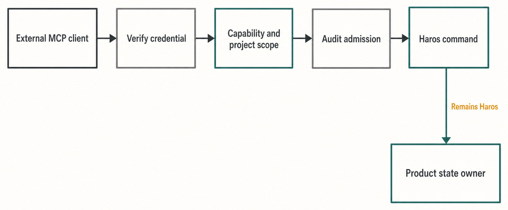
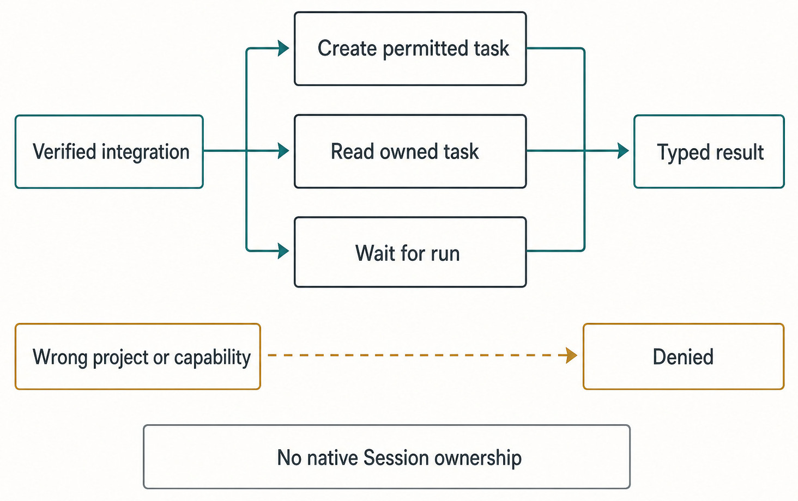

# Chapter 48 — External Connections and MCP {#chapter-48}

## The question

If another application connects to Haros through MCP, does that application become a second Haros
client with direct ownership of Projects, Product Threads, Queue, Timeline, or local tools?

No. The external MCP surface is an admitted capability gateway. It authenticates one integration,
projects a bounded tool catalog from explicit scopes, checks Project and task authority, and sends
accepted work through existing Haros owners. Product Orchestration still creates and stores the
Product Thread. Engine adapters still translate native execution. HostGateway and the existing
creation coordinator still own local execution authority, idempotency, compensation, and receipts.

The external client owns its request and its local connection state. It does not own Haros Product
State, cannot fabricate a native Engine Session, and cannot turn an MCP protocol success into a
claim that a task finished successfully.

## The plain-English model

An external connection passes through six gates:

1. **Local runtime gate.** External MCP is exposed only by a loopback-only Haros instance.
2. **Pairing and credential gate.** An owner creates an expiring integration and pairs a client
   through a short-lived code; later requests use an integration credential.
3. **Scope gate.** Tools appear only when the integration has their required capability.
4. **Project and task gate.** Each operation checks the live allowed Project set and task-read rule.
5. **Execution admission gate.** Runtime mode, environment, rate, concurrency, and input bounds are
   enforced before work enters the shared creation path.
6. **Audit gate.** Tool metadata and outcome are recorded without making audit telemetry the result
   owner.

After those gates, an accepted create request becomes ordinary Haros work. It receives a Product
Thread, an exact Engine/model/options binding, Queue and Timeline behavior, and the same failure and
recovery rules as work started inside Haros.

_Figure 48.1 — External MCP admits a bounded intent into existing Haros owners; it is not a second Product State path._

**Accessible equivalent.** External MCP client passes Verify credential, Capability and project scope, and Audit admission before Haros command reaches Product state owner. The ownership edge is labeled Remains Haros.

## The connection record is a grant, not a mirror account

An integration record has a Haros-owned identity, name, audience, capabilities, Project scope,
expiry, rate limit, concurrency limit, client kind, and pairing/revocation timestamps. Its public
view includes a command configuration for the local stdio bridge. Credential hashes and pairing
hashes remain in the server repository; the credential itself is returned only during pairing and
stored by the local bridge in a private file.

The owner chooses either selected Projects or all Projects. Selected scope must name at least one
existing Project. “All” is dynamic: verification recomputes the effective set from the live Project
projection, so a later Project becomes visible to that integration. This is a powerful grant and
must be described honestly; it is not a snapshot of the Projects that existed on pairing day.

Capabilities are independent permissions. `tasks:create` requires `projects:read`, but task reads,
waits, broader allowed-Project reads, local-checkout execution, and full-access execution have their
own scopes. The server filters the MCP tool list by the required capability and checks the
capability again at invocation. Hiding a tool in `tools/list` is presentation; invocation
authorization is the security boundary.

| Grant or check                          | What it permits                                                     | When it is checked                                              | What it does not permit                                                         |
| --------------------------------------- | ------------------------------------------------------------------- | --------------------------------------------------------------- | ------------------------------------------------------------------------------- |
| Integration credential                  | Identify one active, paired, unexpired, unrevoked integration       | Before reading the external request body and again during calls | Owner management, arbitrary local server access, or another integration's tasks |
| `projects:read` plus Project scope      | List or inspect only allowed Haros Projects                         | Verification and per-tool Project assertion                     | Reading every Product Thread or trusting a caller-supplied workspace path       |
| `tasks:create`                          | Submit one bounded task per stable request ID                       | Tool projection and create handler                              | Direct database writes, native Session fabrication, or silent Engine fallback   |
| `tasks:read` / `tasks:wait`             | Read or wait for integration-owned tasks                            | Every read/wait call                                            | Retry, replace, cancel, or create work while waiting                            |
| `tasks:read-project`                    | Read tasks in allowed Projects, even if another source created them | Task lookup plus live Project authorization                     | Crossing into an ungranted Project                                              |
| `runtime:local` / `runtime:full-access` | Opt into the corresponding higher-risk execution request            | Runtime policy and create admission                             | Bypassing HostGateway, permission, or exact-Turn checks                         |

## Pairing and bridge trust

Integration management is reserved for an authenticated owner session. Mutations also require a
trusted request Origin. The external MCP endpoint itself uses an integration bearer, not an ambient
browser cookie. Invalid credentials return unauthorized; temporary verification failure returns
service unavailable. That distinction prevents a repository outage from being misreported as a
bad credential and prompting unnecessary credential replacement.

The pairing code is short-lived and consumed once. The client supplies a freshly generated
credential with the expected prefix, and the server stores only its hash. Refreshing pairing is
allowed only for an active, unpaired integration. After pairing, a new pairing code is not a
credential-recovery shortcut; revoke and create a deliberate replacement instead.

The stdio bridge discovers exactly one running Haros runtime under the configured base directory.
For external MCP it requires loopback HTTP. Runtime-state files and their directories must be
private, owned by the current user, ordinary files/directories rather than symlinks or reparse
points, and stable while being read. The bridge challenges the runtime with a process-specific
proof before forwarding MCP messages. Multiple matching instances fail closed instead of choosing
one arbitrarily.

Credentials are stored under the machine-contract Haros home in a private MCP credential
directory. That path is an implementation identity, not a second product brand. It must not appear
in normal product copy or be treated as a public configuration API.

## Admission happens before Product creation

The external HTTP route bounds the work used just to understand a request. It verifies the bearer
before buffering the body, limits body size and read time, and uses a small body-buffer semaphore.
It also limits concurrent requests per integration. The MCP layer rejects empty or oversized
JSON-RPC batches and duplicate request IDs inside one batch.

At the tool layer, create input is schema-checked: Project, Engine, model, prompt, stable request ID,
and optional runtime choices must fit declared shapes and bounds. The safe defaults are a managed
worktree and approval-required execution. `auto` is not available to this external path. Local
checkout requires `runtime:local`; full access requires `runtime:full-access`.

The create handler delegates to the same HostGateway creation coordinator used by the product's
bounded task-creation flow. The external principal carries its integration ID, allowed Project IDs,
capabilities, and an `assertAuthority` function. Engine availability and model discovery come from
the canonical Engine owners. Project roots come from Product projections, not arbitrary client
paths.

Most importantly, `requestId` is an idempotency key. One integration may create exactly one planned
task for that stable request. Reusing it with a different plan is a conflict, not permission to
overwrite the original Product Thread. Durable operation and task rows support compensation and
restart recovery, but they record external ownership around the Product object; they are not an
alternative Thread store.

## Product Thread versus external task record

An external task record answers “which integration may read or wait for this Haros task?” The
Product Thread answers “what work, messages, Turns, Queue, Timeline, and recovery exist?” Those are
different responsibilities.

If a creation operation fails after partial progress, recovery may compensate created work or keep
the durable ownership record so the caller can inspect a stranded Thread. During explicit Thread
purge, external tasks that have not reached an active execution state are terminalized so capacity
is not stranded. This lifecycle coupling protects authorization and cleanup; it does not transfer
Product State ownership into the MCP repository.

An external client may ask for an Engine and model, but `ENGINE_DESCRIPTORS` remains the sole Engine
identity and discovery owner. An Engine is a complete runtime; a model-service Provider inside an
Engine is not an Engine. The Product Thread created through MCP remains separate from the selected
Engine's native Session. If a later handoff changes Engines, Haros preserves Product history and
starts or binds new native state rather than pretending continuation.

| Fact                                             | Sole owner                                                    | External MCP projection                              | Forbidden duplicate                                     |
| ------------------------------------------------ | ------------------------------------------------------------- | ---------------------------------------------------- | ------------------------------------------------------- |
| Project and workspace root                       | Product Orchestration Project projection                      | Allowed Project ID, title, and bounded overview data | Caller-supplied path trusted as Project authority       |
| Product Thread, Turns, Queue, Timeline           | Product Orchestration and persistence                         | Created Thread ID and summarized permitted task view | MCP-owned Thread/message/session store                  |
| Engine identity and availability                 | `ENGINE_DESCRIPTORS`, adapter registry, discovery, and health | Bounded Engine/model target catalog                  | External tool's private Engine list or fallback order   |
| Native Engine Session                            | Selected Engine adapter and Engine lifecycle owner            | No fabricated cross-Engine continuation              | Treating the MCP connection as a native Session         |
| Local file/Git/terminal/browser/device authority | HostGateway and real capability services                      | Runtime-mode request and exact admitted execution    | Direct external adapter access to local system services |
| Integration scope, ownership, and audit          | External MCP service/repository                               | Credential-blind integration view and tool outcomes  | Using audit rows as Product result or history           |

## Read and wait are deliberately narrow

The read tool summarizes a permitted Product Thread with cursor and size bounds. By default an
integration can read a task it created. With the explicit Project-read capability it may read other
tasks only when their live Project remains allowed.

The wait tool long-polls one permitted task for a bounded time. It identifies the requested Turn or
the latest relevant state, watches projection progress, and returns whether the state is terminal
or timed out. If terminal, it may include a bounded assistant summary and a safe error. It does not
retry, replace, cancel, or create anything. A timeout means “no terminal observation within this
wait,” not “the task failed.”

This is an important API-design lesson. A read-like operation should not quietly become a recovery
writer. If a caller wants another Turn or a cancellation, that requires a distinct, authorized
product command—not a clever interpretation of waiting.

## Audit is evidence, not result authority

Each tool call begins an audit row after checking active integration state. That admission also
enforces a per-minute limit. The audit stores bounded metadata such as tool, request ID, Project,
runtime mode, environment, outcome, and created task IDs. It deliberately does not store prompt
text as audit metadata.

Audit completion is best-effort around an already-produced tool result. If the completion write
fails, a pending completion is retried during request finalization. The code does not replace a
successful tool result with an audit-storage failure. Conversely, beginning audit is part of
admission: if it cannot establish the request record or rate limit, the tool does not run.

_Figure 48.2 — External MCP applies independent security and resource controls while the Product result remains owned by Haros._

**Accessible equivalent.** Verified integration branches to Create permitted task, Read owned task, and Wait for run; each converges on Typed result. Wrong project or capability follows a denied path. No native Session ownership constrains the whole integration.

## Worked example: a CI assistant asks Haros to investigate

Suppose an owner creates an integration called “Local review assistant.” They select one synthetic
Project and grant project read, task create, task read, and task wait. They do not grant local
checkout or full access.

The assistant pairs once and calls the overview tool. It sees only the allowed Project, current
credential-blind Engine availability, safe defaults, and its limits. It chooses an Engine and exact
model from the returned catalog, then calls create with request ID `review-142`, a prompt, and the
Project ID.

Because the assistant lacks `runtime:local`, a request for local checkout is rejected before
creation. It accepts the default worktree and approval-required mode. Haros validates the Project,
Engine target, rate/concurrency budget, and current integration authority. The shared creation
coordinator creates one Product Thread and binds the selected execution facts.

The connection drops after the server has created the Thread but before the client receives the
response. The assistant reconnects and sends the same request ID and identical plan. Idempotency
returns the existing result rather than creating a duplicate. Reusing `review-142` with a different
prompt or model is rejected.

The assistant waits for 30 seconds. The wait times out while the Turn is still running. Nothing is
cancelled. It waits again, then receives a terminal summary. It can read the bounded task detail,
but it cannot inspect another Project or a task it does not own. If the integration is revoked
during the wait, the active-authority check stops the request.

At no point did the assistant own Product history. It proposed an intent through MCP; Haros admitted
and persisted the work.

## What can go wrong

| Failure                                          | Preserved state                                                                           | Recovery                                                                            | Forbidden shortcut                                                  |
| ------------------------------------------------ | ----------------------------------------------------------------------------------------- | ----------------------------------------------------------------------------------- | ------------------------------------------------------------------- |
| Pairing code expires or is reused                | Unpaired integration record and Project/capability choices                                | Owner refreshes pairing for the still-unpaired integration or creates a replacement | Store or log the pairing code for repeated use                      |
| Credential is invalid, expired, or revoked       | Haros Projects and Product Threads; no request body is admitted                           | Re-pair through an authorized replacement integration                               | Fall back to owner cookie or another integration's credential       |
| Credential repository is temporarily unavailable | Existing Product State and credential file remain                                         | Return service unavailable and retry later                                          | Misreport the credential as invalid and rotate blindly              |
| Project/scope/runtime request is denied          | No new Product Thread for that request; audit admission evidence where applicable         | Change the request within existing grants or ask the owner for an explicit grant    | Trust a path, hide a tool only in UI, or downgrade runtime silently |
| Create response is lost after durable creation   | Idempotent operation, external ownership record, and Product Thread                       | Retry the identical stable request ID                                               | Generate a new request ID and duplicate the task                    |
| Wait times out                                   | Product Thread and running Turn continue                                                  | Wait again or read the task                                                         | Treat timeout as failure, cancel, or auto-retry the Turn            |
| Audit completion write fails                     | Already-produced MCP result and pending bounded completion intent                         | Finalizer retries the same outcome                                                  | Replace the Product result with telemetry failure                   |
| Server restarts during partial creation          | Durable operation, task ownership, and any created Product projection needed for recovery | Startup compensation reconciles through shared creation recovery                    | Let the external client write Product tables directly               |

## Security and privacy boundary

External MCP expands who can ask Haros to act, so grants should be minimal and time-limited. Prefer
selected Projects. Add local checkout or full access only when the external workflow truly needs
them. Revoke unused integrations. Treat “all Projects” as a continuing grant to future Projects,
not a convenient default.

Never paste pairing codes, credentials, private runtime-state paths, real Project paths, prompts, or
raw task output into tests, screenshots, diagnostics, or public bug reports. The bridge and server
must redact credential patterns from process diagnostics. Tests should use a task-specific Haros
home, synthetic Projects, loopback-only transport, and bounded fake Engine behavior.

The external client may be a third-party product, but Haros remains the only Product identity in
normal surfaces. MCP is a protocol boundary, not evidence of partnership or a second workbench.

## Try it safely

Do not create a real integration or touch real user state. Use the repository's temporary fixtures.

1. Read `ExternalMcpService.integration.test.ts` and trace create, one-use pairing, verification,
   expiry, revocation, dynamic all-Project scope, and task-read ownership.
2. Run `runtimePolicy.test.ts`. Confirm worktree plus approval-required defaults, denial of `auto`,
   and explicit scopes for local/full-access execution.
3. Run `executionAdmission.test.ts`. Verify per-integration isolation, immediate refusal when slots
   are full, and removal of idle admission entries.
4. Read the gateway end-to-end test. Follow one stable request ID through Project admission,
   creation, wait, read, audit, and restart compensation.
5. Read `bridge.integration.test.ts`. Confirm private path checks, loopback discovery, runtime proof,
   bounded in-flight forwarding, cancellation, and cleanup.

The observable result is a written flow from external intent to a normal Haros Product Thread. No
exercise needs a real credential, external network, private Engine Session, or user Project.

## Recap

- External MCP is a loopback, credentialed, scoped admission gateway—not a Product State owner.
- Tool visibility, invocation scope, Project authority, runtime policy, and resource limits are
  checked separately.
- Accepted work enters existing Product Orchestration, Engine, and HostGateway owners.
- Stable request IDs make task creation idempotent; wait and read never invent recovery writes.
- Audit records bounded evidence and rate admission without replacing the Product result.

## Check your model

1. Why is filtering `tools/list` insufficient as the only capability check?
2. Who owns the Product Thread created by an external MCP request, and what does the external task
   record own instead?
3. What does a wait timeout mean, and which actions must it never perform?
4. Why does “all Projects” need to be explained as a live continuing grant?
5. If audit completion fails after successful task creation, which result should the caller see?

## Source trail

- `packages/contracts/src/externalMcp.ts` defines the audience, capabilities, Project scopes,
  bounded inputs, integration view, and current source-alpha limits.
- `ExternalMcpService.ts` owns creation, pairing, credential verification, revocation, live Project
  grants, task-read authority, rate admission, and audit completion.
- `ExternalMcpGateway.ts` owns the scoped tool catalog and delegates task creation to the shared
  creation coordinator; it does not create a parallel Product store.
- `httpRoute.ts`, `executionAdmission.ts`, and `runtimePolicy.ts` own loopback exposure, bounded
  body admission, per-integration concurrency, and safe execution defaults.
- `bridge.ts` owns local runtime discovery, private client credential files, runtime proof, bounded
  forwarding, cancellation, and reconnect behavior.
- `auditCompletion.ts` keeps audit retry best-effort after a result, while repository and gateway
  integration tests prove durable ownership, compensation, and failure semantics.

<!-- guide-navigation:start -->

[Guidebook contents](../README.md) · [Previous: Diagnostics, Usage, Retention, and Maintenance](47-diagnostics-usage-retention-maintenance.md) · [Next: Adding an Engine Without Adding a Second Truth](49-adding-an-engine-without-second-truth.md)

<!-- guide-navigation:end -->
