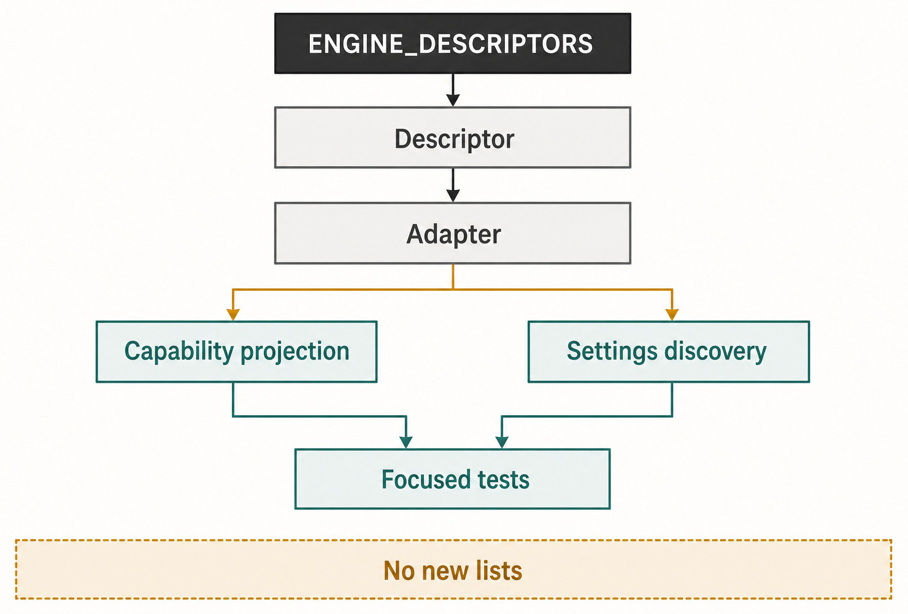
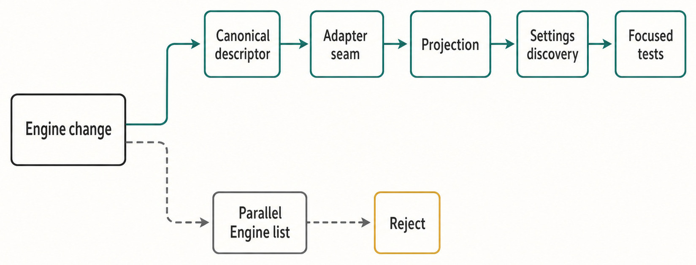

# Chapter 49 — Adding an Engine Without Adding a Second Truth {#chapter-49}

## The question

What is the smallest complete change that makes a new Agent Engine real in Haros—and how do you
know you have not copied its identity into five unrelated places?

The answer is an ownership cut, not a file-count target. A complete Engine addition extends the
typed Engine identity contract, adds exactly one canonical descriptor, implements one bounded
adapter and its runtime composition, projects discovery and Settings from the existing owners, and
proves the new member with focused tests. It may also need exact Haros-owned bilingual copy or an
admitted asset when a functional surface requires it.

It must not create a second Engine list in Chat, Sidebar, Settings, persistence, usage presentation,
or tests. It must not move Product Threads into native Engine state. It must not let the adapter
reimplement HostGateway permissions, cancellation, timeout, idempotency, receipts, file, Git,
terminal, browser, or device authority.

## The plain-English model

An Engine addition has one definition path and several derived consumers:

```text
typed Engine kind
  → ENGINE_DESCRIPTORS
    → adapter composition and registry
      → discovery, health, and capability projections
        → Settings and Composer consumers
```

`ENGINE_DESCRIPTORS` is the sole owner of Engine identity, registration, display name, capability
projection, and Settings discovery. The typed `EngineKind` schema defines which machine values may
cross contracts. The descriptor makes that member a canonical Haros Engine identity and supplies
credential-blind presentation. The adapter translates the runtime. Consumers derive rather than
register again.

The change is complete only when the Engine can be added, observed, selected, started, failed,
stopped, and rediscovered without a consumer inventing its own identity rules.



_Figure 49.1 — The add-an-Engine path extends the canonical owner and one adapter seam; consumer lists remain derived._

**Accessible equivalent.** ENGINE_DESCRIPTORS leads through Descriptor to Adapter. Adapter branches to Capability projection and Settings discovery, then Focused tests. No new lists constrains the full change radius.

## First decide whether it is really an Engine

An Engine is a complete agent runtime. It owns enough native behavior to start a Session, accept a
Turn, emit runtime events, handle interaction, and stop. A model, hosted inference API, search
service, MCP server, or credential source is not automatically an Engine.

Inside a model-service or search domain, **Provider** may be the accurate upstream concept. That
Provider belongs under its Engine's service owner. Promoting every Provider to an Engine would make
the product selector lie about what can execute a complete task and would duplicate model catalogs,
credentials, and health rules.

Before coding, write one sentence: “This runtime is an Engine because it owns …” Then name its
native lifecycle and protocol. If the sentence only describes models or tools, integrate it through
the existing Provider, capability, or MCP boundary instead.

| Question                            | Engine answer                                                       | Non-Engine answer                                                    | Consequence                                                               |
| ----------------------------------- | ------------------------------------------------------------------- | -------------------------------------------------------------------- | ------------------------------------------------------------------------- |
| What is being integrated?           | A complete agent runtime with native Session and Turn behavior      | A model endpoint, search Provider, tool server, or credential source | Choose adapter path only for the complete runtime                         |
| What state does it own?             | Native configuration and native Session state                       | Service-specific catalog, token, or tool state                       | Never move Product Thread state into either                               |
| What does Haros own?                | Product Thread, Queue, Timeline, recovery, exact admitted selection | The same Product owners                                              | No second store or fabricated continuation                                |
| How are local capabilities reached? | Typed HostGateway projection for the exact Turn                     | Existing capability or external MCP owner                            | No direct adapter filesystem, Git, terminal, browser, or device authority |

## Step 1: extend the machine contract and canonical descriptor

`packages/contracts/src/engineIdentity.ts` defines the closed `EngineKind` literals used by RPC,
persistence schemas, and server code. A new member needs a stable machine value there. Do not add a
cosmetic alias or dual-read path. If compatibility or migration is genuinely required, that is a
separate product decision; an Engine addition does not authorize it.

Add one matching entry to `ENGINE_DESCRIPTORS`. The descriptor list is exhaustively checked against
`EngineKind`, so a missing descriptor becomes a type error rather than an invisible Settings bug.
The descriptor owns the Haros display name and whether a live usage surface exists, including its
credential-blind sign-in hint and learn-more destination when applicable.

Do not copy the display name into a new `ENGINE_NAMES` map. Existing helpers derive
`ENGINE_DESCRIPTOR_BY_KIND`, `ENGINE_DISPLAY_NAMES`, and descriptor projections. Ordering for the
Web selector derives from descriptors. Usage-capable ordering derives from the descriptor's
`usage` field. Tests should compare consumer projections with the descriptor owner, not maintain an
expected hand-written list that becomes a second registry.

Machine names such as `@harnessos/*` and `.harnessos` remain stable implementation contracts. A new
Engine may have its own accurate native name in a selector or diagnostic. Haros remains the only
normal Product identity.

## Step 2: implement the adapter, not another orchestrator

`EngineAdapterShape` defines the translation seam. Required operations include starting a native
Session, sending a Turn, interrupting, answering approvals and structured user input, stopping a
Session, listing and checking active Sessions, reading and rolling back native Thread state where
the contract requires it, stopping all resources, and emitting canonical runtime events.

Optional methods correspond to declared capabilities: steering, skills, slash commands, plugins,
models, compaction, forking, account limits, and other bounded native features. Advertise only what
the adapter implements. The conformance checker currently verifies key capability/method pairs,
including steering and discovery methods. The absence of a conformance rule for a new capability
does not authorize a dishonest flag; add focused contract proof when the capability has a method
invariant.

The adapter owns native protocol translation and native Session resources. It does not decide the
Product Thread lifecycle, write Timeline projections, own Queue promotion, or select a fallback
Engine. It emits canonical runtime events to the durable Engine service, which feeds Product
Orchestration through the established path.

Runtime events use a bounded per-adapter ingress buffer. This makes a slow durable consumer apply
backpressure rather than allowing a native runtime to grow server memory without limit. A new
adapter must preserve cancellation and shutdown through that boundary.

| Adapter concern        | Required implementation                                                 | Existing owner it must call or respect                   | Forbidden shortcut                                                          |
| ---------------------- | ----------------------------------------------------------------------- | -------------------------------------------------------- | --------------------------------------------------------------------------- |
| Native lifecycle       | Start, send, interrupt, respond, stop, enumerate, and emit events       | Engine service and Session directory                     | Write Product Thread/session projections directly                           |
| Capability declaration | Exact structural flags and matching optional methods                    | Adapter contract and conformance checker                 | Show controls that fail only after invocation                               |
| Native discovery       | Typed, sanitized model/skill/command/plugin reads as supported          | Engine discovery service and authoritative Project scope | Trust a renderer path or create a screen-owned catalog                      |
| Local tools            | Accept the authorized exact-Turn projection                             | HostGateway                                              | Reimplement permissions, timeout, idempotency, receipts, or system services |
| Product history        | Report canonical events and opaque native identifiers                   | Product Orchestration and persistence                    | Treat Product Thread ID as portable native continuation                     |
| Failure/shutdown       | Settle native errors, release processes/listeners, make stop idempotent | Engine service lifecycle generation                      | Leave ambient background state or silently switch Engines                   |

## Step 3: compose exactly one adapter

The concrete adapter layer belongs in Server runtime composition. `makeServerEngineLayer` builds
the Engine-specific layer, supplies only its required dependencies, and provides it to
`EngineAdapterRegistryLive`. The registry checks every adapter for conformance, rejects duplicate
Engine registrations, orders registered Engines from `ENGINE_DESCRIPTORS`, and in normal
production composition fails when a descriptor has no adapter.

That last check is a useful completion test. A descriptor without an adapter is not “partially
supported”; normal composition should fail. A duplicate is not resolved by last-writer-wins.

Keep the dependency cut narrow. If an adapter needs server credentials, browser automation, or a
native process manager, provide the existing owner layer. Do not introduce a generic manager that
only renames calls. If several existing adapters already share a deep service, reuse it. If the new
runtime's protocol is unique, keep the implementation within its adapter instead of broadening
every adapter contract for hypothetical reuse.

## Step 4: project discovery, health, usage, and Settings

Discovery is observation, not registration. The discovery service resolves the adapter from the
canonical registry, derives an authoritative global-only or Project scope from Product
Orchestration, invokes only supported adapter methods, sanitizes failures, and returns typed
results. A new adapter's model or skill response must fit that contract. It must not pass native
objects or secrets to Web.

Health similarly reports current evidence about the configured runtime. A descriptor proves that
Haros recognizes an Engine; it does not prove that a binary exists, a version is compatible, or an
account is authenticated. Preserve the difference between structural capability and current
availability.

If the Engine exposes live account usage, adding descriptor usage metadata also creates a test
obligation: supply one fetcher under the usage implementation registry. That registry is allowed
because it maps a descriptor-declared optional capability to protocol code. It may not own Engine
identity, display order, or names.

Settings and Composer should consume descriptor-derived identity and typed server projections.
`apps/web/src/engineSettings.ts` uses `mapEngineDescriptors` for model-option projections, and
`engineOrdering.ts` derives order from the descriptors. Engine-specific configuration fields can
exist when the native runtime genuinely requires them, but a configuration row must not become a
new registration list. Product copy added for that row must be shipped in both English and
Simplified Chinese.



_Figure 49.2 — The exact change radius follows one direction from machine identity to derived product presentation._

**Accessible equivalent.** Engine change follows Canonical descriptor, Adapter seam, Projection, Settings discovery, and Focused tests. A dashed Parallel Engine list branch ends at Reject.

## Product Thread is still not a native Engine Session

A new adapter often tempts contributors to “resume” by copying identifiers. Resist that shortcut.
Haros Product Threads are durable product facts. Native Engine Sessions are private runtime facts.
An adapter may persist opaque native binding data required to reconnect to its own Engine, but it
cannot use another Engine's session ID or claim that a Product handoff continued the same native
conversation.

When a user changes Engines, Haros preserves Product history and follows stop-first semantics. The
new Engine begins with the context admitted through the normal handoff or history path. If launch
fails, the prompt and Queue remain Product facts; Haros does not silently fall back to another
Engine.

This boundary also simplifies deletion. Retiring an adapter should remove its composition and
descriptor-backed product availability without rewriting unrelated Product history. Any real
persistent-state migration is a separate, explicitly authorized owner cut—not a naming task hidden
inside integration work.

## Worked example: trace a fictional Engine addition

Assume a complete runtime named “Beacon” exists. This is a thought exercise, not a request to add
it.

First, the contributor proves Beacon is a complete runtime: it starts a native Session, accepts a
Turn, emits structured events, requests approval, supports interruption, and stops. A model API
alone would fail this test.

Second, they add one stable machine literal and one Beacon descriptor. The compiler now identifies
exhaustive projections that need to understand the member. They implement a Beacon adapter with
`sessionModelSwitch: "restart-session"`, because Beacon cannot switch in place. They do not claim
steering or plugin discovery.

Third, they compose the adapter in `makeServerEngineLayer` and provide it to the registry. Registry
tests prove uniqueness, descriptor order, and lookup. Adapter tests prove start/send/interrupt/stop,
event translation, idempotent cleanup, failure sanitization, and restart behavior.

Fourth, discovery tests use a temporary Project and fake Beacon process. They prove a valid model
catalog, auth-required failure, malformed native item isolation, and global-only passive discovery.
Health tests distinguish missing executable from missing authentication.

Fifth, Settings and Composer receive Beacon through descriptor-derived order and names. Only the
real Beacon configuration control and its bilingual copy are added. There is no Beacon string in a
Sidebar list, Chat list, persistence list, or fallback switch.

Finally, the contributor runs a future-change exercise: rename Beacon's Haros display name in the
descriptor. All identity consumers update without another edit. Then disable a structural
capability in the adapter. The relevant control changes through typed projection without changing
identity. Those two exercises prove that identity and capability have not been fused.

## What can go wrong

The most common failure is a superficially working integration that leaves a permanent
maintenance tax. The Engine appears in one picker but not Settings. A display name is spelled
differently in diagnostics. A native capability flag enables a button with no method. A direct
filesystem call works in a happy-path test but bypasses permission and receipts. A handoff copies a
native session ID and appears to continue until the two runtimes disagree.

| Failure                                                | Preserved state                                                                | Recovery                                                                          | Architectural signal                               |
| ------------------------------------------------------ | ------------------------------------------------------------------------------ | --------------------------------------------------------------------------------- | -------------------------------------------------- |
| New `EngineKind` lacks a descriptor                    | Existing Engine identities and Product State remain                            | Add the one canonical descriptor; let exhaustiveness expose consumers             | Machine schema and identity owner are incomplete   |
| Descriptor exists but normal registry lacks an adapter | Canonical identity exposes the missing implementation                          | Compose the bounded adapter and focused tests; fail normal startup until complete | Partial registration must not be hidden per screen |
| Duplicate adapters register the same Engine            | Product State is unchanged; lookup is ambiguous                                | Fail registry construction and remove the duplicate                               | No last-writer-wins adapter ownership              |
| Capability is advertised without required method       | Descriptor identity remains; adapter is invalid                                | Fix the implementation or remove the flag; conformance must pass                  | Presentation must not outrun structure             |
| Discovery or health fails                              | Product Thread, descriptor identity, and admitted historical provenance remain | Return sanitized degraded evidence and retry the same owner                       | Observation failure is not identity removal        |
| Native Session launch fails                            | Prompt, Queue, exact Engine/model/options binding, and Product history remain  | Settle failure visibly and retry deliberately                                     | Never silently select another Engine               |
| Local tool call fails                                  | Engine Session may remain; HostGateway operation/receipt records outcome       | Recover through HostGateway and capability service                                | Adapter must not add a direct fallback             |
| Consumer needs another Engine list                     | Existing product behavior may still work                                       | Stop and complete the descriptor projection instead                               | Strong evidence of a second truth                  |

## Security and privacy boundary

Adapter development must use fake credentials, temporary homes, synthetic Projects, and bounded
process fixtures. Never inspect or rewrite a real Engine's private configuration to make a test
pass. Native stderr and protocol payloads can contain secrets or private paths; sanitize them before
they enter Product diagnostics or fixtures.

Do not broaden HostGateway exposure because a native protocol can call arbitrary tools. The exact
Turn receives only the typed, currently authorized catalog. Credential and model-service details
remain server-side and credential-blind in Web projections. If the integration uses external or
copied code, follow `docs/source-intake.md` and update the sole source-adoption authority with exact
rights and paths; source presence alone does not authorize runtime activation.

## Try it safely

Do not add the fictional Engine. Perform a read-only change-radius exercise.

1. Read `EngineKind` and `ENGINE_DESCRIPTORS`; identify the compile-time exhaustiveness link.
2. Trace descriptor projection into `engineOrdering.ts`, `engineSettings.ts`, and
   `packages/shared/src/engineUsage.ts`. Confirm that names and ordering are derived.
3. Read `EngineAdapterRegistry.ts`. Identify the duplicate and missing-adapter failures and the
   descriptor-derived order.
4. Choose one optional capability in `engineAdapterConformance.test.ts`; state which method must
   exist and which failure should occur when it does not.
5. Read one existing adapter's focused start/send/interrupt/stop tests and one discovery integration
   test. Write the minimum Beacon proof list without changing source.
6. Search for places where adding Beacon would require a literal in Chat, Sidebar, Settings, or
   persistence. Any result is a projection gap to fix, not a new list to bless.

The observable result is an exact owner map and proof plan. No Engine installation, account,
credential, migration, or Product State is touched.

## Recap

- Confirm that the candidate is a complete Agent Engine, not merely a Provider, model, or tool.
- Extend the typed machine kind and one `ENGINE_DESCRIPTORS` entry; derive names, ordering,
  capability projection, and Settings discovery.
- Implement and compose one adapter whose declared capabilities match its methods and lifecycle.
- Keep Product Threads separate from native Sessions and local capabilities behind HostGateway.
- Treat any new consumer Engine list as evidence that the canonical projection is incomplete.

## Check your model

1. Why may a model-service Provider belong inside an Engine without becoming an Engine itself?
2. Which facts belong in the descriptor, and which belong in current discovery or health?
3. What should normal runtime composition do when a descriptor has no adapter?
4. Why is copying a native Session ID across Engines not a continuation feature?
5. What one-line change exercise can reveal a duplicated display-name owner?

## Source trail

- `packages/contracts/src/engineIdentity.ts` owns the closed machine schema; machine aliases and
  migrations are not implied by an addition.
- `packages/shared/src/engineMetadata.ts` owns exhaustive `ENGINE_DESCRIPTORS`, display names,
  ordering projections, usage capability metadata, and Settings discovery identity.
- `EngineAdapter.ts`, `EngineAdapterRegistry.ts`, and `engineAdapterConformance.ts` own the adapter
  seam, canonical lookup, uniqueness/completeness, and capability-method agreement.
- `runtimeLayer.ts` composes concrete adapters and their real dependencies into one server Engine
  layer.
- `EngineDiscoveryService.ts`, `engineSettings.ts`, `engineOrdering.ts`, and `engineUsage.ts`
  project runtime observation and descriptor-owned identity to consumers.
- Registry, conformance, discovery, ordering, and usage-registry tests provide the focused proof
  that a new member changes the owner cut without creating parallel lists.

<!-- guide-navigation:start -->

[Guidebook contents](../README.md) · [Previous: External Connections and MCP](48-external-connections-mcp.md) · [Next: Contributing, Proving, Packaging, and Shipping](50-contributing-proving-packaging-shipping.md)

<!-- guide-navigation:end -->
