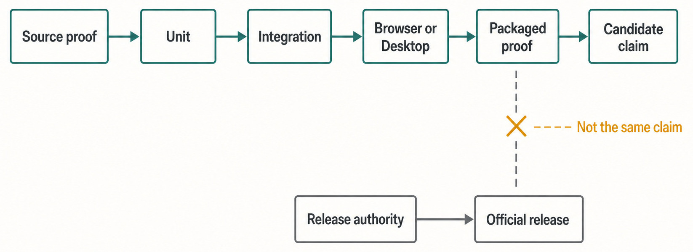
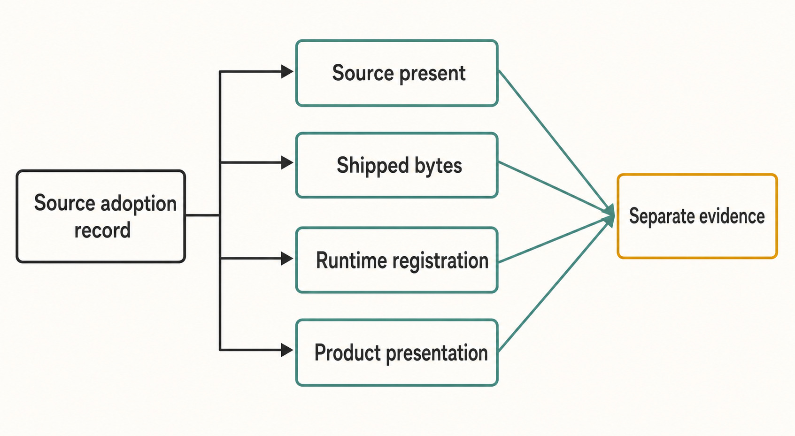

# Chapter 50 — Contributing, Proving, Packaging, and Shipping {#chapter-50}

## The question

When can a contributor truthfully say, “This Haros change is done”?

Not when the code compiles once. Not when a unit test passes. Not when an unsigned package opens on
one laptop. Completion means the requested user result is implemented under the correct owner, the
relevant failure and lifecycle paths are proved at the narrowest sufficient boundaries, source and
legal obligations are closed, and the claim stops exactly where the evidence stops.

For the pinned edition, Haros is source alpha. There are no official installers, releases, update
feeds, or paid support channels. The repository can build short-lived unsigned desktop artifacts
and run packaged smoke journeys. Those are valuable proofs. They are not publication authority,
code signing, notarization, a release, or a support promise.

## The plain-English model

A trustworthy contribution moves through five questions:

1. **Result:** What observable user or maintainer outcome is changing?
2. **Owner:** Which existing lifecycle owner must change so the result has one truth?
3. **Risk:** What normal, failure, cancellation, restart, shutdown, security, data, or legal edge can
   disprove the claim?
4. **Proof:** What is the narrowest test or real journey that crosses the same boundary as the
   claim?
5. **Authority:** Who is allowed to package, sign, publish, or call the result a release?

The proof ladder becomes broader only when the claim becomes broader. A pure parser change may stop
at unit and related type checks. A Product Orchestration lifecycle change needs integration and
restart evidence. A visible browser interaction needs browser proof. A Desktop process or shipped-
bytes claim needs Desktop or packaged evidence. None of those automatically grants release
authority.

_Figure 50.1 — Choose the lowest proof layer that can genuinely disprove the claim, then add broader layers only for crossed boundaries._

**Accessible equivalent.** Source proof proceeds through Unit, Integration, Browser or Desktop, Packaged proof, and Candidate claim. Release authority leads separately to Official release; Not the same claim marks the forbidden shortcut.

## Start from the exact workspace and owner

Before writing, confirm the repository root, current branch, and `git status --short`. A dirty
worktree is normal; unknown changes belong to someone else. Preserve them, avoid broad formatting,
and stage only paths you changed if a maintainer later authorizes a commit.

Read the root instructions, README, and architecture. The architecture is organized around owners,
not screens. Product Orchestration owns Project, Product Thread, Queue, Timeline, and recovery.
`ENGINE_DESCRIPTORS` owns Engine identity and discovery presentation. HostGateway owns exact-Turn
local capability authority. Product Threads are not native Engine Sessions. These are review tools:
if a proposed fix duplicates one of those facts in a convenient consumer, the fix is incomplete
even if its test passes.

Write the user result and non-goals in plain language. Then trace the current entry point through
the owner, writer, normal result, failure, restart, and shutdown. Existing tests are evidence of
behavior, not permission to preserve an accidental second truth. Existing code is replaceable; the
authorized product result and sole-owner rules decide the implementation.

Keep one contribution focused on one result or lifecycle responsibility. “Focused” does not mean
the fewest files. A correct owner cut may update a contract, producer, projection, consumer, and
tests together. A one-line workaround in a screen can be larger in lifecycle cost because every
future change must remember it.

## The proof ladder

The root scripts provide standard gates, but a contributor should understand what each can and
cannot prove.

| Claim                                            | Narrowest useful disproof                                                                                   | Typical command or evidence                                                         | Claim you still cannot make                                       |
| ------------------------------------------------ | ----------------------------------------------------------------------------------------------------------- | ----------------------------------------------------------------------------------- | ----------------------------------------------------------------- |
| Pure function or schema behaves correctly        | Focused unit test plus typecheck for changed contract                                                       | `bun run test:focused -- <paths>` or affected workspace test                        | Product journey works across processes                            |
| Server owner persists and recovers correctly     | Focused integration test with temporary state                                                               | Related server integration suite                                                    | Web geometry or Desktop lifecycle is correct                      |
| User-visible Web behavior works                  | Stable browser test using production component and synthetic state                                          | Affected browser test, keyboard/focus/reduced-motion checks                         | Native packaging contains or launches it                          |
| Desktop/process boundary works                   | Desktop smoke or focused process integration                                                                | `bun run test:desktop-smoke` or affected Desktop suite                              | All packaged platforms or shipped bytes are correct               |
| Packaged payload contains and runs the candidate | Frozen-source artifact build plus isolated startup/journey and legal closure                                | `dist:desktop:*` plus `verify-packaged-desktop.ts` in the authorized proof workflow | Artifact is signed, notarized, published, supported, or a release |
| Public-source baseline is coherent               | Format, lint, typecheck, unit/integration, stable browser, identity, legal, build/proof gates as applicable | Root checks and CI                                                                  | Maintainer has authorized external publication                    |

While developing, start with the cheapest focused test that can fail for the right reason. After the
change stabilizes, run formatting, lint, typecheck, and the affected unit/integration suites. Use
browser or Desktop proof when the claim crosses those boundaries. A candidate handoff should state
the exact commands, environment, and result, including anything not run.

Do not inflate a test result. A unit test with a mocked adapter proves the adapter contract under
that fixture. It does not prove a real credential or live service. A browser screenshot proves one
reproducible visible state. It does not prove persistence after restart unless the journey performs
that restart. A build proves compilation and assembly. It does not prove the installed application
can start.

## What can go wrong

Failure proof is part of the feature.

A happy path rarely closes an agent-workbench change. Ask what the user sees and what Haros
preserves when the Engine executable is missing, a process crashes, permission is denied, a request
times out, the server restarts, or the Desktop quits normally.

For a Turn launch failure, the prompt and Queue must remain recoverable; the product must not
silently select another Engine. For a HostGateway operation, cancellation, timeout, idempotency,
and receipt ownership stay in HostGateway. For an external MCP request, a stable request ID must not
create duplicate Product Threads. For an Engine addition, a missing adapter or dishonest
capability should fail composition or conformance instead of hiding a broken control.

| Failure in contribution flow                       | Preserved state                                                           | Recovery                                                                                 | Evidence boundary                                           |
| -------------------------------------------------- | ------------------------------------------------------------------------- | ---------------------------------------------------------------------------------------- | ----------------------------------------------------------- |
| Focused test fails                                 | Working tree and exact failing assertion/output                           | Fix the owning behavior or correct an invalid test assumption; rerun narrowly            | No broader gate should hide the focused failure             |
| Format/lint/typecheck fails outside changed intent | User and unrelated worktree changes remain untouched                      | Determine whether the failure is pre-existing or caused by the change; report accurately | Never rewrite unrelated files to obtain green output        |
| Browser/Desktop journey cannot reproduce           | Source change and synthetic fixture remain                                | Reduce to the failing boundary, repair fixture or product owner, rerun from fresh state  | A screenshot from a different state is not substitute proof |
| Artifact build fails                               | Source candidate and build logs remain; no release exists                 | Repair deterministic inputs or platform configuration and rebuild                        | Do not describe partial output as an installer              |
| Packaged startup/journey fails                     | Frozen source identity, temporary proof home, and failure evidence remain | Inspect sanitized logs, fix source/package boundary, rebuild and reverify                | Source tests cannot overrule a packaged failure             |
| Legal/source-adoption gate fails                   | Existing retained source and legal files remain                           | Reconcile exact origin, rights, paths, digests, notices, and shipped closure             | Do not remove notices or invent provenance to pass          |
| Signing/publication authority is absent            | Unsigned proof artifact may remain short-lived                            | Stop at packaged proof and request explicit maintainer release authority                 | Never call it a release, installer, or update feed          |

## Source adoption is part of engineering

External source, copied code, patches, vendored archives, and legal text require a separate intake
discipline. `source-adoptions.json` is the sole machine-readable authority. It records exact origin,
immutable revision or artifact identity, rights, adopted and source paths, local differences,
digests where required, and update policy.

Source presence, shipped bytes, runtime registration, and product presentation are four separate
claims. A vendored archive can exist in the repository without being activated. An adopted
component can ship without owning Haros Product State. A third-party name can be necessary in legal
metadata or a functional selector without becoming Haros's product identity.

| Source claim                  | Required owner/evidence                                            | What it proves                                              | What remains separate                                      |
| ----------------------------- | ------------------------------------------------------------------ | ----------------------------------------------------------- | ---------------------------------------------------------- |
| Source is retained            | Exact adoption record, path, immutable origin, and rights          | The reviewed bytes may be kept under recorded terms         | Whether those bytes ship or run                            |
| Bytes are shipped             | Deterministic artifact inventory and packaged closure              | The candidate payload contains the disclosed component      | Whether runtime activates it                               |
| Runtime is registered         | Existing Engine/capability composition and focused lifecycle proof | Haros can deliberately invoke it through the admitted owner | Product presentation and release status                    |
| Third-party identity is shown | Functional selector, diagnostic need, or legal provenance          | The label is accurate in that narrow context                | Haros remains the Product identity; no endorsement implied |

An adoption or update should retain exact license and notice text, preserve upstream tests that
still apply, add focused Haros lifecycle proof, and define how to update, replace, or delete the
adoption. Prefer deleting a local patch when upstream exposes an equivalent safe seam. Stop if an
update would create a second product store, registry, authority, compatibility path, or ambient
lifecycle.

The source-adoption check verifies unique records and retained paths. Deterministic legal metadata
generation builds dependency inventory, notices, and an SBOM-like record from installed and bundled
components. Packaged legal closure then compares what the ASAR actually contains with what the
inventory discloses, checks required lineage components, and confirms bundled runtime receipts.
Passing only the source record check does not prove packaged closure; passing packaged closure does
not grant release authority.

## What packaged proof actually proves

The packaging path intentionally calls itself **Unsigned Packaged Proof**. The build script stages a
short-lived desktop payload, binds source commit and lockfile identity, installs frozen dependencies
without lifecycle scripts, generates legal metadata, disables packager publication, and removes
ambient GitHub publication credentials.

The proof workflow has read-only repository permission, no signing secrets, no release-tag trigger,
no updater feed, no GitHub Release action, and an explicit publish-false setting. CI pins third-
party workflow actions to immutable commit SHAs. Proof artifacts expire quickly.

Packaged verification runs from an isolated temporary tree and a task-specific product home. It
allows only necessary operating-system environment variables into the launched application, so
Provider or product credentials do not become ambient test inputs. A host-wide proof lease prevents
two packaged journeys from interfering and never kills unrelated Haros processes. Linux and
Windows run startup proof; the current full interaction journey belongs to the macOS lane.

Verification checks the artifact's platform, architecture, version, frozen source identity,
packaged contents, startup, and—where selected—a bounded Product journey. It redacts in-memory auth
material from diagnostics and cleans its temporary state. Legal closure checks the packaged ASAR,
not merely development `node_modules`.

These are strong claims about a candidate payload. They are deliberately weaker than shipping.
Signing asserts publisher identity. Notarization or platform review adds another external gate.
Publication exposes an artifact to users. An update feed directs installed applications toward it.
Support and release notes make further promises. None follows from an unsigned smoke pass.

| Stage                     | Evidence produced                                              | Authority required                               | Truthful wording                                           |
| ------------------------- | -------------------------------------------------------------- | ------------------------------------------------ | ---------------------------------------------------------- |
| Source build              | Compiled Web, Server, or Desktop source outputs                | Contributor authority within the repository      | “Build passed at commit …”                                 |
| Unsigned artifact         | Frozen-input candidate files and legal inventory               | Authorized local/CI packaging path               | “Unsigned artifact built for proof”                        |
| Packaged verification     | Isolated startup or bounded journey against candidate bytes    | Authorized proof workflow                        | “Packaged proof passed on the tested lane”                 |
| Signed/notarized artifact | Publisher identity and applicable platform acceptance          | Explicit maintainer credentials and release gate | Only claim the exact completed signing/notarization step   |
| Published release/update  | Public artifact, release record, and possibly updater metadata | Explicit maintainer publication authority        | “Released” only after the real publication boundary closes |

_Figure 50.2 — Packaging can prove candidate bytes without crossing the signing, publication, or support boundary._

**Accessible equivalent.** Source adoption record fans out independently to Source present, Shipped bytes, Runtime registration, and Product presentation under the rule Separate evidence.

## Worked example: a small Engine discovery fix

Suppose an Engine returns one malformed model entry among several valid entries, and Settings shows
an unhelpful total failure. The intended result is to isolate the malformed item, preserve valid
models, and show a sanitized warning.

The contributor first confirms the workspace, status, and instructions. They trace the request from
Settings through typed RPC to `EngineDiscoveryService` and the selected adapter. The descriptor is
already correct, so they do not add a new Engine list or change Product persistence.

They add a focused adapter/discovery fixture containing valid, malformed, and credential-bearing
native values. The expected result keeps valid typed models, rejects the malformed item, and never
returns the credential. A failure test confirms an entirely unavailable source produces a typed
degraded result without selecting another Engine.

Because the visible warning changes, they update Haros-owned English and Simplified Chinese copy in
the same change and run the relevant localization check. They run the focused unit/integration
tests, typecheck, formatting, lint, and the affected stable browser scenario. They do not run a
packaged build because the claim does not cross Desktop assembly or shipped bytes.

In the pull-request description they state the result, owner, failure behavior, and exact tests.
They say “browser scenario passed,” not “release-ready.” If they had changed packaged assets or the
Desktop boundary, they would add `build:desktop` and the authorized packaged proof. If they had
copied upstream code, they would perform source intake and legal closure before handoff.

This example is complete because proof matches the claim. More gates would consume time without
adding relevant confidence; fewer would leave the visible failure path unproved.

## Contribution review: look for owner drift

A reviewer should be able to answer four questions from the diff:

- Where is the single fact owner after the change?
- Which consumers now receive a typed projection rather than copied knowledge?
- What happens on failure, cancellation, restart, and shutdown where relevant?
- Which test would fail if the user result regressed?

Watch for lists copied into screens, native Session identifiers presented as Product Thread truth,
adapter-specific direct file or terminal access, compatibility fallbacks without an authorized
migration, tests that repeat production logic, and documentation that promises more than the
source-alpha owner provides.

A contributor should stop when the authorized result and its lifecycle close. Adjacent cleanup,
new platforms, new compatibility, release publication, and speculative frameworks require their
own decision. “While we are here” is not an owner.

## Security and privacy boundary

Never commit credentials, private endpoints, user data, raw service responses, generated build
output, caches, or test artifacts. Use temporary homes and synthetic Projects. Sanitize logs before
sharing them. Security findings follow `SECURITY.md`: use private vulnerability reporting and do
not place exploit details or proof-of-concept payloads in public Issues or pull requests.

Ordinary reproducible bugs belong in Issues; broader questions and setup help belong in
Discussions. Security reporting, publication, signing, repository visibility, and updater changes
are externally consequential actions and require their exact authority. A contribution request is
not blanket authorization for them.

## Try it safely

Use a read-only or docs-only exercise; do not package, publish, or change source.

1. Choose one recent code path and write its user result, sole owner, failure path, and narrowest
   useful test.
2. Inspect `package.json` and classify `fmt:check`, `lint`, `typecheck`, unit, integration, browser,
   Desktop, artifact build, and packaged proof by the claim each can disprove.
3. Read `packaged-proof-smoke.ts`. List the publication authorities it explicitly rejects.
4. Read `packaged-legal-closure.ts`. Explain why comparing ASAR package identities with disclosed
   inventory is stronger than checking that a notice file exists in source.
5. Pick one `source-adoptions.json` entry. Identify its exact retained paths, rights, Haros
   differences, and replacement/update boundary without copying private material.
6. Draft a five-sentence handoff: result, owner, failure behavior, verification run, and unverified
   boundary.

The observable result is a truthful evidence statement. No private Engine state, signing identity,
network service, release channel, or real user installation is involved.

## Recap

- A contribution is complete when the user result, owner cut, lifecycle, and proportional proof
  agree—not when one convenient test turns green.
- Broaden verification only when the claim crosses Server, browser, Desktop, or packaged
  boundaries.
- External source intake and packaged legal closure are engineering responsibilities, not paperwork
  added after the code.
- Unsigned packaged proof validates a bounded candidate; it is not a release, installer, signature,
  update feed, or support promise.
- State exact evidence and exact unknowns, preserve unrelated work, and stop at the authorized
  outcome.

## Check your model

1. Why can an integration test pass while a user-visible browser claim remains unproved?
2. What does packaged legal closure prove that a source adoption path check does not?
3. Which publication authorities are deliberately absent from the unsigned packaged proof path?
4. When should a contributor run packaged proof, and what wording remains forbidden after it
   passes?
5. How can a very small consumer workaround create a larger lifecycle cost than a multi-file owner
   cut?

## Source trail

- `CONTRIBUTING.md`, root `AGENTS.md`, and `docs/architecture.md` define focused contribution,
  owner, Engine/Session, HostGateway, bilingual-copy, and proof boundaries.
- Root `package.json` owns the current development, verification, build, legal, and packaged-proof
  command entry points; scripts and CI own their implementation.
- `docs/source-intake.md` and `source-adoptions.json` own external-source admission, rights, exact
  paths, differences, digests, and update/deletion boundaries.
- `check-source-adoptions.mjs` verifies adoption identity and retained paths;
  `generate-legal-metadata.ts` verifies deterministic legal inventory; neither substitutes for
  packaged closure.
- `build-desktop-artifact.ts` stages short-lived unsigned artifacts with frozen inputs and
  publication disabled. `verify-packaged-desktop.ts` owns isolated startup/journey proof and
  cleanup.
- `packaged-proof-smoke.ts` enforces the proof-only workflow and absence of signing/publication
  authority. `packaged-legal-closure.ts` compares disclosed dependency identity with actual ASAR
  contents.
- `README.md` and `SUPPORT.md` are explicit that Haros is source alpha with no official installers,
  releases, update feeds, or paid support channels; `SECURITY.md` owns private reporting guidance.

<!-- guide-navigation:start -->

[Guidebook contents](../README.md) · [Previous: Adding an Engine Without Adding a Second Truth](49-adding-an-engine-without-second-truth.md) · [Next: Appendix A — Glossary](../appendices/appendix-a-glossary.md)

<!-- guide-navigation:end -->
