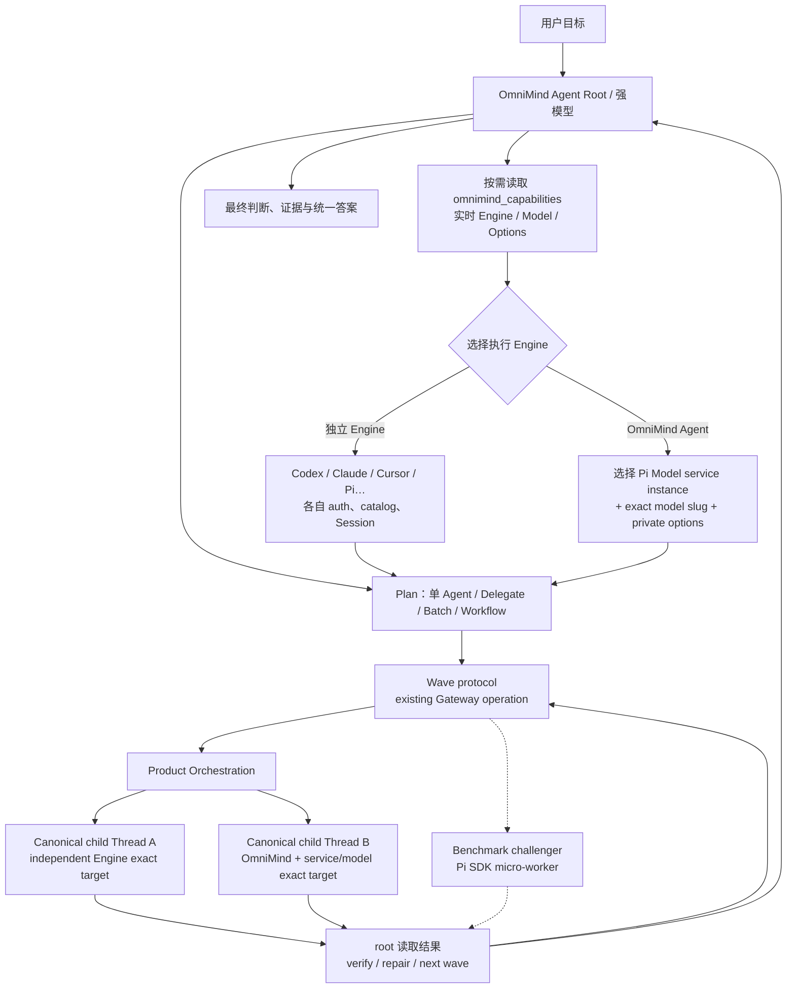

# OmniMind Agent Core：Pi 生态吸收、多模型协作与 Dynamic Workflow 深度审查

> 观察日期：2026-08-12
>
> 本地源码基线：`a9adf9fb9a30f6b0a9fb43fc3349c8d2fdfd5a9d`
>
> 文档性质：local observation + external evidence + inference + maintainer-confirmed direction
>
> 权威边界：本文是绑定下述日期与源码的固定研究、候选比较和反方压力测试；不取代 `architecture/` 中的产品与执行 contract，不声明功能已经实现，也不拥有 Campaign 或当前施工状态。
>
> 相邻研究：`research/model-services-composer-product-design.md` 保存 Composer、Engine 选择、OmniMind Agent Model services 与 Pi ModelRuntime 接线的设计来源。本文消费其历史结论，只描述这些事实如何约束 Agent Core、Subagent 与 Workflow；当前稳定合同与施工状态仍分别只看 `architecture/` 与 `execution-brief.md`。

> [!IMPORTANT]
> **处置（2026-08-15）**：本文保留为绑定 `a9adf9fb9a30f6b0a9fb43fc3349c8d2fdfd5a9d` 的历史研究证据，不是当前施工顺序或新会话入口。它仍保存后续研究需要的 Prompt Diet、Agentic Search、Memory/Wiki 分工、Pi package 候选矩阵、外部证据、压力测试和风险登记；其中关于代码状态、package 时点信号、Slice 顺序和执行准入的文字必须在最新 `main` 重新验证。
>
> 本文不是当前 Agent Core 研究或执行入口。现行稳定事实只看 `architecture/*`，Pi 生态重新进入遵循根 `PI-ECOSYSTEM-INTAKE.md`，当前工作只看 `execution-brief.md`；Pi 成熟 runtime 能力边界见 `research/pi-native-product-integration-review.md`，用户可见能力投影候选见 `research/omnimind-agent-capability-surface.md`。已弃用设计与退休施工门只由 Git 历史保留；不得从本文直接恢复旧分支、安装 package、创建第二控制面或复制旧 Slice 顺序。
>
> **当前议题 supersession（2026-08-19）**：正文中任何“优先采用第三方Pi Todo Extension”、把lazy MCP或第三方MCP Settings纳入首版、建立Host/global Tool Search、让Host active set按每回合重算，或把Host dynamic loading视为确定终态的表述均为历史proposal，不能作为当前准入。Todo现行证据只看[`pi-native-todo-extension-review.md`](pi-native-todo-extension-review.md)；Extension Architecture 1.0、Host Projection eager-active、strong Host parity与owner-local dynamic边界只看[`pi-native-host-tool-loading-review.md`](pi-native-host-tool-loading-review.md)及`architecture/execution.md`；第三方MCP管理继续退出首版。本文中的Chat Todo、六组taxonomy、Device full-access、Browser download、approval/auto与Marketplace建议也不能借当前Host裁决自动采用。
>
> **Web Access supersession（2026-08-22）**：正文 §8.4 与 package 表中的 `pi-web-access@0.22.0`、默认 headless/按需 Curator、旧版本与旧接入建议只作历史研究。当前 exact source、`@harnessos/om-web-access` fork、bundled-only support、非 Host 边界、默认 Right Dock Curator、配置/availability/`source_check` 和长期维护合同只看 [`pi-web-access-intake.md`](pi-web-access-intake.md)。

## 0. 为什么存在这份文档

这轮讨论不是“给 Pi 多装几个 package”，也不是“单独实现一个 Dynamic Workflow”，更不是先假定 Pi 不够强、然后在 Host 中重造一套 Agent Runtime。真正目标是把 OmniMind 内置的 Pi-derived runtime 完成为 **OmniMind Agent**：先完整继承 Pi 已经做好的 Provider、Model、认证、Session、上下文、compaction、工具、资源、extension、usage/cache 与 package substrate，再用 OmniMind 已经拥有的 Engine adapters、Product Thread、Workbench、Browser、MCP 和资产系统补齐跨 Engine 编排与产品体验。

维护者的野心可以准确压缩为一句话：

> OmniMind 要吃掉兼容 Pi 的生态，但最终交付的不是一份 Pi 套壳或 package 合集，而是一个能吸收 Pi、Claude Code、Codex 及自有资产优点、原生支持异构多模型协作、Agentic Search、Goal、Todo、Dynamic Workflow、Markdown Memory/Wiki 和可验证完成闭环的 OmniMind Agent。

本文在该历史快照内回答以下研究问题：

1. 维护者究竟要什么，明确反对什么；
2. OmniMind 当前已经具备什么，缺口在哪里；
3. 为什么现成 Pi subagent/workflow package 不能直接成为 canonical runtime；
4. 如何让强模型调度任意已配置 Engine，或 OmniMind Agent 内任意真实可用 Model service/model 的独立 Subagent；
5. Dynamic Workflow 到底是什么，为什么它必须支持高并发、多波次、验证和恢复；
6. Agentic Search、Memory、Wiki、Goal、Todo 与 Workflow 如何分工；
7. 哪些 package 应直接兼容、fork、只借机制或拒绝；
8. Prompt 现在是否需要改、现状有什么问题、正确分层是什么；
9. 最小而完整、兼容未来、不会形成第二控制面的施工方案是什么；
10. 如何验证它真的比“装了一堆插件”强，而不是只在概念上强。
11. 用户所选 Engine、OmniMind Agent 内部 Model service、具体 Model 与 Engine-private options 如何保持真实层级；
12. 配置变化、服务实例增删、长流程恢复与跨 Engine repair 时，exact target 如何不漂移、不静默替换。
13. Pi 已经拥有的 Runtime 能力哪些必须原样复用，哪些 Host 封装目前反而可能削弱；
14. Prompt/cache/context/tool/compaction/Subagent/Workflow 的整体复用经济学如何优化，而不建设第二套缓存或上下文平台。

本文中的证据强度按以下方式理解：

- **local observation**：已在当前 OmniMind exact SHA 的源码、测试或 Campaign evidence pointer 中观察；
- **external evidence**：来自 package 页面、上游文档或产品资料，只证明上游所述行为，不能自动外推到 OmniMind packaged runtime；
- **inference**：由本地与外部事实共同推出，必须能被后续 fixture/live journey 推翻；
- **maintainer-confirmed direction**：维护者明确选择的产品方向，但在进入 `architecture/` owner 前仍不是可执行 contract；
- **proposal**：本文建议的实现，尚待 architecture adoption 与验证。

若本文的 package 描述与某个 exact upstream revision 源码冲突，以源码与可复现实验修订本文；若本文与 `architecture/` 对同一产品事实冲突，停止施工并先修 sole owner。

## 1. 结论先行

### 1.1 总体裁决

应当建设 **OmniMind Agent Core**，但不能建设第二套 Agent 平台。默认举证责任必须落在“为什么不能继续复用 Pi”一侧，而不是落在 Pi 身上：只要 Pi 的 public SDK/runtime 已拥有正确 owner 和足够 extension point，OmniMind 就应直接继承或做薄 Host bridge；只有存在可复现的产品缺口、跨 Engine 缺口或 packaged 兼容缺口，才允许 fork 或新增机制。

更准确地说，**Pi 不是主要改造对象，OmniMind 后加的每一层才是主要审查对象**。Host Harness、Core Policy、gateway tools、Provider projection、Workbench UI、package bridge、Memory、Subagent 与 Workflow 都必须证明自己没有削弱 Pi 原有的模型支持、认证、Session、Tools、Extensions、Skills、Prompts、compaction、stream、usage/cache、取消和恢复。选择 Pi 的战略价值不仅是今天功能强，更是未来能低成本跟随上游；任何让 upstream upgrade 变困难的私有改造，都必须支付明确且持续的维护预算。

Core 的首个、也是目前唯一有完整产品证据的 Worker 路径，是 OmniMind 已有的 Host Thread/Turn + Product Orchestration + Engine adapters。Pi SDK child session 可以作为 **OmniMind Agent 内部、多 Model service 的 micro-worker challenger**，但在它用真实任务证明明显收益之前，不把“两种 Worker backend”写成正式架构，也不先为它建设通用 backend interface。成熟以后仍不能接管任意独立 Engine 的 lifecycle。

最重要的前置裁决是：**先保护并盘清 Pi 已有能力，再闭合执行目标的事实，最后才用 Prompt 教模型调度。** 当前 Host 已有 exact heterogeneous Thread dispatch 的结构能力，Pi 也已经拥有成熟的 ModelRuntime、Session、ResourceLoader、compaction、tool lifecycle 与 provider-specific cache handling；真正的缺口主要在 Host 产品层和跨 Engine 编排层。与此同时，Host 还不能把“静态默认模型可被解析”当成“该 OmniMind Model service 已发现、已认证、此刻可执行”。因此施工主轴必须是：

1. Pi-first capability inventory 与 Host regression audit；
2. Model services capability truth；
3. truthful Core Policy 与一波委派；
4. Role / Search / MCP / Goal / Memory 资产；
5. 基于现有 Gateway operation 的多波次 Dynamic Workflow；只有实证需要时再增加 durable graph recovery。

完成后才能真实实现：

- 强模型负责理解、判断、拆解、选择角色与模型、监控、质疑和最终综合；
- 每个 Worker 可从当前真实可用能力中选择任意独立 Engine，或在 OmniMind Agent Engine 内选择任意已配置 Model service、exact model slug 和 engine-private options；
- Worker 直接复用各 Engine 自己的发现、认证、Session、Tools 和恢复语义；OmniMind Agent 内部 Model service 直接复用 Pi ModelRuntime 与 `.omnimind`；
- 所有用户可见执行仍是 canonical Thread/Turn，不出现隐形的第二套 Run、任务、认证或模型真相；
- Pi package 贡献算法、交互模式和资产，不篡夺 OmniMind owner。

### 1.2 Core 不是“默认把所有东西塞进上下文”

维护者已经否定“Advanced 能力”这种分层。正确解释是：

- 对效果有决定性贡献的能力应进入 Core；
- Core 能力默认可达、可被模型自主选择；
- 但工具定义、Skill 正文、Wiki 全文、MCP server 和 Workflow 细节应按需加载；
- “Core”表示产品保证和原生协调，不表示每回合都执行、不表示每回合都占 context。

建议的 Core 能力：

1. Agentic Search；
2. Web Search / Fetch / Source Check；
3. OmniMind Browser；
4. lazy MCP；
5. Todo；
6. Goal Loop；
7. heterogeneous Delegate/Subagents；
8. Dynamic Workflow；
9. Markdown Memory/Wiki；
10. compaction/resume handoff；
11. reviewer/judge/repair patterns；
12. 真实环境验证和证据收口。
13. Pi 原生 context/compaction/cache/usage 能力的完整保留与可观察性。

这些是产品保证层，不是同一成熟度层。Agentic Search、Todo、one-wave Delegate 可以先基于现有能力交付；Model services truth 是所有异构路由的前置；Dynamic Workflow 则必须等 exact target、父子事实和恢复 contract 闭合后再成为可宣称能力。

### 1.3 最关键的奥卡姆剃刀

Pi 与 OmniMind 已经共同拥有大部分必要底座。最小完整路径不是导入一个庞大框架，也不是把 Pi 的成熟能力重新包装成一批 OmniMind-owned services，而是：

1. 逐项确认 Pi public runtime 已拥有的 owner，先删除 OmniMind 重复设计与 Host 能力退化；
2. 让 Composer 与 Host 准确表达 Engine、OmniMind Model service、Model 与 option，消除静态 default 伪装成 ready 的路径；
3. 把现有 Host Gateway 的 exact Thread 创建能力提升为 OmniMind Agent 的原生 Delegate 能力；
4. 用紧凑、稳定且诚实的 Core Policy 教会模型按需查询能力、搜索、委派、验证和停止；
5. 在同一 Thread/Turn owner 上增加一个薄的、可恢复的 Workflow Scheduler；
6. 从高价值 Pi packages 中吸收工具与算法，减掉 TUI、重复 registry、重复 scheduler、重复 task system 和 Pi home 假设；
7. 让 provider-specific cache、usage、context 与 compaction 继续由 Pi/native Engine 拥有，Host 只做 typed projection、评测和产品诊断；
8. 用 capability truth、真实 Provider、package compatibility harness 和 packaged journey 证明它真的可执行。

不需要新建第二个 Provider Registry、第二个 Auth store、第二个用户级任务系统、第二个 Workbench、第二个 package marketplace、第二个 prompt-cache store 或“统一上下文平台”，也不需要 RAG/vector/BM25 平台或重型 Safety 平台。

## 2. 已锁定的维护者方向

以下不是本研究者自行推断，而是本轮讨论中维护者明确给出的方向。后续会话不得无依据重新翻案。

1. **内置 Pi 已经不是 Pi 产品。** 它是 OmniMind Agent 的 runtime 基础之一。
2. **目标不止 Dynamic Workflow。** Goal、Todo、Subagents、Memory、Wiki、Agentic Search、MCP、Skills、Prompts、恢复与验证都要全局设计。
3. **要吃掉 Pi 生态。** 高价值 package 可以直接兼容，也可以 fork 后二次开发；不要低估本项目开发能力。
4. **效果大于形式。** 喜欢 Markdown/Wiki 不是为了教条化文件格式，而是为了透明、可编辑、可积累和 Agent 可搜索的效果。
5. **强烈反对 RAG 化。** 本地长期知识不采用 vector database、embedding pipeline、BM25/FTS 召回；本地搜索以 `rg` 为唯一文本检索原语。
6. **真正喜欢的是 Agentic Search。** Wiki 是可持续知识层，不是搜索能力本身；Agent 应主动选择源、构造查询、验证、追问和停止。
7. **反对重型 Safety。** 不建设独立 Safety 平台、权限官僚或重复 approval broker；但必须保留状态隔离、取消清理、秘密不泄露等运行正确性。
8. **Dynamic Workflow 应有高并发。** 不能因为早期实现方便就固定在 2–4 个 Agent；应利用 Host 当前每批最多 20 个 Thread 的能力，并支持多波次。
9. **Advanced 不应成为能力墓地。** 能显著提升默认体验的机制应成为 Core，只做 lazy exposure。
10. **受欢迎程度是重要调查先验。** stars、下载量、实际使用越高越应严肃对待；低采用项目必须更谨慎。但人气不能替代源码、兼容性和效果证据。
11. **Prompt 需要现在开始改。** 但只能描述当前真实能力；尚未实现的 multi-wave scheduler 不能提前宣称存在。
12. **强模型必须能调度弱模型或不同厂商模型。** Role 可以约束或建议执行目标，但 root 必须依据当前 capability truth 提交 exact target；Host 不维护第二份“强/弱/便宜/专家模型”权威表。
13. **Engine 与 Model service 不得压平。** Codex、Claude、Cursor、stock Pi、OmniMind Agent 是执行一轮的 Engine；DeepSeek、MiMo、Anthropic、OpenAI-compatible custom instance 等是 OmniMind Agent 内 Pi ModelRuntime 的 Model services。
14. **配置变化不能改写已经接纳的节点。** 未 dispatch 节点按最新能力重新解析；已接纳 attempt 保留 exact target snapshot；跨 Engine repair 创建有 provenance 的新 attempt，而不是假装 native resume。
15. **Pi-first 是默认工程纪律。** Provider request formation、ModelRuntime/Auth、Session、Resources、Extensions、Skills、Prompts、Tools、compaction、usage/cache 等，先使用 Pi public surface；只有 benchmark 与可复现缺口才能批准 fork 或 Host-owned replacement。
16. **Cache 是全局执行经济学，不是独立产品。** 追求的是成功率、有效上下文、总成本、首个有效结果时间与可恢复性，不追求可被无用长前缀刷高的 cache hit ratio。
17. **未来可维护性是选择 Pi 的核心理由。** OmniMind 差异优先存在于可删除的 Host、bridge、asset 与 policy layer；Pi core 默认不改。确需 fork 时，必须最窄、可 rebase、可单独验证、可在上游补齐后删除。

## 3. 术语与职责：先消除最危险的混淆

### 3.1 OmniMind Agent

OmniMind Agent 不是 provider logo，也不是 Pi 的别名。它是以下能力的组合：

```text
Pi-derived coding runtime
+ OmniMind Host capabilities
+ OmniMind cognitive policy
+ curated/forked Pi ecosystem assets
+ user-installed Skills / Prompts / MCP
+ OmniMind Engine adapters and Model services
+ Workbench projections and product state
= OmniMind Agent
```

### 3.2 Engine、Model service、Model 与 option

这是全文最重要的身份层级：

```text
Engine
  = 谁执行这一轮，并拥有自己的 adapter / auth / Session / tools / recovery
  例：omnimind、codex、claudeAgent、cursor、pi

Model service
  = 仅当 Engine === omnimind 时，Pi ModelRuntime 中一个稳定 provider instance
  例：deepseek、deepseek-proxy、mimo、anthropic

Model
  = 该 Engine 可接纳的 exact model slug
  OmniMind Agent 内必须保留 service instance identity，例如：
    deepseek-proxy/deepseek-chat

Engine-private options
  = 由该 Engine / Model descriptor 暴露并解释的真实选项
  例：reasoningEffort、effort、thinkingLevel、variant
```

统一的提交形态可以继续是：

```text
ModelSelection = Engine + exact model slug + engine-private options
```

但这只是 transport-level selection，不表示所有 Engine 共享同一种认证、模型目录、Thinking 语义或质量等级。尤其不得：

- 把 DeepSeek/MiMo 等 OmniMind Model services 提升成独立 Host Engines；
- 把 Codex/Claude 等独立 Engines 塞进 Pi ModelRuntime；
- 通过品牌名猜 custom instance 的 OAuth、动态目录或 stream 能力；
- 把不同 Engine 的 private option 归一成虚构的通用“推理策略”；
- 删除 service instance 后静默落到同品牌另一个 service。

同一商业供应商的多个服务实例必须使用稳定 Pi provider id 区分。显示名可改，identity 不随改名变化；删除或不可用必须显式失败。

### 3.3 Agent、Workflow、Delegate、Thread

- **Agent**：模型根据环境反馈动态选择过程与工具。
- **Workflow**：执行图、依赖、并发、检查和恢复由代码/图结构表达；图可由 Agent 动态生成。
- **Delegate/Subagent**：一个或少数隔离任务，父 Agent 期望拿回结果。
- **Batch**：一波彼此独立的并行 Delegate。
- **Dynamic Workflow**：任务拓扑事先不可完全预测，root 动态生成/修改多波次图，Worker 结果可产生新节点，包含 verify/judge/repair 与 journal/resume。
- **Product Thread**：OmniMind 用户可见、可继续、可诊断的 canonical 协作与执行事实。
- **Workflow Journal**：只记录图节点、依赖、输入摘要、Thread/Turn 引用、状态、输出 contract 和恢复边界；不是第二份完整 Thread、Run 或模型 registry。

Anthropic 对 workflow 与 agent 的区分可作为外部概念参照：workflow 走预定义代码路径，agent 动态控制过程；常见模式包括 routing、parallelization、orchestrator-workers 和 evaluator-optimizer。来源：[Building effective agents](https://www.anthropic.com/engineering/building-effective-agents)。

### 3.4 Todo、Goal、Workflow、Automation

| 概念             | 唯一职责                                     | 不应拥有                                               |
| ---------------- | -------------------------------------------- | ------------------------------------------------------ |
| Todo             | 当前工作中的轻量步骤和即时进度               | 跨会话 durable scheduler、Provider routing、Run truth  |
| Goal             | 一个会话内“继续直到完成/阻塞/等待”的完成循环 | 多 Goal 队列、第二任务系统、第二 Automation            |
| Delegate         | 一次聚焦的父子任务委派                       | 全局任务图、周期调度                                   |
| Dynamic Workflow | 多节点依赖、并发波次、验证、恢复             | 第二 Product Thread、第二 Provider Registry、第二 Auth |
| Product Thread   | 用户可见协作与 execution truth               | workflow-specific DAG 算法                             |
| Automation       | 定时/事件触发的 durable 产品能力             | 冒充 session Goal 或 workflow scheduler                |

最危险的错误是把一个 package 自带的 `task`、`mission`、`schedule`、`run` 直接映射为新的 OmniMind 产品实体。那会制造 owner 冲突、恢复歧义和 UI 双轨。

### 3.5 单一 owner 地图

| 事实                                                 | 唯一 owner                            | Core / Workflow 如何消费                                |
| ---------------------------------------------------- | ------------------------------------- | ------------------------------------------------------- |
| Engine identity、auth、native Session、Tools、resume | 对应 Engine adapter/native runtime    | 查询、精确选择、保留 provenance，不复制                 |
| OmniMind Agent Model service auth/catalog/config     | Pi ModelRuntime + `.omnimind`         | 通过 typed Host projection 使用，不建静态镜像           |
| Provider request、prompt cache、usage/cost           | Pi/native Engine adapter              | 传入稳定 session/target，投影原生事实，不建统一缓存真相 |
| Session context、compaction、branch summary          | Pi/native Engine runtime              | 消费事件与摘要，不复制 transcript 或自建 context engine |
| 用户可见 Thread/Turn、Timeline、cancel/recovery      | Product Orchestration / Product state | child node 引用 canonical IDs                           |
| Role/Skill/Prompt/Wiki                               | 对应 Markdown / package asset owner   | lazy resolve，记录 source                               |
| Workflow 图与节点依赖                                | thin Scheduler journal                | 只保存图事实和 canonical references                     |
| 用户可见 workflow/worker surface                     | Workbench                             | 投影真实状态，不复制 package TUI                        |

这张表是奥卡姆剃刀：Core 只新增目前没有 owner、且确实属于跨节点协调的最小事实。

## 4. OmniMind 当前已经有什么

### 4.1 已有的 exact heterogeneous dispatch 结构

当前源码已经提供：

- `omnimind_capabilities`：返回 canonical Engines、models、engine-private option keys、可用状态和 gateway limits；见 `apps/server/src/agentGateway/threadReadTools.ts`。
- `omnimind_create_threads`：一次创建精确的 1–20 个独立 Thread；每个条目独立携带 `target { provider, model, options }`，其中历史字段名 `provider` 在产品语义上表示 Engine；见 `apps/server/src/agentGateway/Layers/AgentGateway.ts`。
- `omnimind_wait_for_threads`：等待子 Thread 结果并供父 Agent 汇总。
- 上限 contract：`OMNIMIND_GATEWAY_MAX_THREADS_PER_OPERATION = 20`；见 `packages/contracts/src/agentGateway.ts`。
- Harness 明确要求不得猜测 model slug、不得静默替换 Provider/Model，并要求使用 capabilities 的 exact target construction；见 `apps/server/src/agentGateway/harnessPolicy.ts`。

因此，**结构能力**已经存在：root 可以查询 Host 能力、提交一波 exact heterogeneous Thread targets、等待并综合。这个判断不能再被写成“任意已配置模型今天都已可靠可执行”。

> 更准确的当前事实是：一个强模型今天已经具备 exact one-wave heterogeneous dispatch 的 Host 工具形状；只有当对应 Engine/Model service 的 known、available、auth 与 option truth 真实闭合时，具体 target 才能被宣称为可执行。

这非常重要。后续实现不能忽略它，另建所谓 `SubagentModelRegistry` 或 `WorkflowProviderRegistry`。

### 4.2 当前 readiness truth 缺口

当前 source 存在一条必须在产品级 Prompt 与 Workflow 前正视的反证：

- `targetResolver.ts` 对 OmniMind Agent 保留静态 default；
- 当 live model discovery 为空但存在 default 时，catalog 仍可能把该 default 投影为 `available: true`；
- 空目录解析还可接受这个静态 default；
- contracts 中的 OmniMind default 是 `deepseek/deepseek-chat`；
- Provider health 又把 bundled OmniMind Engine 视为 ready，而 auth 可能仍是 `unknown`。

这意味着“Gateway 能描述/接受 target”不等于“Pi ModelRuntime 已确认该 service instance 有凭据且可发送”。必须把以下状态分开：

| 状态           | 含义                                       | 能否作为 dispatch 证据                 |
| -------------- | ------------------------------------------ | -------------------------------------- |
| known          | 目录知道这个 model slug                    | 否                                     |
| available      | 当前 runtime/provider 声明可选择           | 仍需 auth/send gate                    |
| authenticated  | credential lifecycle 已确认                | 仍需真实 admission                     |
| executable now | 当前 exact target 经 send admission 可执行 | 是                                     |
| unknown        | 尚无足够证据                               | 否，不能用 bundled/static default 抹平 |

第一项实现优先级不是“再加一个模型映射”，而是修复这条静态 default 伪 ready 路径，并让 capabilities 与 send admission 使用同一份真实 ModelRuntime evidence。

### 4.3 当前 Core 缺口

已有能力还不是完整的 OmniMind Agent 原生协作，因为：

1. Host policy 主要描述工具规则，没有形成 OmniMind Agent 的认知工作法；
2. `omnimind_create_threads` 是一波创建计划，每个 active caller turn 只允许一个 creation plan；
3. 创建 dispatch 本身当前在 `creationCoordinator.ts` 中以 `concurrency: 1` 顺序完成，不过创建后的子 Thread 可以并行执行；
4. 没有 canonical multi-wave DAG scheduler；
5. 没有 role asset 到 exact ModelSelection / Skills / Tools / Output Contract 的统一解析；
6. 没有 workflow journal、节点级 resume/recompute/repair；
7. Workbench 还没有把一组 child Threads 投影成一个清晰的 workflow graph/progress surface；
8. Prompt 没有系统教会 root 区分单 Agent、Delegate、Batch、Goal 和 Dynamic Workflow；
9. Memory/Wiki 尚未形成 `rg`-only 的长期学习闭环。

### 4.4 Pi ModelRuntime 的真实能力与边界

`apps/server/src/provider/Layers/PiAdapter.ts` 当前为每个 agent directory 创建 Pi 自己的 `ModelRuntime`：

```ts
ModelRuntime.create({
  authPath: path.join(agentDir, "auth.json"),
  modelsPath: path.join(agentDir, "models.json"),
});
```

创建 SDK session 时，Pi services 使用该 runtime，加载 Pi resources，追加 Host system prompt，并注入 OmniMind gateway tools。

对当前 bundled `@earendil-works/pi-ai@0.84.1` 与 `@earendil-works/pi-coding-agent@0.84.1` 的源码复核表明，Pi 已经拥有的并不只是“轻量调用模型”：

- `ModelRuntime` 与 `ModelRegistry` 拥有 provider instance、认证与模型目录；
- `AgentSession` 拥有 model/thinking、prompt、steer/follow-up、tool registry、active tool rebuild、retry、compaction、branch summary、Session stats 与持久 session；
- `DefaultResourceLoader` 统一加载/reload Extensions、Skills、Prompt templates、Themes、context files 与 system prompt，并保留 source/diagnostic；
- `pi-ai` 对 cache retention、session affinity、provider compatibility、cache read/write tokens 与 cost 有统一类型，再由 OpenAI Responses/Completions、Anthropic-compatible、Bedrock、Gemini、Mistral 等 adapter 映射到各自 wire semantics；
- `pi-coding-agent` 已统计 cache waste，区分首次请求、从未报告 cache 的 provider、合法 compaction/branch summary 与真实重复计费；
- tool set 变化会重建 system prompt；resource reload、Skill/Prompt expansion 与 per-turn extension modification 都是 Pi 已存在的 lifecycle，而不是 OmniMind 需要另造的概念。

当前仓库还同时装有本地 `@harnessos/pi-coding-agent@0.84.1` bundle。它不是另一套 Agent 实现：对 installed `dist` 排除 source maps 的目录比较未发现差异，产品差异集中在 package metadata——包名、`.omnimind` config root、product name、移除 CLI bin、锁定依赖与发行文件。`PiRuntimeIsolation.test.ts` 进一步验证 stock family 与 product family 具有独立 module identity、project/global resources、Session 和 package roots。这种 **相同 Runtime 字节 + 最小 metadata 隔离** 正是未来应保持的理想形态；不能让 branded bundle 逐步吸收无关私有逻辑，悄悄变成难以升级的第二 Pi core。

因此 **Pi Runtime 本身应被视为成熟 substrate，而不是待补齐的空壳**。OmniMind 的第一责任是保持这些语义穿过 Host bridge 后仍可用、可观测、可取消、可恢复；若 Host injection、UI bridge、usage normalization 或 Product Thread projection 丢失了 Pi 原生能力，这叫 integration regression，不叫 Pi 缺功能。

这意味着两件看似相反、实际同时成立的事：

- Pi extension 在同一 Pi SDK 内创建 child session 时，天然理解 Pi ModelRuntime/auth/models；该 runtime 可以连接多个厂商和多个 custom provider instances，并不等于单一供应商；
- 它不会自动得到 Host 的 CodexAdapter、ClaudeAgentAdapter、OpenCodeAdapter 等 Provider runtime；
- package README 里写“跨 provider model routing”，通常指 Pi ModelRuntime 中的 Model services，不等于 OmniMind Host 的所有 Engines；
- 原样安装的 Pi subagent/workflow package 无法自动完成维护者要求的“任意 OmniMind Provider/Model + 原生认证复用”。

相邻 Composer 研究还确认：Settings 侧完整的 OmniMind Agent Model services Host surface 尚未交付。正确 owner 是 task-local ModelRuntime + Pi login/logout/catalog lifecycle；不能把一个全局可变 ModelRuntime 注入所有 Thread，也不能新建 `model-services.json` 充当第二真相。custom provider 持久化若上游暂时缺公共 mutation API，只能在明确授权下使用单一、可删除的窄 `models.json` adapter，并具备锁、unknown-field preservation、原子替换与 reload validation。

### 4.5 当前能力真值表

| 能力                                | 当前判断                          | 不得外推                                                         |
| ----------------------------------- | --------------------------------- | ---------------------------------------------------------------- |
| exact one-wave Host Thread dispatch | 结构已存在                        | 不等于多波次 Workflow                                            |
| Host independent Engines            | 继承 adapter 各自拥有             | 不等于共享 auth/catalog                                          |
| OmniMind Agent Pi ModelRuntime      | per-agent-dir 已存在              | 不等于 Settings Model services 已完整交付                        |
| OmniMind model static default       | source 中存在                     | 不等于 live known/available/authenticated                        |
| child Thread execution concurrency  | 创建后可并行                      | 不等于 creation dispatch 已高并发                                |
| Pi package compatibility            | representative journeys 已有证据  | 不等于 TUI/native/background 全兼容                              |
| Pi SDK child session                | 可做多 Model service micro-worker | 不等于可调用任意 Host Engine                                     |
| Pi Session/Resource/Tool/Compaction | public runtime 已拥有             | 不等于 Host bridge 已完整保真                                    |
| Pi provider cache/usage             | 多 adapter 已原生建模             | 不等于每个兼容 endpoint 真实支持，也不等于跨 Engine 可共享 cache |

### 4.6 Pi extension UI bridge 不是完整 TUI

当前 PiAdapter 对 `select`、`confirm`、`input`、`notify`、`setStatus` 等有桥接，但 `setWidget`、`setHeader`、`setFooter`、`setEditorText`、`setEditorComponent` 等只报告 unsupported。

因此 Pi package compatibility 至少分四类：

1. **Native headless**：工具、Skill、Prompt 可不改运行；
2. **Structured GUI bridge**：只用已桥接 select/confirm/input/notify/status；
3. **PTY capsule**：真正依赖终端绘制/键盘交互，只能在真实 PTY 中运行；
4. **Unsupported**：依赖无法隔离或无法表达的宿主行为。

“package 能加载”不等于“它的完整用户体验可用”。特别是 widget、fleet view、navigator、editor replacement 等，必须重做成 Workbench surface，不能把 ignored TUI 当成兼容成功。

### 4.7 已有 package 兼容证据

当前 Campaign 已记录两个重要方向性证据：

- 未修改的 Pi `todo.ts`、extension、skill、prompt、built-in read 和 MCP 已在隔离的 packaged OmniMind Agent 中运行，且 `.pi` 未被修改；
- 未修改的 `pi-web-access` 已在已安装 App / stock Pi 路径运行，OmniMind Browser 能显示 curator，且 `.pi` 未被修改。

这些证明 Pi compatibility substrate 是真实资产，但不能外推为所有 package、TUI、native dependency、background lifecycle 和 fork 语义都已经兼容。

### 4.8 Pi-first 能力审计裁决

后续每个“增强 OmniMind Agent”的提案，先进入以下五问，而不是直接进入设计：

1. **Pi 已经有吗？** 查 public types、SDK lifecycle、exact bundled revision 与运行证据，不能凭印象或旧版 Pi 下结论。
2. **Host 是否已经接通？** 能力存在但没有进入 PiAdapter/Workbench/usage projection，优先补 bridge，不 fork runtime。
3. **缺口是否属于跨 Engine 或产品 owner？** Product Thread、异构 Engine、Workbench、durable workflow 属于 OmniMind；provider wire、Pi session、resource loading 不属于。
4. **最小 delta 是否经 benchmark 获胜？** 只有直接复用和薄 bridge 都无法达到成功条件，才 fork；fork 只保留必要差异，并持续跟进 Pi public API。
5. **增强是否造成 Pi regression？** 同一 bundled revision 的 public-SDK family 与 OmniMind packaged family 做差分 journey；后者若更弱，先修 Host/metadata bundle/bridge，而不是把退化包装成新架构。

据此，当前能力采用地图应是：

| 能力面                          | 默认动作                                | 允许自研/fork 的触发条件                                        |
| ------------------------------- | --------------------------------------- | --------------------------------------------------------------- |
| Provider/Auth/Model Registry    | 直接复用 Pi/native Engine               | public surface 确实无法表达真实 service instance 或认证生命周期 |
| Session/Context/Compaction      | 直接复用并投影事件                      | packaged journey 证明语义丢失，且 bridge 无法修复               |
| Skills/Prompts/Extensions/Tools | 直接兼容 + lazy exposure                | TUI/Host API 冲突或高价值 package 依赖不可桥接行为              |
| Usage/Cache/Cost                | 原生 adapter owner + Host normalization | 只补缺失字段、错误归一或诊断；不建缓存服务                      |
| Host heterogeneous Delegate     | OmniMind 薄编排                         | Pi 只知道内部 Model services，无法拥有独立 Host Engines         |
| Dynamic Workflow/Product UX     | OmniMind owner，吸收 Pi 算法            | package 自带 owner 与 Product Thread/Workbench 冲突             |

这里还隐含一条发布约束：`@harnessos/pi-coding-agent` 只应承担命名、配置根、物理模块隔离和发行封装。若要改变 Runtime 行为，优先在 Host public injection point 完成；任何进入 branded `dist` 的行为差异都按 Pi core patch 的最高门槛处理。

这不是保守主义。恰恰因为项目有 fork 和二次开发能力，才更应把开发能力花在真实差异上，而不是重写已经成熟、未来还会继续进化的 Pi 内核。

允许修改 Pi core 的门槛必须同时满足：

1. 与 OmniMind 已确认产品目标直接冲突或阻断关键效果；
2. Pi public API、extension、custom tool/provider、ResourceLoader override 与 Host bridge 均无法实现；
3. 有 stock Pi vs candidate 的可复现失败与收益证据；
4. patch 被隔离在最小边界，有 upstream revision pin、差分测试和升级重验；
5. 能明确说明将来上游出现等价 public capability 时如何删除该 patch。

不满足任一项，就不改 Pi。

## 5. 目标架构：一个控制面、一条已证明路径、一个可删除 Challenger

### 5.1 Canonical 数据流



### 5.2 Host Thread：首个实现只走现有 canonical 路径

每个默认 workflow node 通过现有 Orchestration 创建 canonical child Thread/Turn。节点在 admission 前按需读取 `omnimind_capabilities`，把 role/intent 解析为 exact ModelSelection。优势：

- 任意 Host Engine；当 Engine 为 OmniMind Agent 时，可进一步选择任意真实可用的 Pi Model service/model；
- 复用已有认证和 Engine-native Session；
- 复用 Browser、MCP、Source Control、worktree 和诊断；
- 用户可以打开、阅读、继续或终止某个 Worker；
- failure/abort/recovery 进入统一产品事实；
- 不需要翻译 Codex/Claude/OpenCode 的 session 语义进 Pi ModelRuntime。

### 5.3 Pi SDK micro-worker：先是 Challenger，不是第二 Backend

Pi SDK child session 有低启动成本、共享 Pi resource loader 和更紧凑的结果返回优势。它可以利用 OmniMind Agent Pi ModelRuntime 中的多个 Model services，不应被误写成“只能用单一厂商”。但它仍有根本边界：

- 只能天然使用 Pi ModelRuntime 的 Model services/model，不能调用任意 Host Engine；
- Host extension tools 不一定进入 child session；
- session、usage、cancel 和 resume 与 Product Thread 容易形成双轨；
- 用户不可见的 in-memory child 会削弱可诊断性。

它值得在 Model services truth 闭合后做一次独立基准，尤其针对大量、短促、只读、无需用户继续的 workers。但在基准获胜前，它只是 package/SDK experiment，不进入生产 node contract，不驱动 Host 为一个假想的第二消费者抽象 backend interface。若以后增加，也必须：

- 由 root/既有 Gateway 的同一委派入口选择；
- 只返回有界结果和真实 provenance；
- 不拥有新的 Provider Registry/Auth；
- 不用于需要任意独立 Host Engine、可继续 Thread、Workbench 可见性或写操作的节点。

### 5.4 是否允许 Challenger 晋级

| 条件                                            | Host Thread | Pi SDK micro-worker challenger |
| ----------------------------------------------- | ----------- | ------------------------------ |
| 需要 Codex/Claude/Cursor/stock Pi 等独立 Engine | 必须        | 不可                           |
| 需要用户打开、继续、诊断原生 Session            | 默认        | 不宜                           |
| 需要完整 Host tools / Workbench / recovery      | 默认        | 不宜                           |
| 只读、短促、大量、输出 contract 很小            | 可用        | benchmark 候选                 |
| 只需 OmniMind Agent 内多个 Model services       | 可用        | 可用                           |
| 有外部副作用、worktree 或复杂 cancel            | 默认        | 首版禁用                       |

晋级条件不是“理论上更轻”，而是在至少一种高频真实任务上同时改善 task success/首个有效结果/总成本中的实际指标，并保持 cancel、diagnostics、state isolation 与 packaged behavior。未显著获胜就删除实验，不保留为“未来可能用到”的第二路径。

fast path 是执行优化，不是产品语义。它不应迫使 Product state 提前理解 backend、micro-worker 或新的 node lifecycle。

## 6. 原生异构多模型 Subagent 设计

### 6.1 Root 与 Worker 的权力划分

Root 强模型负责：

1. 判断任务是否值得委派；
2. 形成互不重复、边界清晰的子任务；
3. 在 dispatch 前根据实时 capabilities 选择 exact Engine/model/options；若 Engine 为 OmniMind Agent，model slug 保留稳定 Model service instance identity；
4. 为每个 Worker 选择 Role 与所需 Skills/Tools/Context；
5. 定义可验证的输出 contract；
6. 监控失败、空结果、冲突和缺口；
7. 决定追加检索、反方验证、repair 或停止；
8. 对所有结果做最终判断，不把“多数投票”当真相。

Worker 负责：

1. 在隔离上下文中完成一个明确任务；
2. 使用自己的 Engine-native tools/Session/auth；
3. 返回符合 contract 的结果、证据、未知和失败；
4. 不擅自扩张为新的全局计划；
5. 不把中间推理噪声灌回 root context。

### 6.2 Role 不是新的 Engine 类型

建议 Role asset 只描述认知与执行约束，不维护通用模型质量数据库：

```yaml
name: reviewer
description: 对候选实现做反证和最小性审查
skills: [zq-dev-rules]
tools: [read, rg, test]
context: focused
execution: delegate
targetPolicy:
  selection: root
  allowedEngines: [omnimind, codex, claudeAgent]
  exactTarget: null
outputContract:
  type: findings
  requireEvidence: true
```

运行时由 root 根据当下 `omnimind_capabilities` 提交 exact `{provider, model, options}`。Role 可以保存用户显式设定的 exact target，或用 `allowedEngines / allowedModels` 约束选择范围；它不应凭静态 `strong-reasoning / cheap / specialist` 标签建立第二份跨 Engine 能力真相，也不应自带 API key。

“scout 优先快模型”“reviewer 倾向强模型”只能是可编辑的 root/user preference。当前 `ProviderModelDescriptor` 可以诚实描述 context、thinking 开关和 Engine-private option descriptors，却不能权威判断跨厂商智能水平、价格与专业性。最终 exact target 必须由用户指定，或由 root 基于当前任务、当前可用能力和可观察历史做判断。

用户显式指定 target 时必须精确遵守；不可用时应返回可诊断错误和当前候选，不能静默 fallback。Role 里的 preference 可以重新解析，Role 里的 explicit exact target 不可以。

### 6.3 候选 first-party Roles

首发不要预装八个近义角色。先用三个能覆盖不同工作合同、且容易被普通用户理解的最小集合：

- `scout`：定位 owner、入口、调用链、外部一手资料与待证伪点；只读为主；
- `worker`：完成一个明确实现/处理任务并给出 focused validation；
- `reviewer`：独立检查正确性、证据、回归、复杂度与完成条件。

`researcher` 先作为带 Web/Source Skill 的 scout 配置，`verifier/oracle` 先作为 reviewer 的不同 rubric，`delegate` 是无 Role 的普通委派，`synthesizer` 继续由 root 承担。只有真实评测证明这些差异无法由 Skills、Tools、rubric 或 output contract 表达，才增加新的 first-party Role identity。

这些角色应是可编辑 Markdown assets，而不是硬编码 Agent class。用户自有 Skills/MCP 可以挂在 Role 上。角色集合也不是一次性必须全部预装；只有实际 benchmark 证明能改善默认体验的角色才成为 first-party Core asset，其余可由用户创建。

### 6.4 上下文策略

默认不要复制 root 的全部历史给每个 Worker。支持三种明确模式：

- `focused`：只传目标、必要 owner、文件/URL、约束和输出 contract；默认；
- `recent`：加最近若干回合，适用于连续讨论；
- `full`：完整上下文，仅在任务确实依赖隐含历史时使用。

父子交接必须事实化，至少包含：目标、范围、禁止项、当前证据、待证伪点、成功条件。Worker 的完整 transcript 保留在自己的 Thread，不进入 root；root 只接收结果摘要和 canonical link。

capability catalog 也不应复制进每个 Worker 或永久塞入 root system prompt。它应在选择 target 时按需读取，并在每次新 wave/dispatch 前重新读取；一旦 node admission 完成，则只保留该 attempt 的 exact target snapshot。

## 7. Dynamic Workflow：不是“多开几个 Subagent”

### 7.1 它解决的真实问题

Batch 只解决一波独立并行任务。Dynamic Workflow 还要解决：

- 第一波结果决定第二波任务；
- 一个发现动态 fan-out 为多个文件/来源/案例；
- 先研究后实现，再独立验证，再 repair；
- 节点间有数据依赖和结构化输出；
- 多个模型各自做擅长的专业执行；
- root 能观察结果、判断缺口并停止，而不是预先固定全部任务。

Anthropic 2026 年的 Dynamic Workflows 描述了动态写 orchestration scripts、并行数十到数百 subagents、独立验证、长时间运行和进度恢复；来源：[Introducing dynamic workflows](https://claude.com/blog/introducing-dynamic-workflows-in-claude-code)。这证明方向价值，但不意味着 OmniMind 应复制其产品边界或并发数字。

必须把两个成熟度层分开：

- **Dynamic orchestration Core**：同一用户目标内，root 可以 `create wave → wait/read → 判断 → create next wave → verify/stop`。这是当前最关键的效果缺口。
- **Durable graph workflow**：App 重启后恢复 DAG、图编辑后做 stale descendant/recompute、脱离 root context 长时间持续运行。这是更重的产品保证，只有真实任务证明现有 Session/Thread/operation facts 不够时才建设。

不能因为最终可能需要第二层，就让第一层从 Scheduler、DSL 和 journal 起步。

### 7.2 第一原语是 Wave，不是 DSL

当前真实阻塞点非常具体：Gateway 已有 durable、exactly-once 的 `omnimind_create_threads` operation，也能等待和读取 child Threads；但同一个 caller turn 一旦提交一份 creation plan，就会以 `creation_plan_locked` 拒绝第二份不同计划，并明确要求新用户回合。这使 root 无法在一次用户请求内根据第一波结果生成第二波。

最小产品改动应是扩展现有 creation operation 的作用域，而不是另建 Scheduler：

1. 同一 active root turn 允许多个**顺序编号、requestId 独立**的 wave operations；
2. 每个 wave 继续使用现有 exact plan、deterministic IDs、authority recheck、idempotent replay 与 compensation；
3. 第一版同一时刻最多一个 active creation wave；上一 wave 至少完成 creation，root 获取所需结果后才能生成依赖它的下一 wave；
4. 同一 root turn 有累计 node、wave、时长与 no-progress 上限，abort 后禁止新 wave；
5. repair 是带新 provenance 的新 child Thread/attempt，不改写旧结果，不静默替换 explicit target；
6. Root Session transcript、existing operation records 与 canonical child Threads 先承担过程证据，不新增 Workflow aggregate。

`parallel / map / pipeline / verify / judge / retry / loop` 首先是 root 的编排模式和 package donor 语言，不是第一版必须持久化的公共 primitives。只有两个真实消费者需要稳定机器合同，才从运行行为提取最小类型。

### 7.3 高并发策略

维护者明确要求 Dynamic Workflow 并发更高。建议 contract：

1. 一个 ready wave 可提交最多当前 Host limit，即 20 个 child Threads；
2. 总节点数可以超过 20，但必须受一次 root turn 的累计 budget 与 stop rule 约束；
3. 不设置全局固定 2–4 的低上限；
4. 实际 active concurrency 由 ready nodes、Engine/Model service availability、真实 rate limit、worktree 冲突、用户显式预算共同决定；
5. 不同 Engine 或 Model service instance 的 transient limit 应隔离，不能让一个渠道拖死全部可独立结果；
6. root 可显式要求 exhaustive/high-effort 模式，允许更宽 fan-out 和更多 verification；
7. 普通任务仍由 Agent 判断不使用 workflow，避免为并发而并发。

需要区分两个并发：

- **creation dispatch concurrency**：当前 Host 创建/派发循环为 1，且承担 worktree/compensation 一致性；没有 profile 证明它成为首个有效结果瓶颈前，不为数字好看并行化；
- **worker execution concurrency**：一批 child Threads 一旦派发即可并行运行，这是第一版效果关键。

不应把“20”硬编码为永恒产品承诺。Root 每个 wave 读取 Host capabilities 返回的当前 limit。

### 7.4 第一版不建 Workflow Journal

当前已经存在三类事实：Pi/native root Session 保存推理上下文，Gateway operation 保存 exact creation/compensation，Product Thread/Turn 保存每个 Worker 的用户可见执行。首版再增加 `workflowId / graphHash / node state / result cache`，极易变成第二控制面。

第一版恢复边界应诚实且简单：

- App/Provider 能按原生 Session 与 Product operation 恢复的，继续恢复；
- 已创建的 child Threads 保持可见、可打开，不因 root 中断而消失；
- root turn 无法原生继续时，明确以现有结果开始 fresh lineage，不宣传 durable DAG resume；
- 每个新 wave 都重新读取 capabilities；已经 admission 的 child 保留 exact target，未创建的任务没有持久 node identity；
- cache、Role intent、未来计划和未 dispatch graph 不进入 Product state。

只有以下真实 journey 至少一个成为已确认 V1 结果时，才重新评估最小 durable graph facts：

1. App 重启后必须自动继续尚未 dispatch 的后续波次；
2. 用户需要编辑既有图并只重算 stale descendants；
3. workflow 必须脱离 root Session 长时间持续；
4. 现有 Thread/operation lineage 无法回答“哪些节点已验证、哪些仍依赖它”。

即使触发，也先保存最小 `root + node dependency + canonical Thread refs + status`，不复制 transcript、Provider state、cache 或完整结果。`pi-dynamic-workflows` 和 `pi-taskflow` 的 journal/recompute 只能作为到时的 challenger，不提前成为 contract。

### 7.5 失败与取消

节点失败必须分类：

- invalid target / unavailable model；
- auth unavailable；
- transient Engine/Model-service rate limit；
- timeout；
- empty/invalid structured output；
- tool or environment failure；
- user abort；
- parent/root authority lost；
- worktree conflict；
- verification rejected。

规则：

- 只重试明确 recoverable failure；
- schema invalid 可做有界 repair，不能无限自我修复；
- root abort 必须停止后续 dispatch，并取消/收口已在运行的 nodes；
- 某一 Engine/Model service 限流时允许未绑定 exact target 的后续节点重新规划，但显式 target 不得静默替换；
- partial success 对 root 可见，不能伪装成全图成功；
- 已完成节点不得因 UI 关闭而丢失；
- app 重启后 running 节点必须由 Product Orchestration 的真实状态重建，而不是假设仍在运行。

还必须覆盖配置漂移：

- service instance 改显示名：稳定 provider id 不变，节点身份不变；
- service instance 被删除或 auth 失效：active attempt 按 native 状态结束，未接纳节点重新解析；显式 exact target 直接失败；
- 新增 service/model：只影响后续尚未创建的任务，不改写既有 child Thread/operation；
- Engine-private options 变化：视为 target construction 变化，不能靠同名字段跨 Engine 补偿；
- native Session 无法在目标 Engine 上 resume：必须 fresh attempt，准确标记 lineage。

## 8. Agentic Search：核心是控制器，不是搜索框

### 8.1 目标行为

Agentic Search 是一个循环：

```text
理解问题
→ 识别未知与可证伪假设
→ 选择最合适的信息源/工具
→ 并行或迭代查询
→ 阅读原始证据
→ 比较冲突与时效
→ 发现新缺口则继续
→ 判断新增证据是否还会改变结论
→ 带来源综合
→ 必要时写回 Wiki/Memory
```

它不是把用户 query 丢给一个搜索 API 后转述摘要，也不是把所有历史塞进向量库。

### 8.2 工具路由

| 信息需求                               | 首选路径                                     |
| -------------------------------------- | -------------------------------------------- |
| 本地代码、Markdown、配置、历史研究     | `rg --files` + 多 query `rg` + 精读命中文件  |
| 普通公开网页、文档、仓库、PDF、视频    | `pi-web-access` 的 search/fetch/source_check |
| 需要登录、动态渲染、点击、用户可见会话 | OmniMind Browser                             |
| SaaS、数据库、外部系统的结构化能力     | lazy MCP proxy                               |
| 大量可独立来源/模块                    | heterogeneous research Workers / Workflow    |
| 长期已综合知识                         | Markdown Memory/Wiki，经 `rg` 检索           |

### 8.3 本地只用 `rg`

维护者已明确否定 BM25。第一版 local knowledge retrieval 只有：

1. `rg --files` 枚举可见 Markdown；
2. Agent 生成多个 lexical query、同义词、实体和精确短语；
3. `rg -n`、`rg -l`、context flags 找到候选；
4. 读取相关 Markdown 的结构与附近段落；
5. 对未命中进行 query reformulation；
6. 必要时用目录 `index.md` 导航；
7. 结果不足就明确说不足，而不是用低透明召回填空。

这不是“朴素到不智能”。智能在 Agent 如何构造查询、选择文件、跨结果推理和决定继续搜索；`rg` 保持了可解释、零索引漂移、零 embedding 成本和 Git-friendly。

### 8.4 Web Access 的建议接入

`pi-web-access` 是当前最高信号候选之一。它提供多 Provider search、URL fetch、GitHub clone、PDF/video、cache retrieval 和 `source_check`。但默认 `summary-review` 会打开 curator，不适合所有机器触发路径。

建议：

- Core 提供它的 headless search/fetch/source_check；
- Agent 自主调用默认使用 `workflow: none` 或经产品定义的 `auto-summary`；
- 只有用户明确要选源/审阅结果时打开 curator；
- config 必须落在 OmniMind private home，不能写 `~/.pi`；
- 其 remote fetch/privacy/cost 选项映射到现有产品配置，不额外建控制面；
- 版本升级需复验 packaged Electron、Browser bridge、cancel 和 cache path。

## 9. Markdown Memory 与 Wiki：互补而非同义

### 9.1 Memory 的职责

Memory 保存会改变未来行为的稳定事实：

- 用户明确偏好；
- 项目长期约束和 owner；
- 已证实的环境事实；
- 反复出现且有复验证据的经验；
- 重要决策及原因；
- 明确的失败教训和重试条件。

不应自动记住：

- 一次性闲聊；
- 未验证推测；
- 原始长 transcript；
- secrets；
- 随时变化却没有 freshness 的状态；
- Worker 的全部中间输出。

最小布局可为：

```text
memory/
  USER.md
  PROJECT.md
  DECISIONS.md
  LESSONS.md
  log.md
```

每条写回至少带来源/日期/freshness 或明确声明是用户偏好。优先显式写回、用户陈述和高置信度完成时写回；不要首版就做后台每 N turn 自动“学习”。

### 9.2 Wiki 的职责

Wiki 是研究与实践形成的 durable synthesized knowledge：

```text
wiki/<topic>/
  index.md
  sources/
    <source-id>.md
  pages/
    overview.md
    concepts.md
    decisions.md
    comparisons.md
  log.md
```

- `sources/` 保留来源身份、URL、访问日期、必要摘录或本地文件引用；
- `pages/` 是 Agent 综合后的 canonical Markdown；
- `index.md` 提供稳定导航和关键词；
- `log.md` 记录增量更新、被推翻结论和 revalidation trigger。

Karpathy 的 LLM Wiki 思路可作为产品灵感：先积累原始源，再让 Agent 将其综合为可读、可继续演化的 Wiki。来源：[llm-wiki gist](https://gist.github.com/karpathy/442a6bf555914893e9891c11519de94f)。但 OmniMind 不应着相于某个目录模板；若实际基准显示其他 Markdown 组织更好，应以效果为准。

### 9.3 明确拒绝的路线

- vector database / embeddings；
- BM25 / FTS 作为默认知识检索；
- SQLite 作为 Wiki 内容真相；
- 自动把每段聊天写成长期记忆；
- 自动根据模型自评创建 Skills；
- 一个新的 background memory daemon；
- 让 Memory/Wiki 变成第二个 Product State。

`pi-hermes-memory` 的 Markdown memory、纠错和 consolidation 思路值得借鉴，但其 SQLite FTS5、后台周期、auto skill creation、`better-sqlite3` rebuild 与本方向冲突。应做 Hermes-lite 式 first-party 最小实现或窄 fork，而不是原样安装。

`context-mode` 的“raw output 留在 sandbox、Agent 用代码压缩信息”值得吸收；其 SQLite/FTS/BM25 continuity 和跨平台 hook 控制面不应进入 Core。

## 10. Prompt：现在要改，但必须分层和诚实

### 10.1 当前 Prompt 的真实状态

Pi session 当前获得：

1. Pi 自己的 base system prompt；
2. OmniMind shared Host Harness；
3. 当前 session 实际注入的 gateway/browser/device 等 tools；
4. Pi resources/skills/prompts。

Shared Host Harness 很长，主要解决：

- OmniMind host identity；
- Browser/Device 的 canonical tool routing；
- Thread/Project/Automation 操作规则；
- exact Engine/Model target；
- create/wait/synthesize 和 retry/idempotency；
- automation memory/result protocol。

在本文 exact SHA 上，`renderOmniMindHarnessPolicy({ gatewayControlAvailable: true })` 生成约 **8,045 characters**。它稳定，因此可能获得 prompt-cache 复用；但 cache 只减少部分重复计算/计费，不能返还模型注意力。Browser、Device、Thread 与 Automation 的完整细则同时进入普通 coding/research turn，是当前比“缺一份 Core Policy”更先要解决的问题。

它包含必要的 host contract，但当前形态把全局不变量、工具使用说明、异常 runbook 与 automation-turn protocol 混在一个常驻前缀中。若直接再叠一层大 Core Policy，会让 OmniMind 比 stock Pi 更啰嗦、更易分心。

### 10.2 当前问题既有缺失，也有过载

缺少以下行为先验：

- OmniMind Agent 不等于 stock Pi；
- 用户只需表达目标，不需要理解 Prompt engineering、Engine、Model service、Tool、Skill、MCP、Subagent 或 Workflow；
- 用户表述可能短、模糊、术语错误、前后不完整，甚至把一个次优解法当成需求；Agent 必须恢复真实 outcome，而不是机械照抄表面方案；
- 能从 workspace、上下文、工具和现有 owner 查到的信息不反问用户；只有会实质改变结果、范围、授权或不可逆副作用的未知才提问；
- 先 Agentic Search 后凭印象回答的触发条件；
- 单 Agent、Delegate、Batch、Goal、Workflow 的选择标准；
- 强 root 如何选择异构模型和 role；
- 如何向 Worker 给 focused context 与 output contract；
- 如何验证、质疑、repair，而不是拼接结果；
- 何时记录 Todo，何时建立 Goal；
- 何时写回 Memory/Wiki，什么绝对不写；
- 如何在完成前给出环境证据；
- 如何停止无收益搜索或无进展循环。

但这些内容不能全部写进 system prompt：

- outcome、truth、最小充分模式、verify/stop 属于极短 Core Policy；
- Browser/Device/Automation 的具体流程属于对应 tool description、能力触发后的 context 或 automation turn envelope；
- Role、Skill、Wiki、package API 属于按需资源；
- exact target、auth、limits 属于实时 capability tool；
- cancel、idempotency、compensation 属于代码 contract，Prompt 只保留模型确实需要遵守的最小调用规则。

### 10.3 最高哲学：Prompt 不是使用说明，而是意图编译器

OmniMind Agent 应默认服务 **不了解内部机制、没有耐心学习提示词、也无法准确判断技术路线的普通用户**。这不是贬低用户，而是产品责任：用户拥有目标、偏好、资源和最终选择；Agent 拥有理解系统、查证事实、选择方法、执行和验证的认知负担。

因此最先进、最耐久的 Prompt 哲学不是“要求用户写得更专业”，而是：

```text
自然语言目标
→ 恢复真实 outcome 与完成标准
→ 区分目标、约束、偏好和用户猜测的解法
→ 从环境主动补齐可查事实
→ 只暴露真正影响结果的选择
→ 自主选择 single / search / delegate / workflow
→ 执行、观察、验证、修正
→ 用普通人能理解的结果交付
```

Core Policy 必须体现以下原则：

1. **Outcome over wording**：忠于用户真正要达到的结果，不机械忠于其术语或第一版解法；若用户方案有明显更小、更强路径，直接指出并采用推荐路径，除非用户坚持。
2. **Assume novice, preserve agency**：默认不要求用户理解内部架构；但涉及真实偏好、不可逆动作、外部写入、费用或重大范围变化时，必须把选择交还用户。
3. **Inspect before asking**：代码、文件、配置、能力和公开事实能查到就先查；不要把 Agent 的侦察工作变成用户问卷。
4. **One sharp question**：只有 material ambiguity 才提问；默认一次问最能改变下游路径的一个问题，并给出推荐答案与理由。
5. **Progressive disclosure**：默认展示结论、关键理由和下一步；Engine、Model service、workflow graph、日志与诊断只在用户需要或失败时展开。
6. **Adaptive autonomy**：回答/审查/诊断不越权修改；明确要求构建或修复时，Agent 在已授权范围内持续完成并验证，不为普通可逆步骤反复请示。
7. **Epistemic honesty**：区分已知、推断、未知和失败；不能用流畅措辞填补能力、证据或执行缺口。
8. **JIT context**：系统 Prompt 只保留稳定决策原则；Capabilities、Tools、Skills、Wiki、Role 和任务证据按需加载。
9. **Verification before confidence**：能运行、观察或读取权威来源时，不用“应该可以”代替验证；最终答案报告结果而不是活动清单。
10. **Stop when done**：达到真实完成条件就停止；没有新证据的搜索、委派、repair 和追问不得继续。

这与前沿实践一致：Anthropic 将 Prompt engineering 推进为对有限注意力预算负责的 Context engineering，强调最小高信号上下文、正确抽象高度和按需取回；OpenAI 当前模型指南强调更瘦的 Prompt、显式 autonomy boundary、让强模型从上下文推断用户意图，同时保留 hard constraints 与 success criteria。来源：[Anthropic — Effective context engineering for AI agents](https://www.anthropic.com/engineering/effective-context-engineering-for-ai-agents)、[OpenAI — Model guidance](https://developers.openai.com/api/docs/guides/latest-model)。

### 10.4 正确分层

```text
Pi base system prompt
+ Minimal OmniMind Host Harness      # 身份、真实性、最小工具路由
+ OmniMind Agent Core Policy         # 仅 provider === omnimind
+ Triggered capability guidance      # Browser / Device / Automation 按需出现
+ On-demand Capability Resolution    # dispatch 前查询当前 Engine/model/options
+ On-demand Skills / Prompts / Wiki  # 任务触发后加载
```

Minimal Host Harness 与 Core Policy 都应紧凑、稳定、面向决策；package 的完整 API、workflow DSL、Role 长提示、完整 model catalog 和 Wiki 内容不应塞进去。`omnimind_capabilities` 是按需读取的运行事实，不是会话开始时冻结并永久注入的“大快照”。把细则移出 Harness 时必须确认它没有在所有 tool definitions 中重复一遍；目标是删除重复，不是换个位置继续全量注入。

### 10.5 现在的第一动作是 Prompt Diet，不是 Prompt Add

第一步对当前 8,045-character Host Harness 做逐句 owner 审计：

1. 删除已经由 tool schema/typed error/code invariant 保证的重复说明；
2. Automation memory/result/stop protocol 只在 automation-dispatched turn 或相关 tool 被调用时出现；
3. Device 细则只在 Device tools 实际暴露的受支持环境出现；
4. Browser 异常 runbook 优先留在对应工具合同，Host 只保留“OmniMind Browser 是 in-app canonical surface”的一句路由；
5. Thread creation 保留 exact target、no silent fallback、idempotent requestId 与 wait/synthesize 的最小规则；
6. 用现有 harness tests + representative Browser/Device/Automation/Thread journeys 证明删除没有行为回退。

第二步才加入极短 Core Policy。当前真实能力可以诚实要求：

- 先把用户输入归一成 outcome、constraints、success criteria 和 material unknowns；不要要求用户先学会内部名词；
- 对用户提出的具体解法先判断它是硬约束还是可被改进的猜测；
- 可从环境查到的信息自主检查，只在真正分叉时提出一个带推荐答案的问题；
- 复杂、可拆、独立子任务可调用 `omnimind_capabilities`；
- 先区分 Engine 与 OmniMind Agent 内部 Model service，再选择 exact Engine/model/options；
- 使用 `omnimind_create_threads` 完成当前一波异构委派；
- 等待所有 child Threads；
- 检查冲突、失败和缺口后由 root 综合；
- 本地研究优先多 query `rg`；
- 外部事实使用实际可用的 web/browser/MCP；
- 不猜测未发现的 capabilities；
- 不把 static default、known model 或 auth unknown 当成 executable；
- 不把不同 Engine 的 thinking/effort/options 解释成同一种语义；
- 当前 Gateway 仍锁定单 wave 时，不宣称 multi-wave；wave protocol 交付后只宣称动态多波次，不宣称 durable graph resume。

Core Policy 不应写成几百条用户措辞分类或“如果用户说 X 就 Y”的脆弱规则。先用少量高层 heuristic 和少数覆盖真实失败的 canonical examples；只有 eval 复现稳定缺口时才增加或改写 Prompt。

等现有 Gateway 支持顺序多 wave 并通过验证后，只增加一句能触发 `create → inspect → next wave → verify/stop` 的行为指引。Durable graph、resume、recompute 未实现前绝不写入。不能用 Prompt 假装功能已经存在。

### 10.6 Core Policy v1 的概念骨架

下面是概念覆盖面，不是建议逐字注入的最终长度。实际第一版应尽量压缩为五个动作：恢复 outcome、先查再问、选择最小充分模式、保持事实诚实、验证完成即停止。

```text
Identity
- You are OmniMind Agent, not stock Pi and not a thin chat wrapper.

Mission
- Recover the user's real outcome and carry it to a verified result.
- Treat the user's proposed method as a constraint only when they make it one.

User model
- Assume the user may not know internal product or technical concepts.
- Do not require prompt engineering. Translate plain language into the right machinery.

Decision loop
1. Infer outcome, constraints, success criteria, and material unknowns.
2. Inspect available context and environment before asking.
3. Ask only when the answer materially changes the result or authority; recommend one path.
4. Choose the simplest sufficient mode: direct, search, delegate, batch, goal, or workflow.
5. Load capabilities, tools, skills, roles, and knowledge just in time.
6. Execute, observe, verify, repair when evidence justifies it, and stop when complete.

Truth
- Distinguish known, inferred, unknown, unavailable, and failed.
- Never invent capabilities, evidence, completion, or silent fallback.

Collaboration
- Lead with the outcome in plain language.
- Hide internal orchestration by default; reveal provenance and diagnostics on demand.
- Preserve explicit expert constraints and user agency.
```

真正实现时必须：

- 使用简单、直接、同一规则只出现一次的语言；
- 稳定 Core 与 Host tool contract 分离，避免同一规则在 Pi base、Harness、Core Policy 和 Skill 中重复；
- 优先删规则再加规则；通过代表性 eval 证明删减是否改善质量与 token；
- 先保持一份跨 Model service 的稳定 Core，只有某一模型族出现可复现、无法由 Tool/Context 修正的特异失败时，才增加最小 model-specific delta；
- canonical examples 只覆盖真实高频失败：口语化目标、错误术语、次优解法、material ambiguity、expert override，不堆边缘案例百科全书。

### 10.7 Prompt 不是全部答案

只改 Prompt 不足以实现：

- parent/child cancellation；
- Engine/Model-service-level backpressure；
- structured output validation；
- package lifecycle 和 native dependency packaging。

durable graph journal/resume 与专用 Workflow UI 不是已经证明的首版缺口；不得因为 Prompt 做不到就自动把它们变成代码任务。

Prompt 负责选择和使用能力；代码负责真实能力与不变量。

### 10.8 “先配置、再 Prompt、再装资产”的正确落地顺序

维护者提出的直觉是对的：在大改 engine 前，配置与资产就能显著增强 OmniMind Agent。但顺序必须避免把短期试用沉淀成 package soup。

这个顺序成立，但“配置”不能假定当前 Settings 已经拥有完整 Model services surface。相邻 Composer 研究证明该 Host vertical 仍是前置工作。建议 bootstrap：

1. 建立 fresh、任务专用 OmniMind private home，先证明不会读取/修改真实 `.pi`；
2. 先交付最小 Model services vertical：Pi provider/auth/catalog typed projection、API key/OAuth lifecycle、provider-scoped refresh、known/available/auth truth、exact service instance identity，并修复 static default 伪 ready；
3. 在该 truth 上确认 OmniMind Agent 可用 Model services/models/private options，同时确认独立 Engines 继续使用各自 registry/auth；
4. 先瘦身 Host Harness，证明 Browser/Device/Automation/Thread 行为不回退，再加入极短 truthful Core Policy；
5. 装载维护者已有的 Skills、Prompts、MCP 和 Markdown assets，记录 resolved source 与冲突；
6. 固定版本试装高信号、低 owner 冲突的 `pi-web-access`，以及 `pi-mcp-adapter` 的 isolated programmatic mode；
7. 用现有 HostThread 跑通 one-wave heterogeneous delegation，不新增 backend abstraction；
8. 只修改现有 Gateway 的 wave admission，使同一 root turn 能在有界规则下顺序创建下一波；
9. raw `pi-subagents`、`pi-dynamic-workflows`、Goal、Hermes memory 与 Pi micro-worker 先作为 benchmark/donor；只吸收真实胜出的最小 delta。

在 Model services vertical 尚未交付前，可以用隔离 profile 和诊断命令做手工实验，但不能把这种实验写成产品已支持的“先在 Settings 配好即可”。这条路径仍保持可逆：前期只触碰真实 owner、私有 profile、Prompt 与可移除资产；任何进入产品默认值的内容仍要经过 owner adoption、双语 UI 与 packaged proof。

## 11. 全局复用经济学：Context、Cache、Tools、Compaction 与 Workflow

### 11.1 核心裁决：Cache 不是新子系统

“注意模型缓存率”不能被翻译成“建设一个 OmniMind Cache Service”，也不能只理解成优化 system prompt 前缀。真正要优化的是整条执行链的复用经济学：

```text
Pi/native Engine 已有能力复用
+ 稳定且高信号的上下文前缀
+ 按需加载的工具、Skill、Wiki 与任务证据
+ 同一 exact target 的自然 session locality
+ 合理的 compaction / handoff / resume
+ Provider 原生 cache read/write 与 usage truth
= 更高任务成功率、更低无效输入、更低总成本、更快首个有效结果
```

Cache 是 provider/runtime 的瞬时优化事实，不是 Product state：

- cache miss 不是执行失败；cache hit 不得改变语义结果；
- cache retention 不是 durable resume，不得写成 Workflow 的恢复保证；
- cache key、cache entry 或 provider 内部 handle 不进入 canonical Thread/Workflow journal；
- 不跨 Engine、Model service instance、model、endpoint、proxy、protocol adapter、tool schema 或 Prompt 版本假定复用；
- OpenAI-compatible 只说明 wire 近似，不能证明 endpoint 真的支持相同 cache、usage 或 affinity 语义；
- Host 只传递稳定 session/target/options、投影原生 usage，并以真实请求证伪，不维护第二份 cache capability registry。

当前 Pi 0.84.1 已提供 `cacheRetention`、`sessionId`、compat flags、`cacheRead/cacheWrite/cacheWrite1h` 与成本字段，并在多个 provider adapter 中落地。正常 Agent loop 自动传入 Session id，未显式设置时 provider adapter 默认使用 short retention；Pi 自己的 compaction 请求则显式使用 `cacheRetention: "none"` 与 fresh session id，避免把摘要调用错误混入对话 cache identity。这些是应保留的上游语义。

OmniMind 侧并非已经完全闭合：

- `PiAdapter.normalizeTokenUsage()` 当前把 Pi `cacheRead` 投影为 live Thread 的 `cachedInputTokens`，没有单独投影 `cacheWrite`；
- shared `ThreadTokenUsageSnapshot` 只有聚合的 `cachedInputTokens`，而 `UsageHistory` 已分别保存 read/write；
- OpenCode live normalization 把 read + write 合并为 cached input，Pi live normalization 只用 read，跨 Engine 展示口径可能不一致。

这首先是一个**语义审计缺口**，不是立即增加公共字段的授权。先确定 live UI/上下文窗口究竟需要“cache read”“cache write”还是“非普通输入总量”，再在现有 contract 中做最小一致修复。第一步仍是审计完整透传和真实显示，不是再造 telemetry/cache 平台。

### 11.2 稳定前缀架构：稳定，但必须瘦

主流 provider 的 prompt caching 都依赖相同或相近前缀；Anthropic 明确按 `tools → system → messages` 的前缀顺序匹配，OpenAI、Gemini 与 Mistral 也都强调相同前缀/公共内容靠前。稳定前缀是必要条件，却不是越长越好；当前 8,045-character Host Harness 正是“可缓存但仍可能伤害注意力”的反例。由此推导出的 OmniMind request 形状应当是：

```text
Layer A: Pi/native Engine base                    # 上游稳定 owner
Layer B: stable Host tool/product contract        # 低频变更、确定序列化
Layer C: stable OmniMind Agent Core Policy        # 紧凑、按版本整体评测
Layer D: workspace/user instruction layer         # 同 workspace 内相对稳定
Layer E: session history                          # 自然增长
Layer F: current task facts / retrieved evidence  # 高频动态 suffix
```

约束：

1. Host tool definitions、schema、排序和序列化必须 deterministic；同一工具集不能因 Map 遍历、随机 ID、时间戳或无意义字段顺序变化而破坏前缀。
2. 当前 model catalog、健康状态、时间、价格、Workflow 图、Wiki 全文和动态 package 列表不进入稳定前缀；通过 typed tool/JIT context 读取。
3. Core Policy 变更必须由失败聚类和回归 eval 驱动；版本/digest 只用于诊断与分组，不成为第二 Prompt Registry。
4. 不为了“缓存更多”注入更多。把无用规则、全部 Skills 或全部 tool schemas 固定在前缀里，可能提高 hit ratio，却同时损害注意力、输入成本与任务成功率。
5. Pi base、Host Harness、Core Policy、Workspace instructions 之间的重复规则应消除。重复不仅浪费 token，也增加规则漂移和 cache invalidation 面积。

因此目标不是最高 cache ratio，而是**最小、稳定、足够的可复用前缀**。

### 11.3 JIT Context 与 Cache 不是二选一

按需加载会改变后续上下文，全量预载又会污染每一轮。正确的奥卡姆路径是分层：

- 保留很小、稳定、普遍需要的 Core tool surface；
- 用稳定的 capability/search/resource proxy 发现可选 Engine、MCP、Skill、Role、Wiki 与 package；
- 只在任务触发后加载正文或激活特定工具；
- tool set 确需改变时接受该 turn 的 cache boundary，并让 Pi 原生 `setActiveToolsByName()` 重建 system prompt；
- 同一阶段内尽量保持激活工具集与 schema 稳定，不在每个 node 无意义 reload；
- large tool outputs 留在可引用 artifact/Thread 中，给 root/worker 的是 focused evidence，而不是重复粘贴。

“稳定 lazy proxy + 动态 suffix”通常比“所有工具永远注入”更优，但这仍需任务集验证。若某个 Provider 的 tool search/deferred tools public capability 能进一步降低 tool definition 开销，应优先经 Pi compat surface 接入，而不是另造 OmniMind tool protocol。

### 11.4 Compaction、Memory 与 Cache 的真实权衡

Pi 已经拥有 compaction、branch summary 和 session context。Compaction 会重写前缀并自然造成 cache boundary，但它也可能显著减少注意力稀释、context limit 风险和后续输入成本。因此优先级必须是：

```text
语义正确 / 保留关键约束
> context 可持续
> 任务成功率
> 总成本与时延
> 单次 cache hit ratio
```

具体原则：

- 不为了保住 cache 而延迟必需 compaction；
- 不因为一次 cache miss 就自动 compaction；
- compaction summary 只保留 outcome、hard constraints、decisions、changed files、evidence、failures 与 next step，不把完整 Wiki/日志塞回；
- Pi cache diagnostics 已把 compaction/branch summary 后的请求视为合法新上下文，OmniMind 不应把它报警成“缓存浪费”；
- Markdown Memory/Wiki 是跨 session 可搜索知识，Provider prompt cache 是短期计算复用，两者没有 owner 替代关系；
- restart/resume 依赖 Session/Product facts 与 summary，不依赖 provider cache 仍存活。

### 11.5 Subagent 与 Dynamic Workflow 的 Cache locality

高并发和缓存并不冲突，但绝不能让缓存反过来决定任务拓扑。

可以自然利用的 locality：

- 同一 wave 中 exact Engine + service instance + model + Role/Core prefix 相同的 Workers，前缀更可能复用；
- focused handoff、文件范围、问题和 output schema 放在动态 suffix；
- root 与 reviewer 若目标、工具和职责不同，就接受不同前缀，不为了 cache 把它们伪装成同一 Role；
- Scheduler 可以在不改变依赖、优先级和即时 dispatch 的前提下，对 ready nodes 做 stable grouping，但不能为等凑批次而延迟用户结果；
- Pi micro-worker 只有在同一 Pi ModelRuntime 内的短任务上同时赢得启动、context、cache/cost、取消和诊断基准，才保留 fast path；不能仅因理论 cache locality 胜出。

默认不做 cache prewarm。显式预热会产生真实请求、写入成本与失效风险；只有高频、确定、同 target、长稳定前缀的生产 workload 经基准证明总收益为正，才允许作为 provider-specific optimization，并且不能进入语义 contract。

### 11.6 Exact cache scope 与配置漂移

分析一次 cache 变化时，至少要在实验记录中知道以下维度；这不是要求把它们全部增加为生产字段：

```text
Engine
+ Model service instance / endpoint / proxy
+ exact model slug
+ protocol adapter + compat revision
+ Core/Host/Workspace prompt digests
+ active tool schema digest
+ session affinity / retention option
+ compaction epoch
```

这些是 change-scoped 归因维度，不是持久 Cache Registry、digest 平台或新的 Product telemetry schema。现有日志/usage 已足够回答当前假设时，不增加字段。配置变化的规则与 exact target 一致：

- 已接纳 attempt 使用其 snapshot，不被 Settings 热切；
- 未 dispatch node 重新解析最新 capability；
- provider/service/model/tool/Core prompt 改变后，cache miss 是预期事实；
- 删除 service 或换 Engine 必须显式形成新 target/new attempt，不能用同一个 session/cache key 掩盖 lineage 变化；
- secret、credential、完整 endpoint 和敏感用户数据不进入 prompt digest、日志或 journal。

### 11.7 指标：不要被 Cache hit ratio 欺骗

单独看 cache hit ratio 会产生错误激励。一个塞满无用固定文本的 Agent 很容易得到漂亮比例，却更慢、更贵、更笨。每个代表性任务至少联合观察：

| 维度    | 建议指标                                                                                 |
| ------- | ---------------------------------------------------------------------------------------- |
| 结果    | task success、首次正确行动、验证通过、repair 次数                                        |
| Context | 总 prompt、uncached input、cache read、cache write、compaction 次数、root context growth |
| 时延    | TTFT、首个有效结果、总完成时间、Worker 启动时间                                          |
| 成本    | native reported cost、估算总成本、cache write premium、重复计费                          |
| 稳定性  | cache miss 归因、target/model/tool/prompt 变化、proxy 是否报告真实 usage                 |
| 产品    | 不必要提问、用户暴露概念数、恢复重算量、可诊断性                                         |

优先使用 Pi/native provider 返回的 usage 与 cost；OmniMind normalization 必须保留“provider 未报告”和“报告为 0”的区别，不能凭静态价格或品牌名伪造 cache 效果。跨 Provider 不直接比较原始 hit ratio，因为计费桶、最小可缓存长度、写入语义、TTL 与 usage 字段都不同；只在同 exact target/request family 内做前后对照，再比较端到端任务结果。

### 11.8 何时改 Prompt，何时改别处

出现效果问题时按以下顺序定位：

1. capability/auth/target truth 错了：修 ModelRuntime/Host projection/admission；
2. tool 不可发现、schema 重叠或输出难用：修 Tool/ResourceLoader/bridge；
3. context 太大或错误：修 JIT loading、artifact/handoff、compaction；
4. workflow 拓扑、取消、恢复错误：修 Scheduler/Product owner；
5. provider cache/usage 未透传：修 Pi/native adapter bridge 或 upstream；
6. runtime 都正确、模型仍稳定做出同类错误：才改最小 Core Policy；
7. Pi public surface 真正缺失且 bridge 无解：最后才 fork。

这条顺序防止一切问题最终都变成 Prompt 补丁，也防止为了优化 cache 去发明新平台。

## 12. Pi packages 深度审查与采用矩阵

> 下表版本与下载量来自 2026-08-12 的 pi.dev 页面，是时点观察，不是永久事实。README、stars 和下载量是调查优先级，不是能力或兼容性证明。每次 package version、Pi ABI、Electron/runtime 或 storage path 变化都应定向复验。

### 12.1 核心候选

| Package                                   | 时点信号  | 真正价值                                                                                         | 冰山/冲突                                                                                                          | 裁决                                                                                                                                |
| ----------------------------------------- | --------- | ------------------------------------------------------------------------------------------------ | ------------------------------------------------------------------------------------------------------------------ | ----------------------------------------------------------------------------------------------------------------------------------- |
| `pi-web-access` 0.22.0                    | 222K/mo   | search/fetch/GitHub/PDF/video/source_check，多 provider fallback                                 | 默认 curator、remote fetch/privacy/cost、cache/config path                                                         | **Core，优先兼容/窄配置**；机器调用 headless，UI curator 显式触发                                                                   |
| `pi-mcp-adapter` 2.23.0                   | 354.4K/mo | 单 lazy proxy 约 200 tokens、按需发现、resources/prompts/OAuth                                   | host config discovery、TUI/config mutation、native keyring/deps                                                    | **Core，programmatic/headless 接入**；复用 `.omnimind` 和现有 MCP owner                                                             |
| `pi-subagents` 0.47.0                     | 214K/mo   | roles、delegate、review patterns、自然语言 UX                                                    | scope 极大：missions/schedules/fleet/worktrees/TUI；child spawn 依赖 Pi CLI 路径                                   | **兼容目标 + donor**，不做 canonical worker runtime                                                                                 |
| `@tintinweb/pi-subagents` 0.15.0          | 40.7K/mo  | Pi SDK child sessions、steer/resume、role frontmatter、skill preload，可跨多个 Pi Model services | 默认并发 4；不能调用任意 Host Engine；widget/fleet/scheduler/event-bus 形成重复控制面                              | **算法/UX donor + micro-worker challenger**；可验证 OmniMind 多 Model service fast path，不是 Host hetero canonical backend         |
| `@quintinshaw/pi-dynamic-workflows` 3.5.1 | 30.9K/mo  | deterministic JS、parallel/pipeline/phase、schema、verify/judge、journal/resume、worktree        | 自带 model tiers/state/TUI/run manager；最大并发 16；无配置时可无 timeout/budget；child 默认不加载 host extensions | **重点 fork/donor**；保留 scheduler semantics；canonical 路径换 HostThread backend，也可作为 Pi multi-service micro-worker 算法基准 |
| `pi-taskflow` 0.2.9                       | 2,703/mo  | 编译验证的 FlowIR/DAG、dynamic fanout、gate、resume/replay/recompute、host-neutral runner        | 采用量低；完整 compiler/persistence/cache/approval/analytics 会复制控制面                                          | **严肃 challenger/donor**；与 dynamic-workflows 做隔离基准，暂不直接 Core adoption                                                  |
| `@narumitw/pi-goal` 0.51.0                | 30.2K/mo  | complete/blocked/wait、continuation、no-progress/budget                                          | queue、TUI、tool policy 可能成为第二任务/权限系统                                                                  | **窄 fork/first-party Goal Loop**；一个 active goal，无 queue                                                                       |
| `pi-hermes-memory` 0.9.4                  | 23.7K/mo  | Markdown memory、纠错、consolidation、procedural lessons                                         | SQLite FTS5、background cadence、auto skill、native rebuild                                                        | **机制 donor，不原装**；Markdown + `rg` only                                                                                        |
| `context-mode` 1.0.169                    | 73.4K/mo  | think-in-code、raw output 不进 context、跨 host 经验                                             | FTS5/BM25/SQLite/hook 平台，与维护者方向冲突                                                                       | **机制 donor/benchmark**；拒绝其 retrieval/control plane                                                                            |
| `pi-prompt-template-model` 0.12.0         | 13.8K/mo  | Prompt frontmatter 携带 skills/model/thinking/parallel/best-of-N                                 | 自带 chain/loop/model routing/worktree 容易成为第三 orchestration；静态 model tier 会形成第二能力真相              | **资产 metadata donor**，不拥有 target selection，不导入其 orchestration owner                                                      |
| `@zosmaai/pi-llm-wiki` 0.11.3             | 3,681/mo  | Karpathy-style sources → canonical Wiki，Markdown 结构                                           | 采用量低；自动化、目录和更新语义需源码验证                                                                         | **Wiki benchmark/donor**，不因形式偏好直接进 Core                                                                                   |
| `pi-fabric` 0.47.2                        | 28.3K/mo  | QuickJS code-mode，tool/MCP/agent/workflow composition，final-result-only                        | actors/mesh/councils/recursion 是广泛第二 runtime/control plane                                                    | **benchmark/donor**，不直接采用                                                                                                     |

### 12.2 `pi-subagents` 的特别裁决

不能轻易说“不要”，也不能因为下载高就 raw install 成 canonical。

Composer/Model services 研究提高了它作为 **OmniMind micro-worker donor** 的价值：Pi SDK child 可以在同一个 OmniMind Agent runtime 内选择不同 Model service instances，适合低开销、结果有界的并行任务。但这不改变 canonical 裁决，因为它仍无法继承 Codex、Claude、Cursor 等独立 Engine 的 native Session、Tools 与 auth。

应严肃吸收：

- 角色命名与自然语言调用；
- focused child context；
- foreground/background result UX；
- reviewer/oracle/scout/worker 默认角色；
- group join、steer、resume、completion notification；
- skill preloading、tool allowlist、structured role frontmatter；
- 并行 review、implementation→review、review-until-clean patterns。

必须切掉：

- 依赖 standalone `pi` binary 的 child launcher；
- 自带 mission、schedule、cron、queue、worktree owner；
- 自带 model/auth registry；
- TUI fleet/widget/navigator 作为 product surface；
- session-local event bus 作为第二 orchestration；
- 隐形 child transcript 和不可诊断 background lifecycle。

结论不是“pi-subagents 不好”，而是它在 Pi CLI 世界里为自己补了完整产品面；OmniMind 已经拥有这些 owner。**Fork 的工作本质是减法：保留 delegation intelligence，删除重复平台责任。**

如果 micro-worker benchmark 获胜，最小 fork 也应只保留 child-session launch、role handoff、bounded result 与 cancel；Model services 继续由 Pi ModelRuntime 拥有，node status 继续由同一个 Scheduler contract 投影，绝不保留 fleet/run/model tier 的第二真相。

### 12.3 Dynamic Workflows 与 Taskflow 的双候选比较

| 维度           | `pi-dynamic-workflows`                      | `pi-taskflow`                         | OmniMind 倾向                                                              |
| -------------- | ------------------------------------------- | ------------------------------------- | -------------------------------------------------------------------------- |
| Agent 写法     | 动态 JavaScript primitives                  | declarative graph / FlowIR            | 首版选最易被强模型稳定生成并调试者                                         |
| 静态验证       | 有 capability contract/schema，但偏 runtime | compile-time graph validation 更强    | 借 Taskflow 的 validate 思路                                               |
| 动态 fanout    | `parallel`/`pipeline`/loops                 | expand/map/reduce 等图语义            | 都要基准，不先过度 DSL 化                                                  |
| Resume         | positional call journal/edit-resume         | graph replay/recompute frontier       | 首版 node ID + input hash；后续按证据升级                                  |
| Worker backend | Pi sessions                                 | 多 host runner，但自有 host layer     | canonical 收敛到 HostThread；Pi sessions 只保留为有界 micro-worker backend |
| 并发           | clamp 16                                    | 自有 runner policy                    | 读取 Host cap，ready wave 可达 20                                          |
| 产品控制面     | workflow manager/TUI/state                  | compiler/run/cache/approval/analytics | 两者都不能原样成为第二控制面                                               |
| 采用信号       | 中高                                        | 低                                    | 动态工作流优先实证，Taskflow 作为 challenger                               |

### 12.4 其他包的裁决

- `pi-cc-compact`、`pi-boomerang`、`pi-rewind-hook`：吸收 intent/goal/decisions/files/tests/failures/next-step 的 compact summary 内容；不并行安装重复 compaction/rewind/Git refs。
- `pi-tasks` 等任务管理：可借 compact resume/evidence 形式，但不能建立第二 Todo/Task authority。
- `@mjasnikovs/pi-task`：固定 refine→research→grill→compose→critique 适合作 workflow pattern，不适合作新的产品 surface。
- `pi-readseek`：若要挑战 `rg`，必须用真实代码库效果/延迟/context 基准；在没有明显胜出前不进 Core。
- side chat、question、terminal、source control、worktree 类 package：OmniMind 已有 source-owned surface，避免重复安装。
- 低下载 Wiki forks：只作为简洁实现参考，不能用来反向证明产品需求。

## 13. Package 吸收、Fork 与兼容策略

### 13.1 四种采用动作

1. **Configure**：原包 headless、状态隔离、没有 owner 冲突，直接安装配置；
2. **Fork**：效果强但存在少数宿主假设、TUI、路径、worker backend 或重复 owner；
3. **Absorb**：只拿算法、prompt pattern、metadata、测试用例或 UX，不保留 package runtime；
4. **Benchmark/Reject**：价值未证实、采用信号低、无法隔离或复杂度超过收益。

### 13.2 采用门槛

每个候选必须回答：

- 它比 OmniMind 现有能力多出的用户效果是什么？
- 该效果能否通过更小的配置或 Prompt 得到？
- 是否写 `~/.pi`、读取其他 host config 或扫描无关凭据？
- 是否需要 TTY、widget、editor、native binary、native Node addon？
- 是否创建自己的 registry、task/run、schedule、worktree、session truth？
- abort/timeout/app quit 后能否证明清理？
- packaged Electron 中资源路径和依赖是否存在？
- Engine auth/model/runtime 或 OmniMind Model service 是否与 Host truth 冲突？
- 版本升级后 patch delta 能否长期维护？
- 高下载量来自真实当前用户，还是包名迁移/自动下载/生态聚合？

### 13.3 Fork 原则

必须区分两种完全不同的 fork：

- **生态 package fork**：允许为删除重复 owner、替换 worker backend、桥接 GUI 或修 packaged compatibility 做减法；
- **Pi core fork**：默认禁止。只有 OmniMind 目标与 Pi 行为直接冲突、全部 public extension points 无解、差分收益成立、patch 可独立 rebase 且已有删除路径时才允许。

无论哪一种，Fork 都不是把上游全搬进 monorepo。正确的 fork delta 应记录：

```text
upstream package + exact version/revision/hash
adopted capabilities
removed responsibilities
OmniMind integration points
state root changes
UI replacement
worker backend replacement
known divergences
conformance tests
rebase/upgrade procedure
upstream-equivalent deletion trigger
```

Fork 后代码只保留一个明确 owner。若为了“未来兼容”同时保留 upstream runtime 和 OmniMind runtime 双轨，通常是在制造永久复杂度。Pi core patch 应尽量作为隔离 patch stack/窄 adapter delta 存在，不能顺手把更多 upstream 模块改成 OmniMind 私有版本；每次升级先尝试零 patch 回归，再逐项证明哪些差异仍有必要。

### 13.4 兼容实验室而非默认 package soup

“吃生态”的正确产品能力是 compatibility harness：

- 在隔离 `.omnimind` profile 安装 exact package；
- 检查 manifest/extension/skill/prompt/MCP；
- 记录 UI API 使用与 unsupported surface；
- 运行 tool、cancel、restart、package disable/upgrade；
- 检查 `.pi` 未被读取/写入；
- 检查 secret path、native dependency、child process 和 cleanup；
- 输出 compatibility class 与 exact evidence；
- 高价值不兼容包进入 fork queue；

它不需要第二 marketplace 或运行时 LKG 控制面。Engine-native package lifecycle 继续是唯一 lifecycle owner。

## 14. Core 能力如何进入用户体验

### 14.1 Workbench 投影

用户不应看到一堆 package 自带 TUI。建议现有 Workbench 统一显示：

- Root answer stream；
- 当前 Goal 与 Todo；
- Delegate/Workflow 折叠卡片；
- phase、ready/running/completed/failed 数量；
- 每个 Worker 的 Role、Engine、exact Model、状态、耗时和 canonical Thread link；当 Engine 为 OmniMind Agent 时可展开 Model service instance；
- verify/review/repair 波次；
- stop/pause/resume（只有真实支持时显示）；
- bounded usage/cost（Provider 能提供时）；
- partial failure 与未完成项。

打开 Worker 应进入已有 Thread surface，而不是 package 私有 transcript viewer。

用户语言必须保持两级清晰：Composer 顶层选 **Engine**；只有选择 OmniMind Agent 后才在 **Model services / 模型服务** 中配置和选择 DeepSeek、MiMo、custom OpenAI-compatible instances 等。Workflow surface 不应把两者平铺成一组“Providers”，否则用户无法判断认证、Session 和失败到底归谁。

### 14.2 默认按新手设计，而不是要求用户成为 Prompt 工程师

用户可见体验应遵守：

- 用户说“帮我把这个搞好”时，Agent 先读当前 Thread、Workspace 与可见资产恢复指代，而不是先追问一张需求表；
- 用户用了错误术语时，在内部映射到正确机制，只有错误会改变结果时才简短纠正；
- 用户指定一种实现方法但真实目标明显可由更小路径完成时，Agent 应给出明确推荐并说明关键理由；
- 用户不需要选择 Role、并发数、Workflow primitives 或 reviewer 数量，除非主动打开控制面；
- 系统默认给出一个最佳推荐，不把三五个技术选项原样甩给用户；
- 进度更新使用“正在查什么、发现了什么、接下来为何这样做”，不展示内部 Prompt、长推理或 orchestration 噪声；
- 失败时先说明对用户结果的影响和可恢复路径，再按需展开 Engine/Model-service 诊断；
- 专家用户仍可用 exact target、Role、Skill、MCP、Workflow 或 options 覆盖默认判断，Agent 必须准确服从显式约束。

产品目标不是让用户“会用 AI”，而是让用户只需会表达目的。衡量标准是低质量输入下的高质量结果，而不是 Prompt 模板的复杂程度。

### 14.3 默认触发策略

- 普通明确任务：单 Agent；
- 一个独立专业问题：Delegate；
- 多个彼此独立模块/来源：Batch；
- 需要持续直到明确完成：Goal；
- 有依赖、多轮 fanout、验证/repair、长时间运行：Dynamic Workflow；
- 用户明确说“workflow/deep research/exhaustive”：提高使用倾向，但仍由模型根据真实任务选择；
- 不要仅凭一个关键词强制启动昂贵 workflow。

### 14.4 Core 资产与用户资产

优先级建议：

1. Host truth/architecture contract；
2. OmniMind Agent Core Policy；
3. 用户/Workspace instructions；
4. first-party Core Skills/Prompts；
5. 用户安装 Skills/Prompts/MCP；
6. package compatibility assets。

若同名 Role/Skill shadowing 被允许，必须在 UI 和按需 capability resolution 中显示 resolved source；不能静默让第三方包替换 Core 完成语义。

## 15. “反 Safety”后的正确工程边界

维护者反对的是重型 Safety 产品化和无必要的权限仪式，不是接受状态腐坏、孤儿进程或密钥泄露。

因此这些应被定义为 **runtime correctness invariants**：

- `.omnimind` 与 `.pi` 严格隔离；
- exact Engine/Model，不猜测、不静默 fallback；
- secrets 不写 prompt/journal/log/artifact；
- abort 后不继续 dispatch；
- child process、worktree、lock、MCP server 可证明清理；
- Engine/Model-service rate limit/backpressure 不导致无限重试；
- structured output 有界 repair；
- package native dependency 在 shipped artifact 可运行；
- 用户可见状态来自 canonical Thread/Turn；
- destructive external action 继续遵守现有 host authority。

不建设：

- 独立 Safety service；
- 每个内部 read/search 都弹审批；
- 第二 permission broker；
- 与现有 Provider/runtime 重叠的 sandbox platform；
- 因“安全”而把并发固定得极低或禁止自主搜索。

## 16. 最小完整施工路线

### 前置：只把已接受结论写入 sole owner

本文不拥有 architecture contract。每次施工前重新检查 exact SHA 与 diff；稳定结论只进入现有 owner：Pi/native Engine lifecycle 归 `architecture/execution.md`，用户可见表面归 `architecture/workbench.md`，Product Thread/Turn facts 归 `architecture/product.md`。第一阶段没有新的 Workflow aggregate、backend abstraction 或 graph state，因此也没有理由提前给这些 owner 增加对应 contract。

### Slice A：先保持 Pi，再闭合 target truth

这是同一个纵向基础切片，不建设独立 preservation 平台：

- 保持 `@harnessos/pi-coding-agent` shared Runtime bytes 与锁定 Pi revision 等价，只允许已披露的 package identity/config root/archive 差异；
- 只有 Pi revision、PiAdapter、Host Harness、Resource/Tool/Session bridge 或 packaging 变化时，重跑受影响的 public-family vs product-family 差分 journey；
- Model services 继续由 task-local Pi ModelRuntime、Pi login/logout/catalog lifecycle 与稳定 provider instance id 拥有；
- 修复 static default/auth unknown 被误投影为 executable 的路径，send admission 再验证 exact target；
- 证明 `.omnimind/.pi` 隔离、真实 auth/catalog/send、rename/delete 与 restart。

停止条件：OmniMind packaged behavior 比相同 Pi baseline 更弱而无法归因，或 capabilities 仍伪造 executable，就不叠加新 Agent 能力。

### Slice B：Prompt Diet + 现有资产增强

- 先把约 8,045-character Host Harness 按 owner 减肥，删除重复 rule，把 Browser/Device/Automation 细则改为真实触发时加载；
- 加入只覆盖 outcome、inspect-before-ask、simplest-sufficient-mode、truth、verify/stop 的极短 Core Policy；
- 装载维护者已有 Skills、Prompts、MCP 与 Markdown assets，保持 provenance 和冲突显式；
- 固定 revision 试装 `pi-web-access` 与 `pi-mcp-adapter` 的最小 headless/lazy 路径；
- Todo 优先复用已验证的 Pi extension；Goal 先作为 completion contract/候选 package，不建 queue；Memory/Wiki 先只是 Markdown + `rg` + 显式写回。

证明：普通单 Agent 任务不因 Host/Core/tools 膨胀而变差；口语化目标无需用户学习内部名词；search/MCP/Todo/Memory 只在需要时出现。

### Slice C：现有 Host Thread 的一波异构 Delegate

- 不新增 Worker backend interface；直接复用 `omnimind_capabilities → omnimind_create_threads → wait/read → root synthesize`；
- first-party Role 只从 `scout / worker / reviewer` 三个 Markdown assets 开始；
- 每个 child 使用 exact Engine/model/options；OmniMind Engine 内保留 exact Model service instance identity；
- focused handoff + output contract，root 负责冲突消解和最终判断；
- 用 strong root + 多个真实 Engine/Model services 证明 parallel execution、cancel、partial failure、no silent fallback 与用户可打开 child Thread。

### Slice D：在现有 Gateway 上解锁 Dynamic Multi-wave

- 将 caller turn 的“一份 creation plan”收缩为“一次只允许一个 active wave operation，但一个 root turn 可顺序提交多个 exact waves”；
- 每个 wave 继续复用现有 deterministic IDs、requestId、operation repository、authority recheck、compensation 与 canonical child Threads；
- root 根据已读取结果生成下一 wave；每 wave 前按需刷新 capabilities；
- 一波执行并发可达当前 Host cap（现为 20），不先改 `concurrency: 1` 的 creation dispatch；
- 增加累计 wave/node/time/no-progress stop，abort 后禁止新 dispatch；
- 首版不建 Scheduler class、DSL、Workflow journal、result cache、backend interface 或 graph UI。

证明：同一用户 turn 内第二波确由第一波结果产生；失败/取消/限流与 exact target 行为真实；普通任务仍不会自动 workflow 化。

### Slice E：只让胜出的 Package/机制晋级

- `pi-subagents`、`@tintinweb/pi-subagents`、`pi-dynamic-workflows`、`pi-taskflow`、`pi-goal`、Hermes/context-mode/wiki packages 均先作 exact-revision challenger/donor；
- 对大量短促只读任务，比较 Host Thread 与 Pi SDK micro-worker；未显著胜出就删除实验，不提取 backend abstraction；
- 只有真实 crash-resume/graph-edit/recompute 任务证明现有 Session + operation + child Threads 不够，才设计最小 durable graph facts；
- 只有真实用户需要 overview/pause/resume 且 source Child Agent surface 不够，才增加最小 Workbench projection；
- 生态 package 可做减法 fork；Pi core 仍须通过 public-extension-point 无解、差分收益、最窄 patch、可 rebase 与删除路径五道门。

这五个 Slice 中，A–D 各自形成真实用户增量；E 是证据门而不是必做平台。任何时候更简单路径达到同等效果，复杂路线立即退出。

## 17. 验证与基准：什么证据才算“强了”

### 17.1 能力验证矩阵

| Claim                          | 最小可推翻证据                                                                                                                                                                  |
| ------------------------------ | ------------------------------------------------------------------------------------------------------------------------------------------------------------------------------- |
| OmniMind 没有削弱 Pi           | 相同 Pi revision/provider/model/task 的 public-SDK family 与 packaged OmniMind product family 差分 journey；关键 lifecycle/event/usage/cancel/compaction 不丢失，结果无显著退化 |
| Pi core 保持可升级             | Core 默认零 patch；任何 patch 有 exact upstream pin、独立差分测试、最小 rebase surface 与上游补齐后的删除路径                                                                   |
| 小白无需 Prompt engineering    | 只给口语化目标、错误术语或不完整指代，Agent 能先检查上下文、恢复 outcome，并完成或只问一个 material question                                                                    |
| Agent 不机械执行错误解法       | 用户给出次优实现但目标清楚时，Agent 能提出更小推荐路径；用户明确坚持后仍准确服从                                                                                                |
| 提问纪律                       | 可查事实不反问；真正产品分叉给出一个带推荐答案的问题；普通可逆执行不反复请求确认                                                                                                |
| 专家控制不丢失                 | exact Engine/model/options、Role、Tool 或 Workflow 显式约束覆盖默认判断，且不被“智能推荐”静默改写                                                                               |
| Engine 与 Model service 不混淆 | Composer/Settings/Capabilities 分层显示；独立 Engine 不进入 Pi auth；OmniMind service 不冒充 Host Engine                                                                        |
| Model service capability truth | 空 discovery/auth unknown 不再把 static default 宣称 executable；known/available/auth/send admission 可分别证伪                                                                 |
| 多实例身份稳定                 | 同供应商两个 provider ids 可独立 auth/refresh/send；rename 不变 identity；delete 后 exact target 显式 unavailable                                                               |
| 强模型能调度任意已配置模型     | capabilities 返回多个 Host Engines 与 OmniMind Model services；同一 root 一批创建不同 exact targets；各自真实 auth/Session 成功                                                 |
| Worker 真并行                  | 至少一波多个 child Threads 时间区间重叠，不仅创建 API 返回快                                                                                                                    |
| Root 真在判断                  | 有独立冲突结果，root 能引用证据消解而非拼接                                                                                                                                     |
| Dynamic Workflow               | 第二波节点由第一波结果产生；中断恢复不重跑已验证节点                                                                                                                            |
| 高并发                         | ready wave 可超过 4，并能达到当前 Host limit 范围；限流时隔离和退避正确                                                                                                         |
| Goal                           | 模型在未完成时继续，在 complete/blocked/wait/no-progress 时准确停止                                                                                                             |
| Memory/Wiki                    | 新 session 用 `rg` 找到正确 Markdown 并改善任务；错误/陈旧信息可追溯和修订                                                                                                      |
| Package compatibility          | packaged App 中运行；`.pi` 未改变；cancel/restart/native deps/UI bridge 均有证据                                                                                                |
| Core lazy exposure             | 普通小任务 context/tool 数不膨胀，复杂任务可发现完整能力                                                                                                                        |
| target 不随配置漂移            | admission 后修改/删除 service 不热切 active attempt；未接纳 node 重新解析；显式 target 不 fallback                                                                              |
| 跨 Engine repair 真实          | repair 创建新 attempt/child Thread 并保留 provenance，不把另一 Engine 冒充 native resume                                                                                        |
| Pi micro-worker 值得保留       | 在同任务 contract 下显著胜过 HostThread 且 cancel/diagnostics/state 不形成第二真相，否则删除 fast path                                                                          |
| Cache 优化真实有效             | 同 exact target/request family 下 task success 不降，uncached input、总成本或 TTFT 至少一项实质改善；不能只报告 hit ratio                                                       |
| Cache 不污染架构               | journal/Product state 不保存 cache entry/key/TTL；cache miss 不改变语义、resume 或 fallback；proxy 不报告时保持 unknown                                                         |

### 17.2 任务集

至少覆盖：

1. 单文件明确 bug：应不启用 workflow；
2. 跨 20+ 模块 audit：高并发 fanout + independent verification；
3. 研究问题：web search + browser/MCP + source_check + Wiki 写回；
4. 多 Provider specialization：强模型规划，弱模型批量扫描，另一厂商 reviewer 反证；
5. 大迁移：research → plan → parallel implementation → tests → repair；
6. Provider 限流：其他 Provider 继续，显式 target 不静默替换；
7. app quit/reopen：journal 恢复，完成节点不重跑；
8. user abort：后续 node 不 dispatch，活动 Worker 被收口；
9. Pi TUI-heavy package：正确判为 bridge/PTY/unsupported，而非假阳性；
10. Memory stale fact：Agent 能发现 freshness 并重新验证；
11. OmniMind static default：无 credential/空 discovery 时不得出现在 executable targets；
12. 同供应商双实例：不同 key/endpoint/model catalog 各自隔离，不能按品牌串线；
13. workflow 中途删除 service：active、pending、explicit 与 preference 四类节点行为符合 contract；
14. Engine-private option 同名异义：不得被 Host 转成跨 Engine 通用推理档位；
15. cross-engine repair：原 attempt 失败后用另一 Engine 新建 lineage，旧 Session 不被伪造 continuation；
16. 极短请求：“这个修一下”——结合当前 Thread/Workspace 定位对象，不先索要完整规格；
17. 错误术语：“给 Claude 模型配 DeepSeek key”——恢复真实意图并映射 Engine/Model service，不照字面制造错误配置；
18. 次优解法：“给 Markdown Wiki 上向量库”——识别目标是提高检索效果，遵守 `rg`-only 方向并给出更小路径；
19. 真正分叉：两个互斥产品结果都合理——只问最高信息增益问题并附推荐；
20. 专家 override：用户给 exact target/options/workflow 后精确执行，不擅自替换；
21. Prompt regression：删除重复规则或旧 examples 后，代表任务成功率不下降且 context/token 更低；
22. Pi preservation：相同 agentDir/provider/model 的 baseline 与 packaged OmniMind 分别跑首轮、continuation、tool、abort、compaction、reload 与 reopen，归因所有差异；
23. cache stability：同一 session 连续 turn、Core Prompt 改版、tool set 变化、compaction、model switch、proxy endpoint 六种条件下，cache read/write 与 miss 原因符合预期；
24. cache anti-gaming：删除低价值固定前缀后 hit ratio 可能下降，但 task success、uncached input、TTFT 或总成本改善，方案应接受更低 ratio；
25. workflow locality：相同 Role/target 的 ready Workers 与异构 Workers 并发运行，验证 grouping 不延迟 dispatch、不改变拓扑、没有错误共享 Session。

### 17.3 比较基线

每个 Core 能力应与更简单方案比较：

- single strong model；
- strong root + one-wave Host Threads；
- HostThread 与 Pi multi-service micro-worker；
- raw `pi-subagents`；
- forked HostThread delegate；
- `pi-dynamic-workflows` algorithm + Host backend；
- `pi-taskflow` compiler/IR challenger；
- Markdown + `rg` 与无 Memory；
- lazy MCP 与全量 tool definitions；
- lean Core Policy 与规则堆叠 Prompt；
- 口语化/残缺输入与人工“完美 Prompt”输入之间的结果差距；
- public Pi SDK family journey 与 OmniMind product family/packaged bridge；
- provider-native cache 默认行为与稳定瘦前缀/JIT context candidate；
- compaction-before-limit 与为保 cache 延迟 compaction；
- immediate dispatch 与 cache-oriented grouping/prewarm。

指标：task success、意图恢复率、不必要提问数、首次正确行动率、用户需要理解的内部概念数、漏检率、错误率、错误 target 接纳率、总时延、首个有效结果时间、root context 增长、uncached input、cache read/write、cache miss 归因、compaction 次数、token/cost、恢复重算量、用户可诊断性、Pi bridge regression 数、upstream rebase patch surface、package patch maintenance burden。

### 17.4 真实 Provider 与 packaged proof

涉及 Provider/Model/Thinking/stream/tool/abort/timeout/recovery 的 candidate，不能只靠 mock。按仓库规则优先用 Xiaomi MiMo 与 DeepSeek 等已授权真实资源，区分直连、兼容 endpoint 和代理转换；关键行为最终必须从 exact pushed SHA 构建并安装 packaged OmniMind App，在 fresh task-specific profile 下验证启动、journey、关闭和重开。

任何仅源码/focused test 通过的阶段都应标为 source-only candidate，不能宣称用户已经获得能力。

## 18. Stop-loss 与明确非目标

出现以下情况应停止当前路线并重设计：

- 为接一个 package 新增第二 Provider/Auth/Model registry；
- 用通用 `strong/cheap/specialist` matrix 替代 root 对当前 capabilities 的判断；
- 用 static default、bundled 状态或品牌名填补 unknown auth/catalog；
- Workflow journal 开始复制完整 Product events/Thread transcript；
- Goal 演变成 queue/Automation/task manager；
- Memory 需要 native DB、BM25/embedding 才“能用”；
- package upgrade 必须长期维护大面积 upstream diff；
- Worker 无法被 canonical cancel/recover；
- workflow 需要在 Engine 之间伪造 native Session resume；
- Workbench 必须同时维护 package TUI 和原生 UI；
- 高并发只增加成本和冲突，效果基准不提升；
- Core Prompt 持续膨胀并把未加载能力描述成已存在；
- Prompt 开始要求用户理解 Role、Engine、Model service、MCP 或 Workflow 才能得到好结果；
- 每个模糊表达都触发问卷，而 Agent 没有先检查可用上下文；
- 为每个模型复制一份完整 Core Prompt，而不是用 eval 证明最小差异；
- 为了兼容而读取/写入用户真实 `.pi`；
- 一个新 abstraction 没有至少一个真实 adopter 和可推翻 benchmark；
- 把 Pi 已有 Session/Resource/Tool/Compaction/Cache 能力重新实现成 OmniMind service；
- OmniMind packaged journey 比同 revision Pi baseline 更弱，却继续叠加 Core 功能；
- 为提高 cache ratio 增长固定 Prompt、固定 Tools 或延迟必要 compaction；
- Workflow journal、Product state 或 Memory 开始持久化 provider cache key/entry/TTL；
- 仅因理论 cache locality 延迟 ready Worker、改变 target 或默认发送 prewarm 请求；
- Pi core fork 没有 public-extension-point 无解证据、独立 patch boundary 或未来删除路径。

明确非目标：

- 把所有 Pi package 默认安装；
- 完全复刻 Claude Code/Codex UI；
- 构建通用低代码 workflow marketplace；
- 构建企业级 Safety/Policy 平台；
- 构建 RAG/vector knowledge platform；
- 让 Worker 民主投票替代 root 判断；
- 让 Role 固化 API key 或静态 model catalog；
- 把 OmniMind Model services 与独立 Engines 压平成同一级 credential/catalog；
- 以 package 下载量代替源码与运行证据；
- 构建跨 Provider 的统一 prompt-cache 控制面或持久缓存数据库；
- 把 cache retention 当作 Session resume、Workflow recovery 或 Memory；
- 为了 OmniMind 品牌化而改写 Pi core 中已经正确的能力。

## 19. 风险登记：最容易忽略的冰山

1. **Engine / Model service 压平**：顶层 Engine 决定谁执行一轮；OmniMind Agent 内部 Model service 决定 Pi ModelRuntime 用哪个服务实例。混为一谈会导致 auth、Session 和 UI 全部错位。
2. **表面跨模型、实际只跨 Pi Model services**：必须区分 Pi ModelRuntime 与 Host Engine adapters；反过来也不能忽视 Pi runtime 本身可接多服务实例。
3. **static default 伪 ready**：bundled Engine、默认 slug 和 `auth: unknown` 组合可能让 capabilities 过度承诺；必须以 live runtime truth 和 send admission 收口。
4. **通用模型等级幻觉**：`strong-reasoning / cheap / specialist` 看似方便，实际没有跨厂商权威数据，会成为第二 Model Registry。
5. **服务实例身份丢失**：同供应商多个 endpoint/key 若只保留品牌和 model name，会串 auth、catalog、缓存与 journal。
6. **陈旧 capability snapshot**：长 workflow 若只在启动时读一次目录，后续新增/删除/失效无法正确处理；每 wave JIT 读取，admission 后 snapshot。
7. **配置热切 active worker**：settings mutation 若直接改全局 ModelRuntime，正在执行的 turn 会出现不可复现漂移；只做 task-local mutation 与 revision invalidation。
8. **跨 Engine retry 冒充 resume**：换 Engine 已经是新 attempt/new lineage，不能沿用旧 native Session 语义。
9. **全目录注入 Prompt**：把 model catalog、packages 与 Wiki 全塞 system prompt 会迅速陈旧并污染 context；能力必须 on demand。
10. **创建并发与执行并发混淆**：`concurrency: 1` 的 dispatch 不等于 child Threads 串行，但它仍可能成为启动瓶颈。
11. **一波委派冒充 Dynamic Workflow**：没有 multi-wave、graph、resume、verify/repair 就不是完整 workflow。
12. **Package UI 假兼容**：ignored `setWidget` 等会让工具可跑但产品体验残缺。
13. **隐藏第二控制面**：package 自带 run/task/schedule/model tiers/state 很容易悄悄成为事实 owner。
14. **Prompt 许愿**：模型知道概念不等于 runtime 具备功能。
15. **无限 workflow**：无 timeout/budget/no-progress stop 会产生高费用和僵尸 Agent。
16. **过低并发**：保守固定 4 会浪费 OmniMind 多 Engine/Model service 优势；正确方式是能力驱动和 backpressure，不是常量恐惧。
17. **过高并发无质量**：fan-out 如果没有独立边界、schema、verification，只会批量制造噪声。
18. **Memory 污染**：自动写入未经证实推断，比没有 Memory 更糟。
19. **Wiki 形式主义**：漂亮目录但 Agent 不会查询、更新、推翻，不能产生复利。
20. **低采用“天才项目”诱惑**：Taskflow/Wiki 等低信号候选可以技术先进，但必须 challenger benchmark，不可跳过证据门。
21. **高采用从众偏差**：热门 package 可能只是补 Pi CLI 缺口，OmniMind 已有 owner 后未必适合整体吸收。
22. **native dependency 与 Electron**：keyring、better-sqlite3、ffmpeg/yt-dlp、PTY、worker threads 在 dev 可用不代表 packaged 可用。
23. **状态根泄漏**：第三方 package 可能默认 `~/.pi`，必须在 fresh profile 证明隔离。
24. **Engine semantics 不同**：reasoning options、usage、cancel、resume、tool streams 不可通过统一字段名猜测。
25. **结果复用错误**：graph 编辑后错误 cache 比重跑更危险。
26. **不可见 Workers**：纯 in-memory agent 让用户无法诊断、继续或审计。
27. **资产冲突**：用户 Role/Skill 与 Core 同名 shadowing 若不显示 provenance，会造成行为漂移。
28. **研究指标时效**：版本、下载量、功能和默认配置变化很快，必须记录观察日和 revalidation trigger。
29. **把小白模式做成降智模式**：默认新手不等于输出肤浅、减少验证或禁用高级能力；应隐藏复杂度，不降低后台能力上限。
30. **机械服从用户解法**：用户常描述手段而非目标；照字面执行会把产品判断外包给最不了解内部系统的人。
31. **过度推断意图**：Agent 可以推荐更优路径，但不能把真实偏好、费用、外部副作用或重大产品分叉偷偷替用户决定。
32. **澄清上瘾**：为了“准确”连续提问，是把侦察成本转嫁给用户；先查、只问 material ambiguity。
33. **Prompt 补丁堆积**：每次失败新增一句规则会形成矛盾、重复和 context rot；Prompt 变更必须由失败聚类与回归 eval 驱动。
34. **模型族分叉失控**：不同模型表现不同不等于每个模型都要独立 Prompt；优先修 Tool、Context 和 capability truth，最后才用最小 model-specific delta。
35. **Host 增强反而削弱 Pi**：长 Harness、重复 tools、有限 UI bridge、错误 usage normalization 或 Electron packaging 可能让同一 Pi journey 更差；必须有差分基线。
36. **私有 Pi 内核漂移**：随手修改 bundled Pi 能快速见效，却会把未来升级变成长期 merge project；默认不改，确需 patch 则最窄、可 rebase、可删除。
37. **Cache ratio 崇拜**：固定注入无用文本、工具或 Skills 能刷高比例，却损害注意力与总成本；端到端结果优先。
38. **兼容 endpoint 幻觉**：相同 OpenAI/Anthropic wire 形状不等于 cache、TTL、usage 与 affinity 完全相同；必须 live 观察。
39. **动态配置破坏前缀**：时间戳、随机 ID、未排序 schema、全量 catalog、price/health snapshot 或 resource reload 会造成无意义 miss。
40. **Compaction 与 Cache 目标倒置**：为保 cache 不压缩已经失焦的长上下文，会用短期计费优化换取更差结果。
41. **Subagent 错误共享**：为了 cache locality 复用不该共享的 Session/context，会污染隔离、权限、Role 与 provenance。
42. **预热投机**：默认 prewarm 产生写入费用、失效和额外请求，却未必被后续 exact request 命中。

## 20. 历史复验清单

只有新证据命中本文复验触发器、且当前 owner 要求重新打开本研究时，才参考以下历史清单；它不能替代根读取路由：

1. 读根 `README.md`；
2. 读 `architecture/README.md`；
3. 完整读 `architecture/execution.md`，确认 Provider/Runtime/Orchestration owner；
4. 按任务读 `architecture/product.md` 与 `architecture/workbench.md`；
5. 读 `execution-brief.md` 与 active Campaign；
6. 完整读 `research/model-services-composer-product-design.md`，因为任何 Subagent/Workflow target 都依赖其 Engine/Model services truth；
7. 读本文件中与本轮来源或反证直接相关的章节；
8. 查看 `git status --short`，不得覆盖未知修改；
9. 复核当前 SHA、Host gateway limits、Pi package exact versions、targetResolver static defaults 与 Model services Host surface；
10. 先建立同 bundled revision 的 Pi preservation baseline，定位已有 Host regression；
11. 把被再次接受的稳定方向写入相应 architecture owner，再施工；
12. 施工时坚持一个 Orchestration、一个 Provider Registry、一个 Product Thread truth；
13. 每个增强先证明 Pi public surface/薄 bridge 是否足够，默认不改 Pi core；
14. focused fixture 后主动用真实 Provider 证伪；
15. 用户可见代码必须双语；
16. candidate 必须经过 packaged fresh-profile journey，并与 Pi baseline 做受影响能力的差分；
17. research 结论、architecture contract、Campaign evidence 不得互相冒充。

## 21. 本地证据锚点

- `apps/server/src/agentGateway/harnessPolicy.ts`：Host identity、exact capabilities、one creation plan、wait/synthesize 规则。
- `apps/server/src/agentGateway/threadReadTools.ts`：`omnimind_capabilities` 与 current limits。
- `apps/server/src/agentGateway/Layers/AgentGateway.ts`：`omnimind_create_threads` 每项 exact target、1–20 batch。
- `apps/server/src/agentGateway/creationCoordinator.ts`：当前 creation dispatch 的 `concurrency: 1`。
- `packages/contracts/src/agentGateway.ts`：`OMNIMIND_GATEWAY_MAX_THREADS_PER_OPERATION = 20`。
- `apps/server/src/agentGateway/targetResolver.ts`：Engine/model 解析、static default 与 empty catalog 行为；任何“可执行模型”声明必须复核这里。
- `packages/contracts/src/model.ts`：ModelSelection/descriptor/default 与 Engine-private options 的 contract。
- `apps/server/src/provider/Layers/ProviderHealth.ts`：bundled/ready/auth unknown 等健康事实如何进入 UI 与 capabilities。
- `apps/server/src/provider/Layers/PiAdapter.ts`：per-agent-dir Pi ModelRuntime、Host prompt/tool injection、UI bridge/unsupported API。
- `bun.lock` 与 bundled Pi 0.84.1：当前 exact `@earendil-works/pi-ai` / `pi-coding-agent` revision，以及本地 `@harnessos/pi-coding-agent` product bundle；升级、patch 与 preservation baseline 必须绑定该 revision。
- `apps/server/src/provider/Layers/PiRuntimeIsolation.test.ts`：public-SDK family 与 product family 的 module identity、`.pi`/`.omnimind` resources、Session 和 package roots 物理隔离。
- bundled `pi-ai` public types/adapters：`cacheRetention`、`sessionId`、provider compat、cache read/write/cost、OpenAI/Anthropic/Bedrock/Gemini/Mistral 等 wire mapping。
- bundled `pi-coding-agent` AgentSession/ResourceLoader/cache-stats：Session、tools、steer/follow-up、Skills/Prompts/Extensions reload、compaction/branch summary 与 cache miss diagnostics。
- `apps/server/src/usageHistory/` 与 `apps/server/src/provider/claudeTokenUsage.ts`：OmniMind 已有 cache read/write normalization、历史聚合、cost 与大额 uncached context 诊断；新增平台前先复用/校正这些 owner。
- `architecture/execution.md`：Provider、Pi/OmniMind Agent runtime、package lifecycle 与 Orchestration owner。
- `architecture/product.md`：Thread/Turn/Run/Queue/receipt/recovery 产品事实。
- `architecture/workbench.md`：Subagents/Todo/Question/Browser 等 Workbench surface owner。
- `missions/independent-omnimind-v1.md`：F-11/F-12 等 package compatibility evidence pointers。
- `research/model-services-composer-product-design.md`：Model services/Composer/Provider options 的相邻产品设计说明。

## 22. 外部证据锚点

概念与产品：

- [Anthropic — Building effective agents](https://www.anthropic.com/engineering/building-effective-agents)
- [Anthropic — Effective context engineering for AI agents](https://www.anthropic.com/engineering/effective-context-engineering-for-ai-agents)
- [Anthropic — Writing effective tools for AI agents](https://www.anthropic.com/engineering/writing-tools-for-agents)
- [Anthropic — Introducing dynamic workflows in Claude Code](https://claude.com/blog/introducing-dynamic-workflows-in-claude-code)
- [OpenAI — Model guidance](https://developers.openai.com/api/docs/guides/latest-model)
- [OpenAI Agents SDK — Context management](https://openai.github.io/openai-agents-python/context/)
- [OpenAI — Prompt Caching](https://openai.com/index/api-prompt-caching/)
- [Anthropic — Prompt caching](https://platform.claude.com/docs/en/build-with-claude/prompt-caching)
- [Google Gemini API — Context caching](https://ai.google.dev/gemini-api/docs/caching)
- [Mistral — Prompt caching](https://docs.mistral.ai/studio-api/conversations/advanced/prompt-caching)
- [OpenAI Academy — Search and deep research](https://openai.com/academy/search-and-deep-research/)
- [Karpathy — llm-wiki gist](https://gist.github.com/karpathy/442a6bf555914893e9891c11519de94f)

主要 Pi packages：

- [pi-web-access](https://pi.dev/packages/pi-web-access)
- [pi-mcp-adapter](https://pi.dev/packages/pi-mcp-adapter)
- [pi-subagents](https://pi.dev/packages/pi-subagents)
- [@tintinweb/pi-subagents](https://pi.dev/packages/%40tintinweb/pi-subagents)
- [@quintinshaw/pi-dynamic-workflows](https://pi.dev/packages/%40quintinshaw/pi-dynamic-workflows)
- [pi-taskflow](https://pi.dev/packages/pi-taskflow)
- [@narumitw/pi-goal](https://pi.dev/packages/%40narumitw/pi-goal)
- [pi-hermes-memory](https://pi.dev/packages/pi-hermes-memory)
- [context-mode](https://pi.dev/packages/context-mode)
- [pi-prompt-template-model](https://pi.dev/packages/pi-prompt-template-model)
- [@zosmaai/pi-llm-wiki](https://pi.dev/packages/%40zosmaai/pi-llm-wiki)
- [pi-fabric](https://pi.dev/packages/pi-fabric)
- [pi-cc-compact](https://pi.dev/packages/pi-cc-compact)
- [pi-boomerang](https://pi.dev/packages/pi-boomerang)
- [pi-rewind-hook](https://pi.dev/packages/pi-rewind-hook)

## 23. 复验触发器

只在下列条件变化时定向复验受影响结论：

- Pi runtime/SDK/extension UI API 版本变化；
- bundled Pi revision、Pi core patch set、PiAdapter Host injection 或 preservation fixture 变化；
- OmniMind Provider Registry、Gateway contract、Thread authority 或 package lifecycle 变化；
- Pi ModelRuntime auth/catalog/config public API、custom provider persistence 或 agentDir mutation/reload 语义变化；
- targetResolver static default、available/auth/send admission 语义变化；
- Host max threads、one-plan-per-turn、dispatch concurrency 变化；
- package exact version/revision、storage path、child launcher、native deps 或默认 workflow 变化；
- packaged Electron/Node ABI/platform 变化；
- Workbench 增加新的 canonical workflow/subagent surface；
- 真实 Provider auth/model/options/stream/abort semantics 变化；
- Provider cache retention、affinity、minimum prefix、usage/cost fields、proxy transformation 或 Pi compat flags 变化；
- 同一供应商多 Model service instance identity 或 Engine/Model service UI 层级变化；
- 维护者对 `rg`-only、Core、Safety、并发或 owner 边界作出新裁决；
- benchmark 证明更简单路线已达到相同效果，或当前复杂路线没有显著收益。

不要因为时间过去就机械重跑所有实验，也不要把 package 页面今天的下载数字当作长期架构事实。

## 24. 最终施工原则

> 把 Pi 当作强大、持续演进且默认不修改的 Agent Runtime：先用 preservation baseline 证明 OmniMind 后加的 Host、Prompt、Tools、UI、资产与 Workflow 没有让它变弱，再只补 Pi public surface 无法拥有的跨 Engine 与产品能力。用 Pi ModelRuntime 与各 Engine adapter 建立真实、分层、可执行的 capability truth，让强模型按需选择 exact target；用 Host Orchestration 承担 canonical 异构协作，用有证据的 Pi micro-worker 优化短任务，用 Dynamic Workflow 放大判断而不复制控制面，用 Agentic Search 与 Markdown Wiki/Memory 形成知识复利。Context/cache 优化服从任务成功、最小高信号上下文、总成本与可恢复性，不建设第二缓存平台。Core 表示默认可达和产品保证，不表示全量注入；任何 package、Prompt、Role、fork 或模型路由都必须服从真实 owner、Pi 可升级性、显式失败和 packaged journey。
