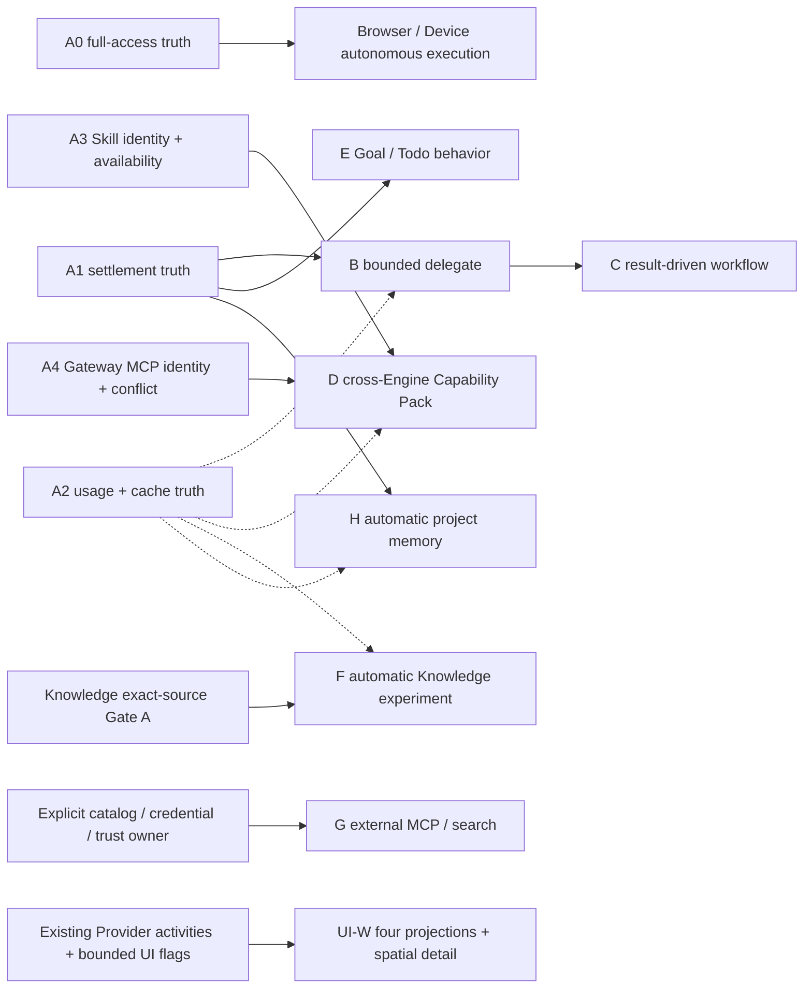

# OmniMind Agent Core 新会话执行指南

> 证据日期：2026-08-12
>
> 文档角色：把 Agent Core 研究设计转换成可由全新会话执行的 preflight、独立切片、验证门和停止条件。
>
> 授权边界：**研究施工指南，不是当前产品施工授权。** 本文故意不复制任何施工阶段名或 next action；每个新会话必须实时读取 `execution-brief.md`。该 owner 未明确准入具体切片时，只能做 Gate A 只读 intake 和获准的任务隔离实验。

## 0. 新会话先读这一页

如果你是零历史的新 Agent：

1. 不要直接安装 `pi-subagents`、`pi-llm-wiki`、`pi-goal`、`pi-mcp-adapter` 或 `pi-web-access`；
2. 不要创建 Agent Team、Goal、Workflow、Memory、Wiki registry/database/scheduler；
3. 不要修改 stock Pi `.pi`、Codex/Claude/OpenCode private home；
4. 不要把研究结论写成已采用 architecture；
5. 先按第 1 节完成权威读取与精确工作区核对；
6. 从 `execution-brief.md` 读取唯一准入切片；若本任务不属于被明确准入的 action，就停止产品实现；
7. 将允许的工作映射到本文一个独立 Slice；一次只闭合一个用户结果；
8. 每个 Slice 都必须明确 Outcome、Entry、最小表面、禁止项、Proof、Exit 与 Stop/Rollback；小型 truth repair 可合并相邻标题，但这些语义缺一项就不开始；
9. 当前 `execution-brief.md` 已准入的 exact action 高于本文总图；新会话必须把它映射到本文对应 Slice，不能从本文的编号、证据日期或“建议顺序”反推施工权。

本指南的目标不是让新会话“照单全做”，而是让它知道：现在能做哪一刀、为什么只能做这一刀、如何证明、何时停止。

零历史会话不要把全文当成一张待办表。机械路由只有一条：先从 `execution-brief.md` 抄出当次 exact action，再在第 3 节匹配**唯一一个** Slice；只读该 Slice 与公共的 Preflight、验证、维护、Stop/交接章节。匹配不到、同时匹配多个且 owner 没有给出边界，或 action 只准入相邻底层修复时，停止产品写入并报告 exact ambiguity；不得用“总体方向一致”补授权。

## 1. Preflight：先证明工作区、权威和准入

### 1.1 必读顺序

在同一个精确工作区完整读取：

1. `README.md`；
2. `PI-ECOSYSTEM-INTAKE.md`；
3. `architecture/README.md`；
4. 当前切片涉及的 architecture owner：
   - runtime/Provider/Session/capability：`architecture/execution.md`
   - Thread/Queue/receipt/recovery：`architecture/product-state.md`
   - UI/能力投影/文案/icon：`architecture/workbench.md`
   - public activation/update：`architecture/public-surface.md`
5. `execution-brief.md`；
6. `missions/independent-omnimind-v1.md`（仅 active 时）；
7. `research/README.md` 与：
   - `research/omnimind-agent-core-design.md`
   - UI、能力发现、运行状态、干预或结果投影相关时：完整读取 `research/omnimind-agent-capability-surface.md`，并以真实 `apps/web` owner 为母体；其 HTML 只验证同一 Workflow 在 Timeline、Composer、Environment、RightDock 的职责关系、空间详情与 100+ Agent 层级，不是 Todo、审批、Computer Use、Knowledge、Memory 或恢复的组件母版
   - 本指南。

研究外部 Pi/Engine 来源时，必须完整执行 `PI-ECOSYSTEM-INTAKE.md` Gate A；不能用本指南替代 exact-source intake。

### 1.2 精确工作区与 dirty state

开始前运行只读检查：

```bash
pwd
git branch --show-current
git rev-parse HEAD
git status --short
```

预期 workspace：

```text
/Users/liuzaoqu/Desktop/Develop/independent/OmniMind
```

记录任务开始时的 dirty paths；所有既有修改都视为用户资产。只改获授权路径，不用 reset/checkout/生成器覆盖未知变化。

### 1.3 当前施工准入

从 `execution-brief.md` 原文回答：

```text
当次唯一获准 action 是什么？
本任务是否明确属于该 action？
entry proof 是否满足？
stop condition 是否触发？
```

本文不提供 dated 答案。新会话必须把 `execution-brief.md` 当场读到的原文写入工作 commentary，并逐项核对：

- 该 action 是否明确包含当前独立 Slice，而不是只在主题上相邻；
- entry proof 是否已经存在，还是仅有研究假设；
- stop condition 是否已触发；
- 若未准入，只能保留 Gate A、只读代码核对或该 owner 明确允许的隔离实验，不能借聊天认可扩张实施权。

### 1.4 Owner 冲突检查

若研究文档、代码行为与 architecture owner 不一致：

1. 不选择“更新的”一边；
2. 停止产品修改；
3. 定位唯一产品 owner；
4. 只有当前任务授权时才修复 owner 和全部路由；
5. 否则报告 exact conflict。

研究文档可以记录反证，但不能自行改写产品事实。

### 1.5 首次输出模板

新会话在任何写入前应给维护者一段简短、可核验的 commentary：

```text
已确认 workspace/branch/HEAD 与 dirty paths。
当前 sole-owner 准入：<execution-brief 原文摘要>。
本轮仅处理：<一个独立 Slice / Intake Gate A>。
现有 owner：<路径>；成功条件：<可观察结果>；停止条件：<最强反证>。
不会触碰：<private home / unrelated dirty paths / 未授权 owner>。
```

## 2. 当前代码事实地图

不要从旧行号开始。先用 `rg` 找 symbol，再读完整局部 owner。

路径记法也是维护合同：本文凡指 implementation，必须写仓库完整路径；同一 basename 同时存在于 `Layers/` 与 `Services/` 时，`Layers/` 是运行实现，`Services/` 是接口/tag，不能只写 basename 让下一会话猜。表中入口是定位锚点，不是永久 API；HEAD 变化后以 symbol、contract、focused test 和真实 wiring 复验。

| 事实                                     | 当前入口                                                                                                                                                                                                                                                                                                                                                                                                                                                                                           | 新会话必须确认什么                                                                                                                                                                                                                                                                                                                                                                                                                                                                                                                                                                                                                                                  |
| ---------------------------------------- | -------------------------------------------------------------------------------------------------------------------------------------------------------------------------------------------------------------------------------------------------------------------------------------------------------------------------------------------------------------------------------------------------------------------------------------------------------------------------------------------------- | ------------------------------------------------------------------------------------------------------------------------------------------------------------------------------------------------------------------------------------------------------------------------------------------------------------------------------------------------------------------------------------------------------------------------------------------------------------------------------------------------------------------------------------------------------------------------------------------------------------------------------------------------------------------- |
| Pi runtime/session                       | `apps/server/src/provider/Layers/PiAdapter.ts`                                                                                                                                                                                                                                                                                                                                                                                                                                                     | ModelRuntime、AgentSession、SessionManager、ResourceLoader、event settlement                                                                                                                                                                                                                                                                                                                                                                                                                                                                                                                                                                                        |
| Product usage contract                   | `packages/contracts/src/providerRuntime.ts`                                                                                                                                                                                                                                                                                                                                                                                                                                                        | input/output/cacheRead/cacheWrite 是否完整                                                                                                                                                                                                                                                                                                                                                                                                                                                                                                                                                                                                                          |
| Skill catalog                            | `apps/server/src/provider/skillsCatalog.ts`                                                                                                                                                                                                                                                                                                                                                                                                                                                        | root、source、dedupe、same-name 行为                                                                                                                                                                                                                                                                                                                                                                                                                                                                                                                                                                                                                                |
| Skill discovery projection               | `apps/server/src/provider/Layers/ProviderDiscoveryService.ts`                                                                                                                                                                                                                                                                                                                                                                                                                                      | native/projected/unavailable 是否诚实                                                                                                                                                                                                                                                                                                                                                                                                                                                                                                                                                                                                                               |
| Turn-time Skill projection               | `apps/server/src/provider/skillPromptInjection.ts`                                                                                                                                                                                                                                                                                                                                                                                                                                                 | path admission、budget、resource 兼容                                                                                                                                                                                                                                                                                                                                                                                                                                                                                                                                                                                                                               |
| Skill reference contract                 | `packages/contracts/src/providerDiscovery.ts`                                                                                                                                                                                                                                                                                                                                                                                                                                                      | 是否仍信任 client raw path                                                                                                                                                                                                                                                                                                                                                                                                                                                                                                                                                                                                                                          |
| Codex Skill seam                         | `apps/server/src/codexAppServerManager.ts`                                                                                                                                                                                                                                                                                                                                                                                                                                                         | `skills/extraRoots/set` scope 与隔离                                                                                                                                                                                                                                                                                                                                                                                                                                                                                                                                                                                                                                |
| Gateway MCP injection                    | `apps/server/src/agentGateway/mcpInjection.ts`                                                                                                                                                                                                                                                                                                                                                                                                                                                     | 每 Engine seam、credential、name conflict                                                                                                                                                                                                                                                                                                                                                                                                                                                                                                                                                                                                                           |
| Gateway transport/authority              | `apps/server/src/agentGateway/mcpTransport.ts`、`apps/server/src/agentGateway/Layers/AgentGateway.ts`                                                                                                                                                                                                                                                                                                                                                                                              | bearer、active turn、abort、tool dispatch                                                                                                                                                                                                                                                                                                                                                                                                                                                                                                                                                                                                                           |
| Provider-native child projection         | `apps/server/src/orchestration/Layers/ProviderRuntimeIngestion.ts`                                                                                                                                                                                                                                                                                                                                                                                                                                 | origin、cap、Product Thread materialization                                                                                                                                                                                                                                                                                                                                                                                                                                                                                                                                                                                                                         |
| Claude private workflow                  | `apps/server/src/provider/Layers/ClaudeAdapter.ts`、`apps/server/src/provider/claudeWorkflowRuntime.ts`、`apps/server/src/provider/claudeWorkflowScript.ts`                                                                                                                                                                                                                                                                                                                                        | provider-private truth，不提升成全局 owner                                                                                                                                                                                                                                                                                                                                                                                                                                                                                                                                                                                                                          |
| Workbench                                | `architecture/workbench.md` 与 `apps/web/src/components/ChatView.tsx`、`apps/web/src/components/chat/RightDock.tsx`、`apps/web/src/components/chat/environment/EnvironmentPanel.tsx`                                                                                                                                                                                                                                                                                                               | 用户只看到真实 availability/origin/status                                                                                                                                                                                                                                                                                                                                                                                                                                                                                                                                                                                                                           |
| Composer task/subagent/workflow/approval | `apps/web/src/components/ChatView.tsx`、`apps/web/src/components/chat/ComposerActiveTaskListCard.tsx`、`apps/web/src/components/chat/ComposerSubagentStrip.tsx`、`apps/web/src/components/chat/WorkflowRunCard.tsx`、`apps/web/src/components/chat/ComposerPendingApprovalPanel.tsx`                                                                                                                                                                                                               | 复用既有 stacked surfaces，不为每项能力新增卡或 aggregate state                                                                                                                                                                                                                                                                                                                                                                                                                                                                                                                                                                                                     |
| Agent identity projection                | `apps/web/src/lib/subagentPresentation.ts`、`apps/web/src/components/chat/ComposerSubagentStrip.logic.ts`                                                                                                                                                                                                                                                                                                                                                                                          | 在既有 deterministic accent owner 上增加 glyph variant；不建 avatar registry，不用 status 改写 identity                                                                                                                                                                                                                                                                                                                                                                                                                                                                                                                                                             |
| Workflow 四投影与 topology/result detail | `apps/web/src/components/chat/TimelineWorkEntryRow.tsx`、`apps/web/src/components/chat/WorkflowRunCard.logic.ts`、`apps/web/src/components/chat/WorkflowRunCard.tsx`、`apps/web/src/workflowRunUiStore.ts`、`apps/web/src/components/chat/environment/EnvironmentPanel.tsx`、`apps/web/src/components/chat/RightDock.tsx`、`apps/web/src/rightDockStore.logic.ts`、`apps/web/src/components/chat/rightDockPaneMeta.tsx`，以及 `apps/server/src/orchestration/providerRuntimeActivityProjection.ts` | 保留现有 activity truth、action wiring 与 paused/dismissed UI owner，不冻结密集 card 视觉。先把 latest/visibility 与 exact-task snapshot selector 拆开，RightDock/旧 Timeline milestone 才能按 `workflowTaskId` 重建。Timeline=去重里程碑、Composer=近手控制、Environment=latest receipt、RightDock=运行拓扑/terminal result；当前 truth 只画 phase-order spine 与 membership containment。顺序/并行/选择/回环只由 explicit facts 组合，完成后不发明 partial。4/20/120-Agent fixture 对比 host DOM/SVG 与 React Flow read-only profile；100+、pan/zoom/fit、visible rendering 或自写 viewport/layout 责任任一成立即可采用成熟 renderer，X6 只作有明确失败反例的升级 |
| Thread Recap                             | `apps/web/src/lib/threadRecap.ts`、`apps/web/src/hooks/useThreadRecap.ts`、`apps/web/src/components/chat/environment/EnvironmentPanel.tsx`                                                                                                                                                                                                                                                                                                                                                         | 当前是有界 UI recap/local cache，不是 durable Agent memory                                                                                                                                                                                                                                                                                                                                                                                                                                                                                                                                                                                                          |

建议 focused 搜索：

```bash
rg -n "agent_end|agent_settled|isIdle|cacheRead|cacheWrite" apps/server/src/provider/Layers/PiAdapter.ts packages/contracts/src/providerRuntime.ts
rg -n "ProviderSkillReference|skillPromptInjection|skills/extraRoots/set" apps/server/src packages/contracts/src
rg -n "mcp_servers\.omnimind|mcpServers|client\.mcp\.add|create_threads|provider_native" apps/server/src packages/contracts/src
rg -n "workflowScript|ClaudeWorkflow|creationSource" apps/server/src packages/contracts/src
rg -n "ThreadRecap|showEnvironmentRecap|EnvironmentRecapSection|ComposerSubagentStrip|WorkflowRunCard" apps/web/src
```

### 2.1 当前已知 truth gaps

在代码没有改变前，以下五类 truth repair 优先级高于依赖它们的新能力：

1. **Runtime mode**：Provider-side `full-access` 基本真实，但 Device mutation 因无 receipt bridge 永远拒绝，Browser download 无条件取消，Pi-family UI 可显示底层不能完成的 approval mode，`acceptForSession` 文案与 Thread 持久语义不符。
2. **Settlement**：`apps/server/src/provider/Layers/PiAdapter.ts` 在 `agent_end` 就完成 Product turn，尚未用 `agent_settled`/idle 证明 retry、follow-up、compaction、package continuation 已结束。
3. **Usage**：Product snapshot 缺 `cacheWrite`，不能准确展示或优化成本。
4. **Skill admission**：client 可提交裸 `{name,path}`，server 读取前未重新证明 path 属于本次 catalog/allowed root，存在任意本机文件被 inline 给模型的事实泄漏风险。
5. **Gateway MCP identity/conflict**：first-party wire name 固定为 `omnimind`。Codex overlay 会替换同名 table，Claude SDK/OpenCode dynamic registration 也可能遮蔽 native same-name server；不写 source home 不能证明没有 session-level silent override。

与 A3 同属一项的语义 debt：统一 Skills UI 可能把 `projected-text` 宣称成完整 native compatibility。它应与 Skill admission 一起修复，不能通过改文案掩盖运行差异。

Project Context 当前也有一个必须先承认的 absence：现有 Thread Recap 只服务当前 UI 理解，没有 durable write/recall/scope/forget owner。不能通过改名或扩大 localStorage 宣称 Memory 已有；Knowledge 与 Memory 正式施工前必须先由同一个 OmniMind project-context owner 承担 writer、scope、provenance、delete 与 JIT load，不能在 Slice F/H 各建一套。

### 2.2 当前已存在、禁止重复的 owner

- Product Thread/Queue/receipt/recovery；
- Provider Registry/adapters；
- Pi native Session/resume/compaction；
- Skills catalog 与 OmniMind Library root；
- fixed OmniMind Gateway/MCP injection；
- Browser/Device tools 与现有 Gateway/Host lifecycle；其 approval 行为必须改为继承 Thread runtime mode，不能复制 owner；
- Provider-native child Thread ingestion；
- Claude workflow private projection；
- product Automation scheduler；
- adopted `pi-todo`。

任何候选 package 如果再创建这些 owner，默认 disposition 是 bridge/translate/decline，而不是并行运行。

## 3. 独立 Slice 总图

旧指南的 X0–X9 串行大链已废弃。以下 Slice 彼此独立；只有共同 contract 发生真实依赖时才排序。

| Slice                                 | 用户结果                                                                             | 默认前置                                                                                   | 是否互相阻塞                                                                   |
| ------------------------------------- | ------------------------------------------------------------------------------------ | ------------------------------------------------------------------------------------------ | ------------------------------------------------------------------------------ |
| A. Runtime and boundary truth repairs | 自动化边界/完成/费用/Skill/Gateway identity 真实                                     | `execution-brief` 准入具体修复                                                             | 其他 runtime/capability Slice 的真实性前置；A0–A4 可独立                       |
| B. Bounded delegate                   | OmniMind Agent 可委派一个有界 child                                                  | settlement truth、exact model target                                                       | 不依赖 Knowledge/Goal/UI 大改                                                  |
| C. Result-driven workflow             | root 可依据一个或多个结果继续/分支/收口                                              | B 或现有 tools                                                                             | 不依赖 DSL、Host multiwave                                                     |
| D. Cross-Engine Capability Pack       | OmniMind Library 加法投影到选定 Engine                                               | Skill admission/availability 与 Gateway identity/conflict truth                            | 不依赖 delegate                                                                |
| E. Goal/Todo behavior                 | 单 active objective 能可靠继续/完成/阻塞/等待                                        | settlement truth                                                                           | 不依赖 `pi-goal` runtime                                                       |
| F. Automatic Knowledge experiment     | 普通任务实际使用来源后自动维护 workspace knowledge                                   | exact-source intake + isolated comparator + project-context owner                          | 不能阻塞 B/C                                                                   |
| G. External MCP/Search                | 用户配置的窄 external capability                                                     | credential/trust/isolation owner                                                           | 最后评估，不复用 fixed Gateway 推断                                            |
| H. Automatic project memory           | settled 后自动保存并按需召回少量高价值项目事实                                       | 与 F 共用 project-context owner、scope/provenance/forget contract、settlement truth        | 与 Knowledge page intent、Recap、native Engine memory 分责；不阻塞 B/C         |
| UI-W. Workflow projection             | 用户在对话中有运行体感，能从 Environment 找回并在 RightDock 理解 100+ Agent workflow | 可按 exact task 重建的 Provider activities + 当前 Web owners；不要求先有通用 Workflow Core | 独立 UI slice；不阻塞 B/C/F/H，也不把 Claude private workflow 提升成全局 owner |

一个 Slice 只能在 `execution-brief.md` 明确准入时施工。不要一次提交 “Agent Core suite”。



箭头只表示真实 contract 依赖，不表示施工顺序。没有箭头的 Slice 不应互相等待；A2 是经济性事实面，可以独立修复，但任何声称“更省 token/更高 cache”的后续 Slice 都必须使用它或等价的准确 usage proof。

## 4. Slice A — Runtime and capability-boundary truth repairs

Slice A 包含五个可独立提交的 truth repair。不要因都在底层或边界层而捆绑成一个大重构。

Shared Entry：`execution-brief.md` 明确准入当前 exact repair；第 2 节对应代码事实已在当前 HEAD 复验；有一个 focused falsifier 能在修改前失败、修改后闭合。Shared Exit：只修 truth contract、adapter/projection 和必要 UI 语义，不顺带实现依赖它的新 Agent capability。任何迁移或历史兼容只能由受影响 sole owner 定义，不能在 repair 中发明永久双轨。

### A0. Full-access end-to-end truth

**Outcome**

Composer 选择的 Thread `runtimeMode` 真实贯穿 Engine adapter、Agent Gateway、Browser、Device、child privilege 与 approval UI。`full-access` 下普通任务内副作用无二次确认；其他 mode 只在 exact Engine/Host 有可完成语义时出现。

**Current falsifiers**

- `packages/contracts/src/orchestration.ts` 默认 `full-access`；Codex、Claude Code、OpenCode 已分别映射到 no-ask/unrestricted native 语义；
- `apps/server/src/agentGateway/Layers/AgentGateway.ts` 构造 Device tools 时没有传 `isExplicitlyApproved`，`apps/server/src/agentGateway/deviceTools.ts` 默认 false，所有 mutation 都返回 `DeviceApprovalRequired`；
- `apps/desktop/src/browserAutomation/desktopBrowserAutomationHost.ts` 对 effecting action 使用 download guard，下载一发生就无条件取消；
- Pi-family session 记录 mode，但 adapter 不暴露 OmniMind approval request；
- `apps/web/src/components/chat/ComposerPendingApprovalPanel.tsx` 写 “Always allow this session”，`apps/web/src/components/ChatView.logic.ts` 却把持久 Thread 切成 `full-access`。

**Minimal change**

1. 沿现有 Gateway caller/Thread lookup 投影 runtime mode；不在 tool args 里信任模型自报 mode；
2. Device/browser effect owner 消费同一 mode：full-access 执行；approval-required/auto 只有 bridge/reviewer 真实存在时才成为 loaded capability；
3. Browser download 在 full-access 落到当前 workspace 或 OmniMind managed artifact/download root，并返回真实 file/artifact；OAuth/2FA/OS picker 归 human-presence，不归普通 approval；
4. Composer 依据 exact Engine + Host capability 隐藏不可兑现 mode；Pi-family 不再展示伪 approval-required；
5. `acceptForSession` 若继续持久化 Thread，文案改为“此任务始终允许 / Always allow for this task”；
6. Harness policy、tests 与 zh-CN/en catalog 同步，不保留“去 Device pane 手工操作”这一假恢复路径。

**Forbidden**

- 第二 permission broker、approval ledger 或 Host-only mode store；
- 把 mode 放进模型可篡改 tool input；
- 用 Provider 名称猜 mode；
- `full-access` 下继续弹普通 command/download/device confirmation；
- 把 OAuth/2FA/OS 授权自动点击掉；
- 在 permission repair 中顺带实现 Memory、Knowledge、Delegate 或 external MCP。

**Proof**

- Codex/Claude/OpenCode full-access mapping regression；Pi-family mode availability；
- Browser click/type/upload/download、OAuth popup、人类接管、abort 与 late event；
- Device boot/install/launch/tap/type、unsupported host、helper failure、abort；
- child 不能从较低 mode 驱动较高 mode Thread，full-access caller 的同 scope Host tool 不被额外拒绝；
- approval once/task/decline/cancel 文案、持久化与 restart；
- zh-CN/en、keyboard/focus；
- packaged fresh profile 的真实 Browser + Device journey，无默认 Provider private-home I/O。

**Exit / Stop**

Exit：用户看到的 mode 与 Engine/Host 运行事实一致，full-access 不再被 Host capability 暗中降级。

Stop：若需要新 permission state owner、无法从 canonical Thread 获得 caller mode，或 download/device effect 无法保持 active-turn/target containment，则停止并修 existing boundary；不能用 global allow 绕过。

### A1. Terminal settlement

**Outcome**

Product turn 只在 Pi runtime 真正 idle/settled 后发出一次 terminal completion；retry、follow-up、compaction、Goal continuation 和 abort 不产生竞态或双完成。

**Entry**

- `execution-brief.md` 准入 settlement/runtime correctness；
- exact bundled Pi event contract 已从 dependency source/type 复验；
- focused fixture 可重现 `agent_end` 后仍有后续行为。

**Minimal change**

1. 建立 `agent_end`、`agent_settled`、abort、retry、follow-up、compaction 的事件序列 fixture；
2. 将内容 finalization 与 terminal settlement 分离；
3. 只在 exact settled/idle proof 后释放 Gateway active-turn authority、清理 active turn、发出 Product `turn.completed`；
4. 对 stale/duplicate/late event 保持幂等；
5. 保留 Engine-native lifecycle，不引入新 Run state machine。

**Forbidden**

- 用固定延迟猜 idle；
- 在 adapter 外建第二 settlement poller；
- 为修竞态引入 Goal/Workflow registry；
- 把 `agent_end` 全部语义抹掉。

**Proof**

- normal completion；
- retry then success/failure；
- follow-up/queued input；
- compaction；
- abort during model/tool/follow-up；
- timeout and late result；
- exactly one terminal receipt；
- Gateway authority 不提前释放、不泄漏。

**Exit**

focused tests + matching live Pi/provider journey 证明 `turn.completed` 与真实 idle 一致。

**Stop/Rollback**

如果 Pi event contract 在当前版本无法区分 content end 与 true settlement，停止编码，先形成 exact upstream seam/patch intake；不要增加轮询猜测。

### A2. Usage/cache truth

**Outcome**

Product 能准确投影 provider/Pi 报告的 input、output、cacheRead、cacheWrite 与缺失状态，成本计算不把“未报告”当 0 或 miss。

**Minimal change**

- 扩展 canonical usage contract，而不是只在 UI 临时补字段；
- adapter 做 provider-specific normalization，保留 unavailable/unknown；
- branch/compaction/resume 的重置语义有 fixture；
- UI 中英文本同步，费用与 cache 来源可解释。

**Proof**

- Pi fixture 覆盖 cacheRead/cacheWrite；
- 不报告 cache 的 provider；
- real MiMo/DeepSeek 或当前资源匹配渠道的最少请求；
- 总量 aggregation、重开与历史兼容；
- secret/endpoint 不进入 fixture 或输出。

**Stop**

如果底层 provider 根本不报告 cacheWrite，必须显示 unknown/unavailable；不能估算成精确事实。

### A3. Skill identity and availability truth

**Outcome**

Client 只能选择 server discovery 本轮签发的 Skill identity；dispatch 重新验证 catalog membership、allowed root 和 canonical containment；UI 区分 native、projected-text、unavailable。

**Minimal change**

1. 设计 server-issued opaque id 或等价 immutable catalog identity；
2. 保存 source/provenance/hash/compatibility，不再信任 client raw path；
3. dispatch 解析 realpath 并检查 root、symlink containment、catalog generation；
4. same-name/different-source 显式；
5. projected-text 只承诺正文注入，脚本/assets/dependencies 未证明则 unavailable/partial；
6. Codex native root、Claude/OpenCode/Pi projection 分别验证。

**Negative proof**

- `/etc/hosts`、workspace 外文件、symlink escape、stale id、disabled Skill、same-name collision；
- client 篡改 name/path；
- catalog refresh 后旧 selection；
- inline budget、missing `SKILL.md`、unreadable asset；
- stock `.pi` 在 OmniMind Agent profile 中 I/O=0。

**Stop**

不能同时闭合 identity 与 compatibility 时，先修任意文件读取风险；UI 保持保守 unavailable，不先宣传 parity。

### A4. Gateway MCP identity and collision truth

**Outcome**

OmniMind Gateway 继续只有一个 lifecycle/credential/transport owner，但不会在任何 Engine 的有效 session 配置里静默替换 native same-name MCP；Workbench 能显示 effective wire identity、origin、loaded/unavailable 与冲突原因。

**Current falsifier**

- `agentGateway/mcpInjection.ts` 固定 `OMNIMIND_MCP_SERVER_NAME = "omnimind"`；
- Codex overlay 的现有测试明确替换 user-defined `[mcp_servers.omnimind]`；
- Claude SDK 注入 `mcpServers.omnimind`；
- OpenCode `client.mcp.add` 也使用 `omnimind`。

source home 未被改写是必要边界，但不能证明 effective session 没有 silent shadowing。

**Minimal change**

1. 沿 `architecture/execution.md` 的唯一冲突语义，定义确定的 first-party wire namespace 或显式 conflict resolution；
2. 注入前读取每个 Engine 能证明的 native/effective inventory，不猜测“omnimind 一定保留”；
3. 同名 native server 保留原来源和状态；若 Engine 无法并存，明确 unavailable/conflict，而不是静默覆盖；
4. Codex overlay、Claude SDK、OpenCode managed process、ACP session 与 Pi custom-tool projection 使用同一 identity policy，但保留各自真实能力；
5. 继续使用 per-session bearer、active-turn authority 和现有 shutdown/cancel owner，不引入第二 Gateway client；
6. display name 与 wire name 分开建模，改品牌/icon 不能充当冲突修复。

**Proof**

- 每个支持路径预置 native same-name server，证明 source config 与 effective native capability 均未被静默丢失；
- 无冲突、同名同目标、同名不同目标、case/quoted-name 变体；
- loaded inventory 与 UI origin 一致；
- parallel Product Threads、resume/restart、shutdown；
- Pi 路径无重复同名 Gateway tools；
- bearer 不进 source config、shell child、日志或错误；
- 旧固定名 session 的兼容/清理策略由现有 owner 明确，不建立永久 alias 双轨。

**Stop/Rollback**

如果某 Engine 当前 API 无法在注入前或 init 后证明冲突，只能 fail closed 或保持该能力 unavailable；不得以“overlay 是临时的”接受 silent replacement。

## 5. Slice B — Bounded delegate

### 5.1 Outcome

OmniMind Agent root 可以启动一个或多个有界 Pi-native child，显式指定 model、tool、context、cwd 与预算；child 返回 bounded result、artifact、usage 和 provenance；root 负责综合；取消和 terminal settlement 唯一。

### 5.2 Entry

- `execution-brief.md` 明确准入 bounded delegate；
- A1 settlement truth 已闭合；
- exact model/auth target truth 可从当前 Provider/Model owner得到；
- bundled Pi 当前版本的 public runtime/session seam 已复验；
- 已写代表性任务和最简单 baseline（root 单 Agent）。

### 5.3 Default implementation hypothesis

优先证明 bundled Pi public APIs 能否提供最小 child executor：

```text
root session
  → bounded delegate tool
    → focused child Pi session/runtime
      → exact result/usage/provenance
  → root continues in same native loop
```

不要从 `pi-subagents` root extension 开始。该 exact package 当前无法裁掉 Fleet/Mission/Schedule/management/state/UI/private-home 责任，只能作为 conformance donor/challenger。

### 5.4 Minimal contract

Input：

- task；
- exact model target；
- allowed tool/capability ids；
- context refs，不默认复制完整 transcript；
- cwd/workspace scope；
- token/time/output budget；
- optional role asset；
- parent turn id/cancellation signal。

Output：

- completed/failed/cancelled/timed_out；
- bounded answer；
- artifact refs；
- usage；
- exact model/origin；
- safe diagnostic；
- one terminal settlement id。

### 5.5 Product owner mapping

- child execution 由 Pi runtime/session；
- parent-child provenance 进入现有 Product Thread/receipt projection；
- root 仍拥有当前 objective 和 synthesis；
- Product Queue 不被 package queue 替代；
- 如果 child 必须是独立 Codex/Claude/OpenCode native Engine，使用现有 Gateway child Thread，而不是复用 Pi delegate 名称伪装。

### 5.6 Forbidden

- Fleet、Mission、Schedule、worktree manager、intercom、Gist/share；
- child 自动读取所有 Skills/MCP/private home；
- detached 默认执行；
- 第二 Agent registry/Team state；
- 默认全 transcript 复制；
- package 自有 permission broker；
- child 成功前 root 释放 active turn。

### 5.7 Proof matrix

任务：

- 单 focused research child；
- 两个只读并行 child + root synthesis；
- child 使用不同 model；
- allowed-tool denial；
- oversized output truncation；
- timeout、abort、late result；
- one child fail/one success；
- parent compaction/resume；
- packaged shutdown/reopen。

证据：

- exact model/auth；
- process/session tree；
- no `.pi`/provider private-home I/O；
- bounded context/output；
- usage/cacheRead/cacheWrite；
- one settlement；
- no orphan child；
- root synthesis source attribution。

### 5.8 Challenger gate

只有最小实现基线成立后，才可用 exact `pi-subagents` 隔离 profile 比较。它必须显著赢得可靠性、延迟、成本或恢复，并证明能移除重复 owner。否则保留其测试思想，不 fork。

### 5.9 Exit / Stop

Exit：一个 bounded delegate journey 在 focused + real provider + packaged fresh profile 中闭合，且没有引入第二控制面。

Stop：如果 bundled Pi public seam 不足，先 upstream issue/patch；若只能通过复制大块 Pi internals 实现，暂停并重新做 Intake Gate A，不能静默形成 fork。

## 6. Slice C — Result-driven dynamic workflow

### 6.1 Outcome

Root 在同一 native Agent loop 中观察 tool/delegate 结果后，自主选择下一步、并行验证、失败降级或结束。用户只看到 exact activity 能证明的运行轨迹与来源，但产品不新增 Workflow DB/DSL。

### 6.2 Entry

- `execution-brief.md` 准入；
- 现有 root tool loop 或 Slice B delegate 已可用；
- 至少一个任务证明固定 upfront plan 不足、result-driven continuation 有收益。

### 6.3 Minimal change

优先不新增 runtime：

1. 保持同一 root session；
2. 提供小而稳定的 delegate/tool schema；
3. root 读取 structured result；
4. 通过下一次 native tool call 表达分支/并行；
5. 用现有 Product Thread/receipt 展示 progress；
6. artifact/checkpoint 负责跨 compaction/session 恢复。

只有 UI 需要表达且现有 activity payload 无法推导时，才在同一 Provider Runtime activity owner 增加最小 presentation fact；不新增 workflow journal。最小 visual grammar 固定为：

- `group`：phase、parallel set 或 iteration；
- `step`：root、Agent、tool、decision 或 checkpoint；
- `transition`：`next / dispatch / join / selected / retry / handoff`；
- `result`：terminal settlement、exact result reference 或 failure frontier。

这四类是只读 projection，不是 Core API 或新的执行器。顺序、并行、选择、回环是唯一结构原语；orchestrator-worker、evaluator-optimizer、fallback、handoff 都由它们组合，不新增 runtime mode。

### 6.4 不默认采用的机制

- `workflowScript`/JS worker；
- DAG/graph designer；
- Wave journal；
- background Mission；
- Host cross-Engine multiwave；
- scheduled runs。

Claude private workflow 继续由其 adapter 投影，不能因为 UI 看起来相似就统一底层语义。

### 6.5 Proof

- result A 决定是否调用 B；
- 并行结果不一致时追加验证；
- child failure 后 root 选择降级；
- 顺序、并行、选择、回环各至少一个 exact event fixture；没有 explicit route/iteration/handoff 时 projection 不画；
- user steer/queued input 改变下一步；
- abort 停止未完成分支；
- compaction 后从 artifact 恢复；
- tool order/prefix 稳定；
- 相比固定 script 的 task success/成本/延迟。

### 6.6 Exit / Stop

Exit：至少两个真实任务证明 result-driven loop 有增益，且没有新 workflow owner。

Stop：如果需求其实只是显示“步骤”，应只做 Workbench progress；如果必须确定性流程，优先现有 Automation/普通代码，不把所有确定性任务交给 Agent DSL。

## 7. Slice D — Cross-Engine Capability Pack

### 7.1 Outcome

用户在 OmniMind 选择 Codex、Claude Code 或 OpenCode 时，可直接使用经过验证的 OmniMind-owned Skill/MCP 能力；Engine native ecosystem、auth、session、permission 与 plugin 仍完整保留；Workbench 显示 `native / projected / unavailable`。

### 7.2 Entry

- A3 Skill identity/availability truth 闭合；
- A4 Gateway MCP identity/conflict truth 已闭合，或本 Slice 明确不涉及 MCP 且证明不会改变现有注入；
- `execution-brief.md` 准入指定 Engine 与指定 asset；
- canonical asset、version、hash、rights、compatibility 已存在；
- 当前 OmniMind adapter、Engine binary/SDK、官方 seam 与 init/status inventory 的 exact-version proof 完成。

### 7.3 Per-Engine strategy

**Codex**

- 从现有 `codexAppServerManager.ts` 与 app-server process contract 扩展，不增加第二 Codex launcher；
- 当前已用 `skills/extraRoots/set` 挂 OmniMind root，并以 native skill turn input 调用；先复验 exact installed app-server，再增加其他 asset；
- `skills/extraRoots/set` 是 process-scoped、退出即失效，必须 dedicated process 或严格 replace/reset，证明多个 Product Thread 不串能力；
- `dynamicTools` 等实验表面必须 feature-detect；官方当前未稳定列出的字段不得写成生产依赖；
- 从 `skills/list`、MCP/status 或相应 init/list 回报建立 loaded inventory，不以请求成功代替实际加载；
- 不写 `~/.codex`，不替换 Codex auth/session/plugins。

**Claude Code**

- 从现有 `apps/server/src/provider/Layers/ClaudeAdapter.ts` 的 `@anthropic-ai/claude-agent-sdk` `query({ options })` 路径扩展，不另启 CLI；
- 官方当前 SDK 文档把 local plugin seam 定义为 `plugins: [{ type: "local", path }]`；先证明 workspace 锁定 `0.3.207` 的 exact type/runtime 确实支持，再加到现有 `queryOptions`，不支持则回到独立 SDK upgrade intake；MCP 继续使用现有 session `mcpServers` owner；
- `settingSources`、native user/project/local ecosystem、hooks、agents、permission 和 resume 继续由现有 adapter/Engine 拥有；
- `--plugin-dir`、`--mcp-config` 等 CLI flags 只能做手工 comparator，不是产品实现路径；除非产品明确要求排除 native MCP，否则不能用 strict 配置破坏 additive contract；
- 从 `system/init` 读取 plugins、slash commands、tools/MCP 与 plugin errors，证明 bundle 真正 loaded；
- 不写 `~/.claude`，不迁移 Claude session/auth。

**OpenCode**

- 从现有 managed `opencode serve` process pool、`@opencode-ai/sdk/v2` client 与 `buildOpenCodeServerProcessEnv` 扩展，不另启平行 server/CLI；
- 需要 process-start Skill/config 时，使用现有 process owner 中的 exact inline config contract；Gateway MCP 继续走现有 thread-isolated process + `client.mcp.add`；
- native global/project config 与 `.claude/.agents` compatibility roots 会合并发现，产品目标又要求保留 native ecosystem，因此不能通过全局禁用 compatibility roots 伪造隔离；
- V2 plugin API beta、config merge/global scan 与 SDK/CLI 版本必须 pinned source + live proof；
- external `serverUrl` 若不能证明 per-thread bearer isolation，继续不注入；不能宣称 strict isolation 或“只加载 OmniMind Library”；
- 不把 `OPENCODE_CONFIG_DIR` 当 isolated home 证明。

### 7.4 Canonical Pack contract

每个 asset 至少记录：

- opaque id、name、type；
- canonical source、hash、rights；
- versioned immutable content root；
- Engine renderer/version range；
- required tools/resources/runtime；
- permissions/network/filesystem；
- conflict namespace；
- availability diagnostic；
- loaded inventory proof。

### 7.5 Conflict rules

- 默认 namespace，不静默覆盖 native same-name；
- 用户必须看到 native 与 OmniMind 来源；
- Engine 不支持某字段时标 unavailable/partial，不丢字段假装兼容；
- 同一个 fixed OmniMind Gateway 不通过第二 MCP client 再注册；
- capability set 实质改变时新开 Engine Session + handoff，不回写旧 prefix。

### 7.6 Proof

- 每个 Engine 的 exact-version fresh session；
- native capabilities 仍可用；
- OmniMind asset 确实 loaded，不只是列表展示；
- same-name conflict；
- disable/unavailable；
- process/thread isolation；
- no private-home write；
- session shutdown cleanup；
- tool/prompt/cache delta；
- packaged Desktop journey。

### 7.7 Exit / Stop

一个 Engine + 一个 asset 类型可以独立晋级，不等待全矩阵。若只能复制文件到 provider home，或需要统一伪 plugin runtime，停止并拒绝该 seam。

## 8. Slice E — Goal/Todo behavior pack

### 8.1 Outcome

用户可以给当前 OmniMind Agent 一个清晰目标；Agent 在单 active session 中可靠地继续、完成、阻塞或等待；Todo 表达当前步骤；所有状态仍属于现有 Product Thread/Queue/session owner。

### 8.2 Entry

- A1 settlement truth 已闭合；
- `execution-brief.md` 准入；
- 明确用户 journey 需要 continuation，而不只是输入框 prompt；
- `pi-goal` exact-source conformance fixtures 已转成与 owner 无关的行为表。

### 8.3 Minimal change

- one active objective；
- complete/blocked/wait protocol；
- retry/compaction/busy edit/queued input/stale-id guards；
- settled-idle 后是否继续的唯一 decision point；
- Todo 继续复用已采用机制；
- durable progress 用现有 Thread/artifact，不建 Goal DB。

### 8.4 Forbidden

- `@narumitw/pi-goal` 原 runtime 直接成为第二 owner；
- Goal queue、scheduled goal、background daemon；
- package session entries 与 Product state 双写；
- tool 自动推进与用户 queued input 竞争；
- 目标/任务/Todo/Automation 混成同一概念。

### 8.5 Proof

- normal complete；
- blocked/wait；
- retry and compaction；
- user edits while busy；
- queued input；
- stale completion id；
- no-progress loop guard；
- abort/reopen；
- exactly one continuation owner；
- Goal disabled 时没有 schema/prompt/state cost。

### 8.6 Exit / Stop

Exit：Goal 是轻行为包，disabled/dormant 时零后台 owner，开启后只影响当前 objective。

Stop：若 journey 需要多项目计划、依赖图或定时执行，转到现有 Product/Automation owner，不扩张 Agent Goal。

## 9. Slice F — Automatic Knowledge controlled experiment

### 9.1 Outcome

新手只需正常工作、提供文件/链接或使用 workspace 资料；Agent 在当前任务完成后自动保存真正有复用价值的来源、更新关联知识/index，并在未来任务中按需召回。用户不需要创建知识库、发起“知识更新”或批准第一次写入；没有实际使用的 durable source 时零 bootstrap、零扫描、零 daemon、零 prefix 正文。

### 9.2 Entry and exact-source comparator set

Entry：

- `execution-brief.md` 明确准入 Knowledge 受控实验，而不是直接准入生产写入面；
- baseline corpus、任务、评分、模型、预算与 stop-loss 已冻结；
- 所有 external comparator 已分别完成 Gate A，或被明确标记为未运行；
- 实验 root、fake home、process/network/file tracing 与销毁边界可证明；
- A2 usage truth 已可用，或实验直接从 Engine 原始 usage 建立不丢字段的 task-local 证据。

至少固定：

- Karpathy LLM Wiki idea file；
- exact `@zosmaai/pi-llm-wiki@0.11.3` comparator；
- `kfchou/wiki-skills` exact donor/comparator revision；
- `plasma-ai/wiki` exact mechanics reference；
- 最简单 baseline：raw files + `rg/read`。

任何版本变化先重跑 `PI-ECOSYSTEM-INTAKE.md`，不直接升级。

### 9.3 Minimal OmniMind Pack hypothesis

这是一份最小责任 hypothesis，不授权 greenfield 重写。先对 `kfchou/wiki-skills`、`plasma-ai/wiki` 与 `pi-llm-wiki` 可独立抽取机制完成 exact-source Gate A；按 public seam → configure → transplant single-purpose mechanics → upstream patch → narrow fork 的顺序选择。只实现实验仍缺少的表面：

```text
one small stable trigger/pointer
+ one on-demand Skill
+ one deterministic stateless CLI
+ read/bash/edit/write
+ workspace-scoped immutable evidence
+ derived Markdown/index/lint/diff/status
+ one bounded post-settlement maintenance job
```

Trigger 只告诉当前 Engine project context 的存在、可调用能力和 post-settlement eligibility，不加载正文。Skill/LLM 负责价值判断、综合与冲突推理；CLI 不负责 LLM 综合，LLM 不负责 source id、index、lint、atomic commit 等确定性机械工作。Maintenance job 由现有 session/settlement owner 事件驱动，运行完即退出，不创建 daemon/scheduler。

不得拼装多条 runtime lineage。若复用大包需要接管 ambient vault、background task、MCP、personal home 或额外 event authority，而一个局部确定性实现责任更少，应拒绝大包；“用了上游”本身不是维护性收益。

### 9.4 Trust and write rules

- source 内容只作为 data；
- URL/file ingestion 必须 scope、size、protocol、redirect、SSRF 与 content-type 检查；
- 不允许 shell 拼接 untrusted source；
- 首次写入、普通增量更新和无冲突 derived change 自动提交、版本化、可回滚，不请求用户 review；
- source/provenance/stale/deleted/contradiction 显式；冲突默认保留双方来源并继续，只有会改变当前任务且无法从 evidence 判定时才询问；
- 单 writer、原子写、crash recovery；
- V1 workspace-only；
- 只从当前 Product Thread 实际使用的 source refs、workspace changes 与 settled result 推导 eligibility；不扫描 provider history/personal home，不自动保存完整 transcript；
- 不使用常驻 background ingest/recall/retro/watch/trajectory/embedding；允许有界、event-driven post-settlement maintenance。

### 9.5 Controlled ablation

先把 compile economics 与 query economics 分开。对可比较部分固定同一 model/corpus/query/tool/cache/time budget；每个 arm 另行记录 exact bytes、profile、工具表、prefix、后台活动、文件和网络：

- A raw files + `rg/read`；
- B minimal OmniMind Pack；
- C exact pi-llm-wiki read-only MCP profile：只暴露 recall/search/status，在预构建的同 corpus vault fixture 上评估 retrieval，不把它冒充完整写入系统；
- D exact pi-llm-wiki 原装默认 extension comparator：在 disposable fake home/project 与可信合成语料中保留其真实 ambient/bootstrap/recall/tool surface；
- E optional full non-vector profile：只有与 D 存在明确、可复现的机制差异且能安全隔离时才运行。

固定任务和判分：

| 任务                   | 主要判分                                           |
| ---------------------- | -------------------------------------------------- |
| single fact            | source support、延迟、token                        |
| cross-source synthesis | claim-level citation、omission                     |
| incremental source     | 受影响页面、重复编译成本                           |
| contradiction          | 冲突发现与不确定性                                 |
| stale/deleted source   | 修正与删除传播                                     |
| no-answer              | 不编造、缺证据说明                                 |
| cross-session reuse    | break-even reuse count                             |
| novice first-use       | 用户除正常提供资料外的额外配置/命令/确认次数应为 0 |
| crash/restart          | source/derived/index 一致性                        |

同时记录 input/output/cacheRead/cacheWrite、TTFR/总时长、工具数、schema、文件数、后台进程、private-home I/O。

### 9.6 Comparator isolation

`pi-llm-wiki` comparator 只能在任务专用 root/profile 中运行：

- exact bytes/digest；
- `WIKI_ROOT=WIKI_HOME=<absolute isolated root>`；
- fake HOME、isolated cwd/project；禁止真实 `~/.llm-wiki`、`.pi` 和 provider home；
- C 只允许 read-only MCP 的 recall/search/status；vault fixture 由可信本地语料预构建并固定 digest；
- D 必须保留 exact 默认 behavior 才能称“默认 comparator”，但只喂可信合成语料、无真实凭据，并记录其 bootstrap、ambient recall、footer、tools、写入和 background activity；
- capture 的任意本地路径/URL、SSRF/local-file、shell/`uvx` 风险未修复前，不对不可信输入开放；
- E 的每个非默认开关必须完整记录；如果它与 D 没有可归因差异就删除该 arm；
- 单 writer；
- 进程/网络/文件访问记录可审计。

如果 D/E 不能在上述边界内安全运行，应标记 `skipped: unsafe/unisolatable`。不能关闭它们的默认行为后仍沿用 D/E 名称，也不能写一个仿真替代 exact comparator。

原装 extension 不是 production candidate。

### 9.7 Exit / Stop-loss

- B 不劣于 C/D/E 的可比部分且更简单、更便宜：仅晋级最小 automatic Pack candidate；
- D/E 获胜：逐项 ablate 机制，回到 Intake Gate A；
- B 不能在摊销成本后稳定优于 A：停止 Wiki 产品，不实现写入面，保留 Markdown + Agentic Search；
- 任何 persistent injection、private-home I/O、并发损坏或 no-answer 退化：立即停止。

## 10. Slice G — External MCP 与 fixed web search

这是未来可选 Slice，不是 Agent Core 前置。

### 10.1 Outcome

只有在真实用户 journey 需要时，OmniMind 才提供一个来源、权限、凭据、route、失败与关闭都可解释的窄 external capability；它不扫描 Provider global config，不复制 fixed Gateway owner，不把多 provider fallback 包装成“智能”。

### 10.2 Entry

- `execution-brief.md` 明确准入 external MCP 或 fixed search 的一个具体 journey；
- architecture 已给现有 owner 增责或指定唯一 catalog/credential/trust owner；
- A4 Gateway MCP identity/conflict truth 已闭合；
- exact candidate Gate A、endpoint/credential source、权限和 data boundary 已闭合；
- 最简单 baseline（现有 Browser/Gateway、本地 `rg` 或无该能力）已记录。

### 10.3 External MCP

现有 fixed OmniMind Gateway 已跨 Engine。若 External MCP 正式准入，architecture 必须先给现有 owner 增责或指定一个 sole catalog/credential/trust owner；本指南不预先授权新建 registry。无论落在哪个 owner，都不能重复 Gateway lifecycle。

首片若准入，只考虑：

- URL server；
- explicit streamable HTTP/protocol；
- OmniMind session credential projection；
- tool allowlist；
- resources/prompts off；
- hard timeout/abort/shutdown；
- dedicated process/profile；
- no ambient host config/private home。

`pi-mcp-adapter` 只能作为窄 outbound client challenger，不能成为 Gateway owner；关闭 host discovery、directTools、scriptMode、OAuth/autoAuth、sampling、elicitation、npx/stdio/socket/command/`!shell`。

### 10.4 Fixed web search

若准入 web search，只接受 OmniMind-owned fixed-route schema：

- 工具参数没有 provider/all/fallback；
- 固定 SearXNG endpoint；
- failure fail-closed，无第二 provider；
- browser cookies/keychain/proxy override 禁止；
- fetch/sourceCheck/curator/GitHub clone/video/PDF 等独立 Slice；
- abort/timeout/SSRF/redirect/DNS 行为有 proof。

stock `pi-web-access` 只能做 donor/challenger；仅配置默认 provider 不能强制 route。

### 10.5 Proof / Exit / Stop

共同 proof：

- exact configured route 与 outbound host allowlist；
- same-name/tool collision、loaded inventory、disable/unavailable；
- model 尝试覆盖 provider/all/fallback 被 schema 拒绝；
- timeout/abort 后单次 settlement、无 late result；
- shutdown/reopen 无 orphan process、listener、credential 或 cache 泄漏；
- argv/log/context/child env 无 secret；
- fresh packaged profile 不读取真实 Provider config、browser cookie 或 keychain；
- fixed Gateway tool 不重复注册。

Exit：只晋级被证明的一个 transport/route/tool surface；其他 MCP transport、OAuth、resources/prompts、fetch/media 与 provider route 保持 unavailable，不因同包存在而顺带开启。

Stop：

如果 external MCP/search 需要读取 Provider global config、动态下载、keyring、浏览器 cookie、隐式 fallback 或重复工具 owner，停止并拒绝原包。

## 11. Slice H — Automatic project memory

### 11.1 Outcome

普通用户无需配置、逐条确认或主动点击“记住”：root task 真正 settled 后，系统只自动保存少量未来可能复用的 project facts/preferences/constraints；后续任何 compatible selected Engine 都能通过 OmniMind project-context pointer 按需召回。用户能在现有 Workbench 查看、纠正、遗忘或关闭，且不会与 Thread Recap、Knowledge page intent 或 Engine-native memory 混淆。

### 11.2 Entry

- `execution-brief.md` 明确准入自动 Memory，而不是只准入 Recap、Knowledge 或 UI 文案；
- A1 terminal settlement 已闭合，能够证明 extraction 只在 root turn 真正 idle 后触发；
- 明确两个不竞争的 owner：Engine-native memory 继续拥有其私有 state；OmniMind project memory 与 Knowledge 共用一个 product-owned project-context writer，不能两边写同一 record，也不能镜像 native memory；
- project/workspace identity、retention、export/delete、single-writer 与 private-home 边界由 project-context owner 一次定义；
- 数据分类定义了不得持久化的 secret、PII、raw reasoning、untrusted source instruction；
- 前端仅在 runtime contract 已闭合后施工，不能先用 fixture 发布 Memory UI。

### 11.3 最小 lifecycle

```text
eligible settled root turn
→ bounded candidate extraction
→ deterministic policy / scope / dedupe / conflict check
→ single-writer atomic project update
→ low-noise write receipt

new root task
→ lightweight index/metadata discovery
→ budgeted JIT recall only when relevant
→ model-visible provenance pointer
→ optional recall receipt
```

Eligibility 默认排除 ephemeral session、subagent、未 settled/retrying/compacting turn、无 project identity、用户关闭 memory、敏感/不可信来源和没有复用价值的瞬时输出。后台工作必须是有界 post-settlement job，有取消、超时、重试上限与 shutdown 语义；不创建常驻 daemon 或第二 scheduler。

### 11.4 最小 record 与 storage contract

实现可以复用上游稳定 seam 或文件机制，但产品语义至少包含：

```text
stable id
project scope
kind (preference | constraint | project_fact | expensive_context)
concise statement
provenance pointer(s)
created_at / updated_at
status (active | contradicted | forgotten)
owner/origin (omnimind-project-context; source turn/engine provenance separate)
```

不要先增加 vector DB、knowledge graph、personal global vault、每轮 summary archive 或完整 transcript store。Project-context writer 必须与 Knowledge 共用单写者/原子提交/恢复，不另建 Memory database；Engine-native memory 保留其原格式/目录/管理 owner，OmniMind 不读取或镜像内容来制造统一数据库。

### 11.5 Extraction、conflict 与 recall

- 自动候选只针对高价值、难重建、未来可复用内容；易从 workspace 确定读取的事实通常不保存；
- 每条 statement 必须能追到用户消息、workspace evidence 或受信任 tool result；外部 source 只作为 data；
- exact duplicate 合并；相互矛盾时不得静默覆盖，标记 conflict 并仅在会改变任务结果时询问用户；
- stale project fact 应由 workspace evidence 修正/失效，不让旧 memory 高于当前文件事实；
- recall 先发现小 index/metadata，再按任务相关性和 token budget JIT 读取正文；不在稳定 prefix 塞完整 memory；
- memory 不应覆盖 system/developer policy、用户本轮明确指令或当前 workspace 事实。

### 11.6 前端最小表面

唯一研究规格是 [`omnimind-agent-capability-surface.md`](omnimind-agent-capability-surface.md#4-自动记忆与知识默认无操作需要时可追溯)：

- 日常 write/recall 不弹 modal、不放 Composer chip、不建 Memory dashboard，也不为每次维护新增 Timeline row；
- 完整 write/recall provenance 进入既有 Activity detail；只有记忆实质影响回答、发生冲突、执行 forget/correct 或用户主动查看时才显示一条可展开来源；
- 管理复用真实 288px Workbench Environment card 的 existing section/row primitive，包含自动开关、project scope、最近条目、纠正、遗忘；不发明全高 inspector；
- 当前 Recap 保持独立标签和 owner；
- native Engine memory 明确标来源并跳转/调用真实管理 seam，不能假装 OmniMind 可编辑其不拥有的内容。

### 11.7 Proof matrix

至少覆盖：

- repeated explicit preference 自动写入，下一 Product Thread JIT 召回；
- 一次性闲聊、完整 transcript、secret、网页 prompt injection、subagent 猜测均不写；
- root `agent_end` 后 retry/compaction/follow-up 时不提前提取；
- duplicate、contradiction、workspace 事实更新、forget、disable、project switch；
- native Engine memory 与 OmniMind project context 不互读/镜像；不同 selected Engine 能 JIT 读取同一 OmniMind project record 且不 cross-project 泄漏；
- write/recall token、cacheRead/cacheWrite、延迟与 break-even；
- extraction failure 不阻塞主任务，shutdown 无 orphan/late write；
- crash/reopen 后原子性、index/record 一致、forget 不复活；
- zh-CN/en、keyboard、screen reader、窄窗口、receipt aggregation；
- packaged fresh profile 不读取或改写真实 `.pi/.codex/.claude`，除非 exact selected Engine official seam 明确拥有该访问且使用任务专用隔离 profile。

### 11.8 Exit / Stop

Exit：证明自动、稀疏、project-scoped、跨 compatible Engine 可 JIT 使用、可纠正/遗忘/关闭，且相对“每次从 workspace 重新读取”在代表性跨任务 journey 上有可解释复用收益；平时 UI 几乎不变。

Stop：若必须保存完整 transcript、复制 native Engine memory、为 Knowledge/Memory 建两个 writer/database、建立 daemon、默认 personal scope、逐条弹确认/回执，或 recall 成本/错误率不优于简单 JIT workspace read，则停止产品化并保留现有 Recap/文件机制。

## 12. Slice UI-W — Workflow four projections and spatial detail

### 12.1 Outcome

用户不需要打开一个新“Workflow 产品”，也不会在 Composer、Timeline 和 Environment 同时看到三张竞争卡：运行中的结构化 workflow 在对话里留下有意义体感；terminal 后 Environment 仍保留当前任务最近一次 Run 的一行凭证；点击任何摘要都进入同一个 RightDock，运行图在这里冻结成结果图；100+ Agent 时仍可搜索、筛选和定位当前 frontier、失败与结果。

### 12.2 Entry

- `execution-brief.md` 明确准入 Workflow UI projection，不能从本文或历史聊天反推施工权；
- exact Engine/adapter 已持久化足以按 `workflowTaskId` 重建同一 workflow snapshot 的 Provider activities，至少有两个 phase 或多个 Agent；
- 当次 HEAD 重新确认 `apps/web/src/components/chat/WorkflowRunCard.logic.ts` 的字段、现有 pause/stop/resume/dismiss/open-child wiring、Timeline activity primitive、Environment section/row primitive 与 RightDock pane owner；
- 确认 `apps/web/src/workflowRunUiStore.ts` 仍是 pausedByUser/dismissed 的唯一 bounded per-Thread owner；pause 仍为 mark+stop、resume 仍为新 Composer turn + dismiss old run。不得把展示文案误写成新的 runtime state；
- 确认 `deriveWorkflowRunState()` 是否仍只选 latest workflow 并内嵌 Composer visibility；若是，先建立共享 exact-task snapshot selector，不得让 RightDock/Timeline 复制 parser 或受 Composer dismiss policy 影响；
- fixture 明确区分真实 phase order、Agent membership 与不存在的 Agent dependency edge；另以 synthetic explicit facts 独立验证顺序、并行、选择、回环，不能把 synthetic graph 当成当前 Claude truth；普通 tool sequence、Todo、无结构 Pi/Codex loop 不进入；
- 先有四投影 contract test/fixture，再改视觉；不能先把研究 HTML 复制进 production。

### 12.3 One state owner, four non-competing projections

| Projection  | 唯一职责                   | 最小内容                                                                                                                    | 生命周期                                                                                                              |
| ----------- | -------------------------- | --------------------------------------------------------------------------------------------------------------------------- | --------------------------------------------------------------------------------------------------------------------- |
| Timeline    | 已发生的 durable milestone | start、group/route/iteration transition、重要 failure/recovery、terminal settlement；必要时带 Agent identity/provenance     | 稳定后封存；不为 poll、heartbeat、每个 Agent tick 刷行                                                                |
| Composer    | 当前可立即干预的近手控制   | 名称、当前 frontier、最短进度、pause/stop/resume/open                                                                       | running，或 paused/failed/stopped 且 exact run 可 resume；normal completed/无恢复动作后退场                           |
| Environment | 当前任务的 latest index    | 名称、frontier/terminal status、done/total、最多三个 identity glyph + `+N`                                                  | 始终只保留当前任务最近一个同类 Run；运行时原位更新，terminal 后冻结；用户收起或新 Run 替换时移除，不保存 history/正文 |
| RightDock   | 完整解释、结果和导航       | topology overview、Agent membership、aggregate counts、terminal summary、search/filter、usage/provenance、open child/result | 打开时按 exact task state 重建；selected group/Agent/filter/viewport 是 pane-local ephemeral state                    |

四处只保存 bounded workflow identity，消费由同一 Provider activities + bounded UI flags 构造的 exact-task snapshot，并复用现有 action owner。不得复制 timer、Agent list、optimistic command state、settlement 或 provider provenance。Composer 不是“只能留 Plan”，而是只保留此刻不与 Plan/Subagent/Approval 冲突的可行动信息。

Timeline 的 milestone owner 仍是 canonical persisted activities。使用 `task.started/progress/completed/updated` 与 `workflowTaskId` 做纯 projection，连续相同 phase/frontier/status 只生成一个稳定 milestone；禁止在 React mount/effect 中追加伪 event。若现有 activity payload 缺少不可推导事实，修复现有 Provider Runtime activity projection/contract，而不是写 localStorage receipt。

### 12.4 Topology grammar、terminal result 与 100+ Agent level of detail

- 唯一结构原语是顺序、并行、选择、回环；orchestrator-worker = sequence + parallel + join，evaluator-optimizer = sequence + loop，fallback = choice，handoff 只是 control-transfer transition；production 没有 mode selector；
- presentation 只需要 `group / step / transition / result` 四类；transition 只允许 `next / dispatch / join / selected / retry / handoff`。当前 Claude phase 是 group/parent，phase-order spine 只表达真实顺序，Agent membership 用 containment；没有 explicit dependency/route/iteration/handoff truth 就不画对应 edge；
- 默认 overview 展示 3–8 个 group 与 aggregate `done/running/failed/total`；只展开 current/selected group 的 bounded children 和搜索命中；
- Environment 永不展开 100 个 Agent；Timeline 不逐 Agent tick；Composer 不展示成员列表；
- Agent 节点点击打开既有 child Thread/Agent detail，不创建第二 Agent inspector；
- identity 使用 `subagentPresentation.ts` 同一 deterministic owner：从 Central 策展 24 个低密度 glyph × 8 accent，canonical child/thread id seed，同 parent/workflow 内稳定消碰撞；名称与状态文字始终存在；
- active frontier 最多一条低频动效；节点状态改变可短暂过渡。hidden/background/reduced-motion 时无持续动画；terminal 时所有持续动效停止，已走 transition 变实线，parallel group 聚合，loop 显示 iteration count；
- current `TaskCompletedPayload` 已有 status、summary、workflowAgents、usage；exact-task snapshot 应透传可用 terminal facts。overall completed 但 child failed 时只显示事实性例外，不推断 `partial success`；只有 Engine 明确 conclusion 才增加 conclusion projection；
- terminal Timeline 只留一条 milestone；Composer 退场；Environment latest row 冻结；RightDock 顶部只放状态、名称、一行 summary 和可证明动作，下面保留 frozen topology、失败节点与 exact child/result references。缺 result reference 不显示“查看产物”，normal completed 不凭空提供 rerun；
- 字体与文字执行必要性门：节点只显示最短可区分 label，不重复写相同“已完成”；模型、effort、token、工具、耗时只在 selected/failed/terminal detail 出现；图例只在当前图真的使用非自明 transition 时出现。每个可删且不影响判断/动作的词都删除。

### 12.5 Renderer focused bake-off

用同一 4/20/120-Agent、3–8-group、四原语单独/混合、running/paused/completed/failed/stopped fixture 对比：

1. host DOM/SVG `WorkflowTopologyMap` composition；
2. React Flow read-only grouped-node profile。

React Flow profile 必须关闭 drag/connect/delete/editor，只保留 select、pan/zoom/fit 和必要的 visible-element rendering；nodes/edges 是 exact-task snapshot 的纯投影，不成为 canvas document。current phase-only fixture 与 synthetic explicit topology fixture 分开，renderer 不得从 synthetic schema 反向制造 runtime facts。出现 100+ Agent、pan/zoom/fit、visible-element rendering 或自写 layout/keyboard/focus/viewport 责任增长任一事实，就优先采用通过 proof 的成熟 renderer。必须复核 exact version、MIT source、bundle、重复 Zustand runtime、React 19、keyboard/screen-reader、`ariaLabelConfig` 双语、theme、offline packaged 与 continuous-update 成本。X6 只有在记录了一个 React Flow 无法闭合的嵌套、路由或规模反例时才能进入；不默认引入 Dagre/ELK。

### 12.6 Minimal implementation map

- 将 `apps/web/src/components/chat/WorkflowRunCard.logic.ts` 拆成共享纯 snapshot builder（支持 exact `workflowTaskId`）与每个宿主的 visibility selector；保留/收敛 `apps/web/src/components/chat/WorkflowRunCard.tsx` action wiring，将可见 Composer surface 重构为薄控制行；
- 继续复用 `apps/web/src/workflowRunUiStore.ts` 的 pausedByUser/dismissed 和 50-entry/thread bounded persistence；不创建第二 flags owner；
- 用现有 `TimelineWorkEntryRow`/activity owner 表达 milestone，不新增 Workflow log；
- 用现有 `EnvironmentSection`/`EnvironmentRow` 组合索引，不新增 Environment store；
- 保留 `apps/web/src/components/ChatView.tsx` 现有 `workflowRunState.taskIds` 对 generic background task 的去重，并将同一 exclusion 应用于 Environment generic subagent summary；同一 child 不得同时计入 Workflow 行和“子智能体”行；
- 只在 `RightDockPaneKind`/meta owner 增加 `workflow` 和 bounded `workflowTaskId`，同步更新 `RightDockPane`、constructor、persisted sanitizer、`singletonPaneReopenPatch`、singleton/meta/label/i18n 与 tests；点击另一个 Timeline milestone 必须替换同一 singleton pane 的 `workflowTaskId`，不能只激活后继续显示旧 run。RightDock selection/filter 不进入 persisted pane identity；
- persisted pane 指向的 run 已不在 retained activities 时，pane 显示一条可关闭的 unavailable state，并保留 exact task identity 供诊断；不得静默回退到 latest workflow；
- 新 presentation component 只接收 projection；search/filter/selection/viewport 属于 pane-local state；若 terminal summary/usage 已在 `task.completed` activity 中存在但 current snapshot builder 丢弃，应在同一纯 selector 中透传，不建 outcome store；
- 文案同时交付 zh-CN/en；能力/集合图标直接复用 `architecture/workbench.md` 锁定的现有 Central 资产：目标 `target-arrow`、Agent 团队 `agent`、动态工作流 `agent-network`、知识库 `books`、记忆 `brain-2`、会话恢复 `history`。本 Slice 只消费工作流的 `agent-network`；Agent 实例只用 deterministic identity glyph，不得让集合图标兼任 child identity、通用网络/集成或 Git 图；
- 不新增 route、workflow registry/database、layout persistence、editor、DSL、第二 Run、第二 action handler 或第二 settlement owner。

### 12.7 Proof / Exit / Stop

Proof 至少覆盖：

- 4/20/120 Agent、3–8 group；顺序、并行、选择、回环单独/混合；running/completed/failed/stopped/pausedByUser/resumable churn；验证当前无 waiting/route/iteration/handoff truth 时 UI 不猜；
- milestone 去重与封存；Composer completed 时退场，paused/failed/stopped 且 exact resumable 时保留恢复；Environment latest completed receipt 可重开、用户收起/新 Run replacement；Workflow member 不在 generic subagent summary 重复计数；三入口打开同一 pane；
- terminal status/summary/exception count/result references 与 frozen topology；completed + failed child 不误写 partial；缺 result ref 不造按钮；完成后无持续动画；
- search/filter、current/selected phase bounded expansion、open child、pause/stop/resume 单 owner、不同 Timeline milestone 连续打开会替换 singleton target、关闭/重开无 stale selection；retained activities 缺失时不回退 latest；
- 382–800px RightDock、窄主窗口、light/dark、zh-CN/en 长标签、keyboard/screen reader、reduced motion、hidden/background；
- render/update memory/CPU、120-Agent 状态 churn、无 120 个 simultaneous animation；
- focused tests、document contracts、`git diff --check`；代码若进入 shipped bytes，再按项目规则做 exact pushed SHA packaged fresh-profile journey。

Exit：四个投影职责唯一、运行过程有体感、completed 后不污染 Composer 且 latest receipt 仍可从 Environment 找回、RightDock 从运行图自然收口为结果图、100+ Agent 可理解，且未新增 runtime/state owner。

Stop：若只能靠复制 workflow state/action 维持四处一致、需要猜测 Agent dependency、需要把普通 tool activity 提升成 workflow、renderer 迫使引入 editor/canvas owner，或 120-Agent fixture 无法在合理资源内保持可用，则停止并缩回 Timeline + Environment + textual detail，不用假动态图掩盖数据不足。

## 13. 验证阶梯

每个 Slice 根据真实风险选择最窄但完整的阶梯；不能跳过适用层。

### 13.1 Source/contract

- typecheck/lint/unit；
- contract fixtures；
- schema snapshot；
- negative/adversarial tests；
- `git diff --check`；
- 文档/owner contract。

### 13.2 Isolated runtime

- fresh task profile/home/cwd；
- process tree、network、file I/O；
- normal/failure/abort/timeout/retry；
- shutdown/reopen；
- no private-home mutation；
- secrets redacted。

### 13.3 Real provider

涉及 model/thinking/stream/tool/usage/abort/recovery 时，在 focused fixture 后主动使用授权资源做最少 live probe：

- 优先与待测协议匹配的 Xiaomi MiMo 与 DeepSeek；
- 区分直连、compatible endpoint 与代理转换；
- 硬超时、费用边界、脱敏；
- 不把单渠道偶发现象写成全局 fallback。

### 13.4 Packaged Desktop

任何改变用户可观察行为的 candidate：

1. focused tests 通过；
2. commit/push exact task SHA；
3. 从该 SHA 重建 App；
4. 停止所有现存 OmniMind 实例；
5. 显式任务专用 `userData`、home、Provider private home 启动；
6. 从 Main/Helper/bundled Server 参数或等价证据确认隔离；
7. 完成启动、真实 journey、失败/取消、关闭、重开；
8. 验证默认 profile 没有被读取/迁移/写入。

只通过 dev/HMR/source test 只能称 source candidate。

### 13.5 Candidate honesty

- producer 只能提交受影响 claim 为 candidate；
- `verified` 由 Campaign 对应授权与 evidence 决定；
- 未打包、未 live、未 fresh-profile 必须精确标注；
- 不把单个 Slice 绿色称为 Agent Core suite 完成。

## 14. 性能、Context 与 Cache 回归

每个 Runtime/Pack Slice 至少记录：

```text
task success
input/output/cacheRead/cacheWrite
effective context size
tool/schema count and order
TTFR / total latency
compaction count
delegate count and copied context
abort-to-idle latency
files/processes/network endpoints
```

不变量：

- session 内 tool/capability 顺序确定；
- stable prefix 小且低 churn；
- Skill/wiki/memory 正文 JIT；
- tool output capped；
- capability 变化尽量 append；
- 实质环境变化新开 Engine Session + artifact handoff；
- 不用 cache ratio 单独判断经济性；
- child 默认不复制完整 parent history；
- compaction 是必要的 context hygiene，不为 cache 禁止。

任何新能力若显著增加常驻 schema/prompt，但只在少量任务有用，应移出 Core 成为 dormant Pack。

## 15. Source adoption 与维护

### 15.1 每个外部来源先 Intake Gate A

按 `PI-ECOSYSTEM-INTAKE.md` 记录 exact identity、owner、运行边界、disposition、Required proof、stop-loss 和重开触发器。package 热度只决定研究顺序。

### 15.2 Upstream first，fork last

优先级：public API → configure → narrow bridge → translate mechanism/tests → upstream patch → narrow fork → decline。

Fork 必须有：exact base、patch inventory、删除条件、同步预算、license/SBOM、reproducible packaging、rollback。多个 donor 不拼成多 lineage runtime。

### 15.3 Re-entry triggers

以下变化后只重跑受影响且能证伪结论的 proof：

- Pi/Provider SDK/Engine seam；
- package version/source/dependency/installer；
- Product owner；
- private-home/network/process/state schema；
- upstream public seam；
- benchmark 结果；
- packaged crash/recovery 或安全事件。

不要自动追 latest，不建立后台 ecosystem watcher。

## 16. Commit、文档与 owner 收口

一个 commit 一个真实关注点，只 stage 本任务路径。不要把 unrelated dirty changes 带入。

落点规则：

- 产品事实 → 唯一 `architecture/*` owner；
- 当前施工顺序 → `execution-brief.md`；
- claim/evidence status → active Campaign；
- exact source 与研究裁决 → `research/*`；
- intake 方法 → `PI-ECOSYSTEM-INTAKE.md`；
- 代码事实 → 代码、contract 和 tests。

新能力正式准入时，应更新所有必要路由，但不复制同一事实全文。若 owner 文档未授权，保持研究 candidate，不偷偷修改 architecture。

为降低长期维护成本，文档引用遵循四条规则：

1. 代码观察写完整路径和稳定 symbol，不复制易漂移行号；同 basename 的 Layer/Service 必须明确区分；
2. 产品合同只在 `architecture/*` 解释，研究文档只链接并记录反证/候选，不抄成第二份合同；
3. 代码移动但责任不变时，只更新事实地图和受影响验证命令；责任变化时才修改 architecture owner；
4. prototype、benchmark 或上游新版本只更新相应 evidence/disposition，不能顺带改变准入。每次文档改动都应能指出触发它的代码、contract、exact source 或实验事实。

## 17. 全局 Stop conditions

任一条件成立就停止当前 Slice：

- `execution-brief.md` 未准入；
- sole owners 冲突；
- exact source/rights/dependency 不闭合；
- 必须读取/写入真实 `.pi` 或其他 Provider private home；
- 引入第二 Thread/Goal/Run/Queue/Scheduler/Memory/permission/update owner；
- terminal settlement、abort、timeout 或 late result 不唯一；
- secret 可能泄露到 argv/log/cache/context/child env；
- capability availability 无法验真；
- package 的 disabled 只隐藏 UI；
- packaged journey 无法隔离或恢复；
- benchmark 不优于更简单 baseline；
- 相同失败没有新假设；
- 修改范围开始跨多个未准入 Slice。

停止后应输出：已证明事实、未证明事实、最强阻断、最小重开触发器和可安全保留的机制。不要用临时兼容层掩盖失败。

## 18. 单 Slice 交接模板

任何需要新会话继续的 Slice，使用已有 canonical Campaign spec（若是 Campaign）或项目根唯一 `HANDOFF.md`（非 Campaign）。不要为 Agent Core另建 ledger。

交接内容：

```text
Slice / user outcome:
Authority admission:
Workspace / branch / HEAD / dirty paths:
Existing owners and exact code seams:
Implemented paths:
Exact external sources (if any):
Proofs run and sanitized results:
Unproven claims:
Current strongest falsifier:
Stop/rollback status:
One next action:
Paths that must not be touched:
```

## 19. 完成判定

### 19.1 单能力 candidate

只有当该 Slice 的 Outcome、negative proof、failure/abort/reopen、usage/context、private-home 和 packaged journey 全部按风险闭合，才可称该能力为 candidate。

### 19.2 Agent Runtime Core candidate

至少需要：

- runtime mode 从 Engine 到 Host capability 真实一致；
- settlement truth；
- model/auth/usage truth；
- safe capability identity；
- minimal tools；
- bounded delegate；
- result-driven native loop；
- native resume/compaction；
- no second control plane；
- real-provider + packaged fresh-profile proof。

Automatic Knowledge、project Memory、Goal、Computer Use、Review 和 external MCP 可以各自作为独立 capability candidate 晋级，不阻塞 Runtime Core；Knowledge/Memory 共用一个 OmniMind project-context owner，Engine-native Memory 保持 native owner，不强行包装或镜像成 OmniMind state。

### 19.3 最终产品判断

新会话执行正确的标志不是“实现了最多能力”，而是：

- 它知道当前是否获准施工；
- 它能从真实代码 owner 开始；
- 它只引入闭合用户结果所需的最小责任；
- 它会用最强反证和真实成本决定采用；
- 它能让下一个零历史会话复现同一结论；
- 不依赖历史聊天或自动摘要来补齐权威文档缺口，也不依赖隐式配置或 Provider private home。

一句话执行原则：**先修真实运行边界，再增加一个最小原语；能力用包组合，状态留在唯一 owner，证据决定是否继续。**
