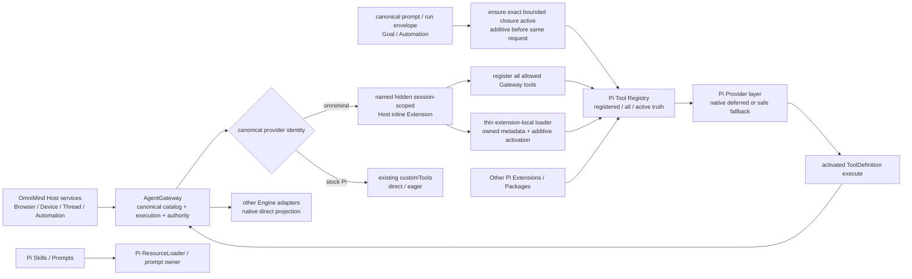

# Pi-native Host 工具动态加载、投影与生态所有权复核

> 证据日期：2026-08-19
> OmniMind 源码复核基线：原始调用链锁定于 `a24653bc7b00f9632275f2960776c31c68d61968`；Gate B 本地实现候选位于独立分支 `codex/review-pi-host-tool-mcp-settings`，截至 `d3cf632c7` 未 push、merge、发布或替换已安装 App
> Upstream/stock exact source artifact：`@earendil-works/pi-coding-agent@0.84.2`，upstream exact commit `914cf1472e715297caa30db4b9535d534a9eb718`
> OmniMind Agent 产品 runtime：生成后的 `@omnimind/pi-coding-agent@0.84.2`，基于同一 exact source 与产品窄 patch；本文不宣称它与 upstream artifact byte-identical
> 维护者裁决：OmniMind Agent 的 AgentGateway Host tools 必须进入 Pi 原生 Extension、Tool Registry 与 Dynamic Tool Loading 生命周期；dynamic 是目标架构，不再与 eager 共同参与产品方向表决
> 文档角色：Gate A exact-source 证据、已确认架构约束与 Gate B 本地候选证据；不取代 `architecture/`、`execution-brief.md`、代码或 Campaign 状态

## 0. 本文回答什么

第一目标不是建立一个 OmniMind 自有的工具搜索系统，而是：

> 让 OmniMind Agent 在保留全部可用 Host 能力的同时，不在首轮上下文中承受几十个完整 schema，减少工具选择注意力噪声，并把 registered/all/active、reload 与 Provider wire 语义留给 Pi 原生 owner。

Owner、权限、MCP、reload、collision 与 prompt 都是保证这个用户结果不失控的冰山，不是新的产品能力。

从零重开时按以下顺序读取：

1. [`README.md`](../README.md)；
2. [`PI-ECOSYSTEM-INTAKE.md`](../PI-ECOSYSTEM-INTAKE.md)；
3. [`architecture/README.md`](../architecture/README.md) 与 [`architecture/execution.md`](../architecture/execution.md)；
4. [`execution-brief.md`](../execution-brief.md) 与 active Campaign；
5. 本文锁定的 Pi artifact/source 与 OmniMind current symbols；
6. [`agent-tools-mcp-settings-review.md`](agent-tools-mcp-settings-review.md) 的 Settings 与 all-agent Built-in policy 边界。

若 Pi revision、AgentGateway topology、Provider SDK、Settings policy 或稳定 owner 改变，只重验受影响结论。

### 0.1 Gate A 摘要

```text
Workspace / branch / writer:
  /Users/liuzaoqu/Desktop/Develop/independent/OmniMind-wt-review-pi-host-tool-mcp-settings
  codex/review-pi-host-tool-mcp-settings
  one isolated writer; main workspace remains untouched

Exact source:
  upstream/stock source artifact @earendil-works/pi-coding-agent 0.84.2 / 914cf147...
  OmniMind product runtime @omnimind/pi-coding-agent 0.84.2 / same exact source + narrow product patches
  OmniMind AgentGateway + PiAdapter current integration path

Confirmed product result:
  provider === "omnimind" registers allowed Gateway tools as standard Pi Extension tools;
  within the Host Extension-owned Gateway subset, only the loader and any exact
  first-request closure start active; other owners stay opaque;
  later Host-subset activation is monotonic/additive for that Session;
  actual execution still returns to AgentGateway.

Non-goals:
  no global search subsystem, second registry, active store, ranking platform,
  third-party MCP manager, cross-Engine dynamic loading, Pi core fork or product settings.

Evidence maturity:
  Pi core/wire mechanics: upstream/stock artifact-verified + source-matched
  OmniMind product runtime lineage: source-derived; not claimed byte-identical
  current eager OmniMind bridge: current-source-observed
  target integration: architecture-confirmed + local focused/full/wire/live evidence;
  packaged interactive product journey remains narrower than source coverage

Disposition:
  Bridge narrowly through Pi's existing Extension and AgentSession owners.
```

### 0.2 Gate B 本地候选证据

截至本地代码候选`d3cf632c7`，目标形状已由一组不改写历史的本地commits实现：`14725599b`建立all-agent Built-in policy，`eac33f156`使prompt按projection/policy收敛，`38f4b7a84`增加collision-safe Host Extension，`81921d8fa`只为canonical `omnimind`接入dynamic loading与prompt-required preflight，`d9f74bd64`闭合active/authorized、toggle/in-flight、late-result与局部collision矩阵，`d3cf632c7`锁定exact Pi provider wire。它们仍是local candidate，不是main、installed bytes或public delivery。

当前证据边界：

- exact serializer 4/4通过：OpenAI Responses分别捕获`tool_search_output`与`additional_tools`；Anthropic捕获deferred definition与`tool_reference`；Kimi exact system-tool encoding与generic OpenAI-compatible fallback被区分；
- focused Host/Provider矩阵分别通过353与567项；全仓测试通过，Server为362个test files/4251项通过（另3 files/16项skip），Web为322 files/4108项通过；
- MiMo与DeepSeek在明确标记为OpenAI Chat-compatible endpoint的最小live probe中，均完成`loader → activated browser tool`两请求journey并观察到stream abort；这不证明Responses或Anthropic native wire；
- 代表性live payload中loader-only tools envelope为222 bytes，加入一个activated tool后为434 bytes。该数值只证明“未激活definition没有被偷偷搬回首轮tools payload”的局部方向，不冒充完整Gateway catalog、cache、TTFR或总成本benchmark；
- `d3cf632c7`的macOS arm64 DMG/ZIP成功闭合240个staged production dependency identities，ZIP通过隔离`HOME`、`OMNIMIND_HOME`、Electron userData与provider-private-home缺省隔离的packaged startup smoke；仓库尚无可复用的packaged交互journey harness，因此Settings toggle、Todo/Host真实点击与reopen语义仍由source integration tests证明，不能被这次startup smoke冒充。

## 1. 结论先行

稳定架构只有三层：

1. **Pi 原生机制**：Tool Registry、registered/all/active truth、Dynamic Tool Loading、reload/session lifecycle、Provider-native deferred representation 与安全 fallback；
2. **Host 接入**：AgentGateway definitions 转成标准 Pi `ToolDefinition`，由一个 named、hidden、session-scoped inline Extension 注册；
3. **可替换细节**：若 exact runtime 没有可直接复用的 callable loader，Host Extension 内提供一个极薄、无持久状态的 extension-local loader，调用 `getAllTools()`、`getActiveTools()`、`setActiveTools()` 请求纯 additive activation。

因此：

- 只有 canonical `provider === "omnimind"` 使用这条 dynamic projection；
- stock Pi 继续通过现有 `customTools` direct/eager；
- Codex、Claude、OpenCode 等继续使用各自 native MCP/plugin seam direct/eager；
- 一套 fresh 默认开放的 Built-in policy 控制所有 Agent，包括 OmniMind Agent；
- 允许且可用的AgentGateway Host tools全部注册；在Host Extension拥有的Gateway subset中，Session启动时只让loader与同一首个request明确要求的exact closure active，其余owned searchable names设为inactive，不凭感觉预留固定Host core；loader整个Session保持active，其他owner的active set保持opaque；
- 之后dynamic loading在同一Session内monotonic/additive：loader或prompt-required ensure-active只增加缺失owned names，已active schema不因职责结束被反复卸载；
- Pi Registry 是 all/active truth，不另建 Host registry、active store、resume store 或索引；
- extension-local loader 不是稳定产品工具、不是 OmniMind 全局工具搜索，也不固定名称、ranking、limit 或算法；
- actual tool execution 始终进入 AgentGateway `tools/call`；
- `registered != active != authorized`。

动态加载是维护者已确定的目标。eager 仅保留为当前行为基线、测量 comparator 与实现故障时的临时代码 rollback。如果 exact Pi seam 无法满足目标，应报告 blocker 或 upstream seam 需求；不能把 eager 重新包装为等价终态。

## 2. Exact Pi 0.84.2：三层事实必须分开

下列Pi原生语义锁定于upstream/stock exact source artifact `@earendil-works/pi-coding-agent@0.84.2`与commit `914cf147…`。OmniMind Agent实际运行生成后的`@omnimind/pi-coding-agent@0.84.2`，其来源是同一exact source加产品窄patch；这建立lineage，不建立byte-identical推断。本地Gate B conformance已在产品runtime证明Host Extension、active-set、collision与reload路径；Provider payload形状另由exact installed `@earendil-works/pi-ai@0.84.2` serializer锁定，live兼容endpoint证据不替代它。

### 2.1 Pi Core / AgentSession 原生拥有的事实

锁定 artifact/source 已验证：

- Extension 使用 `pi.registerTool()` 注册工具；
- Session 提供 `getAllTools()`、`getActiveTools()` 与 `setActiveTools()`；
- Pi 拥有 registered/all/active truth；
- Extension wrapper 比较 loader 执行前后的 active set；
- 只有纯 additive 变化会形成 `addedToolNames`；
- Session/ResourceLoader 拥有 startup、reload、resume、fork 与 shutdown 生命周期；
- Pi 根据新增 active definitions 选择 Provider-native deferred representation 或安全 fallback。

`dist/core/agent-session.js` 的关键反例是：启动构建 runtime 时会包含全部 Extension tools，Extension/custom tools 默认 active。Host Extension因而必须在`session_start`只把自己拥有且可搜索的Host names设为inactive，同时保持loader与其他owner已有active tools。之后遵循官方建议add tools instead of replacing active set；绝不能用全局reset、每回合重算或反复removal接管Session。

`dist/core/extensions/wrapper.js` 识别的信号不是 loader 名称，而是：

```text
activeBefore → loader executes → activeAfter
no removals + one or more additions → addedToolNames
```

所以 Pi 不依赖某个 magic tool name，也不要求 Host 手写 Provider-specific reference。

### 2.2 Provider / wire 层原生拥有的事实

锁定 `@earendil-works/pi-ai@0.84.2` 已验证：

- OpenAI Responses completed client 处理 `tool_search_call` / `tool_search_output`，并处理 `additional_tools`；
- Anthropic Messages 处理 `tool_reference`；
- Kimi/OpenAI-compatible 路径存在已验证的 deferred handling；
- `supportsToolSearch` 表达 Provider wire compatibility，不表达“Session 已经注册一个全局 callable search tool”。

因此 native/fallback 必须由 exact Provider/model/endpoint 的真实 wire evidence 区分。DeepSeek、MiMo、OpenAI-compatible proxy 或其他渠道不能按模型名、品牌或 API 外形推断。未知就保持 unknown，并使用 Pi 的安全 fallback；Host 不模拟 Provider payload。

### 2.3 Exact source 没有的东西

Pi `0.84.2` 没有默认注册到每个 Session、自动搜索所有 Extensions 的 turnkey global callable search tool。

官方 `docs/extensions.md` 与 `examples/extensions/kimi-deferred-tools.ts` 中的 `search_tools` / `tool_search` 是 Extension 自己 `registerTool()` 的 pattern/example：searchable owned name set 与 metadata matching 由该 Extension实现，loader 调用 `setActiveTools()`，Pi只观察active set的纯additive变化并负责后续wire encoding。

准确表述是：

> Pi 原生拥有动态工具加载与 Provider tool-search wire 机制；exact `0.84.2` 的 callable loader 是 Extension-local pattern/example，而非默认全局产品工具。

“Pi 完全没有 Tool Search”和“Pi 已提供一个可直接调用的全局 Search Tool”都不准确。

## 3. 当前 OmniMind 调用链

### 3.1 AgentGateway 是唯一 Host capability owner

`apps/server/src/agentGateway/Layers/AgentGateway.ts` 的 `makeAgentGateway` 当前组装 Thread read/diagnostics/mutation、Automation、Browser，以及仅在平台与服务真实支持时加入的 Device tools。当前观察通常为 46 个工具、支持 Device 时最多 58 个；数字只是证据快照，不是稳定 API。

`apps/server/src/agentGateway/mcpTransport.ts` 继续拥有 `tools/list` canonical definitions、`tools/call` execution、session-bound bearer、required capability、exact active-turn write authority、token revoke、Provider replacement、timeout 与 cancellation。Dynamic loading 不能复制这些责任。

### 3.2 其他 Engine 已有正确的 direct projection

`apps/server/src/agentGateway/mcpInjection.ts` 从同一 Gateway connection 生成 Codex、Claude SDK、ACP、OpenCode、Antigravity 等原生配置。外部 Engine 拥有其 Session、MCP client、cache、tool namespace 与错误语义；OmniMind 只投影当前 thread-scoped connection。

stock Pi 不走这条 MCP injection，但已有 `PiAdapter customTools` direct/eager projection；其source/stock exact artifact身份是`@earendil-works/pi-coding-agent@0.84.2`。它的产品身份不是 OmniMind Agent，不承担本轮 attention governance。

### 3.3 公共基线与本地 Gate B 候选必须分开

公共main/installed产品基线仍从`tools/list`取得definitions，通过Pi `defineTool()`转为`ToolDefinition`，`execute()`调回Gateway `tools/call`并转发`AbortSignal`，再经`customTools` eager注入。OmniMind Agent这条调用链实际使用生成后的`@omnimind/pi-coding-agent@0.84.2`产品runtime，而不是把upstream/stock package identity直接冒充为产品runtime。

本地Gate B候选已把canonical `omnimind`的Gateway definitions迁入named hidden Host inline Extension，stock Pi与其他Engine仍direct/eager；同Session内loader只additive激活owned names，Goal/Automation bounded closure在同一request前ensure active，execute仍回到Gateway。该结论由source/exact tests支持，但未push、未进入main或安装产品。

eager baseline本身使用官方seam，不是错误hack；本轮改变的是OmniMind Agent的初始上下文与provenance/collision，不是Gateway execution owner。

### 3.4 Pi ecosystem lifecycle 已有 owner

`apps/server/src/provider/Layers/OmniMindEcosystem.ts` 已复用 Pi `SettingsManager`、`DefaultPackageManager`、`ResourceLoader`、package resource enable/disable 与 reload。本文不创建第二 package manager，也不让 Host Extension接管Package、Skill、Prompt或third-party MCP。

### 3.5 Current-source 已有两类 canonical lifecycle prompt

全局反扫区分了generic `harnessPolicy.ts`与真正由Product lifecycle生成的prompt/envelope：

- **ThreadGoal**：[`architecture/product-state.md`](../architecture/product-state.md)已经把持久objective、计时/暂停/achievement、prompt injection与continuation交给现有ThreadGoal owner，并与逐turn进度快照分开。`AgentGateway.ts`中的`omnimind_set_thread_goal`是Gateway tool，要求`thread:write`与active turn；`goalMode.ts`的synthetic continuation直接要求完成时调用它记录achievement，重复外部blocker时调用它暂停Goal。active Goal的任何可能完成/阻塞request都必须在发送前确保该exact definition active；若此前inactive，只做一次additive activation。Goal cleared、paused或achieved后停止对应prompt与continuation duty，不卸载已经active的schema。没有active Goal时不预留固定core：普通自然语言设Goal可由loader发现，`/goal`与Composer Goal panel继续走Product owner；
- **Automation run**：`runEnvelope.ts`只为automation-dispatched turn直接要求/允许`omnimind_report_automation_result`、`omnimind_update_automation_memory`与`omnimind_cancel_automation`，并明确这些completion duties不得泄漏到later manual follow-up。三者来自`automationTools.ts`且受active-turn authority约束。`omnimind_cancel_automation`需要definition revision，当前revision source来自`omnimind_view_automation`；普通更新路径也明确要求`omnimind_update_automation → omnimind_view_automation`。Gate B候选已按exact envelope与schemas锁定automation turn的最小依赖closure，避免只激活一个无法完成职责的schema；
- **Generic harness**：`harnessPolicy.ts`已在OmniMind dynamic路径收敛为不枚举inactive names的短发现原则；direct Engine则只获得与其filtered tool surface一致的server instructions。它不是active-set authority。只有Goal prompt与Automation envelope可以在其canonical lifecycle内直接点名tools，且同一request发送前必须已经active。

## 4. 目标架构



图中 loader 位于 Host Extension 内部，只是 exact-version glue；它不是 Gateway 旁边的新子系统。

## 5. 唯一 owner map

| 事实或行为                           | 唯一 owner                             | Host Extension 可以做                      | 禁止做                         |
| ------------------------------------ | -------------------------------------- | ------------------------------------------ | ------------------------------ |
| Host name/schema/annotations/group   | AgentGateway catalog                   | 无损转成 Pi `ToolDefinition`               | 维护第二 schema 清单           |
| Host execution/credential/capability | AgentGateway + Host service            | closure 转发 call                          | 搬进 Extension 或 Package      |
| Pi registered/all/active truth       | Pi AgentSession                        | 注册 owned tools、请求 additive activation | 建第二 registry/active store   |
| Pi reload/resume/fork                | Pi Session/ResourceLoader              | 在 lifecycle 内重建本 Extension            | 持久化 parallel resume truth   |
| Provider deferred/fallback wire      | Pi Provider adapter                    | 消费 exact evidence                        | 按模型名猜或手写 payload       |
| Built-in exposure intent             | OmniMind ServerSettings policy         | session-start 与 live filter               | per-Provider 副本              |
| Goal/Automation prompt requirement   | ThreadGoal/Automation Product owner    | request前ensure exact closure active       | 固定Host core或第二lifecycle   |
| 某次 call 是否授权                   | Gateway/Engine runtime authority       | 传递 exact Session/turn context            | 把 active 当 permission        |
| 所有非owned Pi tool source           | 各自唯一 owner                         | 无                                         | 盘点、分类、搜索或修改         |
| third-party MCP                      | 首版无人接管；未来 exact adapter owner | 本轮无动作                                 | Host loader 扩张为 MCP manager |

## 6. OmniMind Agent 端到端生命周期

### 6.1 新 Session

```text
canonical provider === "omnimind"
  → read current Built-in policy
  → intersect platform/service availability
  → obtain allowed AgentGateway definitions
  → validate names/provenance/collisions
  → convert each definition to a real Pi ToolDefinition
  → register through one named hidden session-scoped inline Extension
  → on session_start keep extension-local loader active
  → set this Extension's searchable owned Host names inactive
  → before the first request, add any exact prompt/envelope-required closure
  → mutate only the Extension's owned name set; leave non-owned names unclassified and unchanged
```

所有允许的AgentGateway Host definitions都注册；在Host-owned Gateway subset中，首个request只暴露loader和该request明确要求且policy/availability允许的exact closure，其余owned Host tools保持inactive，不预设固定core。其他owner的active set保持opaque且不受Host控制。之后loader与request preflight只做additive activation；已经active的Host schema继续留在Pi Session active truth中。

所有非owned Pi tools均超出Host研究范围，Host不得为它们建立inventory、例外清单或控制逻辑；产品Todo的独立证据owner是[`pi-native-todo-extension-review.md`](pi-native-todo-extension-review.md)。

如果 Gateway 不可用、过滤后集合为空或 discovery 失败，应准确 unavailable，不注册空壳 loader 产品。是否还能启动 identity-only Session 由现有 Provider owner决定，不能从“没有 Host tools”擅自推出。

### 6.2 Prompt-required ensure-active

canonical prompt/envelope若直接点名Gateway tools，只在发送同一request前确保exact有界closure active：

```text
current canonical Session/turn lifecycle
  → exact prompt/envelope duties
  → bounded schema dependency conformance
  → intersect current Built-in policy and availability
  → add any missing owned Gateway definitions before the same request
  → keep Pi active set as the only Session truth
```

当前exact evidence：active ThreadGoal使Goal completion/blocking tool在该request active；Goal结束后停止prompt与continuation duty。automation-dispatched turn使run envelope直接要求的report/memory/cancel及其完成调用所需exact dependency active；later manual follow-up不继承automation duty。`cancel`所需definition revision来源与`update → view`依赖必须以exact schemas/conformance证明。

这不是arbitrary core，也不是per-turn active controller。架构不固定tool names；研究记录当前names只为Gate B falsifier。ensure-active发生在request admission前，不热切已admitted request或call；职责结束只移除prompt、duty与对应loop，不移除schema。工具保持active也不表示later manual turn获得run-only authority，Gateway call-time检查必须拒绝。Pi active set仍是唯一truth，不持久化lifecycle overlay、dependency graph或第二active store。

### 6.3 Extension-local loader

候选集合每次由以下交集产生：

```text
this Extension's immutable owned names
∩ Pi getAllTools()
∩ current Built-in policy
∩ current availability
− Pi getActiveTools()
```

它只用 name、短 description 与明确 provenance 等轻量 metadata；不得把完整 JSON Schema、全 catalog 或长 prompt 编成另一份上下文。

执行只允许：

```text
current = getActiveTools()
matches = bounded deterministic matches in this owned inactive set
setActiveTools(unique(current + matches))
```

稳定合同不规定模型可见名称、lexical 权重、默认命中数或长期 ranking 算法。首个实现应沿官方最薄 pattern，确定性、有界、无外部依赖；具体参数只是可替换 probe 参数。

若命中的exact tool schema/description明确要求另一个Gateway tool提供前置事实，activation必须带上完成该调用所需的有界closure。当前至少包括automation update对view的显式前置要求，以及automation cancel取得definition revision所需的exact closure。实现只编码被current source证明的少量关系，不建立通用dependency graph或registry。

loader 不代理执行、不返回完整schemas、不连接server、不启动进程/timer/watcher/network、不建索引/cache/active store/resume store，也不搜索或修改任何非owned tool。

`getAllTools()` 能看到别人的工具不等于 Host 有权激活它们。其他 Extension若需要 dynamic loading，由其 owner负责。

### 6.4 安全 request/turn 与实际调用

loader造成纯additive active-set change后，Pi记录新增tool names；下一安全agent request由Pi选择native deferred representation或fallback。prompt/envelope直接点名的bounded closure则必须在同一request发送前ensure active。两条路径都只增加缺失的owned names，不会热切已经admitted的模型请求或正在执行的call；已经active的schema保持到Pi原生reload/new Session/session replacement，或确有安全/政策收缩需要沿这些原生边界处理。完整schema进入真实工具面后，模型调用ToolDefinition，execute bridge仍进入AgentGateway `tools/call`。

## 7. Prompt 与上下文合同

稳定invariant是：任何发送给模型的prompt或envelope都不得直接点名inactive tool。

`apps/server/src/agentGateway/harnessPolicy.ts`是generic Host guidance。Gate B候选已在OmniMind dynamic路径将它diet成：额外Host能力可按需发现和加载；需要时使用当前active加载入口；激活后在下一安全turn调用；不要猜tool name；发现、prompt-required或active都不等于authorized。该路径不再枚举Browser、Device、Thread或Automation的inactive names。

Goal prompt与Automation run envelope是不同的canonical lifecycle owner：它们可以直接点名当前duty所需tools，但Host必须在同一request发送前ensure exact bounded closure active。不得把这些工具说明反向塞进generic prompt，也不得枚举其他inactive Host names、在loader description/result列出全catalog、把完整schema放进system prompt或用长`promptSnippet`/`promptGuidelines`重建稳定前缀。

权限、停止、人类接管和数据边界等调用前必须知道的跨工具安全约束仍保留；tool-specific guidance 优先跟随激活后的 canonical ToolDefinition。stock Pi与其他Engine继续获得与其完整filtered schema一致的直接工具指导；Codex静态Browser instructions同样受Built-in policy过滤。

## 8. Built-in policy 与 availability

Built-in tools fresh 默认开放，并控制所有 Agent，包括 OmniMind Agent。

### 8.1 关闭

- 新 OmniMind Session：disabled/unavailable group 不注册；
- 旧 OmniMind Session：loader与request ensure-active live-filter不再返回或激活该组；
- Goal/Automation所需closure被policy或availability截断：阻止/暂停对应dispatch或continuation并准确unavailable，不绕过policy、不继续loop、不伪造achievement/result；
- stale call：Gateway 按当前 policy 立即拒绝；
- schema 已 active：不承诺下一turn自行移除；exact Pi能通过安全reload/session replacement收缩时沿用原生边界，否则可以暂时可见但不能执行，并准确诊断；
- 已准入 in-flight call：普通 exposure toggle 不伪装成 emergency kill；cancel 仍归 turn/session owner；
- Browser/Device 人类 UI：不受 Agent exposure 设置影响。

### 8.2 重新开启

创建时已经注册但后来被live policy屏蔽的tool，重新开放后可由loader再次发现；创建时没有注册的tool不得静默注入旧Session，按exact reload/new-session边界生效；不为抹平Engine差异新增全局registry或第二active store。

### 8.3 Availability

平台与服务真实不可用先从注册池排除。Device unsupported 不是“用户关闭”；UI 与 diagnostics 必须区分 unavailable 与 disabled。

## 9. Authorization、permission 与 cancellation

每次真实 call 重新检查：current Built-in policy、exact session identity、credential/lease、platform/service availability、runtimeMode与真实permission、approval bridge（仅在真实存在时）、exact turn authority、timeout、cancellation/abort、Provider replacement与late-result fence。

注册只表示Session知道definition；canonical prompt/envelope-required只表示同一request必须提供对应definition；active只表示request可选择；三者都不是授权。loader自身应是短、进程内、无外部副作用的discovery/activation操作。实际Tool execute继续转发Pi `AbortSignal`；reload或active变化不取消in-flight call。

## 10. Reload、resume、fork 与 instance replacement

Pi Session是active truth owner：reload创建新Extension instance与owned set；旧instance/handler不能继续mutation；resume/fork使用exact Pi lifecycle。Host不在每个request重算或收缩active set；不能原生恢复时由loader重新发现，prompt/envelope只ensure当次明确需要的missing closure。不建Host active persistence、LKG、generation、dependency registry或migration；compaction继续由Pi拥有transcript/tool result/summary truth。

需要重点做 conformance，而不是先承诺：Pi `0.84.2` 各 lifecycle event 对 inline Extension 的精确触发顺序、Session replacement 后旧 closure 是否释放、active definitions 在 resume/fork 中如何恢复。

## 11. Collision 与 provenance

`dist/core/resource-loader.js` 对 Extension-Extension tool conflict 产生 diagnostics，并有加载顺序/priority语义。它不自动证明 built-in、SDK custom、inline Extension 等所有交叉来源的安全结果。AgentSession最终Map composition存在last-set风险；因此不能只靠命名猜测或“有 diagnostic”宣称安全。

Gateway内部duplicate必须拒绝不可信catalog。cross-source同名时，Host只对自己的ownership claim、该collided capability以及依赖它的Goal/Automation dispatch fail closed：不得把第三方winner当成owned Gateway capability，不得由Host loader激活或投影为Host tool。Pi-native第三方winner与Session其余能力默认继续，并通过既有diagnostic/warning准确报告局部不可用。只有exact Provider contract无法诚实隔离局部冲突时，才把整个Session标为unavailable；这是必须由conformance证明的升级条件，不预先承诺fatal。

不得silent override、silent drop或自动rename。错误只报告必要canonical names与provenance，不泄露bearer、endpoint、完整schema或用户参数。

Provenance目标：Gateway tools与loader属于named inline Host Extension；Host只按自己的immutable names核对exact `sourceInfo`，不建立全局tool inventory，也不重写、归类或复制其他sourceInfo。Timeline继续记录实际tool name、Provider、Thread与call identity。UI若显示provenance，只投影现有真相，不建立第二表。

## 12. Provider wire 验证

每个 exact Provider/endpoint只允许三种结论：

- `native`：wire真实接受并完成deferred references；
- `fallback`：Pi在下一request发送当前active tool definitions；
- `unknown`：证据不足。

验证至少记录脱敏的初始/激活后真实wire tool-schema bytes、compatibility path、native reference或fallback definitions、prompt/cache/input/output usage、额外round trip与TTFR。不把代理转换、兼容endpoint与直连混为同一证据。

## 13. 性能与 outcome：证明实现，不重投产品方向

维护者已经选择 dynamic architecture。benchmark只验证exact provider native/fallback、量化schema bytes与prompt/cache变化、调优轻量metadata matching、发现错误搜索/漏召回/额外turn，并证明任务成功率、TTFR、总成本与无回归；产品方向不由benchmark重新表决。eager只作current baseline/comparator/temporary rollback。

代表性 OmniMind Agent journeys：

| Journey                           | 关键观测                                                        |
| --------------------------------- | --------------------------------------------------------------- |
| 普通代码任务，无 Host需求         | 初始schema bytes、错误加载率、TTFR、成功率、成本                |
| Browser任务                       | metadata召回、additive activation、下一turn schema、执行与停止  |
| Thread协调                        | 精确工具选择、write authority、target identity                  |
| active Goal普通/continuation turn | 同request Goal tool active；结束后停止prompt/loop；schema可保留 |
| Automation-dispatched turn        | report/memory/cancel exact closure同request active              |
| Automation manual follow-up       | 无run duty；run-only call即使schema active也被authority拒绝     |
| Device unsupported                | 不注册、不发现、不产生幽灵schema                                |
| Stop in-flight Gateway call       | abort-to-idle、无late副作用                                     |
| reload/resume/fork                | instance replacement、重新发现成本、无第二truth                 |

MiMo与DeepSeek使用协议匹配的最小真实journey；报告区分直连、兼容endpoint与代理。外部Engine只做direct projection、Built-in过滤、prompt和call deny回归，不建立通用动态工具benchmark。

## 14. Scale、Package、Skill 与 MCP

当前几十个Host tools足以证明初始schema需要治理，但不授权embedding、BM25、远端服务或持久索引。首个loader线性扫描短metadata；只有profile真实证伪后才在Extension内部替换有界算法，owner与Registry不变。

Pi Skills已使用progressive disclosure；Package install/update/remove/enable/reload继续由PackageManager/ResourceLoader拥有。Host loader不搜索Skill正文、不安装Package、不管理Package tools。

首版不提供第三方MCP Settings、CRUD、credential/OAuth、连接测试、全局状态面板、跨Engine自动分发或统一搜索。未来只有某个exact Pi-native MCP Extension/adapter经source match、isolated runtime与真实Session证明支持lazy discovery/proxy或按需activation时，它才能拥有自己的加载体验；MCP协议本身不证明lazy语义。

即使未来成立，adapter仍拥有config、secret、transport、server lifecycle与its tools；Host Extension不接管；工具被发现/active不代表授权；不能为发现连接所有servers、制造process/network/reconnect storm或把全量schemas塞回上下文；不建立Host+third-party总registry或统一permission system。

## 15. 最小 Gate B 实施切片

### Slice 1：冻结 exact baseline 与 conformance falsifier

- 记录OmniMind Agent与stock Pi all/active/sourceInfo；
- 记录Gateway 0/普通/Device可用tool count；
- 记录initial prompt与wire schema bytes；
- fixture覆盖普通Extension、自有dynamic loader与name collision；
- fixture覆盖active Goal、Goal结束、automation run/manual follow-up与policy-disabled dispatch；
- 证明Pi启动默认active Extension/custom tools与cross-source composition。

### Slice 2：只迁移 OmniMind Agent 的注册 owner

- 复用现有definition→`ToolDefinition`与execute bridge；
- 只有`provider === "omnimind"`注入named hidden inline Extension；
- Gateway tools从该Provider的eager `customTools`移出；
- stock Pi保持direct/eager；
- 非owned tools不进入Host的注册、分类或active-set计算；
- filter、duplicate、collision与empty failure先闭合。

### Slice 3：接入 Pi-native Dynamic Tool Loading

- Extension注册必要的极薄loader；
- session start只调整owned Host names；exact Pi API若要求完整active list，把当前集合视为opaque base，只union owned additions；
- session_start保持loader active并只把owned searchable Host names设为inactive；
- Host-owned Gateway subset首个request只ensure当次明确要求的exact closure，其余owned tools保持inactive；
- loader只做owned/live/available/inactive交集与additive `setActiveTools`；
- Goal/Automation prompt-required closure只做bounded additive ensure-active，职责结束不卸载schema；
- 同步区分generic Host guidance与Goal/Automation lifecycle prompt；
- 不固定公共名称/ranking/limit。

### Slice 4：focused lifecycle 与 wire proof

- exact upstream/stock source artifact与生成后的OmniMind产品runtime `0.84.2`；
- startup/reload/resume/fork/shutdown；
- collision/provenance；
- Built-in disable/re-enable；
- Browser/Thread representative calls；
- active Goal completion/block、Goal paused/cleared/achieved；
- Automation report/memory/cancel dependency closure与manual follow-up authority；
- Device unavailable；
- turn authority、AbortSignal、timeout、Provider replacement；
- native/fallback wire。

### Slice 5：outcome/economics 与 packaged closure

- MiMo/DeepSeek最小真实journeys；
- schema bytes、prompt/cache、错选率、额外turn、成功率、TTFR、成本；
- exact local candidate SHA fresh isolated packaged profile；
- close/reopen与private-home隔离。

当前本地候选已经完成exact serializer、focused/full tests、MiMo/DeepSeek兼容endpoint最小journey与隔离packaged startup；完整Gateway catalog economics、packaged Settings/Todo/Host交互与close/reopen journey仍不得从startup smoke或小型payload probe外推。

## 16. 验收矩阵

### 16.1 Registry 与加载

- allowed Gateway definitions以真实Pi `ToolDefinition`注册；
- disabled/unavailable definitions不注册；
- Host-owned Gateway subset初始只有loader与首个request明确要求的closure active；其余owned tools inactive；
- loader active且只管理owned集合；
- other-owner active set保持不变；
- 后续activation在Session内monotonic/additive，不因Goal/Automation duty结束移除schema；
- 下一安全turn出现完整definitions；
- actual execute回到同一Gateway handler。

### 16.2 Prompt 与上下文

- generic prompt不枚举inactive tools；
- Goal/Automation prompt/envelope点名的tools在同request active；
- prompt-required tool说明不泄漏到generic prompt或later manual follow-up；
- loader description/result不包含全catalog或完整schemas；
- ordinary task不错误加载Host tools；
- schema bytes显著低于eager baseline；
- native/fallback有exact wire证据。

### 16.3 Policy 与权限

- Built-in fresh默认开放且覆盖所有Agent；
- 关闭后新Session不注册、旧loader/ensure-active不再增加、stale call deny；
- prompt-required closure不完整时阻止/暂停对应loop并准确unavailable；
- 已active schema不承诺per-turn移除；必要收缩只沿exact Pi reload/session replacement；
- in-flight不被普通toggle伪杀；
- re-enable遵循reload/new-session边界；
- registered/prompt-required/active不冒充authorized；
- credential、permission、approval、turn、timeout、cancel全部保留。

### 16.4 Lifecycle 与 collision

- reload/resume/fork无第二active store；
- Goal/Automation结束后停止对应prompt/duty/loop，已active schema可保持；
- automation cancel/update的revision dependency closure可完成；
- old Extension instance/handler不泄漏；
- no Gateway/empty/error准确unavailable；
- duplicate拒绝；cross-source collision只让Host claim/capability局部fail closed；
- 无silent override/rename；
- `.pi`与`.omnimind`隔离。

### 16.5 Scope

- stock Pi仍direct/eager；
- 其他Engine仍native direct；
- Host loader不搜索、分类或修改任何非owned tool；
- 无新registry、settings、permission system、index、process或持久状态。

## 17. Rollback、stop-loss 与重开

### 17.1 临时代码 rollback

实现故障时可移除OmniMind Provider的inline Extension injection，临时把Gateway definitions放回该Provider现有`customTools`，恢复与eager schema一致的prompt，同时保持Gateway、Built-in policy、stock Pi与其他Engine不变。

这条路径无数据迁移，但只是临时止损，不是等价最终架构。不得用永久feature flag或双轨配置让两种authority长期并存。

### 17.2 Stop-loss

出现任一条件即停止扩张并报告blocker/upstream需要：必须fork Pi core才能获得基本registered/active/additive seam；需要第二Registry/active/resume/search store、通用dependency registry或Host lifecycle control plane；必须接管其他Extension active set；collision只能靠silent override/rename；需要按模型名硬编码wire；需要全局搜索、embedding/BM25/远端索引；权限/credential/turn/timeout/cancel/secret边界被削弱；prompt只是把全catalog从schema搬到文字；相同失败没有新假设仍重复补丁。

命中后只允许简化实现或请求exact upstream seam，不能把eager宣布为终态。

### 17.3 Revalidation triggers

- upstream/stock source artifact、OmniMind产品runtime revision或AgentSession/Extension API变化；
- Provider tool-search wire变化；
- AgentGateway catalog/listChanged/policy/lifecycle变化；
- ThreadGoal prompt/continuation或Automation run envelope/schema/dependency变化；
- Package collision/load order变化；
- Host tool规模使有界metadata扫描被profile证伪；
- future third-party MCP产品scope被维护者重新开启；
- 真实泄密、orphan、late side effect或resume失败。

## 18. Gate B 本地候选 disposition

```text
Exact identity:
  Pi 0.84.2 / upstream 914cf147...; OmniMind integration path as recorded above.

Confirmed architecture:
  AgentGateway Host definitions become standard Pi Extension tools for provider === "omnimind";
  Pi owns Registry/active/wire; only the Host-owned Gateway subset starts minimal and then grows
  monotonically/additively, while other owners remain opaque;
  Gateway owns execution/authority.

Replaceable detail:
  exact 0.84.2 may need one thin extension-local callable loader;
  its name, ranking, limit and algorithm are not stable contracts.

Dynamic status:
  required target, implemented as a local candidate; not an eager-vs-dynamic product experiment.

Loader scope:
  only this Host Extension's registered, live-policy-allowed, available, inactive Gateway tools.

Prompt-required scope:
  ensure the exact policy-allowed/available Gateway closure required by the current request;
  Goal and Automation prompts may name only tools active in that same request;
  missing dependencies are added once, while duties end without schema removal.

Third-party MCP:
  out of first release; no settings, manager, unified search or cross-Engine distribution.

Non-owned tools:
  out of this Host Extension's registry, search and active-set authority.

Revalidation trigger:
  Goal/Automation prompt, envelope, schema or dependency changes;
  or the Pi Extension API changes the owned-set isolation/collision guarantees.

Delivery boundary:
  local source candidate only; not pushed, merged, installed or released;
  packaged startup is proven, packaged interactive Gate B journey is not claimed.
```

最终原则：

> **让AgentGateway Host tools真正进入Pi原生Extension与Dynamic Tool Loading生命周期；Pi拥有Registry、active set与Provider wire，Host Extension只注册并按需激活自己的工具，AgentGateway始终拥有执行与授权。**
