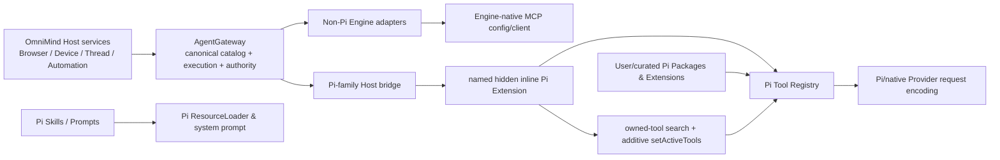

# Pi-native Host 工具投影、动态加载与生态所有权复核

> 证据日期：2026-08-18
> OmniMind 证据快照：`main@8066f23f92a8dbe35c052fc9bcdbd71d347f2c0a`，研究开始与写入前工作树均 clean
> Bundled Pi 基线：`@earendil-works/pi-coding-agent@0.84.2`，upstream exact commit `914cf1472e715297caa30db4b9535d534a9eb718`
> 维护者裁决：2026-08-18 选择方案 A；本文的长期 owner/Engine-native 投影原则已同步到 `architecture/README.md` 与 `architecture/execution.md`，但未授权 Gate B 代码实施
> 文档角色：Gate A 只读复核、架构建议与未来 Gate B 执行参考；不拥有产品架构、当前施工状态、Campaign claim 或实施授权

## 0. 从零开始时先读这里

这份文档回答一个具体问题：

> OmniMind Host 能力、外部 MCP、Pi Package/Extension、Skill 与工具搜索分别应该由谁拥有；OmniMind Agent 如何在不 fork Pi、不复制 registry、不把几十到上百个工具一次塞给模型的前提下，使用 Pi 官方动态工具机制。

重开本议题时，不依赖历史聊天，按以下顺序恢复事实：

1. 根 [`README.md`](../README.md)：产品身份、Pi-compatible 承诺与 production adoption；
2. 根 [`PI-ECOSYSTEM-INTAKE.md`](../PI-ECOSYSTEM-INTAKE.md)：Pi Core、Package、Extension、Skill、Tool、MCP 的两门 intake；
3. [`architecture/execution.md`](../architecture/execution.md)：Provider、Pi-family runtime、生态与 Host capability 的稳定 owner；
4. [`execution-brief.md`](../execution-brief.md)：当前目标、真实并发和阻塞；本文不能替代它；
5. 当前 active Mission：只读取 claim 状态和 evidence pointer；
6. 本文列出的 current source symbols 与 bundled Pi exact package；
7. 若 Pi revision、OmniMind Gateway topology、Provider SDK 或产品 owner 已变化，只重验受影响结论。

本文中的“建议”“执行切片”不是当前已实现状态。稳定职责若被维护者正式采用，应进入对应 `architecture/*` sole owner；代码进展只由代码、测试、Git 与当前执行 owner证明。

### 0.1 Gate A 摘要

```text
Workspace / branch / HEAD / dirty paths:
  /Users/liuzaoqu/Desktop/Develop/independent/OmniMind
  main @ 8066f23f92a8dbe35c052fc9bcdbd71d347f2c0a
  clean at inspection and before this document write

Applicable authority owners:
  README.md
  PI-ECOSYSTEM-INTAKE.md
  architecture/execution.md
  current execution-brief.md
  active Mission for claim state only

Candidate exact source:
  bundled Pi 0.84.2, upstream commit 914cf1472e715297caa30db4b9535d534a9eb718
  OmniMind current AgentGateway and PiAdapter at the OmniMind HEAD above
  no third-party MCP adapter candidate is proposed for runtime adoption

Exact OmniMind integration path:
  AgentGateway canonical MCP catalog and execution
    -> native MCP injection for non-Pi Engines
    -> PiAdapter tools/list + tools/call projection for Pi-family Engines

User journey:
  ordinary work starts with a small, accurate tool surface;
  when Host capability is needed, the Agent finds and activates the exact tools;
  Package/Skill/Extension behavior remains Pi-native;
  external Engines retain their native MCP lifecycle.

Simplest baseline:
  preserve current Gateway owner and Pi SDK;
  replace only the Pi-family eager Gateway projection with one inline Pi Extension.

Primary falsifier:
  the proposal is rejected if it requires a Pi core patch, a second registry/config store,
  silently changes third-party Extension active tools, weakens permission/cancellation,
  or fails representative outcome/economics against the current eager baseline.

Gate B authorization:
  absent; the maintainer requested this detailed review and execution plan, not code implementation.

Architecture disposition:
  accepted on 2026-08-18 for stable owner and Engine-native projection principles only;
  architecture does not claim the inline dynamic implementation is already shipped.
```

## 1. 结论先行

最终建议不是“两套能力体系”，而是：

> **一份能力真相，两条 Engine-native 投影；Host 拥有能力，Pi 拥有 OmniMind Agent 会话中的工具语义。**

具体裁决：

1. OmniMind 内置 Browser、Device、Thread、Automation 等能力继续由 `AgentGateway` 唯一拥有 catalog、执行、权限、凭据、turn authority、取消与生命周期。
2. Codex、Claude Agent、OpenCode、Cursor、Grok、Droid、Antigravity 等非 Pi Engine 继续使用各自已经支持的原生 MCP 接入；Host 不把 Pi 的 `tool_search` 语义强加给它们。
3. OmniMind Agent 与 stock Pi 这两个 Pi-family Engine 通过 Pi 官方 `ResourceLoader.extensionFactories` 接收一个 session-scoped、named、hidden inline Extension。该 Extension 把同一 Gateway tool definitions 注册进 Pi Tool Registry，并用 Pi 官方 `getAllTools / getActiveTools / setActiveTools` 管理按需激活。
4. Gateway tool execution 仍调用现有 `tools/call`，不搬进 Extension，不复制 schema，不复制凭据，不持久化 MCP 配置。
5. 用户安装的 Pi Packages、Extensions、Skills、Prompts 与 Pi-only MCP adapter 继续由 Pi `DefaultPackageManager / ResourceLoader` 拥有。Host inline Extension不得关闭、重命名或接管其他 Extension 的工具。
6. `tool search` 只搜索已经注册到 Pi Tool Registry、且明确由该 inline Extension拥有的 Host Gateway tools。它不搜索或安装 Package，不搜索 Skill 正文，不管理 MCP server lifecycle，也不擅自激活其他 Extension 刻意保持 inactive 的工具。
7. 不为本议题引入第三方 `pi-mcp-adapter`。它可能是未来“Pi-only 外部 MCP”候选，但对 OmniMind 自己的 AgentGateway 是一次没有收益的回环和第二生命周期。
8. 不修改 Pi core。若 public Extension/SDK seam 不足，先保留 current `customTools` bridge 或向 upstream 提 seam；不能把不足悄悄补成长期 fork。
9. 面向未来的扩展单位固定为“新增一个 canonical Host tool definition，自动进入既有投影”，而不是“每增加一个工具，就分别修改 Pi、MCP、Prompt、UI 与权限五处”。若新增 Provider 或能力类型仍要求成倍复制 glue，视为边界设计失败，不以更多抽象掩盖。

Disposition：**Bridge narrowly**。

`zq-dev-rules` 裁决：

```text
Outcome:
  OmniMind Agent 按需发现并使用 Host tools，外部 Engines 保持 native MCP，
  用户的 Pi 生态不被 Host 接管。

Current truth:
  AgentGateway 已是唯一 catalog/execution owner；PiAdapter 已用官方 customTools 投影，
  但当前 Gateway tools 全部 eager active，且没有 Pi-native search/activation owner。

Smallest path:
  保留 Gateway 与 provider injection；把 Pi-family Gateway projection收口为一个 inline Extension，
  只增加 owned-tool search 与 additive activation。

Excess rejected:
  Host Plugin Registry、第二 Tool Registry、第三方 adapter 回连自身 Gateway、
  embeddings/BM25 服务、Package discovery 与 tool search 合并、Pi core fork、全量 UI 控制台。

Proof:
  exact Pi conformance + current Adapter focused tests + representative DeepSeek/MiMo live journeys
  + exact pushed SHA packaged fresh-profile journey；只证明实际覆盖的协议与平台。

Decision:
  SIMPLIFY 后 GO。
```

## 2. 问题不是“MCP 归谁”，而是每一层归谁

把整个 MCP 或整个插件一刀切给 Host/Pi，会掩盖真正的责任。必须拆成以下层：

| 事实或行为                                               | 唯一 owner                                               | 边界层可以做什么                                 | 绝不能做什么                                     |
| -------------------------------------------------------- | -------------------------------------------------------- | ------------------------------------------------ | ------------------------------------------------ |
| OmniMind Browser/Device/Thread/Automation 能力           | OmniMind Host 对应 service + AgentGateway                | 投影 tool definition，转发 call                  | 在 Pi/Provider adapter 复制实现                  |
| Host tool canonical name/schema/annotations              | AgentGateway tool catalog                                | 转成目标 Engine 接受的格式                       | 在每个 adapter 手写第二份 schema                 |
| Host credential、thread lease、turn write authority      | AgentGateway credential/session owner                    | 以 session closure 或 native MCP config 安全传递 | 写入 Pi settings/package、argv、模型上下文或日志 |
| 非 Pi Engine 的 MCP transport/lifecycle                  | 对应 Engine/native adapter                               | 注入该 Engine 真实支持的 MCP config              | 伪造跨 Engine 完全相同语义                       |
| Pi Session Tool Registry、active set、下一 turn tool set | Pi `AgentSession`                                        | Host 通过官方 Extension API 注册和请求 mutation  | Host 建第二 registry/active store                |
| Pi Package install/update/remove/enable/reload           | Pi `DefaultPackageManager`、Settings、ResourceLoader     | OmniMind Library 做 typed intent/projection      | Host 建第二 package store、LKG、generation       |
| Pi Skill discovery与正文加载                             | Pi ResourceLoader/system prompt/read                     | Library显示 provenance；模型按描述读取正文       | 用 tool search冒充 Skill loader                  |
| 某次调用是否允许                                         | Product `runtimeMode` + Engine/Host真实 permission owner | active tool 只能表达“模型可选择”                 | 把 inactive 当 security deny                     |
| Provider wire-level deferred loading/cache               | Pi/native Provider adapter                               | 传递真实 compatibility 与 usage                  | Host按模型品牌猜 supportsToolSearch              |
| 用户可见状态                                             | 现有 Timeline/Library/Usage/diagnostics                  | 投影真实 active/source/failure                   | 新建 Capability Center 或技术仪表盘              |

这张表允许不同层有不同 owner，但每一层只能有一个事实源。所谓“两个机制”只能是两种投影，不是两套配置、两套 catalog 或两套权限。

## 3. 当前真实调用链

### 3.1 AgentGateway 是现有唯一能力 owner

当前 `apps/server/src/agentGateway/Layers/AgentGateway.ts` 的 `makeAgentGateway` 组装：

- Thread read tools；
- Thread diagnostics tools；
- Thread create/send/interrupt/title/archive/goal tools；
- Automation tools；
- 22 个 Browser tools；
- macOS 且 `DeviceService.supported === true` 时追加 12 个 Device tools。

当前 canonical catalog 在普通支持平台包含 46 个工具，在支持 Device 的 macOS 环境最多 58 个：

| 组           | 当前数量 | 说明                                                      |
| ------------ | -------: | --------------------------------------------------------- |
| `omnimind_*` |       24 | 6 read + 4 diagnostics + 7 thread mutation + 7 automation |
| `browser_*`  |       22 | 来自 `packages/shared/src/browserAutomationCatalogue.ts`  |
| `device_*`   |       12 | 仅 platform/service capability 真实支持时注册             |

测试中的 `omnimind_unknown` 不属于生产 catalog，不能计入 24。

`apps/server/src/agentGateway/mcpTransport.ts` 的 `makeAgentGatewayMcpTransport`：

- `tools/list` 返回该 Session 可见的 canonical definitions；
- `tools/call` 才检查 `requiredCapability`；
- write tool 还要检查 exact active turn authority；
- bearer token 绑定 exact Provider Session；
- token revoked、Provider replacement 或 turn authority退休后 fail closed；
- 当前 protocol 宣告 `tools.listChanged: false`，因此 catalog 是 session-start snapshot，不是动态 server catalog。

这些都是工具加载之外的执行冰山。任何新的 Pi Extension只能复用，不能重写。

### 3.2 非 Pi Engines 已经走 native MCP

`apps/server/src/agentGateway/mcpInjection.ts` 从同一 `AgentGatewayMcpConnection` 生成：

- Codex `[mcp_servers.omnimind]` TOML；
- Claude Agent SDK `mcpServers` HTTP entry；
- ACP `session/new` / `session/load` 的 HTTP 或 stdio→HTTP proxy；
- OpenCode 的 remote MCP config；
- Antigravity 的 secret-free plugin fragment。

这条路径的 owner 选择是正确的：外部 Engine 拥有自己的 Session、MCP client、tool namespace、cache 与错误语义，OmniMind 只做 thread-scoped connection projection。

### 3.3 Pi-family 当前走 eager `customTools`

`apps/server/src/provider/Layers/PiAdapter.ts` 当前：

1. `buildPiAgentGatewayCustomTools()` 调用 Gateway `tools/list`；
2. 每个 descriptor 通过 Pi `defineTool()` 转成 `ToolDefinition`；
3. `execute()` 继续调用 Gateway `tools/call`，并把 Pi `AbortSignal` 转发到 HTTP request；
4. `createSdkRuntime()` 把全部 Gateway definitions放入 `createAgentSessionFromServices({ customTools })`；
5. 同一数组还包含 supervised Bash 与 OmniMind Agent 的 `omnimind_update_tasks`。

这不是错误的非官方 hack。Pi 0.84.2 官方 SDK 明确支持 `customTools`，并将其与 Extension tools 合并进同一个 registry。当前 bridge 还正确保留了 per-thread connection、token rotation、abort signal 与 Gateway execution owner。

当前真正缺口是：

- Pi 创建 Session 时默认把全部 Extension/custom tools active；
- OmniMind 没有注入任何 loader Extension；
- 当前代码没有 `search_tools`、`tool_search` 或 `setActiveTools` 调用；
- 因此最多 58 个 Host schemas 与 Pi built-ins/package tools 同时暴露给模型；
- Gateway tools作为 SDK tools的 `sourceInfo.source` 只能显示 `sdk`，不能准确区分 supervised Bash、task tool 与 Host Gateway；
- Pi custom tool在 registry 合并顺序中可覆盖同名 Extension tool，而 ResourceLoader 的 Extension conflict diagnostics看不到 custom-tool collision；
- 当前 Host policy 大量直接点名 Browser、Device、Thread 与 Automation tools；若工具改成 inactive，必须同步保持 prompt与真实 active set一致。

### 3.4 Pi Package lifecycle 已经接上，不应重造

`apps/server/src/provider/Layers/OmniMindEcosystem.ts` 已直接实例化 bundled Pi：

- `SettingsManager`；
- `DefaultPackageManager`；
- public package list/resource list；
- install/update/remove；
- resource enable/disable；
- Provider Session resource reload。

这条链说明 OmniMind 不缺一个“新的插件管理器”。Library 应继续投影 Pi 的真实状态，不维护平行 package database。

## 4. Pi 官方机制与设计哲学

### 4.1 Exact source identity

生产采用的 bundled runtime 不是 `/Users/liuzaoqu/Desktop/Develop/πCode/pi` 当前 head。证据必须锁到：

- upstream repository：`https://github.com/earendil-works/pi.git`；
- exact release commit：`914cf1472e715297caa30db4b9535d534a9eb718`；
- package：`@earendil-works/pi-coding-agent@0.84.2`；
- npm integrity：`sha512-l4E+B7hgXKWddRo8bC/eSue2aWZjEgJ9xIpf5p0Og+lq8a2TArCwJ0HCoCPCgaBP/tN4zbYH/wOwvx9pJpeLCA==`；
- OmniMind archive：`vendor/omnimind-pi-coding-agent-0.84.2.tgz`；
- archive SHA-256：`a08d63bcfb691d936cea4a822b3e4c25b9152fd3f59ee5a5c13a04ab12525514`；
- product patch SHA-256：`c2233003a1c313488e09bf0a2e8fc1c293ab3ba9392226e637d09f592489895f`；
- stock package patch SHA-256：`7acead23cba0ac9243b85150049c8ab98a0f1d5d9ed05e133a17afd20165cc77`。

当前 `/Users/liuzaoqu/Desktop/Develop/πCode/pi` head 为 `209bc7b9a89b01c8fd05861cf5bbdda3e300037a`，虽然 package version仍显示 `0.84.2`，但相对 release commit已有后续源码变化。它可用于发现上游方向，不能替代 bundled artifact 的生产事实。

本轮对 dynamic tools 的结论已在真实安装的 0.84.2 docs/dist中复核；OmniMind patch没有接管 Tool Registry/active-set owner。

证据成熟度：

```text
Pi dynamic-tool public API: artifact-verified + source-matched
OmniMind current eager bridge: current-source-observed + focused tests present
建议的 inline Extension: design-only，尚未 isolated-runtime-observed
真实 Provider outcome/cache收益: unknown，必须 Gate B live proof
packaged product结果: unknown，必须 exact pushed SHA fresh profile proof
```

### 4.2 Pi 的核心不是“内置所有功能”，而是最小 core + Extension

Pi README 的 Philosophy 明确说明：

- core保持最小；
- workflow差异由 Extensions、Skills 或 Packages提供；
- **No MCP** 不是“不允许 MCP”，而是 MCP 不进入 core；需要者用 Extension增加；
- subagent、permission popup、plan mode、todo 同样不固化成唯一答案。

Pi 作者对 MCP 的进一步论证强调：大型 MCP server常带来大量 schema/context、较弱的代码组合性和难扩展性；能用 Bash/CLI/代码与按需说明解决时，不必默认 MCP 化。来源：<https://mariozechner.at/posts/2025-11-02-what-if-you-dont-need-mcp/>。

对 OmniMind 的约束不是拒绝现有 AgentGateway，而是：

- AgentGateway 是真实跨 Engine Host boundary，可以保留；
- 进入 Pi 时必须成为可替换 Extension/Tool composition，而不是 Pi core fork；
- 新增 MCP 之前先问 CLI/Skill/普通 Tool是否更小；
- “一切皆插件”不能被误译成“一切都由一个 Host Plugin Registry拥有”。

### 4.3 Pi 0.84.2 已有我们需要的公开 seam

Pi 0.84.2 官方 surface 已提供：

- `customTools`：SDK Host直接注入 ToolDefinition；
- `extensionFactories`：SDK Host注入进程内 inline Extension；
- named inline Extension与 `hidden` 标记；
- `pi.registerTool()`；
- `pi.getAllTools()`，包含 name、description、parameters、promptGuidelines、sourceInfo；
- `pi.getActiveTools()`；
- `pi.setActiveTools()`；
- `session_start` / `session_shutdown` / reload/resume/fork lifecycle；
- ResourceLoader Extension conflict diagnostics；
- additive tool activation的 provider-native/fallback编码。

因此当前问题不需要 Pi core patch，也不需要新依赖。

### 4.4 Pi 官方 Dynamic Tool Loading 的准确语义

官方流程是：

1. 所有候选 Tool先注册，进入 `getAllTools()`；
2. 初始只让 loader和必要核心 Tool active；
3. loader执行时调用 `setActiveTools([...current, ...matches])`；
4. 变化必须是 additive，不能在同一次加载里移除当前 active tools；
5. Pi在 loader result后记录新增 Tool names；
6. 支持 native deferred loading的 Provider使用原生引用；其他 Provider在下一 request发送完整的当前 active tool list。

重要细节：

- loader没有保留名称，也不需要标记为“特殊 search tool”；真正的信号是 active set additive change；
- unknown tool name会被忽略；
- active-set removal仍可工作，但不会走 native deferred fast path；
- active Tool带 `promptSnippet` 或 `promptGuidelines` 会重建 system prompt，可能使稳定前缀 cache失效；lazy Tool通常应依赖 description；
- active变化只作用于下一 agent turn，不热切已经接纳或执行中的 Tool call；
- Pi 0.84.2 docs列出的 native路径包括 Anthropic特定新模型与 OpenAI新 Responses家族；custom/proxy必须通过真实 wire证据设置 compat flag，不能按 Provider/model名字猜。

### 4.5 Skill、Package、MCP 与 Tool Search不是同一对象

| 对象            | Pi 如何发现                                  | 模型初始看到什么                                                | `omnimind_search_tools` 是否处理         |
| --------------- | -------------------------------------------- | --------------------------------------------------------------- | ---------------------------------------- |
| Package         | PackageManager/settings                      | 不把整个 Package manifest当 Tool                                | 否；安装/更新属于 Library intent         |
| Extension       | ResourceLoader执行 factory                   | 注册出的 active tools/commands及其实际贡献                      | 只处理本 inline Extension拥有的 tools    |
| Skill           | 扫描 `SKILL.md`，解析 frontmatter            | 未禁用 model invocation的 name/description/path XML；正文不注入 | 否；模型按 Pi 指令用 read加载正文        |
| Prompt template | ResourceLoader/命令扩展                      | 不作为 Tool schema                                              | 否                                       |
| MCP server      | Pi core不内置；由 Extension实现连接          | 取决于该 Extension注册什么 Tool                                 | 只有被本 Extension拥有并注册的 Host Tool |
| Pi Tool         | built-in、Extension或SDK custom registration | 只有 active tools的 definitions                                 | 是，但首版只搜索 Host-owned Gateway集合  |

所以“把 MCP Tool转换成 Pi Tool后可被搜索”的完整含义是：它已经进入 Pi Tool Registry，并且某个 search Extension明确把它纳入候选。Pi不会因为它来自 MCP自动识别、安装或搜索该 server。

## 5. 推荐目标架构



### 5.1 关键边界句

> Host 决定“这项 OmniMind 能力是否存在、谁获准执行”；Pi 决定“当前 Pi Session 的模型下一轮看见哪些工具、如何按 Provider协议加载”。

### 5.2 为什么使用 named hidden inline Extension，而不是继续只用 customTools

`customTools` 是官方且当前 bridge正确；它不是必须清除的错误。这里建议将**Gateway tools这一组**迁入 inline Extension，是因为同一改动同时关闭四个真实问题：

1. loader需要 Extension API调用 `getAllTools/setActiveTools`；
2. Gateway tools获得 `<inline:omnimind-host-gateway>` provenance，不再与 Bash/task tool都混为 `sdk`；
3. ResourceLoader能够报告与其他 Extension的同名 Tool冲突；
4. register、owned set、initial activation与 search在同一 session lifecycle owner内，减少桥接散落。

supervised Bash与 `omnimind_update_tasks` 仍可保留为 `customTools`。它们没有必要为了形式统一一起迁移。

### 5.3 为什么它不是一个可安装 Pi Package

该 Extension：

- 闭包持有 thread-scoped Gateway ToolDefinition与安全 connection；
- 生命周期与当前 Provider Session完全相同；
- 没有用户级配置、独立凭据、安装、更新或卸载意义；
- Gateway不可用时根本不应注册。

把它包装成 npm/git Package会迫使 runtime endpoint/token进入 package配置或环境桥，增加第二 lifecycle。它应是 SDK Host使用 Pi官方 seam注入的 ephemeral Extension，而不是 Library对象。

### 5.4 stock Pi 的处理

本规则按 runtime family，不按产品品牌划分：

- 非 Pi Engines走 native MCP；
- OmniMind Agent与 stock Pi都运行 Pi `AgentSession`，因此二者都应走同一个 Pi-native inline Extension bridge；
- 二者仍使用各自独立 package、agentDir、Session、settings与 diagnostics；
- inline Extension不读取或写入 stock `.pi`，也不让 OmniMind Agent读取它。

这样能继续共享窄 Pi-family adapter core，不复制两份工具加载实现。

## 6. Inline Extension 的最小设计

### 6.1 建议形状

在 `PiAdapter.ts` 现有具体 owner内先实现，不预建通用 plugin framework：

```ts
makePiAgentGatewayExtension({ gatewayTools }): InlineExtension
```

返回 named inline Extension：

```ts
{
  name: "omnimind-host-gateway",
  hidden: true,
  factory(pi) { ... }
}
```

`hidden` 只表示它不是用户安装的 Extension条目，不隐藏 tools、diagnostics或失败。

### 6.2 注册

factory在启动期：

1. 验证 Gateway descriptor/tool names唯一；
2. 构建 `ownedToolNames` immutable set；
3. 对每个现有 Gateway `ToolDefinition` 调用 `pi.registerTool(tool)`；
4. 注册一个 namespaced loader：`omnimind_search_tools`；
5. 注册 `session_start` handler。

Tool execution函数继续闭包调用现有 `callAgentGatewayMcpTool()`；Extension看不到 bearer文本，只持有已经构造好的 definitions/execute closures。

### 6.3 初始 active set

在 `session_start`：

```text
current = pi.getActiveTools()
next = current - owned Gateway tool names + omnimind_search_tools
pi.setActiveTools(dedupe(next))
```

必须保持：

- Pi built-ins；
- supervised Bash replacement；
- `omnimind_update_tasks`；
- 用户/项目 Pi Extensions当前已经 active的 tools；
- 其他 Extension的 loader tools。

不得使用“所有非 builtin 都先关闭”的算法。Pi官方示例只隐藏当前 Extension明确拥有的 searchable tools；越过这条边界会破坏第三方 Extension对启动、prompt、权限和生命周期的假设。

首个候选不预设额外常驻 Gateway core tools。若 representative journey证明某个小工具在绝大多数 OmniMind Agent任务中必需，才把它加入 evidence-backed core set。工具数量不是唯一判据，应该同时看 schema bytes、调用频率、额外 search round trip和任务成功率。

### 6.4 Search范围

首版候选严格是：

```text
all tools ∩ ownedToolNames - current active tools
```

不自动扩大到：

- built-ins；
- SDK Bash/task tools；
- user/project Package tools；
- 其他 Extension故意保持 inactive的 tools；
- Skills、Prompts、Package catalog或未连接的 MCP server。

以后只有 Pi upstream提供明确的 searchable ownership/metadata contract，或真实第二消费者证明需要，才重开跨 Extension聚合搜索。不能从 `sourceInfo !== builtin` 猜“Host有权激活”。

### 6.5 Search算法

首版使用进程内、确定性、无依赖 lexical ranking：

1. query trim、lowercase、按非字母数字与 `_` 分词；
2. tool name exact/prefix/token match权重大于 description substring；
3. 只对 name + description搜索，不把完整 JSON Schema序列化进索引；
4. stable sort：score降序，再按 canonical name升序；
5. 默认最多返回/激活 5 个，硬上限 10；
6. 无命中返回明确结果，不改变 active set；
7. 已 active命中可报告 already active，但不重复 mutation；
8. query应鼓励模型使用简短英文 capability描述，因为当前 canonical tool descriptions为英文。

不引入 embeddings、向量库、BM25服务、远端检索、LLM二次路由或持久索引。58–数百个短 metadata的线性扫描足够；更重算法必须先由真实失败和 profile证明。

### 6.6 Activation

命中后：

```text
active = pi.getActiveTools()
added = matches - active
pi.setActiveTools(unique(active + added))
```

要求：

- 只做 additive mutation；
- 不在 loader执行中移除任何 active tool；
- 不手工生成 `tool_reference`、`tool_search_call` 或 Provider-specific payload；
- 不返回完整 schemas；
- tool result只报告 canonical names、简短 descriptions与 `added/alreadyActive`；
- Pi根据 before/after active set在下一 request生成 native deferred representation或fallback；
- activation不是permission。Gateway仍在 `tools/call`检查 capability、turn authority与runtime mode。

### 6.7 Reload、resume、fork与重开

Pi active set是 Session内存事实，不是当前持久 package状态。官方示例在每次 `session_start`重新建立初始 searchable set。首版应 follow该行为：

- resource reload：新 Extension实例重建 owned set，Gateway tools回到 inactive；
- native resume/new/fork：新实例同样回到初始 set；
- 已激活 Tool不会被另建 Host数据库恢复；需要时模型再次搜索；
- in-flight Tool不因 reload/active变化被伪取消；取消继续走 operation owner；
- session shutdown不创建 timer/process，因此无额外 teardown资源。

若真实 resume journey显示反复搜索造成显著损失，才研究 Pi custom session entry或upstream state seam；不得预建第二 active-tool persistence。

## 7. Prompt、Tool description 与 cache

### 7.1 当前 Prompt 反例

`apps/server/src/agentGateway/harnessPolicy.ts` 的 `renderOmniMindHarnessPolicy()` 当前稳定 prompt直接：

- 命令模型使用全部 `omnimind_*`、`browser_*`、`device_*`；
- 逐项讲 Browser等待、snapshot、OAuth、人类中断、下载；
- 讲 Device读取、mutation approval与限制；
- 讲 thread create/wait/model target；
- 讲 Automation modes、completion、memory与reporting。

如果所有这些 Tool初始 inactive，而 prompt仍要求直接调用，模型会得到“政策说存在、request里没有 definition”的矛盾。

### 7.2 第一候选的最小修复

不要在第一切片同时重写整份 Harness Policy。先保持其安全与行为内容，并增加一条稳定、靠前、准确的桥接规则：

> 当前 request中未出现所需 Host tool时，先调用 `omnimind_search_tools` 按任务/能力搜索并激活；不要猜不存在的 tool或绕过到 Host storage。

这允许独立测量“只减少 tool schemas”带来的结果，避免同时改变工具暴露与认知 policy后无法归因。

### 7.3 Prompt Diet 只在证据支持时进入第二切片

测量以下事实：

- Host policy静态 bytes/tokens；
- initial active tool schema bytes/tokens；
- search后每次新增 schema bytes；
- ordinary coding task、Browser task、Thread coordination与Automation task成功率；
- TTFR、总延迟、额外 tool round trip；
- input/cacheRead/cacheWrite/output/cost provenance；
- resume/compaction后重复搜索。

只有数据证明静态 policy本身仍造成明显 attention/context负担，才在现有 `harnessPolicy.ts` owner内做 prompt diet。优先顺序：

1. 删除重复且已由 Tool description/handler错误覆盖的说明；
2. 保留身份、不可替代性、权限与停止规则等跨 Tool关键约束；
3. 将只对某一 Tool有效的说明收进 canonical Tool description；
4. 如果跨 Tool指南确实需要按需加载，优先让 search result返回简短 capability guidance，而不是新增第二 guide registry；
5. 避免给 lazy Tool添加长 `promptSnippet/promptGuidelines`，因为 Pi官方明确提示这会重建 system prompt并可能破坏稳定前缀。

不能为了 cache冻结过期 capability truth，也不能用更短 prompt换取权限、停止、人类接管或错误处理退化。

### 7.4 Native deferred 与 fallback

验收必须区分：

- **native**：exact Provider/model/wire真实接受 deferred tool references；
- **fallback**：Pi在下一 request发送完整当前 active tools；
- **unknown**：代理/兼容 endpoint没有足够证据。

DeepSeek、MiMo或任意 OpenAI-compatible endpoint不能因名称或 API形状被写成 `supportsToolSearch: true`。若 native probe失败，继续使用 Pi安全 fallback，不在 Host添加模拟 `tool_search_call`的兼容层。

Cache目标不是最高 hit ratio，而是成功率、有效上下文、总成本、首个有效结果时间和恢复真实性。缓存一大段无关 prompt/schema不是优化。

## 8. Collision、provenance 与失败语义

### 8.1 Gateway catalog内部重复

`tools/list`若返回重复 canonical names，应在创建 Extension前 fail，不能让 Map或 `registerTool`静默 last-wins。错误只报告重复 name与来源，不输出 bearer、endpoint或完整 schema。

### 8.2 与 Pi built-ins/custom tools冲突

Gateway canonical names当前不应与 `read/bash/edit/write` 或 `omnimind_update_tasks`重复。启动前以 exact name检查；冲突即 fail closed，不能自动改名后让 Harness Policy和Timeline失真。

### 8.3 与用户/项目 Extension冲突

named inline Extension让 Pi ResourceLoader能够报告 Tool conflict与两侧 source path。由于 Pi仍按加载顺序决定winner，仅“有 diagnostic”不足：OmniMind Session启动必须检查涉及 `<inline:omnimind-host-gateway>` 的 tool collision并明确失败，提示用户禁用/修复冲突 Package。

首版不做 partial Gateway：

- 不静默让第三方 Tool冒充 Host Browser/Device；
- 不静默丢掉某一个 Host Tool后仍宣称 Gateway完整可用；
- 不维护 per-tool degraded capability store；
- 不自动重命名 canonical Tool；
- 不为冲突建设 UI resolver。

公开发行前若真实 package生态证明 fail-whole-session过于严厉，再以现有 diagnostics/Library owner设计显式解决；没有真实第二需求时保持 fail closed最简单。

### 8.4 Provenance

目标结果：

- Gateway tools：source path明确为 named inline Host bridge；
- search loader：同一 source；
- Bash/task SDK tools：保持 `sdk`；
- user/project package tools：保持各自 Pi sourceInfo；
- Timeline继续记录实际 toolName与Provider/Thread/Tool call identity；
- UI如果未来显示 source，只投影 Pi truth，不另建 provenance表。

## 9. 10、100、1000 个能力时如何扩展

### 9.1 不按“插件数量”统一处理

一个 Package可能只有 Skill，也可能注册几十个 Tools；一个 MCP server可能暴露一个 proxy Tool或上百个直连 Tools。规模治理应按模型初始可见的 metadata/schema bytes和实际调用模式，而不是按“装了几个插件”计数。

### 9.2 Tools

| 规模                                   | 首选机制                                        | 不做什么                                 |
| -------------------------------------- | ----------------------------------------------- | ---------------------------------------- |
| 少量高频、低 schema成本                | 可以保持 active                                 | 不为数字10机械增加search round trip      |
| 数十至数百长尾 Host tools              | 全部注册、少量active、owned search additive加载 | 不把schemas放进system prompt，不建向量库 |
| 上千 metadata且线性搜索已被profile证伪 | 先优化进程内索引/排序，再评估成熟库             | 不先上远端搜索、持久索引或第二 catalog   |

首版 Host Gateway已达到最多58个，足以证明 dynamic activation有现实价值，但最终 core set仍由 benchmark决定。

### 9.3 Skills

Pi 0.84.2 对 Skills实行 progressive disclosure：启动扫描 name/description/path，system prompt包含可被模型调用的轻量 XML目录，正文只在任务匹配后用 `read`加载。

因此100个 Skill不会把100份正文全部塞入 prompt，但100条 metadata仍有真实成本。正确顺序：

1. 写紧凑、区分度高的 description；
2. 稀有、只供用户显式调用的 Skill使用 `disable-model-invocation: true`；
3. 通过 Pi Package resource enable/disable做策展；
4. 测量真实 prompt bytes与选择质量；
5. 只有当前 Pi机制被代表性任务证伪，才先向 upstream寻求 lazy skill-catalog seam。

不要让 `omnimind_search_tools`顺便搜索 Skill；那会形成第二 Skill discovery/selection owner。

### 9.4 Packages

Package discovery、安装、更新、移除、resource enable与reload继续走 `OmniMindEcosystem -> Pi DefaultPackageManager`。`tool search`只发生在已加载 Session中，不联网搜 marketplace，不安装代码，不执行 package lifecycle。

### 9.5 MCP

未来 MCP必须先选择产品 scope：

| 用户承诺                                      | owner                       | Pi-family投影                               | 非 Pi投影                                      |
| --------------------------------------------- | --------------------------- | ------------------------------------------- | ---------------------------------------------- |
| “只增强 OmniMind Agent/stock Pi”              | 对应 Pi Package/Extension   | 该 Extension注册 Pi Tools                   | 不提供                                         |
| “作为 OmniMind Library asset注入兼容 Engines” | OmniMind asset/config owner | session-scoped Pi Extension/Tool projection | 每个 Engine真实支持的 native MCP/session mount |
| OmniMind内置 Host能力                         | AgentGateway                | 本文 inline Extension                       | 当前 native MCP injection                      |

同一个 external MCP不能同时在 Host settings和 `.omnimind` Pi Package中维护两份凭据/config。选择scope后只有一个 lifecycle owner。

当前研究不授权建设“跨 Engine通用 MCP中心”。真实用户要求出现后，必须按 `PI-ECOSYSTEM-INTAKE.md` 重新锁 exact client/adapter、OAuth、stdio/HTTP、SSRF、redirect、DNS、shutdown、listChanged、resources/prompts与package rights。

### 9.6 面向未来的维护与扩展契约

未来友好不等于今天先造一个抽象平台。这里追求的是：**稳定边界少、变化落点明确、扩展路径线性、错误可定位、旧机制可删除。**

#### 9.6.1 应长期稳定的最小契约

只有以下契约值得稳定，具体实现可以替换：

1. `AgentGateway` 提供 canonical tool catalog 与 call transport；
2. 每个 definition 至少拥有稳定 name、description、input schema、annotations 与 required capability；
3. Pi-family bridge把 definition无损映射为 Pi Tool，execute只转发到同一 Gateway call；
4. inline Extension只管理自己的 `ownedToolNames` 与会话内 active set；
5. 非 Pi adapter只负责目标 Engine的 native projection；
6. 权限、凭据、turn authority、取消与业务执行始终留在 Host owner；
7. Package、Skill、MCP server lifecycle仍由各自 ecosystem owner管理。

不要把下列当前细节提升为长期公共契约：loader的具体名字、默认返回5个、lexical权重、当前46/58数量、Pi内部source字符串格式、某个Provider的deferred编码、当前文件布局。这些都应可在不改变能力真相与安全边界的情况下演进。

#### 9.6.2 未来改动应该只落在哪里

| 未来变化                                       | 唯一主要落点                                        | 理想影响面                                      | 如果还要改很多地方，说明什么                                      |
| ---------------------------------------------- | --------------------------------------------------- | ----------------------------------------------- | ----------------------------------------------------------------- |
| 新增一个 Browser/Device/Thread/Automation Tool | 对应 Host service + AgentGateway catalog            | Pi与native MCP投影自动继承；只补契约/权限测试   | adapter仍复制schema或prompt仍硬编码catalog                        |
| 修改 Tool schema/name                          | AgentGateway canonical definition                   | projection tests与必要迁移；调用侧编译/契约失败 | 存在第二schema truth或silent compatibility层                      |
| 新增非 Pi Engine                               | 新 Engine adapter                                   | 复用Gateway catalog/call；不碰Pi bridge         | Host被Pi语义污染或建立了global lowest-common-denominator registry |
| Pi升级                                         | bundled Pi adoption + Pi-family adapter conformance | 只重验Extension/active/deferred seam            | fork/private patch已成为隐性依赖                                  |
| 新增Pi Package/Skill                           | Pi PackageManager/ResourceLoader                    | Host bridge无需修改                             | Host search接管了Pi生态                                           |
| 引入Pi-only外部MCP                             | 独立Pi Package/Extension                            | 不改变AgentGateway                              | Host被迫维护无跨Engine承诺的integration                           |
| 引入跨Engine外部MCP产品                        | 新的Host-owned asset Gate A                         | 各Engine仅增加projection                        | 与Pi-only config双写credential/lifecycle                          |
| 搜索规模增长                                   | inline Extension内部ranking/index实现               | owner与Tool契约不变                             | 为换算法新增远端服务或第二catalog                                 |
| Provider获得原生deferred能力                   | Pi/provider adapter                                 | Host search逻辑不变                             | Host根据model名维护wire兼容表                                     |

这张表也是架构回归测试：任何普通扩展若跨越多个不相关 owner，应先问“边界泄漏在哪里”，而不是立即抽出一个更大的 Manager。

#### 9.6.3 扩展成本预算

维护目标不是零改动，而是可预测的线性改动：

```text
新增 Host Tool：
  1 个 canonical definition + 1 个真实 handler + 权限/契约测试
  不应乘以 Engine 数量

新增 Engine：
  1 个 projection/lifecycle adapter + conformance tests
  不应乘以 Tool 数量逐个手写

新增 Pi Package/Skill：
  走 Pi owner
  不应修改 Host Gateway 或 search loader
```

若实际复杂度趋向 `工具数 × Engine数 × 权限模式数`，必须停下来消除重复映射；若只是多出一个真实边界adapter，则不应为了形式统一建立跨Engine超级抽象。

#### 9.6.4 Schema与命名演进

- canonical Tool name是模型、Prompt、Timeline与测试都会观察到的协议，不随意改名；
- breaking rename应优先原子升级所有内部消费者。只有存在已发布的外部调用者和明确退役窗口时，才短期保留deprecated alias；
- alias必须仍转发同一handler/permission owner，带可观测deprecated诊断，并有删除版本或日期；不能永久双写两个实现；
- input schema扩展优先新增optional字段；收紧、删除或语义变化需要契约测试与真实journey；
- description是检索与模型选择的一部分，修改后必须回归召回质量，不能视为纯文案；
- annotations必须来自canonical catalog，projection不得按Engine自行猜副作用或权限等级。

首版不新增`catalogVersion`、数据库migration或通用compatibility registry。只有跨进程热更新、远端持久消费者或真实滚动升级要求出现后，版本化才有用户价值。

#### 9.6.5 可观测性必须围绕边界，而不是围绕实现细节

未来排障至少能回答：

1. 当前Session从Gateway发现了多少tools、按组分别多少；
2. 哪些tools由哪个Pi source注册、哪些active；
3. 某次search的query、候选数、命中names与新增active names；
4. 某次call最终进入哪个Gateway tool、被何种authority允许/拒绝；
5. reload/resume后Extension instance与connection是否已替换；
6. Provider最终使用native deferred还是fallback；
7. schema bytes、额外search turn、成功率与总成本相对eager baseline如何。

这些证据优先进入现有structured diagnostics、Timeline和测试捕获；不新建永久telemetry pipeline。日志只记录canonical name、source、计数、耗时和脱敏状态，不记录bearer、完整endpoint、用户参数或raw response。为未来维护留下“能定位”的证据，但不为可能永远不发生的故障建设控制面。

#### 9.6.6 测试组合避免随规模爆炸

测试按稳定契约分层，而不是为每个 Tool × Engine复制全量端到端：

- catalog contract：唯一name、有效schema、annotation/capability完整；
- projection contract：任意fixture definition无损进入Pi/native MCP形状；
- execution contract：参数、AbortSignal、错误与authority转发；
- ownership contract：inline Extension只改变owned set；
- collision contract：duplicate与跨source冲突fail closed；
- representative journeys：每个能力族挑一个读、一个写/高风险代表；
- packaged smoke：只验证真实组装、隔离与生命周期。

新增 Tool通常只补其业务/权限测试；只有引入新schema形状或能力族时才扩projection matrix。这样测试量随真实行为类型增长，而不是随工具总数平方增长。

#### 9.6.7 删除性与替换性

好的未来设计必须容易删除：

- Pi未来若官方提供等价的Host-owned searchable group contract，删除inline loader，保留Gateway与官方projection；
- 若dynamic candidate在真实任务持续输给eager baseline，删除Extension search路径，恢复`customTools`，无数据迁移；
- 若lexical ranking被证伪，只替换Extension内部pure ranking函数；
- 若某个Tool退役，从canonical catalog删除后两种projection共同消失，不在各adapter留墓碑；
- temporary aliases、feature probes与benchmark instrumentation都必须有明确清除条件。

任何新层若无法在不迁移用户数据、不改多个owner的情况下删除，说明它已经承担了本文不需要的长期责任。

#### 9.6.8 何时才允许抽象升级

只有同时满足以下条件才提取新的共享模块或公共接口：

1. 已出现至少两个真实消费者，而不是假想未来；
2. 两者共享的是同一语义和生命周期，而不只是代码长得像；
3. 当前重复已经造成可复现缺陷、漂移或维护成本；
4. 新抽象能删除更多代码/状态源，而不是再包一层；
5. 有边界测试证明替换后行为不变；
6. 能明确写出未来删除或upstream替代路径。

否则保持具体：一个AgentGateway、一条Pi-family bridge、每个非Pi Engine一个native adapter。这是当前既可扩展又不过拟合的最小形状。

## 10. 为什么拒绝其他路线

### 10.1 为 AgentGateway安装第三方 `pi-mcp-adapter`

拒绝。它会形成：

```text
Pi -> third-party MCP lifecycle -> OmniMind MCP -> OmniMind Host
```

而当前已有：

```text
Pi official Tool/Extension seam -> OmniMind Host
```

前者新增依赖、配置、凭据传递、transport/reconnect、版本与shutdown owner，却没有新增用户能力。第三方 adapter仅在“Pi-only external MCP”中可能成立，且需要独立 exact-source Gate A。

### 10.2 Host 全局 Plugin/Tool Registry

拒绝。AgentGateway已有 Host catalog，Pi已有 Tool Registry，各 Engine已有 native ecosystem。再造一个跨 Engine registry会成为第二 truth，并诱导共同 UI伪造能力齐平。

### 10.3 保持 Gateway `customTools`，只另加 search Extension

可作为回退，不是首选。它能实现 dynamic activation，但不能给 Gateway tools独立 provenance，也不能让 ResourceLoader发现 customTools与Package Extension冲突。既然同一个官方 inline Extension seam可以同时关闭这些问题，继续拆成两种注册 owner没有收益。

### 10.4 一次暴露全部 tools

拒绝作为58-tool默认。它最少代码，但增加 schema tokens、模型选择混淆与cache前缀压力。仍须用 eager baseline作对照，不能先假定 dynamic search一定更优。

### 10.5 一个全局 search擅自管理所有 Package tools

拒绝。Pi没有公开“此工具允许外部 loader激活/隐藏”的ownership metadata；其他 Extension可能依赖自己的session_start、prompt与permission逻辑。首版只管理明确闭包拥有的 Host tools。

### 10.6 Embeddings、BM25、远端 catalog与推荐模型

拒绝。当前集合短小、metadata明确、线性搜索足够。只有可复现的召回/延迟问题才能重开；“未来1000插件”不是当前证据。

### 10.7 修改/fork Pi core

拒绝。Pi 0.84.2已提供完整 public seam。任何为了本议题新增的 core patch都说明方案越界，应立即停止并重新审查。

## 11. 冰山审计

### 11.1 Startup 与 discovery

- Gateway `tools/list`仍只在Session启动调用一次；
- no Gateway/empty/error时不注册 Extension，现有 warning与identity-only policy保持；
- Device不支持时不注册 `device_*`，search不得返回幽灵工具；
- inline factory不得启动timer、watcher、child process或network连接；
- Package/Project Extension加载顺序与trust继续由Pi ResourceLoader拥有；
- 被动 Library/Settings不因本功能执行third-party Extension。

### 11.2 Credential 与secret

- bearer继续在per-session connection/closure中；
- search只看Tool name/description/source，不看token/endpoint；
- result/details/log/tests不包含credential、完整endpoint或raw response；
- 不新增env、argv、settings、cache或artifact secret路径；
- Session replacement/shutdown继续release/revoke原lease。

### 11.3 Permission、runtime mode与authority

- active只表示下一 request可调用；
- Gateway handler仍检查capability；
- write call仍要求exact active turn；
- thread privilege ceiling、worktree/local boundary、Browser/Device runtimeMode不因search改变；
- search本身read-only、无外部副作用；
- denied Tool不得通过search被描述为“已授权”，只能描述为“已加载/可请求”。

### 11.4 Cancellation、timeout与late result

- actual Tool execute继续接收Pi `AbortSignal`并传给Gateway fetch；
- search是同步/短CPU路径，不创建可泄漏任务；
- parent stop、Provider replacement与Session disposal语义不变；
- active set变化不取消in-flight Tool；
- late HTTP response仍由现有session/turn authority拒绝或抑制。

### 11.5 Reload、resume、compaction与cache

- reload重建Extension且不留下旧handler；
- resume/fork不读取第二active-set store；
- compaction保留Tool calls/results与Pi native summary owner；
- search后definitions在下一 request出现；
- native/fallback必须由wire evidence区分；
- prompt/tool mutation与cacheRead/cacheWrite/cost保持reported/runtime-derived/unknown provenance。

### 11.6 Collision与diagnostics

- duplicate Gateway name：startup fail；
- Gateway与Pi built-in/custom collision：startup fail；
- Gateway与Package Extension collision：source-aware startup fail；
- 不使用last-wins继续运行；
- 错误告诉用户冲突names/sources及可恢复动作，不泄露private path之外的secret；
- 修复Package后通过现有reload/restart恢复，不建recovery DB。

### 11.7 UI与可访问性

- 不新增页面、pane、卡片或tool矩阵；
- search与实际Tool继续进入现有Pi tool event→Timeline projection；
- search可以使用低噪声通用tool row，不为它建永久状态；
- 若用户可见新文案，必须同时提供zh-CN/en；
- diagnostics/Library只在已有表面按需显示source/conflict；
- active tool不是permission开关，UI不得这样命名。

### 11.8 Package安全与private home

- Pi Package仍有full-system-code风险，安装必须保持显式intent；
- OmniMind Agent只使用`.omnimind`，stock Pi只在被选中后使用`.pi`；
- inline Host Extension不写两边的package settings；
- 不把Host资产伪装成用户安装Package；
- 不读取、迁移或合并其他Engine private home。

## 12. Gate B 详细执行方案

以下顺序是纵向闭合一个用户结果的建议，不是永久阶段门。每一步只有在当前 source仍匹配本证据时执行。

### Slice 1：冻结 eager baseline与最小falsifier

目标：先证明当前行为和差额，避免把文档假设当代码事实。

动作：

1. 在当前 exact `main`记录Pi-family Session的：
   - all tools；
   - active tools；
   - sourceInfo；
   - Gateway tool count（无Device/有Device）；
   - initial system prompt bytes；
   - initial encoded tool schema bytes。
2. 用一个fixture Package Extension注册：
   - 唯一普通tool；
   - 故意与Gateway同名tool；
   - 自己的loader + inactive tool。
3. 证明当前 `customTools` eager active、source为`sdk`、同名覆盖行为与第三方Extension active状态。

最窄落点：优先扩展 `apps/server/src/provider/Layers/PiAdapter.test.ts`；不新增生产接口只为测试。

通过条件：差额可复现，测试能在候选实现后翻转。若当前代码已经通过其他机制解决，停止并更新本文，不重复施工。

### Slice 2：将Gateway tools迁入named inline Extension

目标：不改变执行结果，只改变注册owner/provenance/collision visibility。

预计生产触点：

- `apps/server/src/provider/Layers/PiAdapter.ts`
  - 保留 `buildPiAgentGatewayCustomTools()` 的descriptor→ToolDefinition与execute bridge，除非重命名为更准确的projection helper；
  - 新增一个具体的inline Extension factory helper；
  - `resourceLoaderOptions.extensionFactories`注入named hidden Extension；
  - 从`customTools`数组移除Gateway tools，只保留Bash/task tools；
  - 检查duplicate与source-aware collisions；
  - 不扩大`PiCodingAgentModule`为第二SDK定义，只增加真实使用的public type/import。

首个实现留在现有PiAdapter owner内。只有第二个真实消费者或文件职责已无法维护时才提取一个具体文件；不先建`PluginManager`、`ToolRegistryAdapter`或通用framework。

验证：

- Gateway execute参数、结果、错误与AbortSignal与当前测试等价；
- `getAllTools()`保留全部Gateway tools；
- source path为named inline Extension；
- stock Pi与OmniMind Agent都使用各自runtime实例和state root；
- no Gateway时无inline Extension；-冲突明确失败。

### Slice 3：实现owned dynamic search

目标：模型初始不接收全部Gateway schemas，需要时一次search后下一turn可调用。

动作：

1. Extension注册`omnimind_search_tools`；
2. `session_start`只从active set移除`ownedToolNames`并保留其他tools；
3. search使用第6.5节确定性ranking；
4. 命中后只做additive `setActiveTools`；
5. search tool无副作用、无网络、无持久状态；
6. 不给lazy tools增加会重写prompt的长prompt metadata；
7. current operation不热切。

验证：

- initial active set只有原有非Gateway tools + loader；
- user Package tools保持原始active状态；
- search只命中owned inactive tools；
- search无命中不mutation；
- repeat search idempotent；
- limit、stable ordering、duplicate query tokens、空query与长query有界；
- search执行后紧邻的下一model request出现新增definitions；
- fallback Provider同样可调用；
- removal/replace不被错误使用。

### Slice 4：Prompt一致性与最小diet

预计触点：

- `apps/server/src/agentGateway/harnessPolicy.ts`；
- 对应 harness policy tests；
- 必要时当前Gateway tool description owner。

先只增加“工具未出现时调用`omnimind_search_tools`”的准确规则，并验证普通coding任务不会无意义search、Host任务会先search。

只有Slice 1–3数据证明静态policy仍是主要负担，才删除重复说明或把局部规则归入canonical description。不得在同一个未冻结候选里同时大改tool selection与整个Agent identity/policy。

### Slice 5：Focused conformance

至少覆盖：

1. Pi 0.84.2 exact bundled package，而不是仅stock类型或πCode latest source；
2. OmniMind Agent与stock Pi两种family；
3. Gateway 0/46/58 tools；
4. Package Extension无冲突/冲突/自有loader；
5. startup/reload/resume/fork；
6. search→browser tool、search→thread tool、search→automation tool；
7. Browser human interrupt/OAuth/download error不回归；
8. Device unsupported不被search发现；
9. write turn authority retired后拒绝；
10. tool AbortSignal与Provider stop；
11. Extension resource reload后旧instance不再mutation；
12. diagnostics不泄密。

只运行能证伪本改动的PiAdapter、Gateway、Harness policy与runtime isolation tests，再跑相关Server typecheck/lint。候选冻结前不升级到全仓重复gate。

### Slice 6：真实Provider outcome与经济性

按本机授权资源选择协议匹配、费用有界的最小DeepSeek与MiMo probe。每个provider至少比较current eager baseline与candidate：

| Journey                             | 关键观测                                         |
| ----------------------------------- | ------------------------------------------------ |
| 普通代码解释，不需要Host Tool       | 是否错误search；首轮tool schema/input/cache/TTFR |
| 打开并操作OmniMind Browser          | search召回、工具序列、额外turn、任务成功、停止   |
| 创建/等待多个Thread                 | capabilities/create/wait召回与exact target       |
| 创建Automation                      | 相关tools是否足够、policy是否仍准确              |
| Stop正在执行的Gateway Tool          | abort-to-idle、无late side effect                |
| Session reload/resume后再次使用Tool | 重搜成本、上下文与结果真实性                     |

报告必须区分直连、兼容endpoint与代理转换；只记录脱敏数值和pass/fail。Native deferred support只由wire acceptance证明；否则标fallback。

### Slice 7：exact pushed SHA packaged journey

若代码改变Desktop用户可观察行为：

1. 只提交任务相关路径；
2. push当前任务分支；
3. 从exact pushed SHA构建；
4. 使用fresh任务专用userData、HOME、XDG与Provider private homes；
5. 明确停止现存OmniMind实例；
6. 核验main、Helper、bundled Server隔离参数；
7. 完成ordinary、search+Host Tool、failure/stop、close/reopen；
8. 证明真实`.pi`未被OmniMind Agent读取/写入；
9. 只对实际平台和产物声明结果。

本研究文档本身是纯文档，不触发打包。

## 13. 验收矩阵

### 13.1 功能

- `getAllTools()`包含全部当前Gateway definitions；
- initial active set不包含Gateway长尾，只包含loader与Pi/Package原有active tools；
- search能按任务找到正确tools并additive激活；
- 下一model request可调用已激活Tool；-实际调用仍进入同一个Gateway handler；
- 0/unsupported capability准确不可用；
- stock Pi与OmniMind Agent行为同构但state完全隔离。

### 13.2 不回归

- Pi Package install/update/remove/enable/reload无变化；
- Skill metadata与正文按Pi原生机制加载；
- third-party Extension active set不被Host重写；
- Bash supervision、task tool、retry、compaction、usage与Session lifecycle不回归；
- Browser/Device/Thread/Automation权限、turn authority、cancel与错误语义不回归；
- non-Pi native MCP injection不变化。

### 13.3 性能与经济性

- initial Provider tool schema bytes显著低于eager baseline；
- ordinary task不支付无意义search round trip；
- Host task额外search成本没有抵消成功率/context收益；
- linear search无可感知主线程阻塞；
- memory只持有当前Session definitions与短metadata，无第二cache/index；
- cacheRead/cacheWrite/input/output/cost来源不被推断值冒充。

### 13.4 安全与真实性

- active不被描述为permission；
- bearer/endpoint不进模型、argv、日志、result/details、snapshot；
- name collision无silent winner；
- no Gateway/failed discovery不宣称可用；
- in-flight operation不被active mutation伪取消；
- reload/shutdown无handler或connection泄漏；
- no `.pi` cross-read/write；
- UI不新增第二状态源或虚假跨Engine parity。

### 13.5 可维护性与未来扩展

- 新增fixture Host Tool时，Pi与native MCP projection无需各写一份schema；
- 新增非Pi Engine时，不修改Pi inline Extension或Host业务handler；
- 新增Pi Package/Skill时，不修改AgentGateway与owned search范围；
- canonical name/schema变化在contract tests中显式失败，不被silent adapter coercion吞掉；
- diagnostics能从Session source追到Gateway call，但不泄露secret或用户payload；
- 测试矩阵按契约与能力族增长，不按Tool × Engine笛卡尔积增长；
- dynamic search、ranking、临时alias与probe都有明确删除路径；
- 没有新增global registry、compatibility DB、feature-flag控制面或永久双轨。

## 14. Rollback、stop-loss 与重开条件

### 14.1 Rollback

本方案不增加数据库、migration、settings字段、Package或外部服务。回滚应是代码级可逆：

1. 移除inline Extension factory injection；
2. 把Gateway definitions放回现有`customTools`数组；
3. 恢复旧Harness Policy；
4. 保留现有Gateway catalog/execution/lease/cancel；
5. 无用户数据迁移或清理。

不为回滚增加永久feature flag或双轨配置。若需要短期对照，使用test/benchmark harness或任务分支，不让两种生产authority长期共存。

### 14.2 Stop-loss

出现任一情况停止新增复杂度并重新审查：

- 需要修改Pi core才能完成注册/activation；
- 需要第二Tool Registry、search index store、Package state或credential config；
- 必须关闭/重写第三方Extension tools才能工作；
- tool collision只能靠silent rename/override解决；
- search与prompt变化导致普通或Host代表性任务成功率下降；
- extra search turn使TTFR/总成本在代表性任务持续劣于eager baseline；
- native deferred需要按model名硬编码compat；
- Gateway permission、turn authority、cancel、shutdown或secret边界被削弱；
- prompt diet开始复制Tool schema/catalog或形成第二guidance registry；
- 同一失败没有新假设仍重复补丁；
- 代码/测试/文档增长快于用户可观察结果。

命中后只能：

- `GO`：新证据支持同一路径；
- `SIMPLIFY`：回到`customTools + 最薄search Extension`或更小active core；
- `RE-SCOPE`：停止，交维护者裁决。

### 14.3 Revalidation triggers

以下变化只重验受影响部分：

- bundled Pi revision或Tool Registry/Extension/active-set API变化；
- Pi新增官方全局tool search/searchable ownership contract；
- Provider native deferred/cache wire变化；
- AgentGateway tools/listChanged、catalog、capability或credential lifecycle变化；
- Gateway canonical name/schema/annotations变化；
- Pi Package trust/load order/collision规则变化；
- OmniMind从“session-scoped Host capabilities”变为用户配置的跨Engine integration产品；
- 代表性规模从几十增长到线性search被profile证伪；
- 真实安全事件、泄密、orphan、late side effect或resume失败。

## 15. Gate A 最终 disposition

```text
Exact identity:
  Pi 0.84.2 / upstream 914cf147...；OmniMind main 8066f23...
  artifact/hash/patch identity见本文4.1与README source-adoptions。

Evidence maturity:
  Pi public mechanism artifact/source verified；current eager bridge source observed；
  proposed inline dynamic path design-only，未做runtime/live/packaged proof。

Observed runtime/profile:
  current PiAdapter lists Gateway tools once per thread-scoped session and injects all as customTools；
  no dynamic search/activation；Package lifecycle already uses Pi owners。

User outcome versus baseline:
  candidate应减少初始schemas与选择噪声，同时保持Host执行与Pi生态；
  是否净胜eager baseline必须由representative live outcome/economics证明。

Owner conflicts:
  current customTools provenance/collision与future global search存在风险；
  named inline Extension能在不建第二owner的情况下收口。

Strongest counterevidence:
  search增加一个model round trip；current stable Host policy仍很长；
  fallback Providers未必获得cache收益；Package Extensions可能有自己的active策略。

Disposition:
  Bridge narrowly：Host catalog/execution不变，Pi-family通过named hidden inline Extension投影；
  首版search只管理该Extension拥有的Gateway tools。

Required proof:
  exact Pi conformance、collision/provenance、reload/resume/cancel、DeepSeek/MiMo paired outcome、
  exact pushed packaged fresh-profile；无证据不宣称native deferred/cache收益。

Stop-loss / rollback:
  不改Pi core、不建第二registry/config/persistence；失败即回到current customTools bridge。

Reopen trigger:
  Pi/Gateway/Provider wire/scale/产品scope变化，或真实outcome推翻本结论。

Unresolved maintainer choice:
  稳定架构原则已于2026-08-18被维护者接受；是否进入Gate B代码实施仍需维护者明确启动。
```

最终原则：

> **不要让 OmniMind Host 取代 Pi，也不要让 Pi Package 取代 OmniMind Host。Host 能力以 Pi Extension 的方式进入 Pi；进入以后，registry、active set、dynamic loading与Provider编码全部交还 Pi。**
