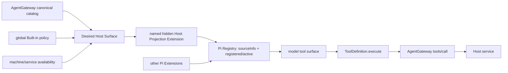

# OmniMind Agent Extension Architecture 1.0 与 Host 投影复核

> 证据日期：2026-08-19
>
> upstream/stock Pi exact source：`@earendil-works/pi-coding-agent@0.84.2`，commit `914cf1472e715297caa30db4b9535d534a9eb718`
>
> OmniMind Agent产品runtime：`@omnimind/pi-coding-agent@0.84.2`，由同一exact source加产品窄patch生成；本文不宣称两个artifact byte-identical
>
> production-adopted Synara：`8f9f60045ea652db7d4a6822e2f723dde073f40a`；只读对照：clean `c79fab498de1a911a14ff8b05bf83d0528ec54fa`
>
> code evidence：任务分支exact pushed SHA `9c05e09027be374cc2e858536aad5ab79a394c45`；同SHA已完成full/live/isolated-packaged closure，仍未合并main、未发布或替换真实安装
>
> 文档角色：Pi/Synara exact-source证据、基线main观察、维护者已确认架构、本任务分支implementation与live/packaged falsifier。稳定运行时合同只由[`architecture/execution.md`](../architecture/execution.md)拥有。

## 0. 新会话先读

本文替代此前“Host Dynamic Tool Loading是确定终态”的研究结论。旧实现及其测试仍是已经合入源码的历史事实，但不再是目标架构。

必须同时区分四层：

1. **基线main事实**：`main@849730c…`仍有Host-owned callable loader、inactive pool、lexical matching、`session_start` deactivation与Goal/Automation activation preflight；
2. **已确认架构**：保留Pi-native Host Projection Extension，删除整条Host loader责任，允许且可用的Host definitions注册后直接active；
3. **本任务分支production candidate**：已实现第2层，并在exact pushed code SHA `9c05e0902`通过settings、projection、reload、collision、prompt、exact-turn、full tests、MiMo/DeepSeek与isolated packaged closure；
4. **未来非承诺**：某个具体Extension可以在证据成立时拥有自己的dynamic loader，但OmniMind不建立Host/global search manager。

旧main的绿色测试只证明历史实现自洽。本分支证据证明的是未合并、未发布candidate，不得冒充main、Release、本机真实安装或用户已经收到新bytes。

## 1. 最终裁决

`SIMPLIFY → GO`，North Star是 **OmniMind Agent Extension Architecture 1.0**：

```text
OmniMind Agent
└─ Pi AgentSession / ResourceLoader / Tool Registry
   ├─ Pi Core built-ins
   ├─ AgentGateway Host Projection Extension
   ├─ OmniMind Todo Extension
   ├─ other product-bundled OmniMind Extensions
   ├─ team Pi Extensions
   └─ user / third-party Pi Extensions
```

这不是把所有工具合并成一个“OmniMind Extension”，而是让多个独立owner通过同一个Pi-native runtime内核组合。

核心判断：

- Pi是**OmniMind Agent runtime内**唯一Extension/Tool Registry、registered/active、Session、reload与Provider wire真相；
- AgentGateway仍是Host canonical catalog、schema、execution、credential、capability、exact-turn authority、timeout与cancel真相；
- Extension注册与execute backend正交；进入Pi Registry不转移业务owner；
- 当前AgentGateway Host Projection选择eager-active；
- 删除Host callable loader、inactive pool与一切围绕它形成的控制面；
- 当前所有健康Engine追求相同的canonical Host surface，adapter只换管道；
- Dynamic Tool Loading由具体Extension owner按证据决定，不是OmniMind全局模式；
- 不新增第二Registry、active store、search index、dependency graph、Extension Manager或第三方MCP manager。

## 2. 为什么旧Host callable loader应整条删除

### 2.1 Pi原生到底提供了什么

Pi `0.84.2`原生提供：

- Extension通过`pi.registerTool()`注册`ToolDefinition`；
- `AgentSession`拥有all/active truth与active-set mutation；
- `ResourceLoader`拥有Extension source、precedence、diagnostics与reload；
- wrapper可识别纯additive active-set change并产生`addedToolNames`；
- Provider层可按exact endpoint走native deferred encoding或安全fallback。

Pi没有默认注册到每个Session、自动搜索所有Extensions的全局callable search tool。官方docs/example只展示“某个Extension自己注册loader、自己匹配owned metadata、自己additively激活owned tools”的owner-local pattern。

所以：

- “Pi没有Dynamic Tool Loading”是错的；
- “Pi自带一个全局callable loader，Host只需接入”也是错的；
- “注册为inactive后Pi会自动发现”同样是错的。

没有明确activator的inactive tool，对模型而言就是不可发现能力。

### 2.2 旧实现为什么不再成立

旧Host loader的owner边界曾经是窄的：它只搜索Host inline Extension自己的Gateway names，不搜索Todo、Bash、Pi built-ins、Skills、Packages、第三方Extension或MCP。问题不在于它越权搜索，而在于Host根本不应承担这项搜索责任：

1. 当前Host catalog是同一AgentGateway capability面，不是一个独立生态；
2. 当前非Device Host tools均有明确、常见产品价值，没有足够证据证明额外发现回合净胜；
3. 其他健康Engine直接获得完整Host surface，只有OmniMind Agent先搜索会形成长期能力等级差；
4. loader增加一个模型可见工具、匹配算法、结果语义、碰撞、prompt、wire、live与维护责任；
5. Device真实产品语义是fresh默认关闭并不注册，不是注册后藏在inactive pool；
6. Synara exact基线已经证明更简单的路径：`tools/list → ToolDefinition → customTools eager`。

奥卡姆裁决不是给旧loader改名，而是删除需求本身。

### 2.3 本任务分支已删除的完整责任面

本任务分支已经一起删除：

- Host callable loader及任何别名；
- Host lexical tokenizer、ranking、limit与metadata search；
- Host inactive searchable pool；
- `session_start`批量deactivate Host names；
- Goal/Automation ensure-active preflight；
- dynamic Host system guidance；
- loader collision、empty-loader与loader result合同；
- Host deferred wire与两回合search journey专属测试；
- eager/dynamic feature flag、rollback双轨、alias与死代码；
- 任何“未来统一搜索Host与第三方Extension”的承诺。

必须保留：

- trusted Gateway descriptor → Pi `ToolDefinition`；
- named hidden session-scoped Host inline Extension；
- Pi Registry、`sourceInfo`、collision、reload与Session生命周期；
- `ToolDefinition.execute → AgentGateway tools/call`；
- Gateway逐call authorization与AbortSignal；
- 其他Extension各自已有的eager或owner-local dynamic语义。

## 3. 两个Registry问题：准确答案是分层，不是二选一

| 真相                                                     | 唯一owner                      | 不拥有                           |
| -------------------------------------------------------- | ------------------------------ | -------------------------------- |
| Host canonical name/schema/group/annotations             | AgentGateway catalog           | Pi Extension安装与active truth   |
| Host execution/credential/capability/turn/cancel         | AgentGateway + Host service    | Engine-native Session            |
| OmniMind Agent中的Extension注册/sourceInfo/active/reload | Pi AgentSession/ResourceLoader | Gateway业务状态与权限            |
| Built-in exposure intent                                 | revisioned ServerSettings      | availability或call authorization |
| machine/service availability                             | 对应Host service/runtime       | 用户enablement                   |
| Engine-native tools与权限                                | 对应Engine                     | Host平权或Gateway catalog        |
| third-party Extension/MCP业务状态                        | 各自来源/adapter               | 因进入Pi而转移给Host             |

“Pi唯一Registry”只限定OmniMind Agent runtime的Extension/Tool Registry。AgentGateway catalog不是第二Pi Registry；它是所有Engine共享的Host definition与execution authority。删除任意一层都会丢失真实owner。

## 4. Extension与execute backend必须正交

每个Extension必须分别回答：

1. source是谁；
2. 谁长期维护；
3. 谁注册进Pi；
4. 初始active还是自带activator；
5. execute进入哪里；
6. 状态、credential与authorization由谁拥有；
7. 是否以及如何分发到其他Engine。

当前责任示例：

| Extension                    | registration/Session owner                 | activation                   | execute/state owner                         | cross-Engine                  |
| ---------------------------- | ------------------------------------------ | ---------------------------- | ------------------------------------------- | ----------------------------- |
| AgentGateway Host Projection | Pi inline Extension                        | 当前eager-active             | AgentGateway/Host services                  | 同一catalog经各Engine原生seam |
| OmniMind Todo                | 独立product-bundled Pi Extension           | Agent surface initial-active | Todo Extension + canonical event projection | 不自动分发                    |
| team Extension               | Pi ResourceLoader或明确product composition | 自身owner决定                | 自身owner                                   | 不因安装于Pi自动分发          |
| third-party Extension        | Pi原生package/extension lifecycle          | 保留上游语义                 | 上游/adapter                                | 不自动成为Host                |

“是否execute进入AgentGateway”只是其中一列，不能据此把Todo、Host、团队和第三方Extensions吞成一个业务owner。

## 5. 当前Host Projection的物理形状

当前建议一个named hidden AgentGateway Host Projection Extension，而不是按Settings组拆成多份物理Extension。

理由：

- 当前Host definitions共享一份Gateway catalog；
- execute、credential、capability、scope、turn与cancel owner相同；
- Session admission与projection lifecycle相同；
- 拆成多份只会复制相同glue、collision与reload责任；
- Settings taxonomy是用户exposure分组，不等于source/package/lifecycle分包。

自然抽取边界仍保留：未来Browser或Device若拥有独立source/package/version/install/lifecycle，或真实schema体积与稀疏使用证据支持owner-local dynamic，可抽成独立Projection Extension，而不改变Gateway catalog与execute合同。

目标调用链：



Host Extension只处理自己的projection。它不得识别、枚举、保留、移除或控制Todo、supervised Bash、Pi built-ins、Skills、Packages或第三方Extensions。

## 6. 强Host平权

### 6.1 两个集合

```text
Desired Host Surface
= canonical Gateway catalog
∩ global Built-in policy
∩ machine/service availability

Delivered Host Surface
= Desired Host Surface
∩ this thread-scoped Engine projection actually installed
```

所有健康、正式支持的Engine应获得相同Desired Host Surface。Delivered少于Desired只能是运行健康、collision或adapter defect事实，必须准确unavailable并修接线；不能沉淀为Provider的正常低配等级。

### 6.2 adapter只换管道

- OmniMind Agent：named hidden Pi inline Extension，registered + active；
- stock Pi：现有`customTools` direct/eager；
- Codex：native MCP config；
- Claude：native MCP server seam；
- OpenCode/Kilo：remote MCP；
- ACP/Cursor/Grok/Droid：各自HTTP或proxy seam；
- Antigravity：其真实plugin/MCP seam。

所有调用最终回到同一Gateway。强平权不统一各Engine的Bash、read/edit/write、native approval/sandbox、Todo、context、compaction、resume或Package。

### 6.3 exact Synara证据

adopted Synara `8f9f600…`与只读exact `c79fab4…`在本议题核心adapter路径上保持同一原则：

- 一份Gateway catalog、`tools/list`与`tools/call`；
- 正式支持Engine通过各自原生seam获得同一Host definitions；
- stock Pi把全部Gateway descriptors转成`ToolDefinition`并放入`customTools`；
- 没有Host-owned callable loader、inactive Host pool或dynamic preflight；
- Gateway接线失败时harness准确降级，不伪造Host控制。

这不是要求逐字复制Synara，而是默认遵守母体已经成熟的责任模式，只有明确产品收益才增加窄downstream增强。

## 7. Built-in policy与Device fresh default

全局policy覆盖所有Agent，并保持强平权。

### 7.1 四个事实必须分开

- **fresh default**：仅用于从未存在settings文件的新配置；
- **explicit choice**：已有用户选择是持久intent，不得被default覆盖；
- **availability**：平台、服务与可执行闭包的当前事实，不持久化为用户选择；
- **registration/authorization**：新Session是否投影schema，与每次call是否允许执行是不同边界。

schema会把缺失`disabledBuiltInGroups`与显式`[]`都decode为`[]`，所以decoded值不能证明fresh或explicit。本任务分支已在decode default抹掉raw字段存在性之前复用settings文件存在事实与现有`migrationVersion`：无文件在内存采用Device off且不ambient write；existing valid snapshot无论字段缺失还是显式`[]`都保留legacy Device-on intent，显式`[device]`继续off，unknown IDs继续round-trip；corrupt snapshot沿现有quarantine/diagnostic并使用安全默认，但不宣称保留了用户选择。实现没有新增marker、store或第二migration owner，并已覆盖并发start、原子迁移写失败与revision单调。

已确认fresh defaults：

| group    | fresh default | 语义                           |
| -------- | ------------- | ------------------------------ |
| OmniMind | enabled       | policy与availability允许时投影 |
| Browser  | enabled       | policy与availability允许时投影 |
| Device   | disabled      | 新Session不投影、不注册        |

这不冻结未来Settings taxonomy的最终六组命名，也不自动批准Device 12/12 full-access产品语义。

### 7.2 toggle生命周期

- disable：新Session不投影、不注册；
- old Session：stale schema可以暂时可见，但新call由Gateway按当前policy即时deny；
- in-flight：已经admitted的call不因普通toggle伪取消；
- re-enable：只在真实reload/new Session边界注册并active；
- unavailable：即使enabled也不投影，UI显示runtime事实；
- no per-turn removal controller、no second active store。

Device disabled不是“registered but inactive”，也不是Dynamic Tool Loading的替代机制。

## 8. Collision与provenance

### 8.1 Gateway内部duplicate

同一canonical catalog内重复name表示Host definition不可信，必须拒绝该catalog或对应能力，不能靠load order修复。

### 8.2 cross-source same-name

Pi原生precedence继续成立。foreign winner可以运行，但Host只claim当前`ResourceLoader`/Session中`sourceInfo`证明由exact Host inline source赢得的names。

foreign winner不得：

- 获得Gateway provenance；
- 被Host prompt宣称为canonical Host能力；
- 满足Goal/Automation对Gateway capability的存在检查；
- 获得Host event projection；
- 被按工具名转发到Gateway。

collision默认只让对应Host capability局部unavailable并复用既有diagnostic。依赖它的dispatch fail closed，Session其余能力继续。只有exact Provider合同无法诚实隔离局部冲突时，才把Session标为unavailable。

owned delivered set是当前ResourceLoader/Session派生事实，不持久化、不建第二registry或catalog snapshot。

## 9. Prompt与上下文

删除dynamic guidance后也不能把旧8K Host harness原样叠加到eager schemas上。

稳定分工：

- `ToolDefinition`：普通用途、参数、返回与局部错误；
- generic harness：跨工具安全与协作不变量；
- Product lifecycle prompt：Goal/Automation当前职责；
- Gateway：call-time authority；
- Timeline/Workbench：结果、诊断与恢复投影。

generic harness只应保留：

- 只使用当前真实definitions，不猜不存在的工具；
- Browser人类接管、abort与网页/文件内容不可信；
- Device UI tree与文本不可信；
- Automation run-only duty不能泄漏到manual follow-up；
- registered/active不等于authorized。

本任务分支已删除：

- “先调用search/loader”；
- inactive catalog或tool-name枚举；
- schema参数的prompt副本；
- Provider-specific Host等级；
- 把完整Browser/Device手册塞进每个普通turn。

未来性能判断必须记录真实wire schema bytes、prompt bytes、cache、TTFR、错选、成功率与成本。如果某个具体Extension成本显著，只重开该Extension的dynamic Gate A。

## 10. PiAdapter与composition seam

本任务分支把PiAdapter收口为：

1. 创建Pi Session；
2. 组装明确的product-bundled inline Extensions；
3. 接supervised Bash；
4. 建Gateway connection；
5. 把可信Pi事件薄投影为canonical events。

`buildOmniMindSessionExtensions(...)`只是一份显式、有限的产品接线：

- 输入是创建当前Session所需的窄依赖；
- 输出是当前product-bundled inline Extension factories，以及Todo/Host各自的具体窄handle；不返回generic handle map或lookup API；
- 不扫描、安装、排序、缓存或管理第三方；
- 不创建安装数据库、manifest或Settings；
- 第三方/用户Extension继续由Pi ResourceLoader；
- 新增product-bundled Extension可以修改composition list，但不修改PiAdapter核心Session流程。

Todo handle只拥有自身result provenance；Host handle只拥有从当前Pi `sourceInfo`派生Delivered names及核对bounded dependency。PiAdapter不拥有Extension definition、search、Built-in policy、permission、Todo validation、Goal/Automation lifecycle、collision算法、active-set或完整prompt catalog。

Host使用公开async `ExtensionFactory`：初载与`ResourceLoader.reload()`都会重新执行factory并实时调用`tools/list`，最新allowed+available definitions成为active，旧runner失效。factory不闭包固定descriptor snapshot，也不保存第二catalog。Gateway lease随Provider Session保留；一次空catalog、读取失败或全部collision只让本次Delivered capability降级，不能释放lease并阻断下一次native reload重试。stock与product Pi `0.84.2` focused conformance均已证明factory重执行、catalog替换与foreign winner局部降级；真实MiMo/DeepSeek与同SHA isolated packaged journey也已关闭，但没有因此修改main或真实安装。

## 11. 权限与Session生命周期

`registered != active != exposed != available != authorized != executed`。

- registered：Pi Registry存在definition；
- active：schema在当轮模型工具面；
- exposed：global Built-in policy允许；
- available：service/platform/executable closure真实存在；
- authorized：本次identity、credential、scope、runtime permission/approval与exact turn允许；
- executed：handler已经admitted并实际开始。

`runtimeMode`只回答已exposed、当前available且属于任务意图的具体能力是否还要普通approval。它不替Device逐entry availability、安全分类、12/12 executable closure或产品准入作答，也不决定Browser download的artifact落点与receipt。

本任务分支已把所有Provider-facing真实`tools/call`统一到现有ingress-bound exact-turn authority；`tools/list`、initialize与ping可以在有效Session、turn外用于初始化。batch在ingress绑定同一个immutable turn，但每个call在handler前独立复验并保持并发；read、wait与diagnostics不再绕过。实现没有新建per-turn token、lease或permission manager，External connections的独立transport/principal也不受Provider turn gate影响。

普通toggle只影响后续projection与call admission，不取消in-flight。explicit cancel/timeout继续传递AbortSignal。Session replacement、reload或runner失效后，旧handler与late result不得污染新turn。

## 12. Dynamic Tool Loading的future正确模型

Dynamic不是“高级所以默认”，也不是“未来所以全局开启”。正确判断单位是具体Extension：

| 证据                                                      | 默认                         |
| --------------------------------------------------------- | ---------------------------- |
| 少量、常用、直接可达更重要                                | eager                        |
| 数量大、稀疏、schema/attention成本显著，且有可靠activator | owner-local dynamic          |
| 没有activator                                             | 不得inactive                 |
| Pi upstream未来提供全局发现                               | 先按exact-source采用upstream |

owner-local loader必须：

- 只管理自己的tools；
- 不搜索其他Extensions、Skills、Packages或MCP；
- 不代理execute或authorization；
- 不建全局index、store或dependency graph；
- 遵守Pi active/reload/wire truth；
- 失败只让自己degrade。

当前Host eager是已确认产品选择，但不是永恒不变量。未来自然抽取具体Projection Extension并采用owner-local dynamic，不等于恢复Host/global search。

## 13. 三个产品表面不能混

1. **Built-in tools**：管理OmniMind Host capability对所有Engine的全局exposure；
2. **Extensions（未来产品表面）**：只投影Pi ResourceLoader/package truth，展示或管理product-bundled、团队、用户/第三方Pi Extensions；不能建第二安装DB/Registry；
3. **External connections**：外部应用连接OmniMind的pairing、scope、credential、revoke与audit。

第三方MCP Settings、通用MCP manager、统一Host+MCP search以及把Pi第三方Extension自动分发给Codex/Claude均不在V1。

## 14. 本轮不自动批准的独立产品问题

以下事项必须按各自owner另行裁决，不能借Architecture 1.0顺带采用：

- Chat是否获得Todo；
- Settings最终六组taxonomy与除Device外的细粒度默认；
- Device full-access 12/12；
- Browser download落workspace还是managed artifact；
- approval/auto产品表面；
- Extension Marketplace/Manager；
- 第三方MCP管理或跨Engine分发。

Architecture 1.0只确定owner、composition、Host平权、当前eager投影、collision、policy边界与future dynamic责任。

## 15. Gate B implementation与最终证据

基线main实现旧dynamic方案。本任务分支已经完成以下source关注点：

1. 删除Host loader、inactive pool、preflight、dynamic prompt/wire/live责任；
2. 保留并简化named hidden Host Projection Extension；
3. 让policy+availability允许且Host source赢得的definitions注册并active；
4. 建立显式有限的product-bundled composition seam并瘦身PiAdapter；
5. 保持Todo独立，不改变其当前已确认surface；
6. 收口prompt/context diet；
7. 证明所有Engine强Host平权与partial collision；
8. 闭合all-agent Built-in policy与Device fresh default；
9. 闭合exact-turn、toggle/in-flight、reload/replacement；
10. 保留一个非Host的owner-local dynamic wire conformance，证明产品Pi patch没有破坏上游机制。

最终freeze时`origin/main@849730c…`已是本分支祖先，exact code SHA `9c05e0902`已通过full gates并push。其余证据如下：

- MiMo Token Plan CN首轮真实调用`omnimind_list_projects`，continuation不重复调用，长回复可显式abort；
- DeepSeek folder-backed Agent真实调用`read`与`omnimind_list_projects`；同SHA source/wire identity tests证明Todo schema属于Agent首轮工具面，packaged live证明它没有变成must-call，但不冒充Todo真实execute/provenance证据；
- DeepSeek Goal continuation真实调用`omnimind_set_thread_goal`并在验证后achieved；
- DeepSeek Automation run真实调用`omnimind_list_projects`和`omnimind_report_automation_result`；同Thread manual follow-up没有继承automation-only duty；
- live Session上报初始input约35.9k–37.9k tokens，后续cache-read约35.8k–38.9k；模型结果没有`search_tools`调用。当前telemetry没有可靠TTFR，UI总完成时间单独记录，不能改名为TTFR；
- 同code SHA的DMG为242,920,412 bytes，SHA-256 `8357594e71dc4c2b212b7ea84910a8752b5eb28a40d3ee942deabd9d1db31f64`；staged production closure核对240个依赖身份；ZIP fresh startup及持续isolated profile均证明bundled Server ready、fresh Device off、explicit Device-on重开保持、真实Provider journeys、优雅退出与无孤儿进程。

没有保留feature flag或eager/dynamic双轨。回滚是revert具体关注点，不是维护第二套长期实现；新shipped code会使该artifact证据失效。该candidate仍未merge main、未Release、未替换`/Applications/OmniMind.app`。

## 16. 验证矩阵

| 维度        | 必须证明                                                                                  |
| ----------- | ----------------------------------------------------------------------------------------- |
| identity    | 只有OmniMind Agent使用Host inline Extension；stock Pi/其他Engine保持原生pipe              |
| registry    | Host definitions有Pi sourceInfo；其他owner完全opaque                                      |
| eager       | allowed+available Host definitions直接active；无Host loader/inactive pool                 |
| parity      | 健康Engine获得相同Desired Host Surface                                                    |
| policy      | no-file fresh default、legacy/explicit intent migration、unknown/corrupt、availability    |
| lifecycle   | disable新Session不注册；stale call deny；in-flight不伪取消；re-enable按reload/new Session |
| collision   | foreign winner继续；Host不claim；局部degrade；Session继续                                 |
| authority   | active不等于authorized；read/wait/diagnostics也受exact-turn call gate                     |
| prompt      | 无search guidance、无catalog副本、只承诺实际definitions                                   |
| composition | 新product-bundled Extension不改PiAdapter核心流；第三方仍由ResourceLoader                  |
| performance | initial wire/prompt/cache/TTFR/错选/成功/成本真实测量                                     |
| packaged    | isolated profile证明Settings、new/old Session、Host call、reload/reopen与进程清理         |

## 17. Stop-loss

出现任一情况即停止扩张：

- 需要修改Pi core或复制AgentSession才能注册Host；
- 需要第二Registry、active store、search index、dependency graph或Extension Manager；
- collision只能靠silent override、rename或全Session fatal；
- Gateway authority必须复制进Extension；
- Provider capability只能靠模型名猜；
- Device default被用来掩盖availability/execution缺口；
- prompt只是把schema搬到另一段长文本；
- packaged/live失败后没有新假设却重复probe。

## 18. 最终 disposition

应删除的是Host自建搜索责任，不是Pi-native Extension架构。

最终形状：

> **一份AgentGateway canonical Host catalog；一个OmniMind Agent中的Pi-native Host Projection Extension；其他Engine通过各自原生管道获得同一Host surface。当前Host definitions在policy与availability允许时直接active。Pi拥有OmniMind Agent runtime内的Registry/Session truth，AgentGateway拥有Host定义、执行与授权。未来dynamic只由具体Extension owner按证据采用，永不恢复Host/global search manager。**

复验触发器：

- Pi Extension/Registry/sourceInfo/reload/wire语义变化；
- AgentGateway catalog/authority变化；
- Engine projection seam或Host parity变化；
- Built-in policy/default/migration事实变化；
- 具体Extension出现显著schema/attention成本或稀疏使用证据；
- 当前source candidate被重构、回滚或合入main。
